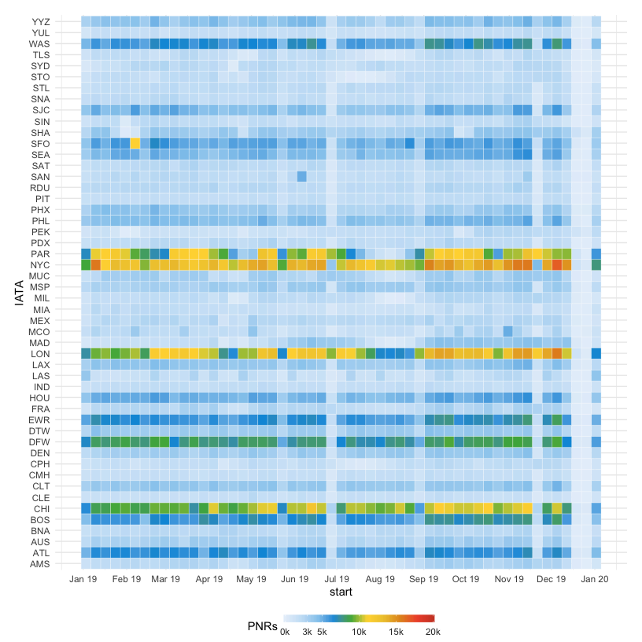

## Problem #1

DPLYR aggregation.


```r
library("readxl")
library("dplyr")
my_data <- read_excel("dow_jones_index.xlsx")
my_data2<-my_data %>%
  group_by(stock) %>% 
  mutate(Weekly_pct_change = (open-lag(open))/lag(open) * 100)  %>% 
  summarise(meanWeekly_pct_change = mean(Weekly_pct_change,na.rm=TRUE), .groups = 'drop') %>% 
  arrange(desc(meanWeekly_pct_change))
  
  
my_data2 %>% print(n = Inf) 
```

```
## # A tibble: 30 x 2
##    stock meanWeekly_pct_change
##    <chr>                 <dbl>
##  1 PFE                 0.560  
##  2 BA                  0.500  
##  3 AXP                 0.494  
##  4 IBM                 0.457  
##  5 CVX                 0.357  
##  6 KRFT                0.348  
##  7 XOM                 0.310  
##  8 UTX                 0.289  
##  9 MCD                 0.288  
## 10 JNJ                 0.244  
## 11 MMM                 0.239  
## 12 T                   0.157  
## 13 CAT                 0.155  
## 14 TRV                 0.133  
## 15 INTC                0.0855 
## 16 DIS                 0.0549 
## 17 PG                  0.0191 
## 18 GE                  0.00181
## 19 DD                 -0.0118 
## 20 KO                 -0.0174 
## 21 VZ                 -0.0651 
## 22 MRK                -0.0754 
## 23 HD                 -0.0763 
## 24 WMT                -0.107  
## 25 JPM                -0.218  
## 26 AA                 -0.232  
## 27 MSFT               -0.598  
## 28 HPQ                -0.720  
## 29 BAC                -1.05   
## 30 CSCO               -1.22
```


## Problems #2 and #4 Combined

A random forest is used to generate feature importance.  I'm transforming all data into factors.  This is a quick and efficient approach and suitable given the small size of the data.  The output at the end highlights the differences between the excel and database files.  

##Step1 - read in the packages

```r
  library(readxl)
  library(dplyr)
  library(magrittr)
  library(vip)
  library(recipes)
  library(workflows)
  library(caret)
  library(DBI)
  library(RSQLite)
  garfield<-read_excel("garfield_activity.xlsx")
  garfield
```

```
## # A tibble: 21 x 13
##    `8AM` `9AM` `10AM` `11AM` Noon  `1PM` `2PM` `3PM` `4PM` `5PM` Commute
##    <chr> <dbl>  <dbl>  <dbl> <chr> <dbl> <dbl> <dbl> <chr> <dbl> <chr>  
##  1 Coff…     5      0      8 Sand…     6     9     2 Tea       2 Long   
##  2 Doug…     0      6      2 Lent…    10     0     1 Ping…     7 Short  
##  3 Coff…     3      7     10 Taco      8     4     6 Ping…     2 Short  
##  4 Coff…     1      7      3 Sand…     7     7     8 Ping…     3 Short  
##  5 Doug…     5      0      2 Sand…     5     6     9 Tea       3 Long   
##  6 Sand…     8      8      8 Lent…     3    10    10 Coff…     0 Short  
##  7 Doug…     7      8      1 Lent…     6     6     4 Coff…     9 Short  
##  8 Coff…     7      7      2 Taco     10     7    10 Tea       8 Short  
##  9 Sand…     2      2      8 Lent…     8     8     0 Ping…    10 Short  
## 10 Coff…     6      9      1 Taco      8     8     4 Work…     4 Short  
## # … with 11 more rows, and 2 more variables: DayOfWeek <chr>, WatchTV <chr>
```

```r
  garfield2<-garfield %<>%
    mutate_if(is.character,as.factor)%<>%
    mutate_if(is.numeric,as.factor)
  
  garfield4<-garfield2[!(is.na(garfield2$WatchTV)),]

  #garfieldglm<-glm(WatchTV ~ ., data=garfield4, family=binomial)
  
  #train the random forest
    rf_fit <- train(WatchTV ~ ., 
                  data = garfield4, 
                  method = "ranger",
                  #tuneGrid = tgrid,
                  importance = "permutation")
    
    rf_fit
```

```
## Random Forest 
## 
## 19 samples
## 12 predictors
##  2 classes: 'No', 'Yes' 
## 
## No pre-processing
## Resampling: Bootstrapped (25 reps) 
## Summary of sample sizes: 19, 19, 19, 19, 19, 19, ... 
## Resampling results across tuning parameters:
## 
##   mtry  splitrule   Accuracy   Kappa     
##    2    gini        0.4642540  0.08410407
##    2    extratrees  0.4647460  0.08380300
##   40    gini        0.6534444  0.29289742
##   40    extratrees  0.6487778  0.27356408
##   78    gini        0.6562222  0.28512172
##   78    extratrees  0.6676508  0.30642607
## 
## Tuning parameter 'min.node.size' was held constant at a value of 1
## Accuracy was used to select the optimal model using the largest value.
## The final values used for the model were mtry = 78, splitrule = extratrees
##  and min.node.size = 1.
```

```r
    #generate variable importances
    #the top two indicators are sandwich at noon and a short commute  
    varImp(rf_fit, scale = TRUE)
```

```
## ranger variable importance
## 
##   only 20 most important variables shown (out of 78)
## 
##              Overall
## NoonSandwich 100.000
## CommuteShort  11.178
## `11AM`3        6.193
## `3PM`3         5.401
## `11AM`7        4.932
## `3PM`2         4.872
## `3PM`10        4.781
## `9AM`7         4.427
## `2PM`8         4.124
## `9AM`4         4.102
## `11AM`4        4.102
## `5PM`5         4.102
## `5PM`9         4.102
## `1PM`4         4.102
## `1PM`5         4.102
## `1PM`1         4.102
## `1PM`2         4.102
## `4PM`Tea       4.102
## `3PM`1         4.102
## `9AM`5         4.102
```

```r
  #problem 4
    
    #read in the data base
  con<-dbConnect(SQLite(), 'test.db')
  
  dbListTables(con)
```

```
## [1] "garfield"       "garfield_stats"
```

```r
  #read in the garfield table
  garfielddb_table<-dbReadTable(con, "garfield")
  
  ##compare to garfield excel sheet
  
  dim(garfielddb_table)
```

```
## [1] 21 15
```

```r
  dim(garfield)
```

```
## [1] 21 13
```

```r
  colnames(garfielddb_table)
```

```
##  [1] "index"     "X8AM"      "X9AM"      "X10AM"     "X11AM"     "Noon"     
##  [7] "X1PM"      "X2PM"      "X3PM"      "X4PM"      "X5PM"      "Commute"  
## [13] "DayOfWeek" "WatchTV"   "New.Field"
```

```r
  colnames(garfielddb_table)
```

```
##  [1] "index"     "X8AM"      "X9AM"      "X10AM"     "X11AM"     "Noon"     
##  [7] "X1PM"      "X2PM"      "X3PM"      "X4PM"      "X5PM"      "Commute"  
## [13] "DayOfWeek" "WatchTV"   "New.Field"
```

```r
  #highlight columns that are the same
  
  colnames(garfielddb_table)[colnames(garfielddb_table) %in% colnames(garfield)]
```

```
## [1] "Noon"      "Commute"   "DayOfWeek" "WatchTV"
```

```r
  #highlight columns that are different
    #There are Xs in front of the times in the database table.  To reconcile the two tables, the index and New.Field columns should be removed from the database table. 
  colnames(garfielddb_table)[!(colnames(garfielddb_table) %in% colnames(garfield))]
```

```
##  [1] "index"     "X8AM"      "X9AM"      "X10AM"     "X11AM"     "X1PM"     
##  [7] "X2PM"      "X3PM"      "X4PM"      "X5PM"      "New.Field"
```

```r
  garfielddb_table2<-garfielddb_table
  garfielddb_table2$index<-NULL
  garfielddb_table2$New.Field<-NULL
  
  
 
 #highlight data points that are different
  gf3<-garfielddb_table2==garfield
  gf3  
```

```
##       X8AM  X9AM X10AM X11AM Noon  X1PM  X2PM  X3PM X4PM  X5PM Commute
##  [1,] TRUE FALSE  TRUE FALSE TRUE FALSE FALSE FALSE TRUE FALSE    TRUE
##  [2,] TRUE FALSE FALSE FALSE TRUE  TRUE  TRUE FALSE TRUE  TRUE    TRUE
##  [3,] TRUE  TRUE FALSE FALSE TRUE FALSE FALSE FALSE TRUE FALSE    TRUE
##  [4,] TRUE FALSE FALSE FALSE TRUE FALSE FALSE FALSE TRUE FALSE    TRUE
##  [5,] TRUE FALSE FALSE FALSE TRUE FALSE FALSE FALSE TRUE FALSE    TRUE
##  [6,] TRUE FALSE FALSE FALSE TRUE FALSE FALSE FALSE TRUE FALSE    TRUE
##  [7,] TRUE  TRUE FALSE FALSE TRUE FALSE FALSE FALSE TRUE FALSE    TRUE
##  [8,] TRUE  TRUE  TRUE FALSE TRUE FALSE FALSE FALSE TRUE  TRUE    TRUE
##  [9,] TRUE FALSE  TRUE FALSE TRUE FALSE FALSE FALSE TRUE FALSE    TRUE
## [10,] TRUE FALSE FALSE FALSE TRUE FALSE FALSE FALSE TRUE FALSE    TRUE
## [11,] TRUE FALSE FALSE FALSE TRUE FALSE FALSE FALSE TRUE FALSE    TRUE
## [12,] TRUE FALSE FALSE FALSE TRUE FALSE FALSE FALSE TRUE FALSE    TRUE
## [13,] TRUE FALSE FALSE FALSE TRUE FALSE FALSE FALSE TRUE FALSE    TRUE
## [14,] TRUE FALSE  TRUE FALSE TRUE FALSE FALSE FALSE TRUE FALSE    TRUE
## [15,] TRUE  TRUE FALSE FALSE TRUE FALSE FALSE  TRUE TRUE FALSE    TRUE
## [16,] TRUE FALSE FALSE FALSE TRUE FALSE FALSE FALSE TRUE FALSE    TRUE
## [17,] TRUE FALSE FALSE  TRUE TRUE FALSE FALSE FALSE TRUE FALSE    TRUE
## [18,] TRUE FALSE FALSE FALSE TRUE FALSE  TRUE FALSE TRUE FALSE    TRUE
## [19,] TRUE FALSE FALSE FALSE TRUE FALSE FALSE FALSE TRUE FALSE    TRUE
## [20,] TRUE FALSE FALSE FALSE TRUE FALSE FALSE FALSE TRUE FALSE    TRUE
## [21,] TRUE FALSE FALSE FALSE TRUE FALSE FALSE  TRUE TRUE FALSE    TRUE
##       DayOfWeek WatchTV
##  [1,]      TRUE    TRUE
##  [2,]      TRUE    TRUE
##  [3,]      TRUE    TRUE
##  [4,]      TRUE    TRUE
##  [5,]      TRUE    TRUE
##  [6,]      TRUE    TRUE
##  [7,]      TRUE    TRUE
##  [8,]      TRUE    TRUE
##  [9,]      TRUE    TRUE
## [10,]      TRUE    TRUE
## [11,]      TRUE    TRUE
## [12,]      TRUE    TRUE
## [13,]      TRUE    TRUE
## [14,]      TRUE    TRUE
## [15,]      TRUE    TRUE
## [16,]      TRUE    TRUE
## [17,]      TRUE    TRUE
## [18,]      TRUE    TRUE
## [19,]      TRUE    TRUE
## [20,]      TRUE      NA
## [21,]      TRUE      NA
```


## Problem 3

Generate both a static plot and an interactive plot with Plotly.  The Plotly plot will only be visible in the HTML file (it will have to be downloaded from GIT).  A four week forecast is presented at the end.


```r
iata_demand<-read.csv("iata_demand_heatmap.csv",stringsAsFactors = FALSE,header=TRUE)

#Heat map colors are defined.  I take the visual aspects of data science very seriously.  This pallete comes from a Wall Street Journal visualization.  
cols<- c("#e7f0fa", #lighter than light blue
         "#c9e2f6", #light blue
         "#95cbee", #blue
         "#0099dc", #darker blue
         "#4ab04a", #green
         "#ffd73e", #yellow
         "#eec73a", #mustard
         "#e29421", #dark khaki (?)
         "#f05336", #orange red
         "#ce472e") #red

#I'm a huge fan of ggplot

library(ggplot2)
library(scales)
col1 = "#d8e1cf" 
col2 = "#438484"
library("viridis")
library("plotly")

library("forecast")

  url <- "https://raw.githubusercontent.com/jpatokal/openflights/master/data/airports.dat"
  
  #There is missing data in this file.  I would always address this in my professional work.  I'm reading it in to add data for the interactive heat map.
  airports <- read.delim(url, sep = ",", header = FALSE ,
                         col.names = c("Airport_ID", "Name", "City",
                                       "Country","IATA_FAA", "ICAO",
                                       "Latitude", "Longitude","Altitude",
                                       "Timezone", "DST", "TZ", "V13", "V14")
  ) %>% select(-V13, -V14) %>%
    ## add a column for the customized label to be displayed on the map
    mutate(Label = paste(paste0("<b>Airport</b>: ",
                                Name, " (", IATA_FAA, ")"),
                         paste0("<b>City</b>: ", City),
                         paste0("<b>Country</b>: ", Country),
                         sep = "<br/>"))
  
  airports2<-merge(x=iata_demand,y=airports,by.x="IATA",by.y="IATA_FAA",all.x=TRUE)
  airports2$label=NULL
  
    airports3<-airports2
  
  airports3<-airports3 %>%
    mutate(text = paste0("City: ", City, "\n","Country: ", Country))
  
  airports3$start<-as.Date(airports3$start)
  
  #First a create a ggplot object
   gg<-ggplot(airports3, aes(x=start, y=IATA,fill=PNRs,label=Name,text=text ) )  +  

    geom_tile(colour="white", 
           # width=0.9, height=0.9) + theme_minimal() +
           size=0.1,)+
 theme_minimal() +
    scale_fill_gradientn(colours=cols, limits=c(0, 20000),
                         
                         breaks=c(0, 3000,5000,10000,15000,20000), 
                         na.value=rgb(246, 246, 246, max=255),
                         labels=c("0k", "3k", "5k", "10k", "15k","20k"),
                         guide=guide_colourbar(ticks=T, nbin=50,
                                               barheight=.5, label=T, 
                                               barwidth=10)) +
    scale_x_date(breaks=date_breaks("1 months"),
                  labels=date_format("%b %y"))+
    theme(
         legend.position=c(.5, -0.1),
          #legend.position=c(.5, -.13),
          legend.direction="horizontal",
  legend.text=element_text(colour="grey20"),
  #plot.margin=grid::unit(c(1.5,1.5,1.5,1.5), "cm"),)
  plot.margin=grid::unit(c(.5,.5,1.5,.5), "cm"),)
   
   gg
```

<!-- -->

```r
   #Plotly is used to generate an interactive plot
     gg2<-ggplotly(gg,              text = ~n,
                textposition = "auto",
                hoverinfo = "text",
)
    
  gg2
```

```{=html}
<div id="htmlwidget-643e94a1ec8863936d0e" style="width:816px;height:816px;" class="plotly html-widget"></div>
<script type="application/json" data-for="htmlwidget-643e94a1ec8863936d0e">{"x":{"data":[{"x":[17899,17906,17913,17920,17927,17934,17941,17948,17955,17962,17969,17976,17983,17990,17997,18004,18011,18018,18025,18032,18039,18046,18053,18060,18067,18074,18081,18088,18095,18102,18109,18116,18123,18130,18137,18144,18151,18158,18165,18172,18179,18186,18193,18200,18207,18214,18221,18228,18235,18242,18249,18256,18263],"y":[1,2,3,4,5,6,7,8,9,10,11,12,13,14,15,16,17,18,19,20,21,22,23,24,25,26,27,28,29,30,31,32,33,34,35,36,37,38,39,40,41,42,43,44,45,46,47,48,49,50],"z":[[0.0815363478884177,0.123110925273281,0.129024550504749,0.127889612329013,0.143300878083747,0.148258765904068,0.131473627620811,0.133683770384087,0.146765426199152,0.161818290424706,0.165939908010274,0.165939908010274,0.145033152141449,0.165282838540111,0.138104055910639,0.0852398303566095,0.0903171853533242,0.139119526909981,0.171076996595185,0.172988471417478,0.113911952690998,0.140971268144077,0.150946777372917,0.185114389821397,0.176930888238456,0.132489098620154,0.121199450450989,0.112956215279852,0.0838062242398901,0.0618242637835255,0.0539394301415686,0.0596738546084463,0.0771160623618661,0.108595663341497,0.121796786332955,0.175079147004361,0.188399737172212,0.204886207514485,0.178483961531569,0.200645122752524,0.179977301236485,0.153097186547996,0.150767576608327,0.172331401947315,0.187503733349262,0.204826473926289,0.161579356071919,0.164028433187982,0.175079147004361,0.113792485514605,0.0149931306373574,0.00232960993966908,0.0599127889612329],[0.290364972223881,0.384445373633594,0.366644764350995,0.390358998865062,0.391075801923422,0.359536467355594,0.367719968938534,0.400274774505705,0.377098142285407,0.389881130159489,0.375664536168688,0.380741891165402,0.291798578340601,0.392688608804731,0.412699360850606,0.345857475658563,0.3861179141031,0.340959321426438,0.396929693566693,0.36939250940804,0.238337016904605,0.356191386416582,0.392808075981124,0.357445791768712,0.375664536168688,0.103398841168389,0.293710053162894,0.341735858072994,0.347888417657249,0.323218445732035,0.328952870198913,0.361806343707066,0.380682157577206,0.369153575055254,0.215160384684308,0.41192282420405,0.402425183680784,0.38540111104474,0.340421719132668,0.367779702526731,0.378531748402126,0.372438922406069,0.333671823666448,0.362582880353623,0.385878979750314,0.420225792963383,0.0910339884116839,0.338808912251359,0.409712681440774,0.313541604444179,0.0341676124484798,0.0284929215697987,0.268801146884893],[0.131473627620811,0.186368795173526,0.160802819425363,0.181112239412221,0.179141031001732,0.151185711725703,0.174481811122394,0.191087748641061,0.208350755629891,0.188101069231229,0.141688071202437,0.212830774744639,0.199808852517771,0.205125141867272,0.175557015709934,0.174661011886984,0.165760707245684,0.188638671524998,0.194970431873843,0.196165103637776,0.119287975628696,0.15178304760767,0.166596977480437,0.167313780538797,0.182665312705334,0.0497580789678036,0.134639507795233,0.168090317185353,0.162057224777492,0.135893913147363,0.147362762081118,0.149333970491607,0.17705035541485,0.148199032315871,0.114927423690341,0.220835075562989,0.212472373215459,0.219520936622663,0.172689803476495,0.214921450331521,0.187503733349262,0.203751269338749,0.170121259184039,0.220775341974792,0.211098500686936,0.200107520458754,0.0432471178543695,0.175676482886327,0.221432411444955,0.129801087151305,0.00937817334687295,0.0111701809927722,0.137805387969655],[0.096529478525775,0.130219222268682,0.125918403918523,0.123349859626068,0.136550982617526,0.124006929096231,0.137566453616869,0.152021981960456,0.14270354220178,0.143480078848336,0.136491249029329,0.140433665850308,0.13398243832507,0.138223523087032,0.16868765306732,0.164924437010931,0.139955797144734,0.143300878083747,0.135654978794576,0.131055492503435,0.094020667821516,0.127411743623439,0.155665730840452,0.157159070545368,0.148736634609641,0.052207156083866,0.116838898512634,0.12705334209426,0.129144017681142,0.112119945045099,0.147123827728332,0.143360611671943,0.138223523087032,0.143898213965713,0.086494235708739,0.146108356728989,0.166059375186667,0.153276387312586,0.140314198673914,0.129084284092945,0.143480078848336,0.155426796487665,0.129681619974912,0.131832029149991,0.15996654919061,0.168388985126337,0.04199271250224,0.112060211456902,0.169703124066663,0.114927423690341,0.00937817334687295,0.0114688489337554,0.0985006869362643],[0.265515799534078,0.372259721641479,0.362941281882803,0.361328475001493,0.361985544471656,0.349501224538558,0.258288035362284,0.404933994385043,0.397228361507676,0.359417000179201,0.350397228361508,0.352547637536587,0.437488799952213,0.411444955498477,0.323994982378591,0.36067140553133,0.402903052386357,0.433606116719431,0.405650797443402,0.383011767516875,0.28576548593274,0.393584612627681,0.41974792425781,0.43736933277582,0.400035840152918,0.108058061047727,0.324711785436951,0.391374469864405,0.38665551639687,0.374589331581148,0.34537960695299,0.341019055014635,0.35374230930052,0.317543754853354,0.264022459829162,0.455528343587599,0.439041873245326,0.449853652708918,0.406666268442745,0.426617286900424,0.455110208470223,0.472432949047249,0.419270055552237,0.433128248013858,0.450032853473508,0.466399856639388,0.132369631443761,0.416343109730602,0.489038886565916,0.349381757362165,0.0307030643330745,0.0124245863449017,0.255540290305239],[0.381936562929335,0.506779762260319,0.507197897377695,0.533062541066842,0.54590526252912,0.511677916492444,0.508750970670808,0.558688250403202,0.552296756466161,0.544889791529777,0.560121856519921,0.436234394600084,0.524401170778329,0.642255540290305,0.558807717579595,0.518009676841288,0.556000238934353,0.600083627023475,0.642255540290305,0.649065169344723,0.410548951675527,0.611731676721821,0.610955140075264,0.735678872229855,0.622364255420823,0.168030583597157,0.477808971984947,0.61370288513231,0.61244847978018,0.581387013917926,0.550922883937638,0.57081416880712,0.630368556239173,0.541604444178962,0.339227047368735,0.617346634012305,0.677856758855504,0.649901439579476,0.627919479123111,0.626724807359178,0.64643689146407,0.6726002030942,0.57242697568843,0.611851143898214,0.639567528821456,0.688907472671883,0.156860402604384,0.49501224538558,0.630726957768353,0.470581207813153,0.0414551102084702,0.0225195627501344,0.325249387730721],[0.0810584791828445,0.091691057881847,0.0921091929992235,0.0989188220536408,0.0927662624693865,0.0924675945284033,0.0993369571710173,0.106266053401828,0.0933038647631563,0.0980228182306911,0.102741771698226,0.0918105250582402,0.10871513051789,0.102801505286423,0.0988590884654441,0.094020667821516,0.113971686279195,0.145451287258826,0.107460725165761,0.111761543515919,0.0757421898333433,0.0955737411146288,0.116958365689027,0.100651096111343,0.11761543515919,0.0391852338569978,0.0955737411146288,0.108237261812317,0.10799832745953,0.0951556059972523,0.095036138820859,0.100770563287737,0.107341257989367,0.096708679290365,0.0601517233140195,0.105967385460845,0.128964816916552,0.113135416044442,0.0921091929992235,0.10996953587002,0.101308165581506,0.105131115226092,0.0876889074726719,0.0910339884116839,0.105310315990682,0.108834597694283,0.0262230452183263,0.0871513051789021,0.103458574756586,0.0715608386595783,0.00519682217310794,0.00256854429245565,0.0660653485454871],[0.181470640941401,0.226091631324294,0.205005674690879,0.235887939788543,0.209007825100054,0.213607311391195,0.228242040499373,0.253808016247536,0.22615136491249,0.241443163490831,0.225554029030524,0.232722059614121,0.201899528104653,0.251299205543277,0.209903828923003,0.208350755629891,0.224120422913804,0.222328415267905,0.236664476435099,0.247655456663282,0.160384684307986,0.230093781733469,0.214443581625948,0.228301774087569,0.236843677199689,0.0546562331999283,0.203631802162356,0.236007406964936,0.222507616032495,0.216414790036437,0.212412639627262,0.214264380861358,0.225912430559704,0.213846245743982,0.12508213368377,0.221312944268562,0.228361507675766,0.227883638970193,0.225076160324951,0.224717758795771,0.213189176273819,0.248372259721641,0.212054238098083,0.254405352129502,0.233916731378054,0.258288035362284,0.0660056149572905,0.218804133564303,0.289767636341915,0.184636521115823,0.011886984051132,0.010871513051789,0.177946359237799],[0.0842840929454632,0.104414312167732,0.0960516098202019,0.102801505286423,0.100471895346753,0.111104474045756,0.104892180873305,0.109192999223463,0.106982856460188,0.121079983274595,0.111164207633953,0.0911534555880772,0.0966489457021683,0.111343408398542,0.110089003046413,0.105131115226092,0.0956334747028254,0.102741771698226,0.120363180216236,0.122812257332298,0.0790275371841587,0.109551400752643,0.104712980108715,0.105608983931665,0.118571172570336,0.0362582880353623,0.0993369571710173,0.1174362343946,0.104653246520518,0.0947972044680724,0.10979033510543,0.110089003046413,0.121975987097545,0.107580192342154,0.0688728271907293,0.131294426856221,0.110746072516576,0.123588793978854,0.104712980108715,0.126993608506063,0.113314616809032,0.112597813750672,0.103159906815602,0.102144435816259,0.116838898512634,0.118929574099516,0.0361985544471656,0.103996177050355,0.124245863449017,0.0922286601756167,0.00645122752523744,0.00382294964458515,0.0720984409533481],[0.0768173944208829,0.0947374708798758,0.103996177050355,0.113732751926408,0.105788184696255,0.0634968042530315,0.0918702586464369,0.102741771698226,0.111881010692312,0.113493817573622,0.109491667164447,0.111223941222149,0.115046890866734,0.124843199330984,0.0426497819724031,0.0758019234215399,0.100113493817574,0.136132847500149,0.11815303745296,0.124604264978197,0.101905501463473,0.0874499731198853,0.11815303745296,0.131413894032615,0.124126396272624,0.0830894211815304,0.0529239591422257,0.0323756048025805,0.0222806283973478,0.0281942536288155,0.0505943492025566,0.0777731318320291,0.107400991577564,0.12544053521295,0.103578041932979,0.129323218445732,0.149871572785377,0.140075264321128,0.122155187862135,0.121020249686399,0.0841048921808733,0.121916253509348,0.12597813750672,0.144137148318499,0.124245863449017,0.127710411564423,0.1423451406726,0.14359954602473,0.141090735320471,0.0990980228182307,0.00734723134818709,0.000537602293769787,0.0640344065468013],[0.131951496326384,0.162176691953886,0.182306911176154,0.193118690639747,0.18433785317484,0.198793381518428,0.182963980646317,0.204707006749895,0.191744818111224,0.212173705274476,0.181769308882385,0.161758556836509,0.180156502001075,0.217012125918404,0.189056806642375,0.173466340123051,0.199092049459411,0.228839376381339,0.20888835792366,0.193716026521713,0.137685920793262,0.186667463114509,0.229615913027896,0.205184875455469,0.216593990801027,0.0651096111343408,0.174661011886984,0.202018995281047,0.223941222149214,0.190908547876471,0.196284570814169,0.223343886267248,0.230511916850845,0.208291022041694,0.127471477211636,0.225255361089541,0.238337016904605,0.218923600740697,0.211277701451526,0.217669195388567,0.21904306791709,0.242637835254764,0.196165103637776,0.212830774744639,0.229615913027896,0.2597813750672,0.0536407622005854,0.185831192879756,0.21958067021086,0.191685084523027,0.0151125978137507,0.00967684128785616,0.143898213965713],[0.407860940206678,0.49519144615017,0.472552416223643,0.498417059912789,0.518248611194074,0.484140732333791,0.468072397108894,0.525297174601278,0.531867869302909,0.399498237859148,0.466399856639388,0.512753121079983,0.46174063676005,0.477808971984947,0.458455289409235,0.435577325129921,0.492861836210501,0.489875156800669,0.49501224538558,0.479959381160026,0.313541604444179,0.434382653365988,0.468789200167254,0.477211636102981,0.478047906337734,0.135117376500806,0.39412221492145,0.465563586404635,0.424108476196165,0.424526611313542,0.401111044740458,0.456842482527925,0.474165223104952,0.434561854130578,0.309300519682217,0.48700794456723,0.473567887222985,0.539872170121259,0.433785317484021,0.487784481213787,0.501105071381638,0.502956812615734,0.466280389462995,0.525775043306851,0.528522788363897,0.508691237082612,0.11654023057165,0.473627620811182,0.536586822770444,0.397228361507676,0.0312406666268443,0.0273579833940625,0.340959321426438],[0.153216653724389,0.255600023893435,0.207992354100711,0.218445732035123,0.20160086016367,0.20052565557613,0.2028552655158,0.195627501344006,0.198255779224658,0.199569918164984,0.216355056448241,0.209724628158413,0.175676482886327,0.218923600740697,0.218206797682337,0.173944208828624,0.203751269338749,0.200346454811541,0.211695836568903,0.222686816797085,0.148557433845051,0.213428110626605,0.209187025864644,0.205005674690879,0.213726778567589,0.0615853294307389,0.158652410250284,0.206200346454812,0.22704736873544,0.199868586105967,0.205364076220059,0.220536407622006,0.219162535093483,0.20160086016367,0.132548832208351,0.259184039185234,0.238217549728212,0.229854847380682,0.208350755629891,0.229257511498716,0.219282002269876,0.227525237441013,0.215697986978078,0.201720327340063,0.205901678513828,0.227346036676423,0.0611671943133624,0.181888776058778,0.234215399319037,0.15052864225554,0.0145152619317842,0.00716803058359716,0.124544531390001],[0.324890986201541,0.428170360193537,0.401529179857834,0.40338092109193,0.374649065169345,0.397586763036856,0.352965772653963,0.385819246162117,0.367242100232961,0.371602652171316,0.362702347530016,0.36102980706051,0.324413117495968,0.382772833164088,0.330565677080222,0.320052565557613,0.36031300400215,0.380383489636222,0.396451824861119,0.409832148617167,0.268383011767517,0.382294964458515,0.403978256973896,0.412759094438803,0.389522728630309,0.10817752822412,0.323457380084822,0.381219759870975,0.379726420166059,0.340839854250045,0.32901260378711,0.334030225195628,0.356012185651992,0.316707484618601,0.24431037572427,0.423511140314199,0.447942177886626,0.460486231407921,0.373932262110985,0.408279075324055,0.418135117376501,0.427453557135177,0.364434621587719,0.424287676960755,0.440236545009259,0.473926288752165,0.109850068693626,0.4199271250224,0.499492264500329,0.358341795591661,0.0251478406307867,0.015052864225554,0.300459948629114],[0.0655277462517173,0.141688071202437,0.150767576608327,0.152798518607013,0.153395854488979,0.16068335224897,0.153156920136193,0.164864703422735,0.148139298727675,0.129980287915895,0.185831192879756,0.186249327997133,0.152917985783406,0.188758138701392,0.123827728331641,0.0771160623618661,0.0824920852995639,0.14359954602473,0.174780479063377,0.176094618003703,0.132309897855564,0.155665730840452,0.148318499492264,0.15052864225554,0.166596977480437,0.138462457439818,0.125560002389344,0.128248013858192,0.115823427513291,0.0989785556418374,0.0936622662923362,0.0941401349979093,0.100292694582164,0.113075682456245,0.130756824562451,0.16832925153814,0.19234215399319,0.191266949405651,0.136312048264739,0.154829460605699,0.166955379009617,0.206976883101368,0.151006510961113,0.123947195508034,0.179917567648289,0.200764589928917,0.171495131712562,0.169464189713876,0.182067976823368,0.127411743623439,0.0106325786990024,0,0.0523863568484559],[0.233140194731498,0.304641299802879,0.318200824323517,0.305537303625829,0.306731975389762,0.311331461680903,0.305835971566812,0.34502120542381,0.331461680903172,0.274834239292754,0.303625828803536,0.306313840272385,0.29394898751568,0.292455647810764,0.291260976046831,0.282002269876351,0.268801146884893,0.331222746550385,0.318260557911714,0.317125619735978,0.202735798339406,0.277163849232423,0.293889253927483,0.288931366107162,0.309121318917627,0.095036138820859,0.241741831431814,0.290185771459292,0.277701451526193,0.249208529956394,0.245505047488203,0.27776118511439,0.284750014933397,0.289767636341915,0.183083447822711,0.308105847918284,0.332895287019891,0.347171614598889,0.287378292814049,0.294426856221253,0.323576847261215,0.345319873364793,0.301475419628457,0.321187503733349,0.35284630547757,0.372438922406069,0.0691714951317126,0.301475419628457,0.356430320769369,0.229257511498716,0.0196523505166955,0.0144555283435876,0.226748700794457],[0.0833880891225136,0.105788184696255,0.107639925930351,0.118272504629353,0.111522609163132,0.125201600860164,0.11815303745296,0.120960516098202,0.128009079505406,0.120841048921809,0.125380801624754,0.103697509109372,0.0939609342333194,0.115763693925094,0.119347709216893,0.117137566453617,0.117675168747387,0.116838898512634,0.13505764291261,0.126575473388686,0.0851800967684129,0.110447404575593,0.120841048921809,0.108058061047727,0.112597813750672,0.0356609521533959,0.0998148258765904,0.111940744280509,0.113732751926408,0.102383370169046,0.111104474045756,0.1103279373992,0.128666148975569,0.113015948868048,0.0706648348366286,0.134758974971627,0.123110925273281,0.115226091631324,0.104055910638552,0.104115644226749,0.112836748103459,0.11869063974673,0.096529478525775,0.113075682456245,0.127829878740816,0.121498118391972,0.0305238635684846,0.109551400752643,0.124484797801804,0.0981422854070844,0.0107520458753957,0.00376321605638851,0.0821934173585807],[0.224060689325608,0.0891225135893913,0.080640344065468,0.0718595066005615,0.0878083746490652,0.0900782510005376,0.0957529418792187,0.162116958365689,0.108296995400514,0.096708679290365,0.103279373991996,0.165402305716504,0.0827907532405472,0.153276387312586,0.0765187264798996,0.0683352248969596,0.17705035541485,0.122573322979511,0.0909145212352906,0.106504987754614,0.0473687354399379,0.152440117077833,0.0769368615972762,0.0896003822949645,0.0967684128785616,0.0338092109192999,0.060390657666806,0.163192162953229,0.0836270234753002,0.0835672898871035,0.161937757601099,0.0854787647093961,0.0774744638910459,0.111881010692312,0.052864225554029,0.0886446448838182,0.145630488023416,0.161101487366346,0.0974254823487247,0.085657965473986,0.112418612986082,0.122573322979511,0.138163789498835,0.151723314019473,0.146825159787348,0.104951914461502,0.026103578041933,0.17597515082731,0.130995758915238,0.0677378890149931,0.00967684128785616,0.00901977181769309,0.236783943611493],[0.181888776058778,0.246878920016725,0.215817454154471,0.258049101009498,0.239412221492145,0.237560480258049,0.215638253389881,0.265695000298668,0.257750433068514,0.235290603906577,0.22704736873544,0.231587121438385,0.215817454154471,0.238695418433785,0.223582820620035,0.220357206857416,0.229317245086912,0.221910280150529,0.215459052625291,0.229735380204289,0.152679051430619,0.224239890090198,0.248969595603608,0.228540708440356,0.210979033510543,0.0725763096589212,0.218744399976107,0.203930470103339,0.207156083865958,0.191864285287617,0.186070127232543,0.19287975628696,0.201839794516457,0.211158234275133,0.129263484857535,0.238277283316409,0.238396750492802,0.231766322202975,0.19252135475778,0.213129442685622,0.227166835911833,0.260378710949167,0.237560480258049,0.258347768950481,0.283973478286841,0.294187921868467,0.0954542739382355,0.189534675347948,0.265933934651455,0.200465921987934,0.0291499910399618,0.016068335224897,0.138044322322442],[0.43647332895287,0.558449316050415,0.581327280329729,0.534376680007168,0.567050952750732,0.60516098202019,0.498297592736396,0.691296816199749,0.672480735917807,0.706289946837107,0.716026521713159,0.67952929932501,0.637476853234574,0.617466101188698,0.4537363359417,0.384385640045398,0.595006272026761,0.594110268203811,0.74804372498656,0.783764410728152,0.401648647034227,0.674810345857476,0.744818111223941,0.747983991398363,0.73860581805149,0.580013141389403,0.696254704020071,0.657308404515859,0.593751866674631,0.499133862971149,0.404037990562093,0.390538199629652,0.408637476853235,0.356788722298548,0.586404635326444,0.806702108595663,0.852278836389702,0.84857535392151,0.776297712203572,0.798339406248133,0.802520757421898,0.705095275073174,0.572785377217609,0.755450689922944,0.864106086852637,0.87420106325787,0.698823248312526,0.843438265336599,0.9412818828027,0.629412818828027,0.0699480317782689,0.0161878024012902,0.399378770682755],[0.0427095155605997,0.0809390120064512,0.0836270234753002,0.10106923122872,0.0999342930529837,0.0976644167015113,0.0926467952929932,0.101009497640523,0.0934233319395496,0.112836748103459,0.112597813750672,0.109850068693626,0.106146586225435,0.140971268144077,0.0280747864524222,0.0663042828982737,0.0397825697389642,0.107341257989367,0.0942596021743026,0.14288274296637,0.136730183382116,0.197061107460725,0.213069709097425,0.253270413953766,0.216414790036437,0.207215817454154,0.201003524281704,0.184935189056807,0.143719013201123,0.0801624753598949,0.0333910758019234,0.0186966131055493,0.0287915895107819,0.0584791828445135,0.135535511618183,0.217012125918404,0.26013977659638,0.250462935308524,0.225434561854131,0.235111403141987,0.247058120781315,0.221492145033152,0.211875037333493,0.218624932799713,0.239710889433128,0.257750433068514,0.247356788722299,0.205364076220059,0.220954542739382,0.239173287139358,0.0268801146884893,0.00364374887999522,0.0747267188340004],[0.101726300698883,0.159488680485037,0.130697090974255,0.127650677976226,0.138044322322442,0.210262230452183,0.138342990263425,0.125679469565737,0.123409593214264,0.122931724508691,0.187682934113852,0.118630906158533,0.116958365689027,0.114688489337555,0.120482647392629,0.107699659518547,0.113792485514605,0.234991935965593,0.124783465742787,0.115584493160504,0.0572845110805806,0.0910339884116839,0.115166358043128,0.124544531390001,0.104533779344125,0.0315393345678275,0.0727555104235111,0.0993369571710173,0.0924078609402067,0.0846424944746431,0.0944985365270892,0.104951914461502,0.111821277104116,0.102263902992653,0.0469506003225614,0.0930649304103698,0.157457738486351,0.118929574099516,0.206499014395795,0.113673018338212,0.16779164924437,0.176214085180097,0.109013798458873,0.303446628038946,0.18487545546861,0.117197300041814,0.0261633116301296,0.113314616809032,0.177110089003046,0.0928259960575832,0.0105131115226092,0.0167851382832567,0.0845230272982498],[0.0721581745415447,0.125141867271967,0.156382533898811,0.140732333791291,0.11851143898214,0.145092885729646,0.15960814766143,0.164685502658145,0.140373932262111,0.160982020189953,0.12526133444836,0.14252434143719,0.138462457439818,0.170778328654202,0.0619437309599188,0.107639925930351,0.0939609342333194,0.193835493698106,0.150110507138164,0.153575055253569,0.130756824562451,0.141329669673257,0.159548414073233,0.141568604026044,0.140971268144077,0.125500268801147,0.142106206319814,0.146108356728989,0.137984588734245,0.121498118391972,0.138641658204408,0.143539812436533,0.144853951376859,0.15942894689684,0.137446986440475,0.17525834776895,0.113493817573622,0.156322800310615,0.139716862791948,0.15996654919061,0.155008661370289,0.15196224837226,0.120064512275252,0.135893913147363,0.171614598888955,0.157218804133564,0.12579893674213,0.164804969834538,0.165700973657488,0.105250582402485,0.0192939489875157,0.0107520458753957,0.0625410668418852],[0.0755032554805567,0.144435816259483,0.10943193357625,0.145630488023416,0.109850068693626,0.140493399438504,0.136192581088346,0.138402723851622,0.121139716862792,0.126276805447703,0.121259184039185,0.112717280927065,0.111044740457559,0.114150887043785,0.101308165581506,0.0958126754674153,0.112000477868706,0.105011648049698,0.116420763395257,0.107819126694941,0.0735320470700675,0.0886446448838182,0.0865539692969357,0.0888238456484081,0.0900782510005376,0.0326145391553671,0.0744280508930171,0.0846424944746431,0.0864345021205424,0.0749656531867869,0.0780717997730124,0.0790275371841587,0.0925273281166,0.0903171853533242,0.0554925034346813,0.0847022280628397,0.0996953587001971,0.143360611671943,0.0788483364195687,0.0862553013559525,0.104474045755929,0.146168090317185,0.110387670987396,0.123708261155248,0.128486948210979,0.134639507795233,0.0331521414491368,0.11761543515919,0.122513589391315,0.101009497640523,0.012544053521295,0.0115883161101487,0.0869721044143122],[0.0637954721940147,0.121378651215579,0.108058061047727,0.110865539692969,0.119108774864106,0.114807956513948,0.128905083328356,0.126396272624097,0.122991458096888,0.133504569619497,0.122513589391315,0.138402723851622,0.123170658861478,0.0884654441192282,0.130159488680485,0.0211456902216116,0.0374529597992951,0.12651573980049,0.15178304760767,0.15214144913685,0.131891762738188,0.130219222268682,0.113254883220835,0.148199032315871,0.138223523087032,0.120841048921809,0.12687414132967,0.134997909324413,0.115644226748701,0.0821934173585807,0.0307627979212711,0.00943790693506959,0.0132608565796547,0.0437249865599427,0.100053760229377,0.128725882563766,0.152798518607013,0.162057224777492,0.156203333134221,0.154889194193895,0.156083865957828,0.146347291081775,0.124365330625411,0.14306194373096,0.167851382832567,0.157577205662744,0.161937757601099,0.154052923959142,0.151902514784063,0.133922704736874,0.0163670031658802,0.00161280688130936,0.0483842064392808],[0.138522191028015,0.179499432530912,0.171256197359775,0.174003942416821,0.161459888895526,0.176393285944687,0.183441849351891,0.193835493698106,0.190132011229915,0.187921868466639,0.171495131712562,0.168926587420106,0.181829042470581,0.212830774744639,0.203990203691536,0.185711725703363,0.185532524938773,0.188698405113195,0.229018577145929,0.215279851860701,0.136132847500149,0.217549728212174,0.207693686159728,0.218983334328893,0.224777492383967,0.0571650439041873,0.192760289110567,0.228779642793143,0.233797264201661,0.198434979989248,0.199092049459411,0.203990203691536,0.212950241921032,0.203990203691536,0.12705334209426,0.225733229795114,0.240367958903291,0.22686816797085,0.214801983155128,0.205125141867272,0.2099635625112,0.220536407622006,0.19377576010991,0.206080879278418,0.235649005435757,0.231109252732812,0.0539394301415686,0.184636521115823,0.219700137387253,0.184994922645003,0.0253867749835733,0.00615255958425423,0.129144017681142],[0.097544949525118,0.137506720028672,0.198733647930231,0.193178424227943,0.186667463114509,0.198733647930231,0.201481392987277,0.206558747983991,0.142464607848993,0.194552296756466,0.197718176930888,0.205483543396452,0.196583238755152,0.103279373991996,0.136132847500149,0.0818947494175975,0.0914521235290604,0.196583238755152,0.204647273161699,0.220476674033809,0.15178304760767,0.162415626306672,0.154291858311929,0.127590944388029,0.192461621169584,0.205005674690879,0.197120841048922,0.18433785317484,0.1690460545965,0.124365330625411,0.0912729227644705,0.0582402484917269,0.0763992593035064,0.105907651872648,0.145630488023416,0.198434979989248,0.199390717400394,0.233259661907891,0.157218804133564,0.163251896541425,0.218744399976107,0.212950241921032,0.146227823905382,0.193716026521713,0.227346036676423,0.221014276327579,0.203811002926946,0.219819604563646,0.23594767337674,0.155247595723075,0.0148139298727675,0.00113493817573622,0.0697090974254824],[0.531031599068156,0.948031778268921,0.674989546622066,0.796427931425841,0.773788901499313,0.741473030284929,0.577145929155964,0.777671584732095,0.782928140493399,0.80622423989009,0.749716265456066,0.709873962128905,0.755211755570157,0.809688788005495,0.724926826354459,0.616390896601159,0.794576190191745,0.833522489695956,0.854130577623798,0.787467893196344,0.541425243414372,0.821456304880234,0.802520757421898,0.842601995101846,0.84929215697987,0.22650976644167,0.62242398900902,0.802281823069112,0.74840212651574,0.702048862075145,0.632996834119826,0.642554208231289,0.616510363777552,0.598470820142166,0.56388507257631,0.92491487963682,0.855384982975927,0.88184696254704,0.818648826234992,0.770921689265874,0.837763574457918,0.869840511319515,0.777671584732095,0.885849112956215,0.943372558389582,0.947792843916134,0.26993608506063,0.844035601218565,1,0.889014993130637,0.073950182187444,0.0304641299802879,0.46938653604922],[0.413117495967983,0.649363837285706,0.672719670270593,0.713099575891524,0.643868347171615,0.547040200704856,0.494713577444597,0.426199151783048,0.406606534854549,0.69732990860761,0.684128785616152,0.665432172510603,0.668478585508631,0.597873484260199,0.53772176094618,0.331222746550385,0.190191744818111,0.228361507675766,0.754733886864584,0.715190251478406,0.366047428469028,0.584313959739562,0.547398602234036,0.693447225374828,0.713278776656114,0.599486291141509,0.536885490711427,0.391613404217191,0.27847798817275,0.15249985066603,0.0872707723552954,0.0514903530255062,0.102682038110029,0.238516217669195,0.433546383131235,0.621468251597873,0.671286064153874,0.717400394241682,0.665073770981423,0.717101726300699,0.723015351532167,0.540290305238636,0.338510244310376,0.595185472791351,0.603787109491667,0.770682754913088,0.669912191625351,0.628696015769667,0.585090496386118,0.581267546741533,0.0637954721940147,0.011886984051132,0.358043127650678],[0.0944388029388925,0.120781315333612,0.115166358043128,0.116659697748044,0.124962666507377,0.126276805447703,0.115763693925094,0.146526491846365,0.144435816259483,0.14306194373096,0.145869422376202,0.106445254166418,0.113015948868048,0.150229974314557,0.138223523087032,0.131294426856221,0.115465025984111,0.130458156621468,0.146526491846365,0.172809270652888,0.0922286601756167,0.137387252852279,0.130040021504092,0.116958365689027,0.133922704736874,0.0417537781494534,0.114031419867391,0.15034944149095,0.128307747446389,0.115644226748701,0.115942894689684,0.128188280269996,0.134400573442447,0.131055492503435,0.0838659578280867,0.142942476554567,0.138581924616212,0.175019413416164,0.138641658204408,0.138223523087032,0.128248013858192,0.142106206319814,0.127770145152619,0.131712561973598,0.130577623797862,0.138342990263425,0.0342273460366764,0.12526133444836,0.136849650558509,0.111283674810346,0.0112896481691655,0.00663042828982737,0.0807598112418613],[0.0625410668418852,0.0869721044143122,0.0928857296457798,0.0569261095514008,0.0068096290544173,0.021743026103578,0.0731736455408876,0.0892419807657846,0.0849411624156263,0.0825518188877606,0.0854190311211994,0.0912729227644705,0.0826115524759572,0.0761005913625231,0.0767576608326862,0.0767576608326862,0.0364374887999522,0.0784302013021922,0.0876291738844752,0.0955140075264321,0.0884654441192282,0.0667224180156502,0.0719789737769548,0.099874559464787,0.112956215279852,0.108058061047727,0.109133265635267,0.115226091631324,0.119108774864106,0.109491667164447,0.106385520578221,0.112956215279852,0.114807956513948,0.133086434502121,0.124663998566394,0.130159488680485,0.137387252852279,0.14342034526014,0.0341078788602831,0.0718595066005615,0.152260916313243,0.166298309539454,0.142046472731617,0.154590526252912,0.142763275789977,0.148796368197838,0.130040021504092,0.133922704736874,0.136312048264739,0.114688489337555,0.0650498775461442,0.0360193536825757,0.130040021504092],[0.214861716743325,0.253091213189176,0.244907711606236,0.270354220178006,0.262469386536049,0.265396332357685,0.246460784899349,0.282719072934711,0.265933934651455,0.267427274356371,0.270951556059973,0.268562212532107,0.24395197419509,0.261931784242279,0.244190908547876,0.242219700137387,0.257750433068514,0.264022459829162,0.304282898273699,0.262409652947853,0.190311211994505,0.255062421599665,0.27722358282062,0.270652888118989,0.257153097186548,0.0808195448300579,0.203990203691536,0.26814407741473,0.26103578041933,0.231706588614778,0.240308225315095,0.217071859506601,0.239949823785915,0.225912430559704,0.173765008064034,0.294367122633057,0.284391613404217,0.287736694343229,0.262827788065229,0.289289767636342,0.282659339346515,0.299504211217968,0.26993608506063,0.281165999641598,0.287318559225853,0.327340063317604,0.0824920852995639,0.255241622364255,0.324652051848755,0.224956693148557,0.0262230452183263,0.00991577564064273,0.180933038647632],[0.169344722537483,0.248670927662625,0.267188340003584,0.250821336837704,0.252912012424586,0.2188638671525,0.233319395496087,0.283435875993071,0.239173287139358,0.255181888776059,0.227346036676423,0.217669195388567,0.209485693805627,0.2348724687892,0.213965712920375,0.197538976166298,0.204707006749895,0.209306493041037,0.226629233618063,0.189594408936145,0.11833223821755,0.197061107460725,0.181410907353205,0.194074428050893,0.189893076877128,0.051370885849113,0.158294008721104,0.162475359894869,0.15978734842602,0.15106624454931,0.156322800310615,0.186010393644346,0.182904247058121,0.168747386655516,0.0994564243474105,0.191983752464011,0.214383848037752,0.212711307568246,0.16743324771519,0.16868765306732,0.221432411444955,0.228301774087569,0.201839794516457,0.25285227883639,0.246460784899349,0.221551878621349,0.059554387432053,0.220835075562989,0.242996236783944,0.162893495012245,0.0210262230452183,0.0206080879278418,0.144555283435876],[0.0947374708798758,0.107162057224777,0.10817752822412,0.115166358043128,0.113254883220835,0.107639925930351,0.114031419867391,0.11707783286542,0.109850068693626,0.119646377157876,0.119168508452303,0.111522609163132,0.108117794635924,0.111701809927722,0.113971686279195,0.104892180873305,0.106863389283794,0.121856519921152,0.109670867929036,0.131413894032615,0.0809987455946479,0.113493817573622,0.115823427513291,0.132668299384744,0.124425064213607,0.0438444537363359,0.106385520578221,0.118989307687713,0.116779164924437,0.108954064870677,0.129382952033929,0.111104474045756,0.126276805447703,0.11689863210083,0.0765187264798996,0.131294426856221,0.132011229914581,0.128964816916552,0.131832029149991,0.123767994743444,0.117137566453617,0.147482229257512,0.129502419210322,0.128307747446389,0.13469924138343,0.139955797144734,0.0353622842124126,0.11851143898214,0.131533361209008,0.119586643569679,0.00955737411146288,0.00352428170360194,0.0862553013559525],[0.129203751269339,0.141927005555224,0.141389403261454,0.138522191028015,0.147064094140135,0.148557433845051,0.151305178902097,0.151544113254883,0.136969117734902,0.145092885729646,0.146705692610955,0.153694522429962,0.144017681142106,0.164864703422735,0.126217071859507,0.137327519264082,0.150110507138164,0.152559584254226,0.155426796487665,0.146407024669972,0.102622304521833,0.136431515441133,0.12615733827131,0.136431515441133,0.132130697090974,0.0345857475658563,0.114987157278538,0.136550982617526,0.136252314676543,0.125321068036557,0.129621886386715,0.134938175736216,0.144615017024073,0.137685920793262,0.0865539692969357,0.158592676662087,0.167194313362404,0.174003942416821,0.148497700256854,0.149095036138821,0.149035302550624,0.153694522429962,0.136252314676543,0.156979869780778,0.183262648587301,0.166238575951257,0.0301654620393047,0.15142464607849,0.15907054536766,0.110686338928379,0.00818350158294009,0.00615255958425423,0.108954064870677],[0.0904366525297175,0.122513589391315,0.127172809270653,0.148258765904068,0.121079983274595,0.154351591900125,0.122991458096888,0.145570754435219,0.151842781195866,0.145152619317842,0.141389403261454,0.152201182725046,0.118571172570336,0.133146168090317,0.127292276447046,0.112418612986082,0.121796786332955,0.115524759572308,0.132608565796547,0.140254465085718,0.0685144256615495,0.137865121557852,0.304282898273699,0.124305597037214,0.129382952033929,0.0364972223881489,0.103637775521176,0.105370049578878,0.121737052744758,0.106206319813631,0.109491667164447,0.120124245863449,0.138104055910639,0.121318917627382,0.0684546920733528,0.127770145152619,0.117734902335583,0.143300878083747,0.134938175736216,0.11761543515919,0.107938593871334,0.129084284092945,0.0946180037034825,0.137745654381459,0.131891762738188,0.206797682336778,0.0307627979212711,0.117914103100173,0.131891762738188,0.093184397586763,0.0146944626963742,0.0148139298727675,0.0874499731198853],[0.0913326563526671,0.125022400095574,0.122931724508691,0.118033570276567,0.130637357386058,0.13541604444179,0.14288274296637,0.144196881906696,0.156621468251598,0.110089003046413,0.153873723194552,0.167373514126994,0.136371781852936,0.145152619317842,0.146586225434562,0.143181410907353,0.129382952033929,0.130099755092288,0.136849650558509,0.132668299384744,0.0980825518188878,0.129621886386715,0.11725703363001,0.155486530075862,0.145511020847022,0.0329729406845469,0.112657547338869,0.136849650558509,0.13487844214802,0.120422913804432,0.121259184039185,0.122095454273938,0.13541604444179,0.121796786332955,0.0846424944746431,0.154172391135536,0.159369213308643,0.151663580431277,0.124245863449017,0.134579774207037,0.144137148318499,0.144435816259483,0.12561973597754,0.151006510961113,0.145690221611612,0.150409175079147,0.0281942536288155,0.138462457439818,0.172211934770922,0.115226091631324,0.00925870617047966,0.00746669852458037,0.114569022161161],[0.202018995281047,0.276208111821277,0.261812317065886,0.312705334209426,0.318618959440894,0.302371423451407,0.227644704617406,0.315154411325488,0.289409234812735,0.286422555402903,0.275192640821934,0.27686518129144,0.24395197419509,0.225912430559704,0.252971746012783,0.274356370587181,0.290066304282898,0.30177408756944,0.309300519682217,0.274296636998985,0.198375246401051,0.275013440057344,0.273699301117018,0.276208111821277,0.263066722418016,0.082312884534974,0.213547577802999,0.220715608386596,0.287617227166836,0.236963144376083,0.254046950600323,0.248073591780658,0.257511498715728,0.24251836807837,0.163012962188639,0.329550206080879,0.307807179977301,0.302909025745177,0.300639149393704,0.306313840272385,0.31939549608745,0.323696314437608,0.301833821157637,0.306433307448778,0.362582880353623,0.376799474344424,0.0753240547159668,0.30195328833403,0.330924078609402,0.216295322860044,0.017561674929813,0.0124245863449017,0.181829042470581],[0.236783943611493,0.341795591661191,0.295263126456006,0.358461262768054,0.350994564243474,0.661907890807001,0.296457798219939,0.408577743265038,0.371542918583119,0.339465981721522,0.318260557911714,0.315154411325488,0.291918045516994,0.312765067797623,0.283376142404874,0.332118750373335,0.319873364793023,0.330207275551042,0.334747028253987,0.33558329848874,0.255659757481632,0.323039244967445,0.324054715966788,0.288811898930769,0.309419986858611,0.087509706708082,0.246520518487546,0.290484439400275,0.304939967743862,0.277880652290783,0.257571232303924,0.310375724269757,0.298488740218625,0.378412281225733,0.196105370049579,0.340660653485455,0.31121199450451,0.350994564243474,0.340063317603488,0.315632280031061,0.306493041036975,0.355116181829042,0.301057284511081,0.313123469326802,0.368197837644107,0.335463831312347,0.102443103757243,0.288811898930769,0.320948569380563,0.253808016247536,0.0261633116301296,0.00860163670031659,0.206200346454812],[0.148378233080461,0.231288453497402,0.239591422256735,0.131413894032615,0.0144555283435876,0.0537602293769787,0.167492981303387,0.228779642793143,0.210919299922346,0.220775341974792,0.211934770921689,0.199868586105967,0.175198614180754,0.195089899050236,0.229854847380682,0.206976883101368,0.0854190311211994,0.184935189056807,0.231168986321008,0.232363658084941,0.19323815781614,0.180216235589272,0.205901678513828,0.218744399976107,0.216713457977421,0.15924974613225,0.165760707245684,0.180813571471238,0.196105370049579,0.169165521772893,0.162833761424049,0.179977301236485,0.174541544710591,0.193895227286303,0.191207215817454,0.204288871632519,0.221312944268562,0.245564781076399,0.0550743683173048,0.106803655695598,0.228003106146586,0.244071441371483,0.215279851860701,0.220835075562989,0.240009557374111,0.241921032196404,0.200167254046951,0.207693686159728,0.232602592437728,0.188399737172212,0.0807598112418613,0.0303446628038946,0.191147482229258],[0.0723971088943313,0.114389821396571,0.125201600860164,0.125500268801147,0.0216832925153814,0.108117794635924,0.138283256675228,0.155605997252255,0.131473627620811,0.140134997909324,0.11707783286542,0.131413894032615,0.122035720685742,0.126217071859507,0.103637775521176,0.0829102204169404,0.0715608386595783,0.131234693268025,0.129801087151305,0.118810106923123,0.113374350397228,0.0796248730661251,0.115405292395914,0.111223941222149,0.112119945045099,0.0860163670031659,0.1014276327579,0.109192999223463,0.1014276327579,0.0977241502897079,0.0799235410071083,0.0798638074189117,0.129144017681142,0.114270354220178,0.0890627800011947,0.121617585568365,0.11886984051132,0.141867271967027,0.107281524401171,0.110208470222806,0.125141867271967,0.11869063974673,0.096708679290365,0.140851800967684,0.173346872946658,0.182784779881728,0.120004778687056,0.116062361866077,0.103219640403799,0.0599127889612329,0.00818350158294009,0.00561495729048444,0.0717400394241682],[0.231885789379368,0.310614658622543,0.251000537602294,0.268024610238337,0.256914162833761,0.341616390896601,0.26013977659638,0.314079206737949,0.293650319574697,0.32883340302252,0.289468968400932,0.286064153873723,0.251358939131474,0.266949405650797,0.229615913027896,0.259661907890807,0.257033630010155,0.237859148199032,0.263126456006212,0.280508930171435,0.178722895884356,0.262409652947853,0.281763335523565,0.258706170479661,0.247655456663282,0.0548354339645182,0.207514485395138,0.235290603906577,0.231228719909205,0.215100651096111,0.215877187742668,0.253091213189176,0.253150946777373,0.228421241263963,0.15978734842602,0.296816199749119,0.323337912908428,0.308285048682874,0.267248073591781,0.295263126456006,0.287438026402246,0.298847141747805,0.245863449017382,0.254644286482289,0.344364135953647,0.339585448897915,0.0580013141389403,0.280150528642256,0.354638313123469,0.215936921330864,0.012544053521295,0.00477868705573144,0.162953228600442],[0.10835672898871,0.134579774207037,0.119108774864106,0.135296577265396,0.142584075025387,0.123110925273281,0.120602114569022,0.143002210142763,0.15106624454931,0.154709993429305,0.127889612329013,0.121916253509348,0.106564721342811,0.130517890209665,0.112000477868706,0.113493817573622,0.108476196165104,0.127411743623439,0.12651573980049,0.128666148975569,0.0775939310674392,0.115584493160504,0.138402723851622,0.117675168747387,0.122931724508691,0.0380502956812616,0.108774864106087,0.114449554984768,0.121438384803775,0.0971268144077415,0.112358879397885,0.107042590048384,0.12651573980049,0.126575473388686,0.0698285646018756,0.15160384684308,0.132130697090974,0.132489098620154,0.104772713696912,0.113075682456245,0.115405292395914,0.145092885729646,0.104294844991339,0.163670031658802,0.140134997909324,0.133385102443104,0.028612388746192,0.0994564243474105,0.146705692610955,0.108058061047727,0.00997550922883938,0.00537602293769787,0.084821695239233],[0.0858968998267726,0.112358879397885,0.116599964159847,0.122871990920495,0.129084284092945,0.122513589391315,0.120064512275252,0.136431515441133,0.129203751269339,0.139059793321785,0.115285825219521,0.12526133444836,0.125739203153933,0.140015530732931,0.130398423033272,0.130995758915238,0.121737052744758,0.136013380323756,0.146227823905382,0.140792067379487,0.0971268144077415,0.128068813093603,0.136670449793919,0.139059793321785,0.141568604026044,0.0391255002688011,0.112597813750672,0.14342034526014,0.124245863449017,0.134997909324413,0.137805387969655,0.136371781852936,0.144017681142106,0.134758974971627,0.10071082969954,0.146825159787348,0.156203333134221,0.144017681142106,0.131234693268025,0.13541604444179,0.129263484857535,0.144316349083089,0.125560002389344,0.142464607848993,0.15034944149095,0.146108356728989,0.0385281643868347,0.11671943133624,0.145152619317842,0.113613284750015,0.0108117794635924,0.00901977181769309,0.0940804014097127],[0.0634968042530315,0.110029269458216,0.123469326802461,0.128666148975569,0.131712561973598,0.115106624454931,0.100292694582164,0.0726360432471179,0.124962666507377,0.132787766561137,0.135177110089003,0.131533361209008,0.125560002389344,0.146227823905382,0.0701869661310555,0.0911534555880772,0.0628397347828684,0.134938175736216,0.15160384684308,0.144435816259483,0.103996177050355,0.10106923122872,0.122453855803118,0.129263484857535,0.0996953587001971,0.0600919897258228,0.0315393345678275,0.0139179260498178,0.0103339107580192,0.0101547099934293,0.0281942536288155,0.0608087927841825,0.104055910638552,0.135535511618183,0.131055492503435,0.128367481034586,0.136909384146706,0.133026700913924,0.13487844214802,0.129562152798519,0.134042171913267,0.127650677976226,0.0780717997730124,0.126396272624097,0.139000059733588,0.137208052087689,0.143300878083747,0.146586225434562,0.156382533898811,0.103279373991996,0.00495788782032137,0.000477868705573144,0.0440236545009259],[0.0356609521533959,0.0721581745415447,0.0953945403500388,0.0904366525297175,0.116659697748044,0.149811839197181,0.147541962845708,0.145331820082432,0.162415626306672,0.128307747446389,0.150827310196524,0.14306194373096,0.125201600860164,0.136252314676543,0.100471895346753,0.0158294008721104,0.133743503972284,0.136789916970312,0.154351591900125,0.153336120900782,0.126037871094917,0.133026700913924,0.105310315990682,0.122991458096888,0.125918403918523,0.0902574517651275,0.0863150349441491,0.0836270234753002,0.123827728331641,0.137685920793262,0.149154769727017,0.121079983274595,0.126037871094917,0.106206319813631,0.105907651872648,0.119825577922466,0.133862971148677,0.122513589391315,0.0991577564064273,0.095036138820859,0.124066662684427,0.130816558150648,0.123051191685085,0.0996953587001971,0.155307329311272,0.153216653724389,0.146168090317185,0.149274236903411,0.142584075025387,0.0827310196523505,0.00740696493638373,0.00119467176393286,0.0306433307448778],[0.0712621707185951,0.126575473388686,0.121617585568365,0.129920554327698,0.129801087151305,0.102801505286423,0.11761543515919,0.0811182127710412,0.0703064333074488,0.119108774864106,0.146645959022759,0.144615017024073,0.115046890866734,0.120363180216236,0.110925273281166,0.0686338928379428,0.0311809330386476,0.0379905620930649,0.135475778029986,0.144435816259483,0.0726360432471179,0.125679469565737,0.112597813750672,0.129442685622125,0.151484379666687,0.116301296218864,0.105907651872648,0.0790872707723553,0.0615255958425423,0.0321964040379906,0.0187563466937459,0.0110507138163789,0.0256257093363598,0.0479063377337077,0.0956334747028254,0.130816558150648,0.154948927782092,0.152977719371603,0.117555701570993,0.123887461919838,0.140612866614898,0.108476196165104,0.0645720088405711,0.127889612329013,0.111701809927722,0.161698823248313,0.129801087151305,0.130756824562451,0.115942894689684,0.093184397586763,0.00567469087868108,0.000955737411146288,0.0533420942596022],[0.281942536288155,0.360731139119527,0.313362403679589,0.373991995699182,0.367062899468371,0.352010035242817,0.323218445732035,0.411803357027657,0.395257153097187,0.400872110387671,0.401887581387014,0.355295382593632,0.399378770682755,0.407980407383072,0.349322023773968,0.346872946657906,0.400812376799474,0.396272624096529,0.384385640045398,0.387252852278836,0.265336598769488,0.413416163908966,0.408219341735858,0.448718714533182,0.383310435457858,0.10943193357625,0.29484499133863,0.349441490950361,0.358939131473628,0.321486171674332,0.316050415148438,0.327877665611373,0.307687712800908,0.310973060151723,0.228421241263963,0.455528343587599,0.443760826712861,0.41120602114569,0.354220178006093,0.399438504270952,0.460187563466937,0.430081835015829,0.372379188817872,0.389224060689326,0.438444537363359,0.450749656531868,0.113075682456245,0.374350397228361,0.475479362045278,0.354518845947076,0.0250283734543934,0.0140971268144077,0.262648587300639],[0.0582402484917269,0.0999940266411803,0.111164207633953,0.10089003046413,0.118093303864763,0.103040439639209,0.0987993548772475,0.118571172570336,0.0707843020130219,0.096708679290365,0.114688489337555,0.118093303864763,0.107938593871334,0.115226091631324,0.100113493817574,0.0815363478884177,0.107699659518547,0.10889433128248,0.121438384803775,0.100292694582164,0.104772713696912,0.110805806104773,0.128905083328356,0.120900782510005,0.0927662624693865,0.055552237022878,0.103458574756586,0.100471895346753,0.085837166238576,0.0699480317782689,0.0709037691894152,0.0753837883041634,0.0865539692969357,0.0976644167015113,0.0777731318320291,0.123230392449674,0.134639507795233,0.138522191028015,0.117137566453617,0.127113075682456,0.101726300698883,0.133385102443104,0.107819126694941,0.119526909981483,0.112777014515262,0.140971268144077,0.0987993548772475,0.129980287915895,0.138701391792605,0.0934233319395496,0.0114688489337554,0.00310614658622543,0.0504748820261633],[0.17722955617944,0.221253210680366,0.249686398661968,0.238217549728212,0.24269756884296,0.249447464309181,0.199450450988591,0.289707902753718,0.23505166955379,0.182784779881728,0.227525237441013,0.254166417776716,0.237500746669852,0.282181470640941,0.244370109312466,0.197479242578102,0.222507616032495,0.248730661250821,0.264739262887522,0.208529956394481,0.242578101666567,0.272385162176692,0.280986798877009,0.282898273699301,0.235350337494773,0.0835672898871035,0.187563466937459,0.214204647273162,0.20960516098202,0.179379965354519,0.131354160444418,0.205005674690879,0.206737948748581,0.174063676005018,0.132548832208351,0.275431575174721,0.261334448360313,0.262588853712443,0.240726360432471,0.2508810704259,0.20070485634072,0.292097246281584,0.251179738366884,0.239531688668538,0.265276865181291,0.299026342512395,0.181052505824025,0.246699719252135,0.281584134758975,0.185114389821397,0.0192939489875157,0.0105728451108058,0.144853951376859]],"text":[["start: 2019-01-03<br />IATA: AMS<br />PNRs:  1389<br />Name: Amsterdam Airport Schiphol<br />City: Amsterdam<br />Country: Netherlands","start: 2019-01-10<br />IATA: AMS<br />PNRs:  2085<br />Name: Amsterdam Airport Schiphol<br />City: Amsterdam<br />Country: Netherlands","start: 2019-01-17<br />IATA: AMS<br />PNRs:  2184<br />Name: Amsterdam Airport Schiphol<br />City: Amsterdam<br />Country: Netherlands","start: 2019-01-24<br />IATA: AMS<br />PNRs:  2165<br />Name: Amsterdam Airport Schiphol<br />City: Amsterdam<br />Country: Netherlands","start: 2019-01-31<br />IATA: AMS<br />PNRs:  2423<br />Name: Amsterdam Airport Schiphol<br />City: Amsterdam<br />Country: Netherlands","start: 2019-02-07<br />IATA: AMS<br />PNRs:  2506<br />Name: Amsterdam Airport Schiphol<br />City: Amsterdam<br />Country: Netherlands","start: 2019-02-14<br />IATA: AMS<br />PNRs:  2225<br />Name: Amsterdam Airport Schiphol<br />City: Amsterdam<br />Country: Netherlands","start: 2019-02-21<br />IATA: AMS<br />PNRs:  2262<br />Name: Amsterdam Airport Schiphol<br />City: Amsterdam<br />Country: Netherlands","start: 2019-02-28<br />IATA: AMS<br />PNRs:  2481<br />Name: Amsterdam Airport Schiphol<br />City: Amsterdam<br />Country: Netherlands","start: 2019-03-07<br />IATA: AMS<br />PNRs:  2733<br />Name: Amsterdam Airport Schiphol<br />City: Amsterdam<br />Country: Netherlands","start: 2019-03-14<br />IATA: AMS<br />PNRs:  2802<br />Name: Amsterdam Airport Schiphol<br />City: Amsterdam<br />Country: Netherlands","start: 2019-03-21<br />IATA: AMS<br />PNRs:  2802<br />Name: Amsterdam Airport Schiphol<br />City: Amsterdam<br />Country: Netherlands","start: 2019-03-28<br />IATA: AMS<br />PNRs:  2452<br />Name: Amsterdam Airport Schiphol<br />City: Amsterdam<br />Country: Netherlands","start: 2019-04-04<br />IATA: AMS<br />PNRs:  2791<br />Name: Amsterdam Airport Schiphol<br />City: Amsterdam<br />Country: Netherlands","start: 2019-04-11<br />IATA: AMS<br />PNRs:  2336<br />Name: Amsterdam Airport Schiphol<br />City: Amsterdam<br />Country: Netherlands","start: 2019-04-18<br />IATA: AMS<br />PNRs:  1451<br />Name: Amsterdam Airport Schiphol<br />City: Amsterdam<br />Country: Netherlands","start: 2019-04-25<br />IATA: AMS<br />PNRs:  1536<br />Name: Amsterdam Airport Schiphol<br />City: Amsterdam<br />Country: Netherlands","start: 2019-05-02<br />IATA: AMS<br />PNRs:  2353<br />Name: Amsterdam Airport Schiphol<br />City: Amsterdam<br />Country: Netherlands","start: 2019-05-09<br />IATA: AMS<br />PNRs:  2888<br />Name: Amsterdam Airport Schiphol<br />City: Amsterdam<br />Country: Netherlands","start: 2019-05-16<br />IATA: AMS<br />PNRs:  2920<br />Name: Amsterdam Airport Schiphol<br />City: Amsterdam<br />Country: Netherlands","start: 2019-05-23<br />IATA: AMS<br />PNRs:  1931<br />Name: Amsterdam Airport Schiphol<br />City: Amsterdam<br />Country: Netherlands","start: 2019-05-30<br />IATA: AMS<br />PNRs:  2384<br />Name: Amsterdam Airport Schiphol<br />City: Amsterdam<br />Country: Netherlands","start: 2019-06-06<br />IATA: AMS<br />PNRs:  2551<br />Name: Amsterdam Airport Schiphol<br />City: Amsterdam<br />Country: Netherlands","start: 2019-06-13<br />IATA: AMS<br />PNRs:  3123<br />Name: Amsterdam Airport Schiphol<br />City: Amsterdam<br />Country: Netherlands","start: 2019-06-20<br />IATA: AMS<br />PNRs:  2986<br />Name: Amsterdam Airport Schiphol<br />City: Amsterdam<br />Country: Netherlands","start: 2019-06-27<br />IATA: AMS<br />PNRs:  2242<br />Name: Amsterdam Airport Schiphol<br />City: Amsterdam<br />Country: Netherlands","start: 2019-07-04<br />IATA: AMS<br />PNRs:  2053<br />Name: Amsterdam Airport Schiphol<br />City: Amsterdam<br />Country: Netherlands","start: 2019-07-11<br />IATA: AMS<br />PNRs:  1915<br />Name: Amsterdam Airport Schiphol<br />City: Amsterdam<br />Country: Netherlands","start: 2019-07-18<br />IATA: AMS<br />PNRs:  1427<br />Name: Amsterdam Airport Schiphol<br />City: Amsterdam<br />Country: Netherlands","start: 2019-07-25<br />IATA: AMS<br />PNRs:  1059<br />Name: Amsterdam Airport Schiphol<br />City: Amsterdam<br />Country: Netherlands","start: 2019-08-01<br />IATA: AMS<br />PNRs:   927<br />Name: Amsterdam Airport Schiphol<br />City: Amsterdam<br />Country: Netherlands","start: 2019-08-08<br />IATA: AMS<br />PNRs:  1023<br />Name: Amsterdam Airport Schiphol<br />City: Amsterdam<br />Country: Netherlands","start: 2019-08-15<br />IATA: AMS<br />PNRs:  1315<br />Name: Amsterdam Airport Schiphol<br />City: Amsterdam<br />Country: Netherlands","start: 2019-08-22<br />IATA: AMS<br />PNRs:  1842<br />Name: Amsterdam Airport Schiphol<br />City: Amsterdam<br />Country: Netherlands","start: 2019-08-29<br />IATA: AMS<br />PNRs:  2063<br />Name: Amsterdam Airport Schiphol<br />City: Amsterdam<br />Country: Netherlands","start: 2019-09-05<br />IATA: AMS<br />PNRs:  2955<br />Name: Amsterdam Airport Schiphol<br />City: Amsterdam<br />Country: Netherlands","start: 2019-09-12<br />IATA: AMS<br />PNRs:  3178<br />Name: Amsterdam Airport Schiphol<br />City: Amsterdam<br />Country: Netherlands","start: 2019-09-19<br />IATA: AMS<br />PNRs:  3454<br />Name: Amsterdam Airport Schiphol<br />City: Amsterdam<br />Country: Netherlands","start: 2019-09-26<br />IATA: AMS<br />PNRs:  3012<br />Name: Amsterdam Airport Schiphol<br />City: Amsterdam<br />Country: Netherlands","start: 2019-10-03<br />IATA: AMS<br />PNRs:  3383<br />Name: Amsterdam Airport Schiphol<br />City: Amsterdam<br />Country: Netherlands","start: 2019-10-10<br />IATA: AMS<br />PNRs:  3037<br />Name: Amsterdam Airport Schiphol<br />City: Amsterdam<br />Country: Netherlands","start: 2019-10-17<br />IATA: AMS<br />PNRs:  2587<br />Name: Amsterdam Airport Schiphol<br />City: Amsterdam<br />Country: Netherlands","start: 2019-10-24<br />IATA: AMS<br />PNRs:  2548<br />Name: Amsterdam Airport Schiphol<br />City: Amsterdam<br />Country: Netherlands","start: 2019-10-31<br />IATA: AMS<br />PNRs:  2909<br />Name: Amsterdam Airport Schiphol<br />City: Amsterdam<br />Country: Netherlands","start: 2019-11-07<br />IATA: AMS<br />PNRs:  3163<br />Name: Amsterdam Airport Schiphol<br />City: Amsterdam<br />Country: Netherlands","start: 2019-11-14<br />IATA: AMS<br />PNRs:  3453<br />Name: Amsterdam Airport Schiphol<br />City: Amsterdam<br />Country: Netherlands","start: 2019-11-21<br />IATA: AMS<br />PNRs:  2729<br />Name: Amsterdam Airport Schiphol<br />City: Amsterdam<br />Country: Netherlands","start: 2019-11-28<br />IATA: AMS<br />PNRs:  2770<br />Name: Amsterdam Airport Schiphol<br />City: Amsterdam<br />Country: Netherlands","start: 2019-12-05<br />IATA: AMS<br />PNRs:  2955<br />Name: Amsterdam Airport Schiphol<br />City: Amsterdam<br />Country: Netherlands","start: 2019-12-12<br />IATA: AMS<br />PNRs:  1929<br />Name: Amsterdam Airport Schiphol<br />City: Amsterdam<br />Country: Netherlands","start: 2019-12-19<br />IATA: AMS<br />PNRs:   275<br />Name: Amsterdam Airport Schiphol<br />City: Amsterdam<br />Country: Netherlands","start: 2019-12-26<br />IATA: AMS<br />PNRs:    63<br />Name: Amsterdam Airport Schiphol<br />City: Amsterdam<br />Country: Netherlands","start: 2020-01-02<br />IATA: AMS<br />PNRs:  1027<br />Name: Amsterdam Airport Schiphol<br />City: Amsterdam<br />Country: Netherlands"],["start: 2019-01-03<br />IATA: ATL<br />PNRs:  4885<br />Name: Hartsfield Jackson Atlanta International Airport<br />City: Atlanta<br />Country: United States","start: 2019-01-10<br />IATA: ATL<br />PNRs:  6460<br />Name: Hartsfield Jackson Atlanta International Airport<br />City: Atlanta<br />Country: United States","start: 2019-01-17<br />IATA: ATL<br />PNRs:  6162<br />Name: Hartsfield Jackson Atlanta International Airport<br />City: Atlanta<br />Country: United States","start: 2019-01-24<br />IATA: ATL<br />PNRs:  6559<br />Name: Hartsfield Jackson Atlanta International Airport<br />City: Atlanta<br />Country: United States","start: 2019-01-31<br />IATA: ATL<br />PNRs:  6571<br />Name: Hartsfield Jackson Atlanta International Airport<br />City: Atlanta<br />Country: United States","start: 2019-02-07<br />IATA: ATL<br />PNRs:  6043<br />Name: Hartsfield Jackson Atlanta International Airport<br />City: Atlanta<br />Country: United States","start: 2019-02-14<br />IATA: ATL<br />PNRs:  6180<br />Name: Hartsfield Jackson Atlanta International Airport<br />City: Atlanta<br />Country: United States","start: 2019-02-21<br />IATA: ATL<br />PNRs:  6725<br />Name: Hartsfield Jackson Atlanta International Airport<br />City: Atlanta<br />Country: United States","start: 2019-02-28<br />IATA: ATL<br />PNRs:  6337<br />Name: Hartsfield Jackson Atlanta International Airport<br />City: Atlanta<br />Country: United States","start: 2019-03-07<br />IATA: ATL<br />PNRs:  6551<br />Name: Hartsfield Jackson Atlanta International Airport<br />City: Atlanta<br />Country: United States","start: 2019-03-14<br />IATA: ATL<br />PNRs:  6313<br />Name: Hartsfield Jackson Atlanta International Airport<br />City: Atlanta<br />Country: United States","start: 2019-03-21<br />IATA: ATL<br />PNRs:  6398<br />Name: Hartsfield Jackson Atlanta International Airport<br />City: Atlanta<br />Country: United States","start: 2019-03-28<br />IATA: ATL<br />PNRs:  4909<br />Name: Hartsfield Jackson Atlanta International Airport<br />City: Atlanta<br />Country: United States","start: 2019-04-04<br />IATA: ATL<br />PNRs:  6598<br />Name: Hartsfield Jackson Atlanta International Airport<br />City: Atlanta<br />Country: United States","start: 2019-04-11<br />IATA: ATL<br />PNRs:  6933<br />Name: Hartsfield Jackson Atlanta International Airport<br />City: Atlanta<br />Country: United States","start: 2019-04-18<br />IATA: ATL<br />PNRs:  5814<br />Name: Hartsfield Jackson Atlanta International Airport<br />City: Atlanta<br />Country: United States","start: 2019-04-25<br />IATA: ATL<br />PNRs:  6488<br />Name: Hartsfield Jackson Atlanta International Airport<br />City: Atlanta<br />Country: United States","start: 2019-05-02<br />IATA: ATL<br />PNRs:  5732<br />Name: Hartsfield Jackson Atlanta International Airport<br />City: Atlanta<br />Country: United States","start: 2019-05-09<br />IATA: ATL<br />PNRs:  6669<br />Name: Hartsfield Jackson Atlanta International Airport<br />City: Atlanta<br />Country: United States","start: 2019-05-16<br />IATA: ATL<br />PNRs:  6208<br />Name: Hartsfield Jackson Atlanta International Airport<br />City: Atlanta<br />Country: United States","start: 2019-05-23<br />IATA: ATL<br />PNRs:  4014<br />Name: Hartsfield Jackson Atlanta International Airport<br />City: Atlanta<br />Country: United States","start: 2019-05-30<br />IATA: ATL<br />PNRs:  5987<br />Name: Hartsfield Jackson Atlanta International Airport<br />City: Atlanta<br />Country: United States","start: 2019-06-06<br />IATA: ATL<br />PNRs:  6600<br />Name: Hartsfield Jackson Atlanta International Airport<br />City: Atlanta<br />Country: United States","start: 2019-06-13<br />IATA: ATL<br />PNRs:  6008<br />Name: Hartsfield Jackson Atlanta International Airport<br />City: Atlanta<br />Country: United States","start: 2019-06-20<br />IATA: ATL<br />PNRs:  6313<br />Name: Hartsfield Jackson Atlanta International Airport<br />City: Atlanta<br />Country: United States","start: 2019-06-27<br />IATA: ATL<br />PNRs:  1755<br />Name: Hartsfield Jackson Atlanta International Airport<br />City: Atlanta<br />Country: United States","start: 2019-07-04<br />IATA: ATL<br />PNRs:  4941<br />Name: Hartsfield Jackson Atlanta International Airport<br />City: Atlanta<br />Country: United States","start: 2019-07-11<br />IATA: ATL<br />PNRs:  5745<br />Name: Hartsfield Jackson Atlanta International Airport<br />City: Atlanta<br />Country: United States","start: 2019-07-18<br />IATA: ATL<br />PNRs:  5848<br />Name: Hartsfield Jackson Atlanta International Airport<br />City: Atlanta<br />Country: United States","start: 2019-07-25<br />IATA: ATL<br />PNRs:  5435<br />Name: Hartsfield Jackson Atlanta International Airport<br />City: Atlanta<br />Country: United States","start: 2019-08-01<br />IATA: ATL<br />PNRs:  5531<br />Name: Hartsfield Jackson Atlanta International Airport<br />City: Atlanta<br />Country: United States","start: 2019-08-08<br />IATA: ATL<br />PNRs:  6081<br />Name: Hartsfield Jackson Atlanta International Airport<br />City: Atlanta<br />Country: United States","start: 2019-08-15<br />IATA: ATL<br />PNRs:  6397<br />Name: Hartsfield Jackson Atlanta International Airport<br />City: Atlanta<br />Country: United States","start: 2019-08-22<br />IATA: ATL<br />PNRs:  6204<br />Name: Hartsfield Jackson Atlanta International Airport<br />City: Atlanta<br />Country: United States","start: 2019-08-29<br />IATA: ATL<br />PNRs:  3626<br />Name: Hartsfield Jackson Atlanta International Airport<br />City: Atlanta<br />Country: United States","start: 2019-09-05<br />IATA: ATL<br />PNRs:  6920<br />Name: Hartsfield Jackson Atlanta International Airport<br />City: Atlanta<br />Country: United States","start: 2019-09-12<br />IATA: ATL<br />PNRs:  6761<br />Name: Hartsfield Jackson Atlanta International Airport<br />City: Atlanta<br />Country: United States","start: 2019-09-19<br />IATA: ATL<br />PNRs:  6476<br />Name: Hartsfield Jackson Atlanta International Airport<br />City: Atlanta<br />Country: United States","start: 2019-09-26<br />IATA: ATL<br />PNRs:  5723<br />Name: Hartsfield Jackson Atlanta International Airport<br />City: Atlanta<br />Country: United States","start: 2019-10-03<br />IATA: ATL<br />PNRs:  6181<br />Name: Hartsfield Jackson Atlanta International Airport<br />City: Atlanta<br />Country: United States","start: 2019-10-10<br />IATA: ATL<br />PNRs:  6361<br />Name: Hartsfield Jackson Atlanta International Airport<br />City: Atlanta<br />Country: United States","start: 2019-10-17<br />IATA: ATL<br />PNRs:  6259<br />Name: Hartsfield Jackson Atlanta International Airport<br />City: Atlanta<br />Country: United States","start: 2019-10-24<br />IATA: ATL<br />PNRs:  5610<br />Name: Hartsfield Jackson Atlanta International Airport<br />City: Atlanta<br />Country: United States","start: 2019-10-31<br />IATA: ATL<br />PNRs:  6094<br />Name: Hartsfield Jackson Atlanta International Airport<br />City: Atlanta<br />Country: United States","start: 2019-11-07<br />IATA: ATL<br />PNRs:  6484<br />Name: Hartsfield Jackson Atlanta International Airport<br />City: Atlanta<br />Country: United States","start: 2019-11-14<br />IATA: ATL<br />PNRs:  7059<br />Name: Hartsfield Jackson Atlanta International Airport<br />City: Atlanta<br />Country: United States","start: 2019-11-21<br />IATA: ATL<br />PNRs:  1548<br />Name: Hartsfield Jackson Atlanta International Airport<br />City: Atlanta<br />Country: United States","start: 2019-11-28<br />IATA: ATL<br />PNRs:  5696<br />Name: Hartsfield Jackson Atlanta International Airport<br />City: Atlanta<br />Country: United States","start: 2019-12-05<br />IATA: ATL<br />PNRs:  6883<br />Name: Hartsfield Jackson Atlanta International Airport<br />City: Atlanta<br />Country: United States","start: 2019-12-12<br />IATA: ATL<br />PNRs:  5273<br />Name: Hartsfield Jackson Atlanta International Airport<br />City: Atlanta<br />Country: United States","start: 2019-12-19<br />IATA: ATL<br />PNRs:   596<br />Name: Hartsfield Jackson Atlanta International Airport<br />City: Atlanta<br />Country: United States","start: 2019-12-26<br />IATA: ATL<br />PNRs:   501<br />Name: Hartsfield Jackson Atlanta International Airport<br />City: Atlanta<br />Country: United States","start: 2020-01-02<br />IATA: ATL<br />PNRs:  4524<br />Name: Hartsfield Jackson Atlanta International Airport<br />City: Atlanta<br />Country: United States"],["start: 2019-01-03<br />IATA: AUS<br />PNRs:  2225<br />Name: Austin Bergstrom International Airport<br />City: Austin<br />Country: United States","start: 2019-01-10<br />IATA: AUS<br />PNRs:  3144<br />Name: Austin Bergstrom International Airport<br />City: Austin<br />Country: United States","start: 2019-01-17<br />IATA: AUS<br />PNRs:  2716<br />Name: Austin Bergstrom International Airport<br />City: Austin<br />Country: United States","start: 2019-01-24<br />IATA: AUS<br />PNRs:  3056<br />Name: Austin Bergstrom International Airport<br />City: Austin<br />Country: United States","start: 2019-01-31<br />IATA: AUS<br />PNRs:  3023<br />Name: Austin Bergstrom International Airport<br />City: Austin<br />Country: United States","start: 2019-02-07<br />IATA: AUS<br />PNRs:  2555<br />Name: Austin Bergstrom International Airport<br />City: Austin<br />Country: United States","start: 2019-02-14<br />IATA: AUS<br />PNRs:  2945<br />Name: Austin Bergstrom International Airport<br />City: Austin<br />Country: United States","start: 2019-02-21<br />IATA: AUS<br />PNRs:  3223<br />Name: Austin Bergstrom International Airport<br />City: Austin<br />Country: United States","start: 2019-02-28<br />IATA: AUS<br />PNRs:  3512<br />Name: Austin Bergstrom International Airport<br />City: Austin<br />Country: United States","start: 2019-03-07<br />IATA: AUS<br />PNRs:  3173<br />Name: Austin Bergstrom International Airport<br />City: Austin<br />Country: United States","start: 2019-03-14<br />IATA: AUS<br />PNRs:  2396<br />Name: Austin Bergstrom International Airport<br />City: Austin<br />Country: United States","start: 2019-03-21<br />IATA: AUS<br />PNRs:  3587<br />Name: Austin Bergstrom International Airport<br />City: Austin<br />Country: United States","start: 2019-03-28<br />IATA: AUS<br />PNRs:  3369<br />Name: Austin Bergstrom International Airport<br />City: Austin<br />Country: United States","start: 2019-04-04<br />IATA: AUS<br />PNRs:  3458<br />Name: Austin Bergstrom International Airport<br />City: Austin<br />Country: United States","start: 2019-04-11<br />IATA: AUS<br />PNRs:  2963<br />Name: Austin Bergstrom International Airport<br />City: Austin<br />Country: United States","start: 2019-04-18<br />IATA: AUS<br />PNRs:  2948<br />Name: Austin Bergstrom International Airport<br />City: Austin<br />Country: United States","start: 2019-04-25<br />IATA: AUS<br />PNRs:  2799<br />Name: Austin Bergstrom International Airport<br />City: Austin<br />Country: United States","start: 2019-05-02<br />IATA: AUS<br />PNRs:  3182<br />Name: Austin Bergstrom International Airport<br />City: Austin<br />Country: United States","start: 2019-05-09<br />IATA: AUS<br />PNRs:  3288<br />Name: Austin Bergstrom International Airport<br />City: Austin<br />Country: United States","start: 2019-05-16<br />IATA: AUS<br />PNRs:  3308<br />Name: Austin Bergstrom International Airport<br />City: Austin<br />Country: United States","start: 2019-05-23<br />IATA: AUS<br />PNRs:  2021<br />Name: Austin Bergstrom International Airport<br />City: Austin<br />Country: United States","start: 2019-05-30<br />IATA: AUS<br />PNRs:  2565<br />Name: Austin Bergstrom International Airport<br />City: Austin<br />Country: United States","start: 2019-06-06<br />IATA: AUS<br />PNRs:  2813<br />Name: Austin Bergstrom International Airport<br />City: Austin<br />Country: United States","start: 2019-06-13<br />IATA: AUS<br />PNRs:  2825<br />Name: Austin Bergstrom International Airport<br />City: Austin<br />Country: United States","start: 2019-06-20<br />IATA: AUS<br />PNRs:  3082<br />Name: Austin Bergstrom International Airport<br />City: Austin<br />Country: United States","start: 2019-06-27<br />IATA: AUS<br />PNRs:   857<br />Name: Austin Bergstrom International Airport<br />City: Austin<br />Country: United States","start: 2019-07-04<br />IATA: AUS<br />PNRs:  2278<br />Name: Austin Bergstrom International Airport<br />City: Austin<br />Country: United States","start: 2019-07-11<br />IATA: AUS<br />PNRs:  2838<br />Name: Austin Bergstrom International Airport<br />City: Austin<br />Country: United States","start: 2019-07-18<br />IATA: AUS<br />PNRs:  2737<br />Name: Austin Bergstrom International Airport<br />City: Austin<br />Country: United States","start: 2019-07-25<br />IATA: AUS<br />PNRs:  2299<br />Name: Austin Bergstrom International Airport<br />City: Austin<br />Country: United States","start: 2019-08-01<br />IATA: AUS<br />PNRs:  2491<br />Name: Austin Bergstrom International Airport<br />City: Austin<br />Country: United States","start: 2019-08-08<br />IATA: AUS<br />PNRs:  2524<br />Name: Austin Bergstrom International Airport<br />City: Austin<br />Country: United States","start: 2019-08-15<br />IATA: AUS<br />PNRs:  2988<br />Name: Austin Bergstrom International Airport<br />City: Austin<br />Country: United States","start: 2019-08-22<br />IATA: AUS<br />PNRs:  2505<br />Name: Austin Bergstrom International Airport<br />City: Austin<br />Country: United States","start: 2019-08-29<br />IATA: AUS<br />PNRs:  1948<br />Name: Austin Bergstrom International Airport<br />City: Austin<br />Country: United States","start: 2019-09-05<br />IATA: AUS<br />PNRs:  3721<br />Name: Austin Bergstrom International Airport<br />City: Austin<br />Country: United States","start: 2019-09-12<br />IATA: AUS<br />PNRs:  3581<br />Name: Austin Bergstrom International Airport<br />City: Austin<br />Country: United States","start: 2019-09-19<br />IATA: AUS<br />PNRs:  3699<br />Name: Austin Bergstrom International Airport<br />City: Austin<br />Country: United States","start: 2019-09-26<br />IATA: AUS<br />PNRs:  2915<br />Name: Austin Bergstrom International Airport<br />City: Austin<br />Country: United States","start: 2019-10-03<br />IATA: AUS<br />PNRs:  3622<br />Name: Austin Bergstrom International Airport<br />City: Austin<br />Country: United States","start: 2019-10-10<br />IATA: AUS<br />PNRs:  3163<br />Name: Austin Bergstrom International Airport<br />City: Austin<br />Country: United States","start: 2019-10-17<br />IATA: AUS<br />PNRs:  3435<br />Name: Austin Bergstrom International Airport<br />City: Austin<br />Country: United States","start: 2019-10-24<br />IATA: AUS<br />PNRs:  2872<br />Name: Austin Bergstrom International Airport<br />City: Austin<br />Country: United States","start: 2019-10-31<br />IATA: AUS<br />PNRs:  3720<br />Name: Austin Bergstrom International Airport<br />City: Austin<br />Country: United States","start: 2019-11-07<br />IATA: AUS<br />PNRs:  3558<br />Name: Austin Bergstrom International Airport<br />City: Austin<br />Country: United States","start: 2019-11-14<br />IATA: AUS<br />PNRs:  3374<br />Name: Austin Bergstrom International Airport<br />City: Austin<br />Country: United States","start: 2019-11-21<br />IATA: AUS<br />PNRs:   748<br />Name: Austin Bergstrom International Airport<br />City: Austin<br />Country: United States","start: 2019-11-28<br />IATA: AUS<br />PNRs:  2965<br />Name: Austin Bergstrom International Airport<br />City: Austin<br />Country: United States","start: 2019-12-05<br />IATA: AUS<br />PNRs:  3731<br />Name: Austin Bergstrom International Airport<br />City: Austin<br />Country: United States","start: 2019-12-12<br />IATA: AUS<br />PNRs:  2197<br />Name: Austin Bergstrom International Airport<br />City: Austin<br />Country: United States","start: 2019-12-19<br />IATA: AUS<br />PNRs:   181<br />Name: Austin Bergstrom International Airport<br />City: Austin<br />Country: United States","start: 2019-12-26<br />IATA: AUS<br />PNRs:   211<br />Name: Austin Bergstrom International Airport<br />City: Austin<br />Country: United States","start: 2020-01-02<br />IATA: AUS<br />PNRs:  2331<br />Name: Austin Bergstrom International Airport<br />City: Austin<br />Country: United States"],["start: 2019-01-03<br />IATA: BNA<br />PNRs:  1640<br />Name: Nashville International Airport<br />City: Nashville<br />Country: United States","start: 2019-01-10<br />IATA: BNA<br />PNRs:  2204<br />Name: Nashville International Airport<br />City: Nashville<br />Country: United States","start: 2019-01-17<br />IATA: BNA<br />PNRs:  2132<br />Name: Nashville International Airport<br />City: Nashville<br />Country: United States","start: 2019-01-24<br />IATA: BNA<br />PNRs:  2089<br />Name: Nashville International Airport<br />City: Nashville<br />Country: United States","start: 2019-01-31<br />IATA: BNA<br />PNRs:  2310<br />Name: Nashville International Airport<br />City: Nashville<br />Country: United States","start: 2019-02-07<br />IATA: BNA<br />PNRs:  2100<br />Name: Nashville International Airport<br />City: Nashville<br />Country: United States","start: 2019-02-14<br />IATA: BNA<br />PNRs:  2327<br />Name: Nashville International Airport<br />City: Nashville<br />Country: United States","start: 2019-02-21<br />IATA: BNA<br />PNRs:  2569<br />Name: Nashville International Airport<br />City: Nashville<br />Country: United States","start: 2019-02-28<br />IATA: BNA<br />PNRs:  2413<br />Name: Nashville International Airport<br />City: Nashville<br />Country: United States","start: 2019-03-07<br />IATA: BNA<br />PNRs:  2426<br />Name: Nashville International Airport<br />City: Nashville<br />Country: United States","start: 2019-03-14<br />IATA: BNA<br />PNRs:  2309<br />Name: Nashville International Airport<br />City: Nashville<br />Country: United States","start: 2019-03-21<br />IATA: BNA<br />PNRs:  2375<br />Name: Nashville International Airport<br />City: Nashville<br />Country: United States","start: 2019-03-28<br />IATA: BNA<br />PNRs:  2267<br />Name: Nashville International Airport<br />City: Nashville<br />Country: United States","start: 2019-04-04<br />IATA: BNA<br />PNRs:  2338<br />Name: Nashville International Airport<br />City: Nashville<br />Country: United States","start: 2019-04-11<br />IATA: BNA<br />PNRs:  2848<br />Name: Nashville International Airport<br />City: Nashville<br />Country: United States","start: 2019-04-18<br />IATA: BNA<br />PNRs:  2785<br />Name: Nashville International Airport<br />City: Nashville<br />Country: United States","start: 2019-04-25<br />IATA: BNA<br />PNRs:  2367<br />Name: Nashville International Airport<br />City: Nashville<br />Country: United States","start: 2019-05-02<br />IATA: BNA<br />PNRs:  2423<br />Name: Nashville International Airport<br />City: Nashville<br />Country: United States","start: 2019-05-09<br />IATA: BNA<br />PNRs:  2295<br />Name: Nashville International Airport<br />City: Nashville<br />Country: United States","start: 2019-05-16<br />IATA: BNA<br />PNRs:  2218<br />Name: Nashville International Airport<br />City: Nashville<br />Country: United States","start: 2019-05-23<br />IATA: BNA<br />PNRs:  1598<br />Name: Nashville International Airport<br />City: Nashville<br />Country: United States","start: 2019-05-30<br />IATA: BNA<br />PNRs:  2157<br />Name: Nashville International Airport<br />City: Nashville<br />Country: United States","start: 2019-06-06<br />IATA: BNA<br />PNRs:  2630<br />Name: Nashville International Airport<br />City: Nashville<br />Country: United States","start: 2019-06-13<br />IATA: BNA<br />PNRs:  2655<br />Name: Nashville International Airport<br />City: Nashville<br />Country: United States","start: 2019-06-20<br />IATA: BNA<br />PNRs:  2514<br />Name: Nashville International Airport<br />City: Nashville<br />Country: United States","start: 2019-06-27<br />IATA: BNA<br />PNRs:   898<br />Name: Nashville International Airport<br />City: Nashville<br />Country: United States","start: 2019-07-04<br />IATA: BNA<br />PNRs:  1980<br />Name: Nashville International Airport<br />City: Nashville<br />Country: United States","start: 2019-07-11<br />IATA: BNA<br />PNRs:  2151<br />Name: Nashville International Airport<br />City: Nashville<br />Country: United States","start: 2019-07-18<br />IATA: BNA<br />PNRs:  2186<br />Name: Nashville International Airport<br />City: Nashville<br />Country: United States","start: 2019-07-25<br />IATA: BNA<br />PNRs:  1901<br />Name: Nashville International Airport<br />City: Nashville<br />Country: United States","start: 2019-08-01<br />IATA: BNA<br />PNRs:  2487<br />Name: Nashville International Airport<br />City: Nashville<br />Country: United States","start: 2019-08-08<br />IATA: BNA<br />PNRs:  2424<br />Name: Nashville International Airport<br />City: Nashville<br />Country: United States","start: 2019-08-15<br />IATA: BNA<br />PNRs:  2338<br />Name: Nashville International Airport<br />City: Nashville<br />Country: United States","start: 2019-08-22<br />IATA: BNA<br />PNRs:  2433<br />Name: Nashville International Airport<br />City: Nashville<br />Country: United States","start: 2019-08-29<br />IATA: BNA<br />PNRs:  1472<br />Name: Nashville International Airport<br />City: Nashville<br />Country: United States","start: 2019-09-05<br />IATA: BNA<br />PNRs:  2470<br />Name: Nashville International Airport<br />City: Nashville<br />Country: United States","start: 2019-09-12<br />IATA: BNA<br />PNRs:  2804<br />Name: Nashville International Airport<br />City: Nashville<br />Country: United States","start: 2019-09-19<br />IATA: BNA<br />PNRs:  2590<br />Name: Nashville International Airport<br />City: Nashville<br />Country: United States","start: 2019-09-26<br />IATA: BNA<br />PNRs:  2373<br />Name: Nashville International Airport<br />City: Nashville<br />Country: United States","start: 2019-10-03<br />IATA: BNA<br />PNRs:  2185<br />Name: Nashville International Airport<br />City: Nashville<br />Country: United States","start: 2019-10-10<br />IATA: BNA<br />PNRs:  2426<br />Name: Nashville International Airport<br />City: Nashville<br />Country: United States","start: 2019-10-17<br />IATA: BNA<br />PNRs:  2626<br />Name: Nashville International Airport<br />City: Nashville<br />Country: United States","start: 2019-10-24<br />IATA: BNA<br />PNRs:  2195<br />Name: Nashville International Airport<br />City: Nashville<br />Country: United States","start: 2019-10-31<br />IATA: BNA<br />PNRs:  2231<br />Name: Nashville International Airport<br />City: Nashville<br />Country: United States","start: 2019-11-07<br />IATA: BNA<br />PNRs:  2702<br />Name: Nashville International Airport<br />City: Nashville<br />Country: United States","start: 2019-11-14<br />IATA: BNA<br />PNRs:  2843<br />Name: Nashville International Airport<br />City: Nashville<br />Country: United States","start: 2019-11-21<br />IATA: BNA<br />PNRs:   727<br />Name: Nashville International Airport<br />City: Nashville<br />Country: United States","start: 2019-11-28<br />IATA: BNA<br />PNRs:  1900<br />Name: Nashville International Airport<br />City: Nashville<br />Country: United States","start: 2019-12-05<br />IATA: BNA<br />PNRs:  2865<br />Name: Nashville International Airport<br />City: Nashville<br />Country: United States","start: 2019-12-12<br />IATA: BNA<br />PNRs:  1948<br />Name: Nashville International Airport<br />City: Nashville<br />Country: United States","start: 2019-12-19<br />IATA: BNA<br />PNRs:   181<br />Name: Nashville International Airport<br />City: Nashville<br />Country: United States","start: 2019-12-26<br />IATA: BNA<br />PNRs:   216<br />Name: Nashville International Airport<br />City: Nashville<br />Country: United States","start: 2020-01-02<br />IATA: BNA<br />PNRs:  1673<br />Name: Nashville International Airport<br />City: Nashville<br />Country: United States"],["start: 2019-01-03<br />IATA: BOS<br />PNRs:  4469<br />Name: General Edward Lawrence Logan International Airport<br />City: Boston<br />Country: United States","start: 2019-01-10<br />IATA: BOS<br />PNRs:  6256<br />Name: General Edward Lawrence Logan International Airport<br />City: Boston<br />Country: United States","start: 2019-01-17<br />IATA: BOS<br />PNRs:  6100<br />Name: General Edward Lawrence Logan International Airport<br />City: Boston<br />Country: United States","start: 2019-01-24<br />IATA: BOS<br />PNRs:  6073<br />Name: General Edward Lawrence Logan International Airport<br />City: Boston<br />Country: United States","start: 2019-01-31<br />IATA: BOS<br />PNRs:  6084<br />Name: General Edward Lawrence Logan International Airport<br />City: Boston<br />Country: United States","start: 2019-02-07<br />IATA: BOS<br />PNRs:  5875<br />Name: General Edward Lawrence Logan International Airport<br />City: Boston<br />Country: United States","start: 2019-02-14<br />IATA: BOS<br />PNRs:  4348<br />Name: General Edward Lawrence Logan International Airport<br />City: Boston<br />Country: United States","start: 2019-02-21<br />IATA: BOS<br />PNRs:  6803<br />Name: General Edward Lawrence Logan International Airport<br />City: Boston<br />Country: United States","start: 2019-02-28<br />IATA: BOS<br />PNRs:  6674<br />Name: General Edward Lawrence Logan International Airport<br />City: Boston<br />Country: United States","start: 2019-03-07<br />IATA: BOS<br />PNRs:  6041<br />Name: General Edward Lawrence Logan International Airport<br />City: Boston<br />Country: United States","start: 2019-03-14<br />IATA: BOS<br />PNRs:  5890<br />Name: General Edward Lawrence Logan International Airport<br />City: Boston<br />Country: United States","start: 2019-03-21<br />IATA: BOS<br />PNRs:  5926<br />Name: General Edward Lawrence Logan International Airport<br />City: Boston<br />Country: United States","start: 2019-03-28<br />IATA: BOS<br />PNRs:  7348<br />Name: General Edward Lawrence Logan International Airport<br />City: Boston<br />Country: United States","start: 2019-04-04<br />IATA: BOS<br />PNRs:  6912<br />Name: General Edward Lawrence Logan International Airport<br />City: Boston<br />Country: United States","start: 2019-04-11<br />IATA: BOS<br />PNRs:  5448<br />Name: General Edward Lawrence Logan International Airport<br />City: Boston<br />Country: United States","start: 2019-04-18<br />IATA: BOS<br />PNRs:  6062<br />Name: General Edward Lawrence Logan International Airport<br />City: Boston<br />Country: United States","start: 2019-04-25<br />IATA: BOS<br />PNRs:  6769<br />Name: General Edward Lawrence Logan International Airport<br />City: Boston<br />Country: United States","start: 2019-05-02<br />IATA: BOS<br />PNRs:  7283<br />Name: General Edward Lawrence Logan International Airport<br />City: Boston<br />Country: United States","start: 2019-05-09<br />IATA: BOS<br />PNRs:  6815<br />Name: General Edward Lawrence Logan International Airport<br />City: Boston<br />Country: United States","start: 2019-05-16<br />IATA: BOS<br />PNRs:  6436<br />Name: General Edward Lawrence Logan International Airport<br />City: Boston<br />Country: United States","start: 2019-05-23<br />IATA: BOS<br />PNRs:  4808<br />Name: General Edward Lawrence Logan International Airport<br />City: Boston<br />Country: United States","start: 2019-05-30<br />IATA: BOS<br />PNRs:  6613<br />Name: General Edward Lawrence Logan International Airport<br />City: Boston<br />Country: United States","start: 2019-06-06<br />IATA: BOS<br />PNRs:  7051<br />Name: General Edward Lawrence Logan International Airport<br />City: Boston<br />Country: United States","start: 2019-06-13<br />IATA: BOS<br />PNRs:  7346<br />Name: General Edward Lawrence Logan International Airport<br />City: Boston<br />Country: United States","start: 2019-06-20<br />IATA: BOS<br />PNRs:  6721<br />Name: General Edward Lawrence Logan International Airport<br />City: Boston<br />Country: United States","start: 2019-06-27<br />IATA: BOS<br />PNRs:  1833<br />Name: General Edward Lawrence Logan International Airport<br />City: Boston<br />Country: United States","start: 2019-07-04<br />IATA: BOS<br />PNRs:  5460<br />Name: General Edward Lawrence Logan International Airport<br />City: Boston<br />Country: United States","start: 2019-07-11<br />IATA: BOS<br />PNRs:  6576<br />Name: General Edward Lawrence Logan International Airport<br />City: Boston<br />Country: United States","start: 2019-07-18<br />IATA: BOS<br />PNRs:  6497<br />Name: General Edward Lawrence Logan International Airport<br />City: Boston<br />Country: United States","start: 2019-07-25<br />IATA: BOS<br />PNRs:  6295<br />Name: General Edward Lawrence Logan International Airport<br />City: Boston<br />Country: United States","start: 2019-08-01<br />IATA: BOS<br />PNRs:  5806<br />Name: General Edward Lawrence Logan International Airport<br />City: Boston<br />Country: United States","start: 2019-08-08<br />IATA: BOS<br />PNRs:  5733<br />Name: General Edward Lawrence Logan International Airport<br />City: Boston<br />Country: United States","start: 2019-08-15<br />IATA: BOS<br />PNRs:  5946<br />Name: General Edward Lawrence Logan International Airport<br />City: Boston<br />Country: United States","start: 2019-08-22<br />IATA: BOS<br />PNRs:  5340<br />Name: General Edward Lawrence Logan International Airport<br />City: Boston<br />Country: United States","start: 2019-08-29<br />IATA: BOS<br />PNRs:  4444<br />Name: General Edward Lawrence Logan International Airport<br />City: Boston<br />Country: United States","start: 2019-09-05<br />IATA: BOS<br />PNRs:  7650<br />Name: General Edward Lawrence Logan International Airport<br />City: Boston<br />Country: United States","start: 2019-09-12<br />IATA: BOS<br />PNRs:  7374<br />Name: General Edward Lawrence Logan International Airport<br />City: Boston<br />Country: United States","start: 2019-09-19<br />IATA: BOS<br />PNRs:  7555<br />Name: General Edward Lawrence Logan International Airport<br />City: Boston<br />Country: United States","start: 2019-09-26<br />IATA: BOS<br />PNRs:  6832<br />Name: General Edward Lawrence Logan International Airport<br />City: Boston<br />Country: United States","start: 2019-10-03<br />IATA: BOS<br />PNRs:  7166<br />Name: General Edward Lawrence Logan International Airport<br />City: Boston<br />Country: United States","start: 2019-10-10<br />IATA: BOS<br />PNRs:  7643<br />Name: General Edward Lawrence Logan International Airport<br />City: Boston<br />Country: United States","start: 2019-10-17<br />IATA: BOS<br />PNRs:  7933<br />Name: General Edward Lawrence Logan International Airport<br />City: Boston<br />Country: United States","start: 2019-10-24<br />IATA: BOS<br />PNRs:  7043<br />Name: General Edward Lawrence Logan International Airport<br />City: Boston<br />Country: United States","start: 2019-10-31<br />IATA: BOS<br />PNRs:  7275<br />Name: General Edward Lawrence Logan International Airport<br />City: Boston<br />Country: United States","start: 2019-11-07<br />IATA: BOS<br />PNRs:  7558<br />Name: General Edward Lawrence Logan International Airport<br />City: Boston<br />Country: United States","start: 2019-11-14<br />IATA: BOS<br />PNRs:  7832<br />Name: General Edward Lawrence Logan International Airport<br />City: Boston<br />Country: United States","start: 2019-11-21<br />IATA: BOS<br />PNRs:  2240<br />Name: General Edward Lawrence Logan International Airport<br />City: Boston<br />Country: United States","start: 2019-11-28<br />IATA: BOS<br />PNRs:  6994<br />Name: General Edward Lawrence Logan International Airport<br />City: Boston<br />Country: United States","start: 2019-12-05<br />IATA: BOS<br />PNRs:  8211<br />Name: General Edward Lawrence Logan International Airport<br />City: Boston<br />Country: United States","start: 2019-12-12<br />IATA: BOS<br />PNRs:  5873<br />Name: General Edward Lawrence Logan International Airport<br />City: Boston<br />Country: United States","start: 2019-12-19<br />IATA: BOS<br />PNRs:   538<br />Name: General Edward Lawrence Logan International Airport<br />City: Boston<br />Country: United States","start: 2019-12-26<br />IATA: BOS<br />PNRs:   232<br />Name: General Edward Lawrence Logan International Airport<br />City: Boston<br />Country: United States","start: 2020-01-02<br />IATA: BOS<br />PNRs:  4302<br />Name: General Edward Lawrence Logan International Airport<br />City: Boston<br />Country: United States"],["start: 2019-01-03<br />IATA: CHI<br />PNRs:  6418<br />Name: NA<br />City: NA<br />Country: NA","start: 2019-01-10<br />IATA: CHI<br />PNRs:  8508<br />Name: NA<br />City: NA<br />Country: NA","start: 2019-01-17<br />IATA: CHI<br />PNRs:  8515<br />Name: NA<br />City: NA<br />Country: NA","start: 2019-01-24<br />IATA: CHI<br />PNRs:  8948<br />Name: NA<br />City: NA<br />Country: NA","start: 2019-01-31<br />IATA: CHI<br />PNRs:  9163<br />Name: NA<br />City: NA<br />Country: NA","start: 2019-02-07<br />IATA: CHI<br />PNRs:  8590<br />Name: NA<br />City: NA<br />Country: NA","start: 2019-02-14<br />IATA: CHI<br />PNRs:  8541<br />Name: NA<br />City: NA<br />Country: NA","start: 2019-02-21<br />IATA: CHI<br />PNRs:  9377<br />Name: NA<br />City: NA<br />Country: NA","start: 2019-02-28<br />IATA: CHI<br />PNRs:  9270<br />Name: NA<br />City: NA<br />Country: NA","start: 2019-03-07<br />IATA: CHI<br />PNRs:  9146<br />Name: NA<br />City: NA<br />Country: NA","start: 2019-03-14<br />IATA: CHI<br />PNRs:  9401<br />Name: NA<br />City: NA<br />Country: NA","start: 2019-03-21<br />IATA: CHI<br />PNRs:  7327<br />Name: NA<br />City: NA<br />Country: NA","start: 2019-03-28<br />IATA: CHI<br />PNRs:  8803<br />Name: NA<br />City: NA<br />Country: NA","start: 2019-04-04<br />IATA: CHI<br />PNRs: 10776<br />Name: NA<br />City: NA<br />Country: NA","start: 2019-04-11<br />IATA: CHI<br />PNRs:  9379<br />Name: NA<br />City: NA<br />Country: NA","start: 2019-04-18<br />IATA: CHI<br />PNRs:  8696<br />Name: NA<br />City: NA<br />Country: NA","start: 2019-04-25<br />IATA: CHI<br />PNRs:  9332<br />Name: NA<br />City: NA<br />Country: NA","start: 2019-05-02<br />IATA: CHI<br />PNRs: 10070<br />Name: NA<br />City: NA<br />Country: NA","start: 2019-05-09<br />IATA: CHI<br />PNRs: 10776<br />Name: NA<br />City: NA<br />Country: NA","start: 2019-05-16<br />IATA: CHI<br />PNRs: 10890<br />Name: NA<br />City: NA<br />Country: NA","start: 2019-05-23<br />IATA: CHI<br />PNRs:  6897<br />Name: NA<br />City: NA<br />Country: NA","start: 2019-05-30<br />IATA: CHI<br />PNRs: 10265<br />Name: NA<br />City: NA<br />Country: NA","start: 2019-06-06<br />IATA: CHI<br />PNRs: 10252<br />Name: NA<br />City: NA<br />Country: NA","start: 2019-06-13<br />IATA: CHI<br />PNRs: 12340<br />Name: NA<br />City: NA<br />Country: NA","start: 2019-06-20<br />IATA: CHI<br />PNRs: 10443<br />Name: NA<br />City: NA<br />Country: NA","start: 2019-06-27<br />IATA: CHI<br />PNRs:  2837<br />Name: NA<br />City: NA<br />Country: NA","start: 2019-07-04<br />IATA: CHI<br />PNRs:  8023<br />Name: NA<br />City: NA<br />Country: NA","start: 2019-07-11<br />IATA: CHI<br />PNRs: 10298<br />Name: NA<br />City: NA<br />Country: NA","start: 2019-07-18<br />IATA: CHI<br />PNRs: 10277<br />Name: NA<br />City: NA<br />Country: NA","start: 2019-07-25<br />IATA: CHI<br />PNRs:  9757<br />Name: NA<br />City: NA<br />Country: NA","start: 2019-08-01<br />IATA: CHI<br />PNRs:  9247<br />Name: NA<br />City: NA<br />Country: NA","start: 2019-08-08<br />IATA: CHI<br />PNRs:  9580<br />Name: NA<br />City: NA<br />Country: NA","start: 2019-08-15<br />IATA: CHI<br />PNRs: 10577<br />Name: NA<br />City: NA<br />Country: NA","start: 2019-08-22<br />IATA: CHI<br />PNRs:  9091<br />Name: NA<br />City: NA<br />Country: NA","start: 2019-08-29<br />IATA: CHI<br />PNRs:  5703<br />Name: NA<br />City: NA<br />Country: NA","start: 2019-09-05<br />IATA: CHI<br />PNRs: 10359<br />Name: NA<br />City: NA<br />Country: NA","start: 2019-09-12<br />IATA: CHI<br />PNRs: 11372<br />Name: NA<br />City: NA<br />Country: NA","start: 2019-09-19<br />IATA: CHI<br />PNRs: 10904<br />Name: NA<br />City: NA<br />Country: NA","start: 2019-09-26<br />IATA: CHI<br />PNRs: 10536<br />Name: NA<br />City: NA<br />Country: NA","start: 2019-10-03<br />IATA: CHI<br />PNRs: 10516<br />Name: NA<br />City: NA<br />Country: NA","start: 2019-10-10<br />IATA: CHI<br />PNRs: 10846<br />Name: NA<br />City: NA<br />Country: NA","start: 2019-10-17<br />IATA: CHI<br />PNRs: 11284<br />Name: NA<br />City: NA<br />Country: NA","start: 2019-10-24<br />IATA: CHI<br />PNRs:  9607<br />Name: NA<br />City: NA<br />Country: NA","start: 2019-10-31<br />IATA: CHI<br />PNRs: 10267<br />Name: NA<br />City: NA<br />Country: NA","start: 2019-11-07<br />IATA: CHI<br />PNRs: 10731<br />Name: NA<br />City: NA<br />Country: NA","start: 2019-11-14<br />IATA: CHI<br />PNRs: 11557<br />Name: NA<br />City: NA<br />Country: NA","start: 2019-11-21<br />IATA: CHI<br />PNRs:  2650<br />Name: NA<br />City: NA<br />Country: NA","start: 2019-11-28<br />IATA: CHI<br />PNRs:  8311<br />Name: NA<br />City: NA<br />Country: NA","start: 2019-12-05<br />IATA: CHI<br />PNRs: 10583<br />Name: NA<br />City: NA<br />Country: NA","start: 2019-12-12<br />IATA: CHI<br />PNRs:  7902<br />Name: NA<br />City: NA<br />Country: NA","start: 2019-12-19<br />IATA: CHI<br />PNRs:   718<br />Name: NA<br />City: NA<br />Country: NA","start: 2019-12-26<br />IATA: CHI<br />PNRs:   401<br />Name: NA<br />City: NA<br />Country: NA","start: 2020-01-02<br />IATA: CHI<br />PNRs:  5469<br />Name: NA<br />City: NA<br />Country: NA"],["start: 2019-01-03<br />IATA: CLE<br />PNRs:  1381<br />Name: Cleveland Hopkins International Airport<br />City: Cleveland<br />Country: United States","start: 2019-01-10<br />IATA: CLE<br />PNRs:  1559<br />Name: Cleveland Hopkins International Airport<br />City: Cleveland<br />Country: United States","start: 2019-01-17<br />IATA: CLE<br />PNRs:  1566<br />Name: Cleveland Hopkins International Airport<br />City: Cleveland<br />Country: United States","start: 2019-01-24<br />IATA: CLE<br />PNRs:  1680<br />Name: Cleveland Hopkins International Airport<br />City: Cleveland<br />Country: United States","start: 2019-01-31<br />IATA: CLE<br />PNRs:  1577<br />Name: Cleveland Hopkins International Airport<br />City: Cleveland<br />Country: United States","start: 2019-02-07<br />IATA: CLE<br />PNRs:  1572<br />Name: Cleveland Hopkins International Airport<br />City: Cleveland<br />Country: United States","start: 2019-02-14<br />IATA: CLE<br />PNRs:  1687<br />Name: Cleveland Hopkins International Airport<br />City: Cleveland<br />Country: United States","start: 2019-02-21<br />IATA: CLE<br />PNRs:  1803<br />Name: Cleveland Hopkins International Airport<br />City: Cleveland<br />Country: United States","start: 2019-02-28<br />IATA: CLE<br />PNRs:  1586<br />Name: Cleveland Hopkins International Airport<br />City: Cleveland<br />Country: United States","start: 2019-03-07<br />IATA: CLE<br />PNRs:  1665<br />Name: Cleveland Hopkins International Airport<br />City: Cleveland<br />Country: United States","start: 2019-03-14<br />IATA: CLE<br />PNRs:  1744<br />Name: Cleveland Hopkins International Airport<br />City: Cleveland<br />Country: United States","start: 2019-03-21<br />IATA: CLE<br />PNRs:  1561<br />Name: Cleveland Hopkins International Airport<br />City: Cleveland<br />Country: United States","start: 2019-03-28<br />IATA: CLE<br />PNRs:  1844<br />Name: Cleveland Hopkins International Airport<br />City: Cleveland<br />Country: United States","start: 2019-04-04<br />IATA: CLE<br />PNRs:  1745<br />Name: Cleveland Hopkins International Airport<br />City: Cleveland<br />Country: United States","start: 2019-04-11<br />IATA: CLE<br />PNRs:  1679<br />Name: Cleveland Hopkins International Airport<br />City: Cleveland<br />Country: United States","start: 2019-04-18<br />IATA: CLE<br />PNRs:  1598<br />Name: Cleveland Hopkins International Airport<br />City: Cleveland<br />Country: United States","start: 2019-04-25<br />IATA: CLE<br />PNRs:  1932<br />Name: Cleveland Hopkins International Airport<br />City: Cleveland<br />Country: United States","start: 2019-05-02<br />IATA: CLE<br />PNRs:  2459<br />Name: Cleveland Hopkins International Airport<br />City: Cleveland<br />Country: United States","start: 2019-05-09<br />IATA: CLE<br />PNRs:  1823<br />Name: Cleveland Hopkins International Airport<br />City: Cleveland<br />Country: United States","start: 2019-05-16<br />IATA: CLE<br />PNRs:  1895<br />Name: Cleveland Hopkins International Airport<br />City: Cleveland<br />Country: United States","start: 2019-05-23<br />IATA: CLE<br />PNRs:  1292<br />Name: Cleveland Hopkins International Airport<br />City: Cleveland<br />Country: United States","start: 2019-05-30<br />IATA: CLE<br />PNRs:  1624<br />Name: Cleveland Hopkins International Airport<br />City: Cleveland<br />Country: United States","start: 2019-06-06<br />IATA: CLE<br />PNRs:  1982<br />Name: Cleveland Hopkins International Airport<br />City: Cleveland<br />Country: United States","start: 2019-06-13<br />IATA: CLE<br />PNRs:  1709<br />Name: Cleveland Hopkins International Airport<br />City: Cleveland<br />Country: United States","start: 2019-06-20<br />IATA: CLE<br />PNRs:  1993<br />Name: Cleveland Hopkins International Airport<br />City: Cleveland<br />Country: United States","start: 2019-06-27<br />IATA: CLE<br />PNRs:   680<br />Name: Cleveland Hopkins International Airport<br />City: Cleveland<br />Country: United States","start: 2019-07-04<br />IATA: CLE<br />PNRs:  1624<br />Name: Cleveland Hopkins International Airport<br />City: Cleveland<br />Country: United States","start: 2019-07-11<br />IATA: CLE<br />PNRs:  1836<br />Name: Cleveland Hopkins International Airport<br />City: Cleveland<br />Country: United States","start: 2019-07-18<br />IATA: CLE<br />PNRs:  1832<br />Name: Cleveland Hopkins International Airport<br />City: Cleveland<br />Country: United States","start: 2019-07-25<br />IATA: CLE<br />PNRs:  1617<br />Name: Cleveland Hopkins International Airport<br />City: Cleveland<br />Country: United States","start: 2019-08-01<br />IATA: CLE<br />PNRs:  1615<br />Name: Cleveland Hopkins International Airport<br />City: Cleveland<br />Country: United States","start: 2019-08-08<br />IATA: CLE<br />PNRs:  1711<br />Name: Cleveland Hopkins International Airport<br />City: Cleveland<br />Country: United States","start: 2019-08-15<br />IATA: CLE<br />PNRs:  1821<br />Name: Cleveland Hopkins International Airport<br />City: Cleveland<br />Country: United States","start: 2019-08-22<br />IATA: CLE<br />PNRs:  1643<br />Name: Cleveland Hopkins International Airport<br />City: Cleveland<br />Country: United States","start: 2019-08-29<br />IATA: CLE<br />PNRs:  1031<br />Name: Cleveland Hopkins International Airport<br />City: Cleveland<br />Country: United States","start: 2019-09-05<br />IATA: CLE<br />PNRs:  1798<br />Name: Cleveland Hopkins International Airport<br />City: Cleveland<br />Country: United States","start: 2019-09-12<br />IATA: CLE<br />PNRs:  2183<br />Name: Cleveland Hopkins International Airport<br />City: Cleveland<br />Country: United States","start: 2019-09-19<br />IATA: CLE<br />PNRs:  1918<br />Name: Cleveland Hopkins International Airport<br />City: Cleveland<br />Country: United States","start: 2019-09-26<br />IATA: CLE<br />PNRs:  1566<br />Name: Cleveland Hopkins International Airport<br />City: Cleveland<br />Country: United States","start: 2019-10-03<br />IATA: CLE<br />PNRs:  1865<br />Name: Cleveland Hopkins International Airport<br />City: Cleveland<br />Country: United States","start: 2019-10-10<br />IATA: CLE<br />PNRs:  1720<br />Name: Cleveland Hopkins International Airport<br />City: Cleveland<br />Country: United States","start: 2019-10-17<br />IATA: CLE<br />PNRs:  1784<br />Name: Cleveland Hopkins International Airport<br />City: Cleveland<br />Country: United States","start: 2019-10-24<br />IATA: CLE<br />PNRs:  1492<br />Name: Cleveland Hopkins International Airport<br />City: Cleveland<br />Country: United States","start: 2019-10-31<br />IATA: CLE<br />PNRs:  1548<br />Name: Cleveland Hopkins International Airport<br />City: Cleveland<br />Country: United States","start: 2019-11-07<br />IATA: CLE<br />PNRs:  1787<br />Name: Cleveland Hopkins International Airport<br />City: Cleveland<br />Country: United States","start: 2019-11-14<br />IATA: CLE<br />PNRs:  1846<br />Name: Cleveland Hopkins International Airport<br />City: Cleveland<br />Country: United States","start: 2019-11-21<br />IATA: CLE<br />PNRs:   463<br />Name: Cleveland Hopkins International Airport<br />City: Cleveland<br />Country: United States","start: 2019-11-28<br />IATA: CLE<br />PNRs:  1483<br />Name: Cleveland Hopkins International Airport<br />City: Cleveland<br />Country: United States","start: 2019-12-05<br />IATA: CLE<br />PNRs:  1756<br />Name: Cleveland Hopkins International Airport<br />City: Cleveland<br />Country: United States","start: 2019-12-12<br />IATA: CLE<br />PNRs:  1222<br />Name: Cleveland Hopkins International Airport<br />City: Cleveland<br />Country: United States","start: 2019-12-19<br />IATA: CLE<br />PNRs:   111<br />Name: Cleveland Hopkins International Airport<br />City: Cleveland<br />Country: United States","start: 2019-12-26<br />IATA: CLE<br />PNRs:    67<br />Name: Cleveland Hopkins International Airport<br />City: Cleveland<br />Country: United States","start: 2020-01-02<br />IATA: CLE<br />PNRs:  1130<br />Name: Cleveland Hopkins International Airport<br />City: Cleveland<br />Country: United States"],["start: 2019-01-03<br />IATA: CLT<br />PNRs:  3062<br />Name: Charlotte Douglas International Airport<br />City: Charlotte<br />Country: United States","start: 2019-01-10<br />IATA: CLT<br />PNRs:  3809<br />Name: Charlotte Douglas International Airport<br />City: Charlotte<br />Country: United States","start: 2019-01-17<br />IATA: CLT<br />PNRs:  3456<br />Name: Charlotte Douglas International Airport<br />City: Charlotte<br />Country: United States","start: 2019-01-24<br />IATA: CLT<br />PNRs:  3973<br />Name: Charlotte Douglas International Airport<br />City: Charlotte<br />Country: United States","start: 2019-01-31<br />IATA: CLT<br />PNRs:  3523<br />Name: Charlotte Douglas International Airport<br />City: Charlotte<br />Country: United States","start: 2019-02-07<br />IATA: CLT<br />PNRs:  3600<br />Name: Charlotte Douglas International Airport<br />City: Charlotte<br />Country: United States","start: 2019-02-14<br />IATA: CLT<br />PNRs:  3845<br />Name: Charlotte Douglas International Airport<br />City: Charlotte<br />Country: United States","start: 2019-02-21<br />IATA: CLT<br />PNRs:  4273<br />Name: Charlotte Douglas International Airport<br />City: Charlotte<br />Country: United States","start: 2019-02-28<br />IATA: CLT<br />PNRs:  3810<br />Name: Charlotte Douglas International Airport<br />City: Charlotte<br />Country: United States","start: 2019-03-07<br />IATA: CLT<br />PNRs:  4066<br />Name: Charlotte Douglas International Airport<br />City: Charlotte<br />Country: United States","start: 2019-03-14<br />IATA: CLT<br />PNRs:  3800<br />Name: Charlotte Douglas International Airport<br />City: Charlotte<br />Country: United States","start: 2019-03-21<br />IATA: CLT<br />PNRs:  3920<br />Name: Charlotte Douglas International Airport<br />City: Charlotte<br />Country: United States","start: 2019-03-28<br />IATA: CLT<br />PNRs:  3404<br />Name: Charlotte Douglas International Airport<br />City: Charlotte<br />Country: United States","start: 2019-04-04<br />IATA: CLT<br />PNRs:  4231<br />Name: Charlotte Douglas International Airport<br />City: Charlotte<br />Country: United States","start: 2019-04-11<br />IATA: CLT<br />PNRs:  3538<br />Name: Charlotte Douglas International Airport<br />City: Charlotte<br />Country: United States","start: 2019-04-18<br />IATA: CLT<br />PNRs:  3512<br />Name: Charlotte Douglas International Airport<br />City: Charlotte<br />Country: United States","start: 2019-04-25<br />IATA: CLT<br />PNRs:  3776<br />Name: Charlotte Douglas International Airport<br />City: Charlotte<br />Country: United States","start: 2019-05-02<br />IATA: CLT<br />PNRs:  3746<br />Name: Charlotte Douglas International Airport<br />City: Charlotte<br />Country: United States","start: 2019-05-09<br />IATA: CLT<br />PNRs:  3986<br />Name: Charlotte Douglas International Airport<br />City: Charlotte<br />Country: United States","start: 2019-05-16<br />IATA: CLT<br />PNRs:  4170<br />Name: Charlotte Douglas International Airport<br />City: Charlotte<br />Country: United States","start: 2019-05-23<br />IATA: CLT<br />PNRs:  2709<br />Name: Charlotte Douglas International Airport<br />City: Charlotte<br />Country: United States","start: 2019-05-30<br />IATA: CLT<br />PNRs:  3876<br />Name: Charlotte Douglas International Airport<br />City: Charlotte<br />Country: United States","start: 2019-06-06<br />IATA: CLT<br />PNRs:  3614<br />Name: Charlotte Douglas International Airport<br />City: Charlotte<br />Country: United States","start: 2019-06-13<br />IATA: CLT<br />PNRs:  3846<br />Name: Charlotte Douglas International Airport<br />City: Charlotte<br />Country: United States","start: 2019-06-20<br />IATA: CLT<br />PNRs:  3989<br />Name: Charlotte Douglas International Airport<br />City: Charlotte<br />Country: United States","start: 2019-06-27<br />IATA: CLT<br />PNRs:   939<br />Name: Charlotte Douglas International Airport<br />City: Charlotte<br />Country: United States","start: 2019-07-04<br />IATA: CLT<br />PNRs:  3433<br />Name: Charlotte Douglas International Airport<br />City: Charlotte<br />Country: United States","start: 2019-07-11<br />IATA: CLT<br />PNRs:  3975<br />Name: Charlotte Douglas International Airport<br />City: Charlotte<br />Country: United States","start: 2019-07-18<br />IATA: CLT<br />PNRs:  3749<br />Name: Charlotte Douglas International Airport<br />City: Charlotte<br />Country: United States","start: 2019-07-25<br />IATA: CLT<br />PNRs:  3647<br />Name: Charlotte Douglas International Airport<br />City: Charlotte<br />Country: United States","start: 2019-08-01<br />IATA: CLT<br />PNRs:  3580<br />Name: Charlotte Douglas International Airport<br />City: Charlotte<br />Country: United States","start: 2019-08-08<br />IATA: CLT<br />PNRs:  3611<br />Name: Charlotte Douglas International Airport<br />City: Charlotte<br />Country: United States","start: 2019-08-15<br />IATA: CLT<br />PNRs:  3806<br />Name: Charlotte Douglas International Airport<br />City: Charlotte<br />Country: United States","start: 2019-08-22<br />IATA: CLT<br />PNRs:  3604<br />Name: Charlotte Douglas International Airport<br />City: Charlotte<br />Country: United States","start: 2019-08-29<br />IATA: CLT<br />PNRs:  2118<br />Name: Charlotte Douglas International Airport<br />City: Charlotte<br />Country: United States","start: 2019-09-05<br />IATA: CLT<br />PNRs:  3729<br />Name: Charlotte Douglas International Airport<br />City: Charlotte<br />Country: United States","start: 2019-09-12<br />IATA: CLT<br />PNRs:  3847<br />Name: Charlotte Douglas International Airport<br />City: Charlotte<br />Country: United States","start: 2019-09-19<br />IATA: CLT<br />PNRs:  3839<br />Name: Charlotte Douglas International Airport<br />City: Charlotte<br />Country: United States","start: 2019-09-26<br />IATA: CLT<br />PNRs:  3792<br />Name: Charlotte Douglas International Airport<br />City: Charlotte<br />Country: United States","start: 2019-10-03<br />IATA: CLT<br />PNRs:  3786<br />Name: Charlotte Douglas International Airport<br />City: Charlotte<br />Country: United States","start: 2019-10-10<br />IATA: CLT<br />PNRs:  3593<br />Name: Charlotte Douglas International Airport<br />City: Charlotte<br />Country: United States","start: 2019-10-17<br />IATA: CLT<br />PNRs:  4182<br />Name: Charlotte Douglas International Airport<br />City: Charlotte<br />Country: United States","start: 2019-10-24<br />IATA: CLT<br />PNRs:  3574<br />Name: Charlotte Douglas International Airport<br />City: Charlotte<br />Country: United States","start: 2019-10-31<br />IATA: CLT<br />PNRs:  4283<br />Name: Charlotte Douglas International Airport<br />City: Charlotte<br />Country: United States","start: 2019-11-07<br />IATA: CLT<br />PNRs:  3940<br />Name: Charlotte Douglas International Airport<br />City: Charlotte<br />Country: United States","start: 2019-11-14<br />IATA: CLT<br />PNRs:  4348<br />Name: Charlotte Douglas International Airport<br />City: Charlotte<br />Country: United States","start: 2019-11-21<br />IATA: CLT<br />PNRs:  1129<br />Name: Charlotte Douglas International Airport<br />City: Charlotte<br />Country: United States","start: 2019-11-28<br />IATA: CLT<br />PNRs:  3687<br />Name: Charlotte Douglas International Airport<br />City: Charlotte<br />Country: United States","start: 2019-12-05<br />IATA: CLT<br />PNRs:  4875<br />Name: Charlotte Douglas International Airport<br />City: Charlotte<br />Country: United States","start: 2019-12-12<br />IATA: CLT<br />PNRs:  3115<br />Name: Charlotte Douglas International Airport<br />City: Charlotte<br />Country: United States","start: 2019-12-19<br />IATA: CLT<br />PNRs:   223<br />Name: Charlotte Douglas International Airport<br />City: Charlotte<br />Country: United States","start: 2019-12-26<br />IATA: CLT<br />PNRs:   206<br />Name: Charlotte Douglas International Airport<br />City: Charlotte<br />Country: United States","start: 2020-01-02<br />IATA: CLT<br />PNRs:  3003<br />Name: Charlotte Douglas International Airport<br />City: Charlotte<br />Country: United States"],["start: 2019-01-03<br />IATA: CMH<br />PNRs:  1435<br />Name: John Glenn Columbus International Airport<br />City: Columbus<br />Country: United States","start: 2019-01-10<br />IATA: CMH<br />PNRs:  1772<br />Name: John Glenn Columbus International Airport<br />City: Columbus<br />Country: United States","start: 2019-01-17<br />IATA: CMH<br />PNRs:  1632<br />Name: John Glenn Columbus International Airport<br />City: Columbus<br />Country: United States","start: 2019-01-24<br />IATA: CMH<br />PNRs:  1745<br />Name: John Glenn Columbus International Airport<br />City: Columbus<br />Country: United States","start: 2019-01-31<br />IATA: CMH<br />PNRs:  1706<br />Name: John Glenn Columbus International Airport<br />City: Columbus<br />Country: United States","start: 2019-02-07<br />IATA: CMH<br />PNRs:  1884<br />Name: John Glenn Columbus International Airport<br />City: Columbus<br />Country: United States","start: 2019-02-14<br />IATA: CMH<br />PNRs:  1780<br />Name: John Glenn Columbus International Airport<br />City: Columbus<br />Country: United States","start: 2019-02-21<br />IATA: CMH<br />PNRs:  1852<br />Name: John Glenn Columbus International Airport<br />City: Columbus<br />Country: United States","start: 2019-02-28<br />IATA: CMH<br />PNRs:  1815<br />Name: John Glenn Columbus International Airport<br />City: Columbus<br />Country: United States","start: 2019-03-07<br />IATA: CMH<br />PNRs:  2051<br />Name: John Glenn Columbus International Airport<br />City: Columbus<br />Country: United States","start: 2019-03-14<br />IATA: CMH<br />PNRs:  1885<br />Name: John Glenn Columbus International Airport<br />City: Columbus<br />Country: United States","start: 2019-03-21<br />IATA: CMH<br />PNRs:  1550<br />Name: John Glenn Columbus International Airport<br />City: Columbus<br />Country: United States","start: 2019-03-28<br />IATA: CMH<br />PNRs:  1642<br />Name: John Glenn Columbus International Airport<br />City: Columbus<br />Country: United States","start: 2019-04-04<br />IATA: CMH<br />PNRs:  1888<br />Name: John Glenn Columbus International Airport<br />City: Columbus<br />Country: United States","start: 2019-04-11<br />IATA: CMH<br />PNRs:  1867<br />Name: John Glenn Columbus International Airport<br />City: Columbus<br />Country: United States","start: 2019-04-18<br />IATA: CMH<br />PNRs:  1784<br />Name: John Glenn Columbus International Airport<br />City: Columbus<br />Country: United States","start: 2019-04-25<br />IATA: CMH<br />PNRs:  1625<br />Name: John Glenn Columbus International Airport<br />City: Columbus<br />Country: United States","start: 2019-05-02<br />IATA: CMH<br />PNRs:  1744<br />Name: John Glenn Columbus International Airport<br />City: Columbus<br />Country: United States","start: 2019-05-09<br />IATA: CMH<br />PNRs:  2039<br />Name: John Glenn Columbus International Airport<br />City: Columbus<br />Country: United States","start: 2019-05-16<br />IATA: CMH<br />PNRs:  2080<br />Name: John Glenn Columbus International Airport<br />City: Columbus<br />Country: United States","start: 2019-05-23<br />IATA: CMH<br />PNRs:  1347<br />Name: John Glenn Columbus International Airport<br />City: Columbus<br />Country: United States","start: 2019-05-30<br />IATA: CMH<br />PNRs:  1858<br />Name: John Glenn Columbus International Airport<br />City: Columbus<br />Country: United States","start: 2019-06-06<br />IATA: CMH<br />PNRs:  1777<br />Name: John Glenn Columbus International Airport<br />City: Columbus<br />Country: United States","start: 2019-06-13<br />IATA: CMH<br />PNRs:  1792<br />Name: John Glenn Columbus International Airport<br />City: Columbus<br />Country: United States","start: 2019-06-20<br />IATA: CMH<br />PNRs:  2009<br />Name: John Glenn Columbus International Airport<br />City: Columbus<br />Country: United States","start: 2019-06-27<br />IATA: CMH<br />PNRs:   631<br />Name: John Glenn Columbus International Airport<br />City: Columbus<br />Country: United States","start: 2019-07-04<br />IATA: CMH<br />PNRs:  1687<br />Name: John Glenn Columbus International Airport<br />City: Columbus<br />Country: United States","start: 2019-07-11<br />IATA: CMH<br />PNRs:  1990<br />Name: John Glenn Columbus International Airport<br />City: Columbus<br />Country: United States","start: 2019-07-18<br />IATA: CMH<br />PNRs:  1776<br />Name: John Glenn Columbus International Airport<br />City: Columbus<br />Country: United States","start: 2019-07-25<br />IATA: CMH<br />PNRs:  1611<br />Name: John Glenn Columbus International Airport<br />City: Columbus<br />Country: United States","start: 2019-08-01<br />IATA: CMH<br />PNRs:  1862<br />Name: John Glenn Columbus International Airport<br />City: Columbus<br />Country: United States","start: 2019-08-08<br />IATA: CMH<br />PNRs:  1867<br />Name: John Glenn Columbus International Airport<br />City: Columbus<br />Country: United States","start: 2019-08-15<br />IATA: CMH<br />PNRs:  2066<br />Name: John Glenn Columbus International Airport<br />City: Columbus<br />Country: United States","start: 2019-08-22<br />IATA: CMH<br />PNRs:  1825<br />Name: John Glenn Columbus International Airport<br />City: Columbus<br />Country: United States","start: 2019-08-29<br />IATA: CMH<br />PNRs:  1177<br />Name: John Glenn Columbus International Airport<br />City: Columbus<br />Country: United States","start: 2019-09-05<br />IATA: CMH<br />PNRs:  2222<br />Name: John Glenn Columbus International Airport<br />City: Columbus<br />Country: United States","start: 2019-09-12<br />IATA: CMH<br />PNRs:  1878<br />Name: John Glenn Columbus International Airport<br />City: Columbus<br />Country: United States","start: 2019-09-19<br />IATA: CMH<br />PNRs:  2093<br />Name: John Glenn Columbus International Airport<br />City: Columbus<br />Country: United States","start: 2019-09-26<br />IATA: CMH<br />PNRs:  1777<br />Name: John Glenn Columbus International Airport<br />City: Columbus<br />Country: United States","start: 2019-10-03<br />IATA: CMH<br />PNRs:  2150<br />Name: John Glenn Columbus International Airport<br />City: Columbus<br />Country: United States","start: 2019-10-10<br />IATA: CMH<br />PNRs:  1921<br />Name: John Glenn Columbus International Airport<br />City: Columbus<br />Country: United States","start: 2019-10-17<br />IATA: CMH<br />PNRs:  1909<br />Name: John Glenn Columbus International Airport<br />City: Columbus<br />Country: United States","start: 2019-10-24<br />IATA: CMH<br />PNRs:  1751<br />Name: John Glenn Columbus International Airport<br />City: Columbus<br />Country: United States","start: 2019-10-31<br />IATA: CMH<br />PNRs:  1734<br />Name: John Glenn Columbus International Airport<br />City: Columbus<br />Country: United States","start: 2019-11-07<br />IATA: CMH<br />PNRs:  1980<br />Name: John Glenn Columbus International Airport<br />City: Columbus<br />Country: United States","start: 2019-11-14<br />IATA: CMH<br />PNRs:  2015<br />Name: John Glenn Columbus International Airport<br />City: Columbus<br />Country: United States","start: 2019-11-21<br />IATA: CMH<br />PNRs:   630<br />Name: John Glenn Columbus International Airport<br />City: Columbus<br />Country: United States","start: 2019-11-28<br />IATA: CMH<br />PNRs:  1765<br />Name: John Glenn Columbus International Airport<br />City: Columbus<br />Country: United States","start: 2019-12-05<br />IATA: CMH<br />PNRs:  2104<br />Name: John Glenn Columbus International Airport<br />City: Columbus<br />Country: United States","start: 2019-12-12<br />IATA: CMH<br />PNRs:  1568<br />Name: John Glenn Columbus International Airport<br />City: Columbus<br />Country: United States","start: 2019-12-19<br />IATA: CMH<br />PNRs:   132<br />Name: John Glenn Columbus International Airport<br />City: Columbus<br />Country: United States","start: 2019-12-26<br />IATA: CMH<br />PNRs:    88<br />Name: John Glenn Columbus International Airport<br />City: Columbus<br />Country: United States","start: 2020-01-02<br />IATA: CMH<br />PNRs:  1231<br />Name: John Glenn Columbus International Airport<br />City: Columbus<br />Country: United States"],["start: 2019-01-03<br />IATA: CPH<br />PNRs:  1310<br />Name: Copenhagen Kastrup Airport<br />City: Copenhagen<br />Country: Denmark","start: 2019-01-10<br />IATA: CPH<br />PNRs:  1610<br />Name: Copenhagen Kastrup Airport<br />City: Copenhagen<br />Country: Denmark","start: 2019-01-17<br />IATA: CPH<br />PNRs:  1765<br />Name: Copenhagen Kastrup Airport<br />City: Copenhagen<br />Country: Denmark","start: 2019-01-24<br />IATA: CPH<br />PNRs:  1928<br />Name: Copenhagen Kastrup Airport<br />City: Copenhagen<br />Country: Denmark","start: 2019-01-31<br />IATA: CPH<br />PNRs:  1795<br />Name: Copenhagen Kastrup Airport<br />City: Copenhagen<br />Country: Denmark","start: 2019-02-07<br />IATA: CPH<br />PNRs:  1087<br />Name: Copenhagen Kastrup Airport<br />City: Copenhagen<br />Country: Denmark","start: 2019-02-14<br />IATA: CPH<br />PNRs:  1562<br />Name: Copenhagen Kastrup Airport<br />City: Copenhagen<br />Country: Denmark","start: 2019-02-21<br />IATA: CPH<br />PNRs:  1744<br />Name: Copenhagen Kastrup Airport<br />City: Copenhagen<br />Country: Denmark","start: 2019-02-28<br />IATA: CPH<br />PNRs:  1897<br />Name: Copenhagen Kastrup Airport<br />City: Copenhagen<br />Country: Denmark","start: 2019-03-07<br />IATA: CPH<br />PNRs:  1924<br />Name: Copenhagen Kastrup Airport<br />City: Copenhagen<br />Country: Denmark","start: 2019-03-14<br />IATA: CPH<br />PNRs:  1857<br />Name: Copenhagen Kastrup Airport<br />City: Copenhagen<br />Country: Denmark","start: 2019-03-21<br />IATA: CPH<br />PNRs:  1886<br />Name: Copenhagen Kastrup Airport<br />City: Copenhagen<br />Country: Denmark","start: 2019-03-28<br />IATA: CPH<br />PNRs:  1950<br />Name: Copenhagen Kastrup Airport<br />City: Copenhagen<br />Country: Denmark","start: 2019-04-04<br />IATA: CPH<br />PNRs:  2114<br />Name: Copenhagen Kastrup Airport<br />City: Copenhagen<br />Country: Denmark","start: 2019-04-11<br />IATA: CPH<br />PNRs:   738<br />Name: Copenhagen Kastrup Airport<br />City: Copenhagen<br />Country: Denmark","start: 2019-04-18<br />IATA: CPH<br />PNRs:  1293<br />Name: Copenhagen Kastrup Airport<br />City: Copenhagen<br />Country: Denmark","start: 2019-04-25<br />IATA: CPH<br />PNRs:  1700<br />Name: Copenhagen Kastrup Airport<br />City: Copenhagen<br />Country: Denmark","start: 2019-05-02<br />IATA: CPH<br />PNRs:  2303<br />Name: Copenhagen Kastrup Airport<br />City: Copenhagen<br />Country: Denmark","start: 2019-05-09<br />IATA: CPH<br />PNRs:  2002<br />Name: Copenhagen Kastrup Airport<br />City: Copenhagen<br />Country: Denmark","start: 2019-05-16<br />IATA: CPH<br />PNRs:  2110<br />Name: Copenhagen Kastrup Airport<br />City: Copenhagen<br />Country: Denmark","start: 2019-05-23<br />IATA: CPH<br />PNRs:  1730<br />Name: Copenhagen Kastrup Airport<br />City: Copenhagen<br />Country: Denmark","start: 2019-05-30<br />IATA: CPH<br />PNRs:  1488<br />Name: Copenhagen Kastrup Airport<br />City: Copenhagen<br />Country: Denmark","start: 2019-06-06<br />IATA: CPH<br />PNRs:  2002<br />Name: Copenhagen Kastrup Airport<br />City: Copenhagen<br />Country: Denmark","start: 2019-06-13<br />IATA: CPH<br />PNRs:  2224<br />Name: Copenhagen Kastrup Airport<br />City: Copenhagen<br />Country: Denmark","start: 2019-06-20<br />IATA: CPH<br />PNRs:  2102<br />Name: Copenhagen Kastrup Airport<br />City: Copenhagen<br />Country: Denmark","start: 2019-06-27<br />IATA: CPH<br />PNRs:  1415<br />Name: Copenhagen Kastrup Airport<br />City: Copenhagen<br />Country: Denmark","start: 2019-07-04<br />IATA: CPH<br />PNRs:   910<br />Name: Copenhagen Kastrup Airport<br />City: Copenhagen<br />Country: Denmark","start: 2019-07-11<br />IATA: CPH<br />PNRs:   566<br />Name: Copenhagen Kastrup Airport<br />City: Copenhagen<br />Country: Denmark","start: 2019-07-18<br />IATA: CPH<br />PNRs:   397<br />Name: Copenhagen Kastrup Airport<br />City: Copenhagen<br />Country: Denmark","start: 2019-07-25<br />IATA: CPH<br />PNRs:   496<br />Name: Copenhagen Kastrup Airport<br />City: Copenhagen<br />Country: Denmark","start: 2019-08-01<br />IATA: CPH<br />PNRs:   871<br />Name: Copenhagen Kastrup Airport<br />City: Copenhagen<br />Country: Denmark","start: 2019-08-08<br />IATA: CPH<br />PNRs:  1326<br />Name: Copenhagen Kastrup Airport<br />City: Copenhagen<br />Country: Denmark","start: 2019-08-15<br />IATA: CPH<br />PNRs:  1822<br />Name: Copenhagen Kastrup Airport<br />City: Copenhagen<br />Country: Denmark","start: 2019-08-22<br />IATA: CPH<br />PNRs:  2124<br />Name: Copenhagen Kastrup Airport<br />City: Copenhagen<br />Country: Denmark","start: 2019-08-29<br />IATA: CPH<br />PNRs:  1758<br />Name: Copenhagen Kastrup Airport<br />City: Copenhagen<br />Country: Denmark","start: 2019-09-05<br />IATA: CPH<br />PNRs:  2189<br />Name: Copenhagen Kastrup Airport<br />City: Copenhagen<br />Country: Denmark","start: 2019-09-12<br />IATA: CPH<br />PNRs:  2533<br />Name: Copenhagen Kastrup Airport<br />City: Copenhagen<br />Country: Denmark","start: 2019-09-19<br />IATA: CPH<br />PNRs:  2369<br />Name: Copenhagen Kastrup Airport<br />City: Copenhagen<br />Country: Denmark","start: 2019-09-26<br />IATA: CPH<br />PNRs:  2069<br />Name: Copenhagen Kastrup Airport<br />City: Copenhagen<br />Country: Denmark","start: 2019-10-03<br />IATA: CPH<br />PNRs:  2050<br />Name: Copenhagen Kastrup Airport<br />City: Copenhagen<br />Country: Denmark","start: 2019-10-10<br />IATA: CPH<br />PNRs:  1432<br />Name: Copenhagen Kastrup Airport<br />City: Copenhagen<br />Country: Denmark","start: 2019-10-17<br />IATA: CPH<br />PNRs:  2065<br />Name: Copenhagen Kastrup Airport<br />City: Copenhagen<br />Country: Denmark","start: 2019-10-24<br />IATA: CPH<br />PNRs:  2133<br />Name: Copenhagen Kastrup Airport<br />City: Copenhagen<br />Country: Denmark","start: 2019-10-31<br />IATA: CPH<br />PNRs:  2437<br />Name: Copenhagen Kastrup Airport<br />City: Copenhagen<br />Country: Denmark","start: 2019-11-07<br />IATA: CPH<br />PNRs:  2104<br />Name: Copenhagen Kastrup Airport<br />City: Copenhagen<br />Country: Denmark","start: 2019-11-14<br />IATA: CPH<br />PNRs:  2162<br />Name: Copenhagen Kastrup Airport<br />City: Copenhagen<br />Country: Denmark","start: 2019-11-21<br />IATA: CPH<br />PNRs:  2407<br />Name: Copenhagen Kastrup Airport<br />City: Copenhagen<br />Country: Denmark","start: 2019-11-28<br />IATA: CPH<br />PNRs:  2428<br />Name: Copenhagen Kastrup Airport<br />City: Copenhagen<br />Country: Denmark","start: 2019-12-05<br />IATA: CPH<br />PNRs:  2386<br />Name: Copenhagen Kastrup Airport<br />City: Copenhagen<br />Country: Denmark","start: 2019-12-12<br />IATA: CPH<br />PNRs:  1683<br />Name: Copenhagen Kastrup Airport<br />City: Copenhagen<br />Country: Denmark","start: 2019-12-19<br />IATA: CPH<br />PNRs:   147<br />Name: Copenhagen Kastrup Airport<br />City: Copenhagen<br />Country: Denmark","start: 2019-12-26<br />IATA: CPH<br />PNRs:    33<br />Name: Copenhagen Kastrup Airport<br />City: Copenhagen<br />Country: Denmark","start: 2020-01-02<br />IATA: CPH<br />PNRs:  1096<br />Name: Copenhagen Kastrup Airport<br />City: Copenhagen<br />Country: Denmark"],["start: 2019-01-03<br />IATA: DEN<br />PNRs:  2233<br />Name: Denver International Airport<br />City: Denver<br />Country: United States","start: 2019-01-10<br />IATA: DEN<br />PNRs:  2739<br />Name: Denver International Airport<br />City: Denver<br />Country: United States","start: 2019-01-17<br />IATA: DEN<br />PNRs:  3076<br />Name: Denver International Airport<br />City: Denver<br />Country: United States","start: 2019-01-24<br />IATA: DEN<br />PNRs:  3257<br />Name: Denver International Airport<br />City: Denver<br />Country: United States","start: 2019-01-31<br />IATA: DEN<br />PNRs:  3110<br />Name: Denver International Airport<br />City: Denver<br />Country: United States","start: 2019-02-07<br />IATA: DEN<br />PNRs:  3352<br />Name: Denver International Airport<br />City: Denver<br />Country: United States","start: 2019-02-14<br />IATA: DEN<br />PNRs:  3087<br />Name: Denver International Airport<br />City: Denver<br />Country: United States","start: 2019-02-21<br />IATA: DEN<br />PNRs:  3451<br />Name: Denver International Airport<br />City: Denver<br />Country: United States","start: 2019-02-28<br />IATA: DEN<br />PNRs:  3234<br />Name: Denver International Airport<br />City: Denver<br />Country: United States","start: 2019-03-07<br />IATA: DEN<br />PNRs:  3576<br />Name: Denver International Airport<br />City: Denver<br />Country: United States","start: 2019-03-14<br />IATA: DEN<br />PNRs:  3067<br />Name: Denver International Airport<br />City: Denver<br />Country: United States","start: 2019-03-21<br />IATA: DEN<br />PNRs:  2732<br />Name: Denver International Airport<br />City: Denver<br />Country: United States","start: 2019-03-28<br />IATA: DEN<br />PNRs:  3040<br />Name: Denver International Airport<br />City: Denver<br />Country: United States","start: 2019-04-04<br />IATA: DEN<br />PNRs:  3657<br />Name: Denver International Airport<br />City: Denver<br />Country: United States","start: 2019-04-11<br />IATA: DEN<br />PNRs:  3189<br />Name: Denver International Airport<br />City: Denver<br />Country: United States","start: 2019-04-18<br />IATA: DEN<br />PNRs:  2928<br />Name: Denver International Airport<br />City: Denver<br />Country: United States","start: 2019-04-25<br />IATA: DEN<br />PNRs:  3357<br />Name: Denver International Airport<br />City: Denver<br />Country: United States","start: 2019-05-02<br />IATA: DEN<br />PNRs:  3855<br />Name: Denver International Airport<br />City: Denver<br />Country: United States","start: 2019-05-09<br />IATA: DEN<br />PNRs:  3521<br />Name: Denver International Airport<br />City: Denver<br />Country: United States","start: 2019-05-16<br />IATA: DEN<br />PNRs:  3267<br />Name: Denver International Airport<br />City: Denver<br />Country: United States","start: 2019-05-23<br />IATA: DEN<br />PNRs:  2329<br />Name: Denver International Airport<br />City: Denver<br />Country: United States","start: 2019-05-30<br />IATA: DEN<br />PNRs:  3149<br />Name: Denver International Airport<br />City: Denver<br />Country: United States","start: 2019-06-06<br />IATA: DEN<br />PNRs:  3868<br />Name: Denver International Airport<br />City: Denver<br />Country: United States","start: 2019-06-13<br />IATA: DEN<br />PNRs:  3459<br />Name: Denver International Airport<br />City: Denver<br />Country: United States","start: 2019-06-20<br />IATA: DEN<br />PNRs:  3650<br />Name: Denver International Airport<br />City: Denver<br />Country: United States","start: 2019-06-27<br />IATA: DEN<br />PNRs:  1114<br />Name: Denver International Airport<br />City: Denver<br />Country: United States","start: 2019-07-04<br />IATA: DEN<br />PNRs:  2948<br />Name: Denver International Airport<br />City: Denver<br />Country: United States","start: 2019-07-11<br />IATA: DEN<br />PNRs:  3406<br />Name: Denver International Airport<br />City: Denver<br />Country: United States","start: 2019-07-18<br />IATA: DEN<br />PNRs:  3773<br />Name: Denver International Airport<br />City: Denver<br />Country: United States","start: 2019-07-25<br />IATA: DEN<br />PNRs:  3220<br />Name: Denver International Airport<br />City: Denver<br />Country: United States","start: 2019-08-01<br />IATA: DEN<br />PNRs:  3310<br />Name: Denver International Airport<br />City: Denver<br />Country: United States","start: 2019-08-08<br />IATA: DEN<br />PNRs:  3763<br />Name: Denver International Airport<br />City: Denver<br />Country: United States","start: 2019-08-15<br />IATA: DEN<br />PNRs:  3883<br />Name: Denver International Airport<br />City: Denver<br />Country: United States","start: 2019-08-22<br />IATA: DEN<br />PNRs:  3511<br />Name: Denver International Airport<br />City: Denver<br />Country: United States","start: 2019-08-29<br />IATA: DEN<br />PNRs:  2158<br />Name: Denver International Airport<br />City: Denver<br />Country: United States","start: 2019-09-05<br />IATA: DEN<br />PNRs:  3795<br />Name: Denver International Airport<br />City: Denver<br />Country: United States","start: 2019-09-12<br />IATA: DEN<br />PNRs:  4014<br />Name: Denver International Airport<br />City: Denver<br />Country: United States","start: 2019-09-19<br />IATA: DEN<br />PNRs:  3689<br />Name: Denver International Airport<br />City: Denver<br />Country: United States","start: 2019-09-26<br />IATA: DEN<br />PNRs:  3561<br />Name: Denver International Airport<br />City: Denver<br />Country: United States","start: 2019-10-03<br />IATA: DEN<br />PNRs:  3668<br />Name: Denver International Airport<br />City: Denver<br />Country: United States","start: 2019-10-10<br />IATA: DEN<br />PNRs:  3691<br />Name: Denver International Airport<br />City: Denver<br />Country: United States","start: 2019-10-17<br />IATA: DEN<br />PNRs:  4086<br />Name: Denver International Airport<br />City: Denver<br />Country: United States","start: 2019-10-24<br />IATA: DEN<br />PNRs:  3308<br />Name: Denver International Airport<br />City: Denver<br />Country: United States","start: 2019-10-31<br />IATA: DEN<br />PNRs:  3587<br />Name: Denver International Airport<br />City: Denver<br />Country: United States","start: 2019-11-07<br />IATA: DEN<br />PNRs:  3868<br />Name: Denver International Airport<br />City: Denver<br />Country: United States","start: 2019-11-14<br />IATA: DEN<br />PNRs:  4373<br />Name: Denver International Airport<br />City: Denver<br />Country: United States","start: 2019-11-21<br />IATA: DEN<br />PNRs:   922<br />Name: Denver International Airport<br />City: Denver<br />Country: United States","start: 2019-11-28<br />IATA: DEN<br />PNRs:  3135<br />Name: Denver International Airport<br />City: Denver<br />Country: United States","start: 2019-12-05<br />IATA: DEN<br />PNRs:  3700<br />Name: Denver International Airport<br />City: Denver<br />Country: United States","start: 2019-12-12<br />IATA: DEN<br />PNRs:  3233<br />Name: Denver International Airport<br />City: Denver<br />Country: United States","start: 2019-12-19<br />IATA: DEN<br />PNRs:   277<br />Name: Denver International Airport<br />City: Denver<br />Country: United States","start: 2019-12-26<br />IATA: DEN<br />PNRs:   186<br />Name: Denver International Airport<br />City: Denver<br />Country: United States","start: 2020-01-02<br />IATA: DEN<br />PNRs:  2433<br />Name: Denver International Airport<br />City: Denver<br />Country: United States"],["start: 2019-01-03<br />IATA: DFW<br />PNRs:  6852<br />Name: Dallas Fort Worth International Airport<br />City: Dallas-Fort Worth<br />Country: United States","start: 2019-01-10<br />IATA: DFW<br />PNRs:  8314<br />Name: Dallas Fort Worth International Airport<br />City: Dallas-Fort Worth<br />Country: United States","start: 2019-01-17<br />IATA: DFW<br />PNRs:  7935<br />Name: Dallas Fort Worth International Airport<br />City: Dallas-Fort Worth<br />Country: United States","start: 2019-01-24<br />IATA: DFW<br />PNRs:  8368<br />Name: Dallas Fort Worth International Airport<br />City: Dallas-Fort Worth<br />Country: United States","start: 2019-01-31<br />IATA: DFW<br />PNRs:  8700<br />Name: Dallas Fort Worth International Airport<br />City: Dallas-Fort Worth<br />Country: United States","start: 2019-02-07<br />IATA: DFW<br />PNRs:  8129<br />Name: Dallas Fort Worth International Airport<br />City: Dallas-Fort Worth<br />Country: United States","start: 2019-02-14<br />IATA: DFW<br />PNRs:  7860<br />Name: Dallas Fort Worth International Airport<br />City: Dallas-Fort Worth<br />Country: United States","start: 2019-02-21<br />IATA: DFW<br />PNRs:  8818<br />Name: Dallas Fort Worth International Airport<br />City: Dallas-Fort Worth<br />Country: United States","start: 2019-02-28<br />IATA: DFW<br />PNRs:  8928<br />Name: Dallas Fort Worth International Airport<br />City: Dallas-Fort Worth<br />Country: United States","start: 2019-03-07<br />IATA: DFW<br />PNRs:  6712<br />Name: Dallas Fort Worth International Airport<br />City: Dallas-Fort Worth<br />Country: United States","start: 2019-03-14<br />IATA: DFW<br />PNRs:  7832<br />Name: Dallas Fort Worth International Airport<br />City: Dallas-Fort Worth<br />Country: United States","start: 2019-03-21<br />IATA: DFW<br />PNRs:  8608<br />Name: Dallas Fort Worth International Airport<br />City: Dallas-Fort Worth<br />Country: United States","start: 2019-03-28<br />IATA: DFW<br />PNRs:  7754<br />Name: Dallas Fort Worth International Airport<br />City: Dallas-Fort Worth<br />Country: United States","start: 2019-04-04<br />IATA: DFW<br />PNRs:  8023<br />Name: Dallas Fort Worth International Airport<br />City: Dallas-Fort Worth<br />Country: United States","start: 2019-04-11<br />IATA: DFW<br />PNRs:  7699<br />Name: Dallas Fort Worth International Airport<br />City: Dallas-Fort Worth<br />Country: United States","start: 2019-04-18<br />IATA: DFW<br />PNRs:  7316<br />Name: Dallas Fort Worth International Airport<br />City: Dallas-Fort Worth<br />Country: United States","start: 2019-04-25<br />IATA: DFW<br />PNRs:  8275<br />Name: Dallas Fort Worth International Airport<br />City: Dallas-Fort Worth<br />Country: United States","start: 2019-05-02<br />IATA: DFW<br />PNRs:  8225<br />Name: Dallas Fort Worth International Airport<br />City: Dallas-Fort Worth<br />Country: United States","start: 2019-05-09<br />IATA: DFW<br />PNRs:  8311<br />Name: Dallas Fort Worth International Airport<br />City: Dallas-Fort Worth<br />Country: United States","start: 2019-05-16<br />IATA: DFW<br />PNRs:  8059<br />Name: Dallas Fort Worth International Airport<br />City: Dallas-Fort Worth<br />Country: United States","start: 2019-05-23<br />IATA: DFW<br />PNRs:  5273<br />Name: Dallas Fort Worth International Airport<br />City: Dallas-Fort Worth<br />Country: United States","start: 2019-05-30<br />IATA: DFW<br />PNRs:  7296<br />Name: Dallas Fort Worth International Airport<br />City: Dallas-Fort Worth<br />Country: United States","start: 2019-06-06<br />IATA: DFW<br />PNRs:  7872<br />Name: Dallas Fort Worth International Airport<br />City: Dallas-Fort Worth<br />Country: United States","start: 2019-06-13<br />IATA: DFW<br />PNRs:  8013<br />Name: Dallas Fort Worth International Airport<br />City: Dallas-Fort Worth<br />Country: United States","start: 2019-06-20<br />IATA: DFW<br />PNRs:  8027<br />Name: Dallas Fort Worth International Airport<br />City: Dallas-Fort Worth<br />Country: United States","start: 2019-06-27<br />IATA: DFW<br />PNRs:  2286<br />Name: Dallas Fort Worth International Airport<br />City: Dallas-Fort Worth<br />Country: United States","start: 2019-07-04<br />IATA: DFW<br />PNRs:  6622<br />Name: Dallas Fort Worth International Airport<br />City: Dallas-Fort Worth<br />Country: United States","start: 2019-07-11<br />IATA: DFW<br />PNRs:  7818<br />Name: Dallas Fort Worth International Airport<br />City: Dallas-Fort Worth<br />Country: United States","start: 2019-07-18<br />IATA: DFW<br />PNRs:  7124<br />Name: Dallas Fort Worth International Airport<br />City: Dallas-Fort Worth<br />Country: United States","start: 2019-07-25<br />IATA: DFW<br />PNRs:  7131<br />Name: Dallas Fort Worth International Airport<br />City: Dallas-Fort Worth<br />Country: United States","start: 2019-08-01<br />IATA: DFW<br />PNRs:  6739<br />Name: Dallas Fort Worth International Airport<br />City: Dallas-Fort Worth<br />Country: United States","start: 2019-08-08<br />IATA: DFW<br />PNRs:  7672<br />Name: Dallas Fort Worth International Airport<br />City: Dallas-Fort Worth<br />Country: United States","start: 2019-08-15<br />IATA: DFW<br />PNRs:  7962<br />Name: Dallas Fort Worth International Airport<br />City: Dallas-Fort Worth<br />Country: United States","start: 2019-08-22<br />IATA: DFW<br />PNRs:  7299<br />Name: Dallas Fort Worth International Airport<br />City: Dallas-Fort Worth<br />Country: United States","start: 2019-08-29<br />IATA: DFW<br />PNRs:  5202<br />Name: Dallas Fort Worth International Airport<br />City: Dallas-Fort Worth<br />Country: United States","start: 2019-09-05<br />IATA: DFW<br />PNRs:  8177<br />Name: Dallas Fort Worth International Airport<br />City: Dallas-Fort Worth<br />Country: United States","start: 2019-09-12<br />IATA: DFW<br />PNRs:  7952<br />Name: Dallas Fort Worth International Airport<br />City: Dallas-Fort Worth<br />Country: United States","start: 2019-09-19<br />IATA: DFW<br />PNRs:  9062<br />Name: Dallas Fort Worth International Airport<br />City: Dallas-Fort Worth<br />Country: United States","start: 2019-09-26<br />IATA: DFW<br />PNRs:  7286<br />Name: Dallas Fort Worth International Airport<br />City: Dallas-Fort Worth<br />Country: United States","start: 2019-10-03<br />IATA: DFW<br />PNRs:  8190<br />Name: Dallas Fort Worth International Airport<br />City: Dallas-Fort Worth<br />Country: United States","start: 2019-10-10<br />IATA: DFW<br />PNRs:  8413<br />Name: Dallas Fort Worth International Airport<br />City: Dallas-Fort Worth<br />Country: United States","start: 2019-10-17<br />IATA: DFW<br />PNRs:  8444<br />Name: Dallas Fort Worth International Airport<br />City: Dallas-Fort Worth<br />Country: United States","start: 2019-10-24<br />IATA: DFW<br />PNRs:  7830<br />Name: Dallas Fort Worth International Airport<br />City: Dallas-Fort Worth<br />Country: United States","start: 2019-10-31<br />IATA: DFW<br />PNRs:  8826<br />Name: Dallas Fort Worth International Airport<br />City: Dallas-Fort Worth<br />Country: United States","start: 2019-11-07<br />IATA: DFW<br />PNRs:  8872<br />Name: Dallas Fort Worth International Airport<br />City: Dallas-Fort Worth<br />Country: United States","start: 2019-11-14<br />IATA: DFW<br />PNRs:  8540<br />Name: Dallas Fort Worth International Airport<br />City: Dallas-Fort Worth<br />Country: United States","start: 2019-11-21<br />IATA: DFW<br />PNRs:  1975<br />Name: Dallas Fort Worth International Airport<br />City: Dallas-Fort Worth<br />Country: United States","start: 2019-11-28<br />IATA: DFW<br />PNRs:  7953<br />Name: Dallas Fort Worth International Airport<br />City: Dallas-Fort Worth<br />Country: United States","start: 2019-12-05<br />IATA: DFW<br />PNRs:  9007<br />Name: Dallas Fort Worth International Airport<br />City: Dallas-Fort Worth<br />Country: United States","start: 2019-12-12<br />IATA: DFW<br />PNRs:  6674<br />Name: Dallas Fort Worth International Airport<br />City: Dallas-Fort Worth<br />Country: United States","start: 2019-12-19<br />IATA: DFW<br />PNRs:   547<br />Name: Dallas Fort Worth International Airport<br />City: Dallas-Fort Worth<br />Country: United States","start: 2019-12-26<br />IATA: DFW<br />PNRs:   482<br />Name: Dallas Fort Worth International Airport<br />City: Dallas-Fort Worth<br />Country: United States","start: 2020-01-02<br />IATA: DFW<br />PNRs:  5732<br />Name: Dallas Fort Worth International Airport<br />City: Dallas-Fort Worth<br />Country: United States"],["start: 2019-01-03<br />IATA: DTW<br />PNRs:  2589<br />Name: Detroit Metropolitan Wayne County Airport<br />City: Detroit<br />Country: United States","start: 2019-01-10<br />IATA: DTW<br />PNRs:  4303<br />Name: Detroit Metropolitan Wayne County Airport<br />City: Detroit<br />Country: United States","start: 2019-01-17<br />IATA: DTW<br />PNRs:  3506<br />Name: Detroit Metropolitan Wayne County Airport<br />City: Detroit<br />Country: United States","start: 2019-01-24<br />IATA: DTW<br />PNRs:  3681<br />Name: Detroit Metropolitan Wayne County Airport<br />City: Detroit<br />Country: United States","start: 2019-01-31<br />IATA: DTW<br />PNRs:  3399<br />Name: Detroit Metropolitan Wayne County Airport<br />City: Detroit<br />Country: United States","start: 2019-02-07<br />IATA: DTW<br />PNRs:  3381<br />Name: Detroit Metropolitan Wayne County Airport<br />City: Detroit<br />Country: United States","start: 2019-02-14<br />IATA: DTW<br />PNRs:  3420<br />Name: Detroit Metropolitan Wayne County Airport<br />City: Detroit<br />Country: United States","start: 2019-02-21<br />IATA: DTW<br />PNRs:  3299<br />Name: Detroit Metropolitan Wayne County Airport<br />City: Detroit<br />Country: United States","start: 2019-02-28<br />IATA: DTW<br />PNRs:  3343<br />Name: Detroit Metropolitan Wayne County Airport<br />City: Detroit<br />Country: United States","start: 2019-03-07<br />IATA: DTW<br />PNRs:  3365<br />Name: Detroit Metropolitan Wayne County Airport<br />City: Detroit<br />Country: United States","start: 2019-03-14<br />IATA: DTW<br />PNRs:  3646<br />Name: Detroit Metropolitan Wayne County Airport<br />City: Detroit<br />Country: United States","start: 2019-03-21<br />IATA: DTW<br />PNRs:  3535<br />Name: Detroit Metropolitan Wayne County Airport<br />City: Detroit<br />Country: United States","start: 2019-03-28<br />IATA: DTW<br />PNRs:  2965<br />Name: Detroit Metropolitan Wayne County Airport<br />City: Detroit<br />Country: United States","start: 2019-04-04<br />IATA: DTW<br />PNRs:  3689<br />Name: Detroit Metropolitan Wayne County Airport<br />City: Detroit<br />Country: United States","start: 2019-04-11<br />IATA: DTW<br />PNRs:  3677<br />Name: Detroit Metropolitan Wayne County Airport<br />City: Detroit<br />Country: United States","start: 2019-04-18<br />IATA: DTW<br />PNRs:  2936<br />Name: Detroit Metropolitan Wayne County Airport<br />City: Detroit<br />Country: United States","start: 2019-04-25<br />IATA: DTW<br />PNRs:  3435<br />Name: Detroit Metropolitan Wayne County Airport<br />City: Detroit<br />Country: United States","start: 2019-05-02<br />IATA: DTW<br />PNRs:  3378<br />Name: Detroit Metropolitan Wayne County Airport<br />City: Detroit<br />Country: United States","start: 2019-05-09<br />IATA: DTW<br />PNRs:  3568<br />Name: Detroit Metropolitan Wayne County Airport<br />City: Detroit<br />Country: United States","start: 2019-05-16<br />IATA: DTW<br />PNRs:  3752<br />Name: Detroit Metropolitan Wayne County Airport<br />City: Detroit<br />Country: United States","start: 2019-05-23<br />IATA: DTW<br />PNRs:  2511<br />Name: Detroit Metropolitan Wayne County Airport<br />City: Detroit<br />Country: United States","start: 2019-05-30<br />IATA: DTW<br />PNRs:  3597<br />Name: Detroit Metropolitan Wayne County Airport<br />City: Detroit<br />Country: United States","start: 2019-06-06<br />IATA: DTW<br />PNRs:  3526<br />Name: Detroit Metropolitan Wayne County Airport<br />City: Detroit<br />Country: United States","start: 2019-06-13<br />IATA: DTW<br />PNRs:  3456<br />Name: Detroit Metropolitan Wayne County Airport<br />City: Detroit<br />Country: United States","start: 2019-06-20<br />IATA: DTW<br />PNRs:  3602<br />Name: Detroit Metropolitan Wayne County Airport<br />City: Detroit<br />Country: United States","start: 2019-06-27<br />IATA: DTW<br />PNRs:  1055<br />Name: Detroit Metropolitan Wayne County Airport<br />City: Detroit<br />Country: United States","start: 2019-07-04<br />IATA: DTW<br />PNRs:  2680<br />Name: Detroit Metropolitan Wayne County Airport<br />City: Detroit<br />Country: United States","start: 2019-07-11<br />IATA: DTW<br />PNRs:  3476<br />Name: Detroit Metropolitan Wayne County Airport<br />City: Detroit<br />Country: United States","start: 2019-07-18<br />IATA: DTW<br />PNRs:  3825<br />Name: Detroit Metropolitan Wayne County Airport<br />City: Detroit<br />Country: United States","start: 2019-07-25<br />IATA: DTW<br />PNRs:  3370<br />Name: Detroit Metropolitan Wayne County Airport<br />City: Detroit<br />Country: United States","start: 2019-08-01<br />IATA: DTW<br />PNRs:  3462<br />Name: Detroit Metropolitan Wayne County Airport<br />City: Detroit<br />Country: United States","start: 2019-08-08<br />IATA: DTW<br />PNRs:  3716<br />Name: Detroit Metropolitan Wayne County Airport<br />City: Detroit<br />Country: United States","start: 2019-08-15<br />IATA: DTW<br />PNRs:  3693<br />Name: Detroit Metropolitan Wayne County Airport<br />City: Detroit<br />Country: United States","start: 2019-08-22<br />IATA: DTW<br />PNRs:  3399<br />Name: Detroit Metropolitan Wayne County Airport<br />City: Detroit<br />Country: United States","start: 2019-08-29<br />IATA: DTW<br />PNRs:  2243<br />Name: Detroit Metropolitan Wayne County Airport<br />City: Detroit<br />Country: United States","start: 2019-09-05<br />IATA: DTW<br />PNRs:  4363<br />Name: Detroit Metropolitan Wayne County Airport<br />City: Detroit<br />Country: United States","start: 2019-09-12<br />IATA: DTW<br />PNRs:  4012<br />Name: Detroit Metropolitan Wayne County Airport<br />City: Detroit<br />Country: United States","start: 2019-09-19<br />IATA: DTW<br />PNRs:  3872<br />Name: Detroit Metropolitan Wayne County Airport<br />City: Detroit<br />Country: United States","start: 2019-09-26<br />IATA: DTW<br />PNRs:  3512<br />Name: Detroit Metropolitan Wayne County Airport<br />City: Detroit<br />Country: United States","start: 2019-10-03<br />IATA: DTW<br />PNRs:  3862<br />Name: Detroit Metropolitan Wayne County Airport<br />City: Detroit<br />Country: United States","start: 2019-10-10<br />IATA: DTW<br />PNRs:  3695<br />Name: Detroit Metropolitan Wayne County Airport<br />City: Detroit<br />Country: United States","start: 2019-10-17<br />IATA: DTW<br />PNRs:  3833<br />Name: Detroit Metropolitan Wayne County Airport<br />City: Detroit<br />Country: United States","start: 2019-10-24<br />IATA: DTW<br />PNRs:  3635<br />Name: Detroit Metropolitan Wayne County Airport<br />City: Detroit<br />Country: United States","start: 2019-10-31<br />IATA: DTW<br />PNRs:  3401<br />Name: Detroit Metropolitan Wayne County Airport<br />City: Detroit<br />Country: United States","start: 2019-11-07<br />IATA: DTW<br />PNRs:  3471<br />Name: Detroit Metropolitan Wayne County Airport<br />City: Detroit<br />Country: United States","start: 2019-11-14<br />IATA: DTW<br />PNRs:  3830<br />Name: Detroit Metropolitan Wayne County Airport<br />City: Detroit<br />Country: United States","start: 2019-11-21<br />IATA: DTW<br />PNRs:  1048<br />Name: Detroit Metropolitan Wayne County Airport<br />City: Detroit<br />Country: United States","start: 2019-11-28<br />IATA: DTW<br />PNRs:  3069<br />Name: Detroit Metropolitan Wayne County Airport<br />City: Detroit<br />Country: United States","start: 2019-12-05<br />IATA: DTW<br />PNRs:  3945<br />Name: Detroit Metropolitan Wayne County Airport<br />City: Detroit<br />Country: United States","start: 2019-12-12<br />IATA: DTW<br />PNRs:  2544<br />Name: Detroit Metropolitan Wayne County Airport<br />City: Detroit<br />Country: United States","start: 2019-12-19<br />IATA: DTW<br />PNRs:   267<br />Name: Detroit Metropolitan Wayne County Airport<br />City: Detroit<br />Country: United States","start: 2019-12-26<br />IATA: DTW<br />PNRs:   144<br />Name: Detroit Metropolitan Wayne County Airport<br />City: Detroit<br />Country: United States","start: 2020-01-02<br />IATA: DTW<br />PNRs:  2109<br />Name: Detroit Metropolitan Wayne County Airport<br />City: Detroit<br />Country: United States"],["start: 2019-01-03<br />IATA: EWR<br />PNRs:  5463<br />Name: Newark Liberty International Airport<br />City: Newark<br />Country: United States","start: 2019-01-10<br />IATA: EWR<br />PNRs:  7192<br />Name: Newark Liberty International Airport<br />City: Newark<br />Country: United States","start: 2019-01-17<br />IATA: EWR<br />PNRs:  6746<br />Name: Newark Liberty International Airport<br />City: Newark<br />Country: United States","start: 2019-01-24<br />IATA: EWR<br />PNRs:  6777<br />Name: Newark Liberty International Airport<br />City: Newark<br />Country: United States","start: 2019-01-31<br />IATA: EWR<br />PNRs:  6296<br />Name: Newark Liberty International Airport<br />City: Newark<br />Country: United States","start: 2019-02-07<br />IATA: EWR<br />PNRs:  6680<br />Name: Newark Liberty International Airport<br />City: Newark<br />Country: United States","start: 2019-02-14<br />IATA: EWR<br />PNRs:  5933<br />Name: Newark Liberty International Airport<br />City: Newark<br />Country: United States","start: 2019-02-21<br />IATA: EWR<br />PNRs:  6483<br />Name: Newark Liberty International Airport<br />City: Newark<br />Country: United States","start: 2019-02-28<br />IATA: EWR<br />PNRs:  6172<br />Name: Newark Liberty International Airport<br />City: Newark<br />Country: United States","start: 2019-03-07<br />IATA: EWR<br />PNRs:  6245<br />Name: Newark Liberty International Airport<br />City: Newark<br />Country: United States","start: 2019-03-14<br />IATA: EWR<br />PNRs:  6096<br />Name: Newark Liberty International Airport<br />City: Newark<br />Country: United States","start: 2019-03-21<br />IATA: EWR<br />PNRs:  6068<br />Name: Newark Liberty International Airport<br />City: Newark<br />Country: United States","start: 2019-03-28<br />IATA: EWR<br />PNRs:  5455<br />Name: Newark Liberty International Airport<br />City: Newark<br />Country: United States","start: 2019-04-04<br />IATA: EWR<br />PNRs:  6432<br />Name: Newark Liberty International Airport<br />City: Newark<br />Country: United States","start: 2019-04-11<br />IATA: EWR<br />PNRs:  5558<br />Name: Newark Liberty International Airport<br />City: Newark<br />Country: United States","start: 2019-04-18<br />IATA: EWR<br />PNRs:  5382<br />Name: Newark Liberty International Airport<br />City: Newark<br />Country: United States","start: 2019-04-25<br />IATA: EWR<br />PNRs:  6056<br />Name: Newark Liberty International Airport<br />City: Newark<br />Country: United States","start: 2019-05-02<br />IATA: EWR<br />PNRs:  6392<br />Name: Newark Liberty International Airport<br />City: Newark<br />Country: United States","start: 2019-05-09<br />IATA: EWR<br />PNRs:  6661<br />Name: Newark Liberty International Airport<br />City: Newark<br />Country: United States","start: 2019-05-16<br />IATA: EWR<br />PNRs:  6885<br />Name: Newark Liberty International Airport<br />City: Newark<br />Country: United States","start: 2019-05-23<br />IATA: EWR<br />PNRs:  4517<br />Name: Newark Liberty International Airport<br />City: Newark<br />Country: United States","start: 2019-05-30<br />IATA: EWR<br />PNRs:  6424<br />Name: Newark Liberty International Airport<br />City: Newark<br />Country: United States","start: 2019-06-06<br />IATA: EWR<br />PNRs:  6787<br />Name: Newark Liberty International Airport<br />City: Newark<br />Country: United States","start: 2019-06-13<br />IATA: EWR<br />PNRs:  6934<br />Name: Newark Liberty International Airport<br />City: Newark<br />Country: United States","start: 2019-06-20<br />IATA: EWR<br />PNRs:  6545<br />Name: Newark Liberty International Airport<br />City: Newark<br />Country: United States","start: 2019-06-27<br />IATA: EWR<br />PNRs:  1835<br />Name: Newark Liberty International Airport<br />City: Newark<br />Country: United States","start: 2019-07-04<br />IATA: EWR<br />PNRs:  5439<br />Name: Newark Liberty International Airport<br />City: Newark<br />Country: United States","start: 2019-07-11<br />IATA: EWR<br />PNRs:  6406<br />Name: Newark Liberty International Airport<br />City: Newark<br />Country: United States","start: 2019-07-18<br />IATA: EWR<br />PNRs:  6381<br />Name: Newark Liberty International Airport<br />City: Newark<br />Country: United States","start: 2019-07-25<br />IATA: EWR<br />PNRs:  5730<br />Name: Newark Liberty International Airport<br />City: Newark<br />Country: United States","start: 2019-08-01<br />IATA: EWR<br />PNRs:  5532<br />Name: Newark Liberty International Airport<br />City: Newark<br />Country: United States","start: 2019-08-08<br />IATA: EWR<br />PNRs:  5616<br />Name: Newark Liberty International Airport<br />City: Newark<br />Country: United States","start: 2019-08-15<br />IATA: EWR<br />PNRs:  5984<br />Name: Newark Liberty International Airport<br />City: Newark<br />Country: United States","start: 2019-08-22<br />IATA: EWR<br />PNRs:  5326<br />Name: Newark Liberty International Airport<br />City: Newark<br />Country: United States","start: 2019-08-29<br />IATA: EWR<br />PNRs:  4114<br />Name: Newark Liberty International Airport<br />City: Newark<br />Country: United States","start: 2019-09-05<br />IATA: EWR<br />PNRs:  7114<br />Name: Newark Liberty International Airport<br />City: Newark<br />Country: United States","start: 2019-09-12<br />IATA: EWR<br />PNRs:  7523<br />Name: Newark Liberty International Airport<br />City: Newark<br />Country: United States","start: 2019-09-19<br />IATA: EWR<br />PNRs:  7733<br />Name: Newark Liberty International Airport<br />City: Newark<br />Country: United States","start: 2019-09-26<br />IATA: EWR<br />PNRs:  6284<br />Name: Newark Liberty International Airport<br />City: Newark<br />Country: United States","start: 2019-10-03<br />IATA: EWR<br />PNRs:  6859<br />Name: Newark Liberty International Airport<br />City: Newark<br />Country: United States","start: 2019-10-10<br />IATA: EWR<br />PNRs:  7024<br />Name: Newark Liberty International Airport<br />City: Newark<br />Country: United States","start: 2019-10-17<br />IATA: EWR<br />PNRs:  7180<br />Name: Newark Liberty International Airport<br />City: Newark<br />Country: United States","start: 2019-10-24<br />IATA: EWR<br />PNRs:  6125<br />Name: Newark Liberty International Airport<br />City: Newark<br />Country: United States","start: 2019-10-31<br />IATA: EWR<br />PNRs:  7127<br />Name: Newark Liberty International Airport<br />City: Newark<br />Country: United States","start: 2019-11-07<br />IATA: EWR<br />PNRs:  7394<br />Name: Newark Liberty International Airport<br />City: Newark<br />Country: United States","start: 2019-11-14<br />IATA: EWR<br />PNRs:  7958<br />Name: Newark Liberty International Airport<br />City: Newark<br />Country: United States","start: 2019-11-21<br />IATA: EWR<br />PNRs:  1863<br />Name: Newark Liberty International Airport<br />City: Newark<br />Country: United States","start: 2019-11-28<br />IATA: EWR<br />PNRs:  7054<br />Name: Newark Liberty International Airport<br />City: Newark<br />Country: United States","start: 2019-12-05<br />IATA: EWR<br />PNRs:  8386<br />Name: Newark Liberty International Airport<br />City: Newark<br />Country: United States","start: 2019-12-12<br />IATA: EWR<br />PNRs:  6023<br />Name: Newark Liberty International Airport<br />City: Newark<br />Country: United States","start: 2019-12-19<br />IATA: EWR<br />PNRs:   445<br />Name: Newark Liberty International Airport<br />City: Newark<br />Country: United States","start: 2019-12-26<br />IATA: EWR<br />PNRs:   276<br />Name: Newark Liberty International Airport<br />City: Newark<br />Country: United States","start: 2020-01-02<br />IATA: EWR<br />PNRs:  5054<br />Name: Newark Liberty International Airport<br />City: Newark<br />Country: United States"],["start: 2019-01-03<br />IATA: FRA<br />PNRs:  1121<br />Name: Frankfurt am Main Airport<br />City: Frankfurt<br />Country: Germany","start: 2019-01-10<br />IATA: FRA<br />PNRs:  2396<br />Name: Frankfurt am Main Airport<br />City: Frankfurt<br />Country: Germany","start: 2019-01-17<br />IATA: FRA<br />PNRs:  2548<br />Name: Frankfurt am Main Airport<br />City: Frankfurt<br />Country: Germany","start: 2019-01-24<br />IATA: FRA<br />PNRs:  2582<br />Name: Frankfurt am Main Airport<br />City: Frankfurt<br />Country: Germany","start: 2019-01-31<br />IATA: FRA<br />PNRs:  2592<br />Name: Frankfurt am Main Airport<br />City: Frankfurt<br />Country: Germany","start: 2019-02-07<br />IATA: FRA<br />PNRs:  2714<br />Name: Frankfurt am Main Airport<br />City: Frankfurt<br />Country: Germany","start: 2019-02-14<br />IATA: FRA<br />PNRs:  2588<br />Name: Frankfurt am Main Airport<br />City: Frankfurt<br />Country: Germany","start: 2019-02-21<br />IATA: FRA<br />PNRs:  2784<br />Name: Frankfurt am Main Airport<br />City: Frankfurt<br />Country: Germany","start: 2019-02-28<br />IATA: FRA<br />PNRs:  2504<br />Name: Frankfurt am Main Airport<br />City: Frankfurt<br />Country: Germany","start: 2019-03-07<br />IATA: FRA<br />PNRs:  2200<br />Name: Frankfurt am Main Airport<br />City: Frankfurt<br />Country: Germany","start: 2019-03-14<br />IATA: FRA<br />PNRs:  3135<br />Name: Frankfurt am Main Airport<br />City: Frankfurt<br />Country: Germany","start: 2019-03-21<br />IATA: FRA<br />PNRs:  3142<br />Name: Frankfurt am Main Airport<br />City: Frankfurt<br />Country: Germany","start: 2019-03-28<br />IATA: FRA<br />PNRs:  2584<br />Name: Frankfurt am Main Airport<br />City: Frankfurt<br />Country: Germany","start: 2019-04-04<br />IATA: FRA<br />PNRs:  3184<br />Name: Frankfurt am Main Airport<br />City: Frankfurt<br />Country: Germany","start: 2019-04-11<br />IATA: FRA<br />PNRs:  2097<br />Name: Frankfurt am Main Airport<br />City: Frankfurt<br />Country: Germany","start: 2019-04-18<br />IATA: FRA<br />PNRs:  1315<br />Name: Frankfurt am Main Airport<br />City: Frankfurt<br />Country: Germany","start: 2019-04-25<br />IATA: FRA<br />PNRs:  1405<br />Name: Frankfurt am Main Airport<br />City: Frankfurt<br />Country: Germany","start: 2019-05-02<br />IATA: FRA<br />PNRs:  2428<br />Name: Frankfurt am Main Airport<br />City: Frankfurt<br />Country: Germany","start: 2019-05-09<br />IATA: FRA<br />PNRs:  2950<br />Name: Frankfurt am Main Airport<br />City: Frankfurt<br />Country: Germany","start: 2019-05-16<br />IATA: FRA<br />PNRs:  2972<br />Name: Frankfurt am Main Airport<br />City: Frankfurt<br />Country: Germany","start: 2019-05-23<br />IATA: FRA<br />PNRs:  2239<br />Name: Frankfurt am Main Airport<br />City: Frankfurt<br />Country: Germany","start: 2019-05-30<br />IATA: FRA<br />PNRs:  2630<br />Name: Frankfurt am Main Airport<br />City: Frankfurt<br />Country: Germany","start: 2019-06-06<br />IATA: FRA<br />PNRs:  2507<br />Name: Frankfurt am Main Airport<br />City: Frankfurt<br />Country: Germany","start: 2019-06-13<br />IATA: FRA<br />PNRs:  2544<br />Name: Frankfurt am Main Airport<br />City: Frankfurt<br />Country: Germany","start: 2019-06-20<br />IATA: FRA<br />PNRs:  2813<br />Name: Frankfurt am Main Airport<br />City: Frankfurt<br />Country: Germany","start: 2019-06-27<br />IATA: FRA<br />PNRs:  2342<br />Name: Frankfurt am Main Airport<br />City: Frankfurt<br />Country: Germany","start: 2019-07-04<br />IATA: FRA<br />PNRs:  2126<br />Name: Frankfurt am Main Airport<br />City: Frankfurt<br />Country: Germany","start: 2019-07-11<br />IATA: FRA<br />PNRs:  2171<br />Name: Frankfurt am Main Airport<br />City: Frankfurt<br />Country: Germany","start: 2019-07-18<br />IATA: FRA<br />PNRs:  1963<br />Name: Frankfurt am Main Airport<br />City: Frankfurt<br />Country: Germany","start: 2019-07-25<br />IATA: FRA<br />PNRs:  1681<br />Name: Frankfurt am Main Airport<br />City: Frankfurt<br />Country: Germany","start: 2019-08-01<br />IATA: FRA<br />PNRs:  1592<br />Name: Frankfurt am Main Airport<br />City: Frankfurt<br />Country: Germany","start: 2019-08-08<br />IATA: FRA<br />PNRs:  1600<br />Name: Frankfurt am Main Airport<br />City: Frankfurt<br />Country: Germany","start: 2019-08-15<br />IATA: FRA<br />PNRs:  1703<br />Name: Frankfurt am Main Airport<br />City: Frankfurt<br />Country: Germany","start: 2019-08-22<br />IATA: FRA<br />PNRs:  1917<br />Name: Frankfurt am Main Airport<br />City: Frankfurt<br />Country: Germany","start: 2019-08-29<br />IATA: FRA<br />PNRs:  2213<br />Name: Frankfurt am Main Airport<br />City: Frankfurt<br />Country: Germany","start: 2019-09-05<br />IATA: FRA<br />PNRs:  2842<br />Name: Frankfurt am Main Airport<br />City: Frankfurt<br />Country: Germany","start: 2019-09-12<br />IATA: FRA<br />PNRs:  3244<br />Name: Frankfurt am Main Airport<br />City: Frankfurt<br />Country: Germany","start: 2019-09-19<br />IATA: FRA<br />PNRs:  3226<br />Name: Frankfurt am Main Airport<br />City: Frankfurt<br />Country: Germany","start: 2019-09-26<br />IATA: FRA<br />PNRs:  2306<br />Name: Frankfurt am Main Airport<br />City: Frankfurt<br />Country: Germany","start: 2019-10-03<br />IATA: FRA<br />PNRs:  2616<br />Name: Frankfurt am Main Airport<br />City: Frankfurt<br />Country: Germany","start: 2019-10-10<br />IATA: FRA<br />PNRs:  2819<br />Name: Frankfurt am Main Airport<br />City: Frankfurt<br />Country: Germany","start: 2019-10-17<br />IATA: FRA<br />PNRs:  3489<br />Name: Frankfurt am Main Airport<br />City: Frankfurt<br />Country: Germany","start: 2019-10-24<br />IATA: FRA<br />PNRs:  2552<br />Name: Frankfurt am Main Airport<br />City: Frankfurt<br />Country: Germany","start: 2019-10-31<br />IATA: FRA<br />PNRs:  2099<br />Name: Frankfurt am Main Airport<br />City: Frankfurt<br />Country: Germany","start: 2019-11-07<br />IATA: FRA<br />PNRs:  3036<br />Name: Frankfurt am Main Airport<br />City: Frankfurt<br />Country: Germany","start: 2019-11-14<br />IATA: FRA<br />PNRs:  3385<br />Name: Frankfurt am Main Airport<br />City: Frankfurt<br />Country: Germany","start: 2019-11-21<br />IATA: FRA<br />PNRs:  2895<br />Name: Frankfurt am Main Airport<br />City: Frankfurt<br />Country: Germany","start: 2019-11-28<br />IATA: FRA<br />PNRs:  2861<br />Name: Frankfurt am Main Airport<br />City: Frankfurt<br />Country: Germany","start: 2019-12-05<br />IATA: FRA<br />PNRs:  3072<br />Name: Frankfurt am Main Airport<br />City: Frankfurt<br />Country: Germany","start: 2019-12-12<br />IATA: FRA<br />PNRs:  2157<br />Name: Frankfurt am Main Airport<br />City: Frankfurt<br />Country: Germany","start: 2019-12-19<br />IATA: FRA<br />PNRs:   202<br />Name: Frankfurt am Main Airport<br />City: Frankfurt<br />Country: Germany","start: 2019-12-26<br />IATA: FRA<br />PNRs:    24<br />Name: Frankfurt am Main Airport<br />City: Frankfurt<br />Country: Germany","start: 2020-01-02<br />IATA: FRA<br />PNRs:   901<br />Name: Frankfurt am Main Airport<br />City: Frankfurt<br />Country: Germany"],["start: 2019-01-03<br />IATA: HOU<br />PNRs:  3927<br />Name: William P Hobby Airport<br />City: Houston<br />Country: United States","start: 2019-01-10<br />IATA: HOU<br />PNRs:  5124<br />Name: William P Hobby Airport<br />City: Houston<br />Country: United States","start: 2019-01-17<br />IATA: HOU<br />PNRs:  5351<br />Name: William P Hobby Airport<br />City: Houston<br />Country: United States","start: 2019-01-24<br />IATA: HOU<br />PNRs:  5139<br />Name: William P Hobby Airport<br />City: Houston<br />Country: United States","start: 2019-01-31<br />IATA: HOU<br />PNRs:  5159<br />Name: William P Hobby Airport<br />City: Houston<br />Country: United States","start: 2019-02-07<br />IATA: HOU<br />PNRs:  5236<br />Name: William P Hobby Airport<br />City: Houston<br />Country: United States","start: 2019-02-14<br />IATA: HOU<br />PNRs:  5144<br />Name: William P Hobby Airport<br />City: Houston<br />Country: United States","start: 2019-02-21<br />IATA: HOU<br />PNRs:  5800<br />Name: William P Hobby Airport<br />City: Houston<br />Country: United States","start: 2019-02-28<br />IATA: HOU<br />PNRs:  5573<br />Name: William P Hobby Airport<br />City: Houston<br />Country: United States","start: 2019-03-07<br />IATA: HOU<br />PNRs:  4625<br />Name: William P Hobby Airport<br />City: Houston<br />Country: United States","start: 2019-03-14<br />IATA: HOU<br />PNRs:  5107<br />Name: William P Hobby Airport<br />City: Houston<br />Country: United States","start: 2019-03-21<br />IATA: HOU<br />PNRs:  5152<br />Name: William P Hobby Airport<br />City: Houston<br />Country: United States","start: 2019-03-28<br />IATA: HOU<br />PNRs:  4945<br />Name: William P Hobby Airport<br />City: Houston<br />Country: United States","start: 2019-04-04<br />IATA: HOU<br />PNRs:  4920<br />Name: William P Hobby Airport<br />City: Houston<br />Country: United States","start: 2019-04-11<br />IATA: HOU<br />PNRs:  4900<br />Name: William P Hobby Airport<br />City: Houston<br />Country: United States","start: 2019-04-18<br />IATA: HOU<br />PNRs:  4745<br />Name: William P Hobby Airport<br />City: Houston<br />Country: United States","start: 2019-04-25<br />IATA: HOU<br />PNRs:  4524<br />Name: William P Hobby Airport<br />City: Houston<br />Country: United States","start: 2019-05-02<br />IATA: HOU<br />PNRs:  5569<br />Name: William P Hobby Airport<br />City: Houston<br />Country: United States","start: 2019-05-09<br />IATA: HOU<br />PNRs:  5352<br />Name: William P Hobby Airport<br />City: Houston<br />Country: United States","start: 2019-05-16<br />IATA: HOU<br />PNRs:  5333<br />Name: William P Hobby Airport<br />City: Houston<br />Country: United States","start: 2019-05-23<br />IATA: HOU<br />PNRs:  3418<br />Name: William P Hobby Airport<br />City: Houston<br />Country: United States","start: 2019-05-30<br />IATA: HOU<br />PNRs:  4664<br />Name: William P Hobby Airport<br />City: Houston<br />Country: United States","start: 2019-06-06<br />IATA: HOU<br />PNRs:  4944<br />Name: William P Hobby Airport<br />City: Houston<br />Country: United States","start: 2019-06-13<br />IATA: HOU<br />PNRs:  4861<br />Name: William P Hobby Airport<br />City: Houston<br />Country: United States","start: 2019-06-20<br />IATA: HOU<br />PNRs:  5199<br />Name: William P Hobby Airport<br />City: Houston<br />Country: United States","start: 2019-06-27<br />IATA: HOU<br />PNRs:  1615<br />Name: William P Hobby Airport<br />City: Houston<br />Country: United States","start: 2019-07-04<br />IATA: HOU<br />PNRs:  4071<br />Name: William P Hobby Airport<br />City: Houston<br />Country: United States","start: 2019-07-11<br />IATA: HOU<br />PNRs:  4882<br />Name: William P Hobby Airport<br />City: Houston<br />Country: United States","start: 2019-07-18<br />IATA: HOU<br />PNRs:  4673<br />Name: William P Hobby Airport<br />City: Houston<br />Country: United States","start: 2019-07-25<br />IATA: HOU<br />PNRs:  4196<br />Name: William P Hobby Airport<br />City: Houston<br />Country: United States","start: 2019-08-01<br />IATA: HOU<br />PNRs:  4134<br />Name: William P Hobby Airport<br />City: Houston<br />Country: United States","start: 2019-08-08<br />IATA: HOU<br />PNRs:  4674<br />Name: William P Hobby Airport<br />City: Houston<br />Country: United States","start: 2019-08-15<br />IATA: HOU<br />PNRs:  4791<br />Name: William P Hobby Airport<br />City: Houston<br />Country: United States","start: 2019-08-22<br />IATA: HOU<br />PNRs:  4875<br />Name: William P Hobby Airport<br />City: Houston<br />Country: United States","start: 2019-08-29<br />IATA: HOU<br />PNRs:  3089<br />Name: William P Hobby Airport<br />City: Houston<br />Country: United States","start: 2019-09-05<br />IATA: HOU<br />PNRs:  5182<br />Name: William P Hobby Airport<br />City: Houston<br />Country: United States","start: 2019-09-12<br />IATA: HOU<br />PNRs:  5597<br />Name: William P Hobby Airport<br />City: Houston<br />Country: United States","start: 2019-09-19<br />IATA: HOU<br />PNRs:  5836<br />Name: William P Hobby Airport<br />City: Houston<br />Country: United States","start: 2019-09-26<br />IATA: HOU<br />PNRs:  4835<br />Name: William P Hobby Airport<br />City: Houston<br />Country: United States","start: 2019-10-03<br />IATA: HOU<br />PNRs:  4953<br />Name: William P Hobby Airport<br />City: Houston<br />Country: United States","start: 2019-10-10<br />IATA: HOU<br />PNRs:  5441<br />Name: William P Hobby Airport<br />City: Houston<br />Country: United States","start: 2019-10-17<br />IATA: HOU<br />PNRs:  5805<br />Name: William P Hobby Airport<br />City: Houston<br />Country: United States","start: 2019-10-24<br />IATA: HOU<br />PNRs:  5071<br />Name: William P Hobby Airport<br />City: Houston<br />Country: United States","start: 2019-10-31<br />IATA: HOU<br />PNRs:  5401<br />Name: William P Hobby Airport<br />City: Houston<br />Country: United States","start: 2019-11-07<br />IATA: HOU<br />PNRs:  5931<br />Name: William P Hobby Airport<br />City: Houston<br />Country: United States","start: 2019-11-14<br />IATA: HOU<br />PNRs:  6259<br />Name: William P Hobby Airport<br />City: Houston<br />Country: United States","start: 2019-11-21<br />IATA: HOU<br />PNRs:  1182<br />Name: William P Hobby Airport<br />City: Houston<br />Country: United States","start: 2019-11-28<br />IATA: HOU<br />PNRs:  5071<br />Name: William P Hobby Airport<br />City: Houston<br />Country: United States","start: 2019-12-05<br />IATA: HOU<br />PNRs:  5991<br />Name: William P Hobby Airport<br />City: Houston<br />Country: United States","start: 2019-12-12<br />IATA: HOU<br />PNRs:  3862<br />Name: William P Hobby Airport<br />City: Houston<br />Country: United States","start: 2019-12-19<br />IATA: HOU<br />PNRs:   353<br />Name: William P Hobby Airport<br />City: Houston<br />Country: United States","start: 2019-12-26<br />IATA: HOU<br />PNRs:   266<br />Name: William P Hobby Airport<br />City: Houston<br />Country: United States","start: 2020-01-02<br />IATA: HOU<br />PNRs:  3820<br />Name: William P Hobby Airport<br />City: Houston<br />Country: United States"],["start: 2019-01-03<br />IATA: IND<br />PNRs:  1420<br />Name: Indianapolis International Airport<br />City: Indianapolis<br />Country: United States","start: 2019-01-10<br />IATA: IND<br />PNRs:  1795<br />Name: Indianapolis International Airport<br />City: Indianapolis<br />Country: United States","start: 2019-01-17<br />IATA: IND<br />PNRs:  1826<br />Name: Indianapolis International Airport<br />City: Indianapolis<br />Country: United States","start: 2019-01-24<br />IATA: IND<br />PNRs:  2004<br />Name: Indianapolis International Airport<br />City: Indianapolis<br />Country: United States","start: 2019-01-31<br />IATA: IND<br />PNRs:  1891<br />Name: Indianapolis International Airport<br />City: Indianapolis<br />Country: United States","start: 2019-02-07<br />IATA: IND<br />PNRs:  2120<br />Name: Indianapolis International Airport<br />City: Indianapolis<br />Country: United States","start: 2019-02-14<br />IATA: IND<br />PNRs:  2002<br />Name: Indianapolis International Airport<br />City: Indianapolis<br />Country: United States","start: 2019-02-21<br />IATA: IND<br />PNRs:  2049<br />Name: Indianapolis International Airport<br />City: Indianapolis<br />Country: United States","start: 2019-02-28<br />IATA: IND<br />PNRs:  2167<br />Name: Indianapolis International Airport<br />City: Indianapolis<br />Country: United States","start: 2019-03-07<br />IATA: IND<br />PNRs:  2047<br />Name: Indianapolis International Airport<br />City: Indianapolis<br />Country: United States","start: 2019-03-14<br />IATA: IND<br />PNRs:  2123<br />Name: Indianapolis International Airport<br />City: Indianapolis<br />Country: United States","start: 2019-03-21<br />IATA: IND<br />PNRs:  1760<br />Name: Indianapolis International Airport<br />City: Indianapolis<br />Country: United States","start: 2019-03-28<br />IATA: IND<br />PNRs:  1597<br />Name: Indianapolis International Airport<br />City: Indianapolis<br />Country: United States","start: 2019-04-04<br />IATA: IND<br />PNRs:  1962<br />Name: Indianapolis International Airport<br />City: Indianapolis<br />Country: United States","start: 2019-04-11<br />IATA: IND<br />PNRs:  2022<br />Name: Indianapolis International Airport<br />City: Indianapolis<br />Country: United States","start: 2019-04-18<br />IATA: IND<br />PNRs:  1985<br />Name: Indianapolis International Airport<br />City: Indianapolis<br />Country: United States","start: 2019-04-25<br />IATA: IND<br />PNRs:  1994<br />Name: Indianapolis International Airport<br />City: Indianapolis<br />Country: United States","start: 2019-05-02<br />IATA: IND<br />PNRs:  1980<br />Name: Indianapolis International Airport<br />City: Indianapolis<br />Country: United States","start: 2019-05-09<br />IATA: IND<br />PNRs:  2285<br />Name: Indianapolis International Airport<br />City: Indianapolis<br />Country: United States","start: 2019-05-16<br />IATA: IND<br />PNRs:  2143<br />Name: Indianapolis International Airport<br />City: Indianapolis<br />Country: United States","start: 2019-05-23<br />IATA: IND<br />PNRs:  1450<br />Name: Indianapolis International Airport<br />City: Indianapolis<br />Country: United States","start: 2019-05-30<br />IATA: IND<br />PNRs:  1873<br />Name: Indianapolis International Airport<br />City: Indianapolis<br />Country: United States","start: 2019-06-06<br />IATA: IND<br />PNRs:  2047<br />Name: Indianapolis International Airport<br />City: Indianapolis<br />Country: United States","start: 2019-06-13<br />IATA: IND<br />PNRs:  1833<br />Name: Indianapolis International Airport<br />City: Indianapolis<br />Country: United States","start: 2019-06-20<br />IATA: IND<br />PNRs:  1909<br />Name: Indianapolis International Airport<br />City: Indianapolis<br />Country: United States","start: 2019-06-27<br />IATA: IND<br />PNRs:   621<br />Name: Indianapolis International Airport<br />City: Indianapolis<br />Country: United States","start: 2019-07-04<br />IATA: IND<br />PNRs:  1695<br />Name: Indianapolis International Airport<br />City: Indianapolis<br />Country: United States","start: 2019-07-11<br />IATA: IND<br />PNRs:  1898<br />Name: Indianapolis International Airport<br />City: Indianapolis<br />Country: United States","start: 2019-07-18<br />IATA: IND<br />PNRs:  1928<br />Name: Indianapolis International Airport<br />City: Indianapolis<br />Country: United States","start: 2019-07-25<br />IATA: IND<br />PNRs:  1738<br />Name: Indianapolis International Airport<br />City: Indianapolis<br />Country: United States","start: 2019-08-01<br />IATA: IND<br />PNRs:  1884<br />Name: Indianapolis International Airport<br />City: Indianapolis<br />Country: United States","start: 2019-08-08<br />IATA: IND<br />PNRs:  1871<br />Name: Indianapolis International Airport<br />City: Indianapolis<br />Country: United States","start: 2019-08-15<br />IATA: IND<br />PNRs:  2178<br />Name: Indianapolis International Airport<br />City: Indianapolis<br />Country: United States","start: 2019-08-22<br />IATA: IND<br />PNRs:  1916<br />Name: Indianapolis International Airport<br />City: Indianapolis<br />Country: United States","start: 2019-08-29<br />IATA: IND<br />PNRs:  1207<br />Name: Indianapolis International Airport<br />City: Indianapolis<br />Country: United States","start: 2019-09-05<br />IATA: IND<br />PNRs:  2280<br />Name: Indianapolis International Airport<br />City: Indianapolis<br />Country: United States","start: 2019-09-12<br />IATA: IND<br />PNRs:  2085<br />Name: Indianapolis International Airport<br />City: Indianapolis<br />Country: United States","start: 2019-09-19<br />IATA: IND<br />PNRs:  1953<br />Name: Indianapolis International Airport<br />City: Indianapolis<br />Country: United States","start: 2019-09-26<br />IATA: IND<br />PNRs:  1766<br />Name: Indianapolis International Airport<br />City: Indianapolis<br />Country: United States","start: 2019-10-03<br />IATA: IND<br />PNRs:  1767<br />Name: Indianapolis International Airport<br />City: Indianapolis<br />Country: United States","start: 2019-10-10<br />IATA: IND<br />PNRs:  1913<br />Name: Indianapolis International Airport<br />City: Indianapolis<br />Country: United States","start: 2019-10-17<br />IATA: IND<br />PNRs:  2011<br />Name: Indianapolis International Airport<br />City: Indianapolis<br />Country: United States","start: 2019-10-24<br />IATA: IND<br />PNRs:  1640<br />Name: Indianapolis International Airport<br />City: Indianapolis<br />Country: United States","start: 2019-10-31<br />IATA: IND<br />PNRs:  1917<br />Name: Indianapolis International Airport<br />City: Indianapolis<br />Country: United States","start: 2019-11-07<br />IATA: IND<br />PNRs:  2164<br />Name: Indianapolis International Airport<br />City: Indianapolis<br />Country: United States","start: 2019-11-14<br />IATA: IND<br />PNRs:  2058<br />Name: Indianapolis International Airport<br />City: Indianapolis<br />Country: United States","start: 2019-11-21<br />IATA: IND<br />PNRs:   535<br />Name: Indianapolis International Airport<br />City: Indianapolis<br />Country: United States","start: 2019-11-28<br />IATA: IND<br />PNRs:  1858<br />Name: Indianapolis International Airport<br />City: Indianapolis<br />Country: United States","start: 2019-12-05<br />IATA: IND<br />PNRs:  2108<br />Name: Indianapolis International Airport<br />City: Indianapolis<br />Country: United States","start: 2019-12-12<br />IATA: IND<br />PNRs:  1667<br />Name: Indianapolis International Airport<br />City: Indianapolis<br />Country: United States","start: 2019-12-19<br />IATA: IND<br />PNRs:   204<br />Name: Indianapolis International Airport<br />City: Indianapolis<br />Country: United States","start: 2019-12-26<br />IATA: IND<br />PNRs:    87<br />Name: Indianapolis International Airport<br />City: Indianapolis<br />Country: United States","start: 2020-01-02<br />IATA: IND<br />PNRs:  1400<br />Name: Indianapolis International Airport<br />City: Indianapolis<br />Country: United States"],["start: 2019-01-03<br />IATA: LAS<br />PNRs:  3775<br />Name: McCarran International Airport<br />City: Las Vegas<br />Country: United States","start: 2019-01-10<br />IATA: LAS<br />PNRs:  1516<br />Name: McCarran International Airport<br />City: Las Vegas<br />Country: United States","start: 2019-01-17<br />IATA: LAS<br />PNRs:  1374<br />Name: McCarran International Airport<br />City: Las Vegas<br />Country: United States","start: 2019-01-24<br />IATA: LAS<br />PNRs:  1227<br />Name: McCarran International Airport<br />City: Las Vegas<br />Country: United States","start: 2019-01-31<br />IATA: LAS<br />PNRs:  1494<br />Name: McCarran International Airport<br />City: Las Vegas<br />Country: United States","start: 2019-02-07<br />IATA: LAS<br />PNRs:  1532<br />Name: McCarran International Airport<br />City: Las Vegas<br />Country: United States","start: 2019-02-14<br />IATA: LAS<br />PNRs:  1627<br />Name: McCarran International Airport<br />City: Las Vegas<br />Country: United States","start: 2019-02-21<br />IATA: LAS<br />PNRs:  2738<br />Name: McCarran International Airport<br />City: Las Vegas<br />Country: United States","start: 2019-02-28<br />IATA: LAS<br />PNRs:  1837<br />Name: McCarran International Airport<br />City: Las Vegas<br />Country: United States","start: 2019-03-07<br />IATA: LAS<br />PNRs:  1643<br />Name: McCarran International Airport<br />City: Las Vegas<br />Country: United States","start: 2019-03-14<br />IATA: LAS<br />PNRs:  1753<br />Name: McCarran International Airport<br />City: Las Vegas<br />Country: United States","start: 2019-03-21<br />IATA: LAS<br />PNRs:  2793<br />Name: McCarran International Airport<br />City: Las Vegas<br />Country: United States","start: 2019-03-28<br />IATA: LAS<br />PNRs:  1410<br />Name: McCarran International Airport<br />City: Las Vegas<br />Country: United States","start: 2019-04-04<br />IATA: LAS<br />PNRs:  2590<br />Name: McCarran International Airport<br />City: Las Vegas<br />Country: United States","start: 2019-04-11<br />IATA: LAS<br />PNRs:  1305<br />Name: McCarran International Airport<br />City: Las Vegas<br />Country: United States","start: 2019-04-18<br />IATA: LAS<br />PNRs:  1168<br />Name: McCarran International Airport<br />City: Las Vegas<br />Country: United States","start: 2019-04-25<br />IATA: LAS<br />PNRs:  2988<br />Name: McCarran International Airport<br />City: Las Vegas<br />Country: United States","start: 2019-05-02<br />IATA: LAS<br />PNRs:  2076<br />Name: McCarran International Airport<br />City: Las Vegas<br />Country: United States","start: 2019-05-09<br />IATA: LAS<br />PNRs:  1546<br />Name: McCarran International Airport<br />City: Las Vegas<br />Country: United States","start: 2019-05-16<br />IATA: LAS<br />PNRs:  1807<br />Name: McCarran International Airport<br />City: Las Vegas<br />Country: United States","start: 2019-05-23<br />IATA: LAS<br />PNRs:   817<br />Name: McCarran International Airport<br />City: Las Vegas<br />Country: United States","start: 2019-05-30<br />IATA: LAS<br />PNRs:  2576<br />Name: McCarran International Airport<br />City: Las Vegas<br />Country: United States","start: 2019-06-06<br />IATA: LAS<br />PNRs:  1312<br />Name: McCarran International Airport<br />City: Las Vegas<br />Country: United States","start: 2019-06-13<br />IATA: LAS<br />PNRs:  1524<br />Name: McCarran International Airport<br />City: Las Vegas<br />Country: United States","start: 2019-06-20<br />IATA: LAS<br />PNRs:  1644<br />Name: McCarran International Airport<br />City: Las Vegas<br />Country: United States","start: 2019-06-27<br />IATA: LAS<br />PNRs:   590<br />Name: McCarran International Airport<br />City: Las Vegas<br />Country: United States","start: 2019-07-04<br />IATA: LAS<br />PNRs:  1035<br />Name: McCarran International Airport<br />City: Las Vegas<br />Country: United States","start: 2019-07-11<br />IATA: LAS<br />PNRs:  2756<br />Name: McCarran International Airport<br />City: Las Vegas<br />Country: United States","start: 2019-07-18<br />IATA: LAS<br />PNRs:  1424<br />Name: McCarran International Airport<br />City: Las Vegas<br />Country: United States","start: 2019-07-25<br />IATA: LAS<br />PNRs:  1423<br />Name: McCarran International Airport<br />City: Las Vegas<br />Country: United States","start: 2019-08-01<br />IATA: LAS<br />PNRs:  2735<br />Name: McCarran International Airport<br />City: Las Vegas<br />Country: United States","start: 2019-08-08<br />IATA: LAS<br />PNRs:  1455<br />Name: McCarran International Airport<br />City: Las Vegas<br />Country: United States","start: 2019-08-15<br />IATA: LAS<br />PNRs:  1321<br />Name: McCarran International Airport<br />City: Las Vegas<br />Country: United States","start: 2019-08-22<br />IATA: LAS<br />PNRs:  1897<br />Name: McCarran International Airport<br />City: Las Vegas<br />Country: United States","start: 2019-08-29<br />IATA: LAS<br />PNRs:   909<br />Name: McCarran International Airport<br />City: Las Vegas<br />Country: United States","start: 2019-09-05<br />IATA: LAS<br />PNRs:  1508<br />Name: McCarran International Airport<br />City: Las Vegas<br />Country: United States","start: 2019-09-12<br />IATA: LAS<br />PNRs:  2462<br />Name: McCarran International Airport<br />City: Las Vegas<br />Country: United States","start: 2019-09-19<br />IATA: LAS<br />PNRs:  2721<br />Name: McCarran International Airport<br />City: Las Vegas<br />Country: United States","start: 2019-09-26<br />IATA: LAS<br />PNRs:  1655<br />Name: McCarran International Airport<br />City: Las Vegas<br />Country: United States","start: 2019-10-03<br />IATA: LAS<br />PNRs:  1458<br />Name: McCarran International Airport<br />City: Las Vegas<br />Country: United States","start: 2019-10-10<br />IATA: LAS<br />PNRs:  1906<br />Name: McCarran International Airport<br />City: Las Vegas<br />Country: United States","start: 2019-10-17<br />IATA: LAS<br />PNRs:  2076<br />Name: McCarran International Airport<br />City: Las Vegas<br />Country: United States","start: 2019-10-24<br />IATA: LAS<br />PNRs:  2337<br />Name: McCarran International Airport<br />City: Las Vegas<br />Country: United States","start: 2019-10-31<br />IATA: LAS<br />PNRs:  2564<br />Name: McCarran International Airport<br />City: Las Vegas<br />Country: United States","start: 2019-11-07<br />IATA: LAS<br />PNRs:  2482<br />Name: McCarran International Airport<br />City: Las Vegas<br />Country: United States","start: 2019-11-14<br />IATA: LAS<br />PNRs:  1781<br />Name: McCarran International Airport<br />City: Las Vegas<br />Country: United States","start: 2019-11-21<br />IATA: LAS<br />PNRs:   461<br />Name: McCarran International Airport<br />City: Las Vegas<br />Country: United States","start: 2019-11-28<br />IATA: LAS<br />PNRs:  2970<br />Name: McCarran International Airport<br />City: Las Vegas<br />Country: United States","start: 2019-12-05<br />IATA: LAS<br />PNRs:  2217<br />Name: McCarran International Airport<br />City: Las Vegas<br />Country: United States","start: 2019-12-12<br />IATA: LAS<br />PNRs:  1158<br />Name: McCarran International Airport<br />City: Las Vegas<br />Country: United States","start: 2019-12-19<br />IATA: LAS<br />PNRs:   186<br />Name: McCarran International Airport<br />City: Las Vegas<br />Country: United States","start: 2019-12-26<br />IATA: LAS<br />PNRs:   175<br />Name: McCarran International Airport<br />City: Las Vegas<br />Country: United States","start: 2020-01-02<br />IATA: LAS<br />PNRs:  3988<br />Name: McCarran International Airport<br />City: Las Vegas<br />Country: United States"],["start: 2019-01-03<br />IATA: LAX<br />PNRs:  3069<br />Name: Los Angeles International Airport<br />City: Los Angeles<br />Country: United States","start: 2019-01-10<br />IATA: LAX<br />PNRs:  4157<br />Name: Los Angeles International Airport<br />City: Los Angeles<br />Country: United States","start: 2019-01-17<br />IATA: LAX<br />PNRs:  3637<br />Name: Los Angeles International Airport<br />City: Los Angeles<br />Country: United States","start: 2019-01-24<br />IATA: LAX<br />PNRs:  4344<br />Name: Los Angeles International Airport<br />City: Los Angeles<br />Country: United States","start: 2019-01-31<br />IATA: LAX<br />PNRs:  4032<br />Name: Los Angeles International Airport<br />City: Los Angeles<br />Country: United States","start: 2019-02-07<br />IATA: LAX<br />PNRs:  4001<br />Name: Los Angeles International Airport<br />City: Los Angeles<br />Country: United States","start: 2019-02-14<br />IATA: LAX<br />PNRs:  3634<br />Name: Los Angeles International Airport<br />City: Los Angeles<br />Country: United States","start: 2019-02-21<br />IATA: LAX<br />PNRs:  4472<br />Name: Los Angeles International Airport<br />City: Los Angeles<br />Country: United States","start: 2019-02-28<br />IATA: LAX<br />PNRs:  4339<br />Name: Los Angeles International Airport<br />City: Los Angeles<br />Country: United States","start: 2019-03-07<br />IATA: LAX<br />PNRs:  3963<br />Name: Los Angeles International Airport<br />City: Los Angeles<br />Country: United States","start: 2019-03-14<br />IATA: LAX<br />PNRs:  3825<br />Name: Los Angeles International Airport<br />City: Los Angeles<br />Country: United States","start: 2019-03-21<br />IATA: LAX<br />PNRs:  3901<br />Name: Los Angeles International Airport<br />City: Los Angeles<br />Country: United States","start: 2019-03-28<br />IATA: LAX<br />PNRs:  3637<br />Name: Los Angeles International Airport<br />City: Los Angeles<br />Country: United States","start: 2019-04-04<br />IATA: LAX<br />PNRs:  4020<br />Name: Los Angeles International Airport<br />City: Los Angeles<br />Country: United States","start: 2019-04-11<br />IATA: LAX<br />PNRs:  3767<br />Name: Los Angeles International Airport<br />City: Los Angeles<br />Country: United States","start: 2019-04-18<br />IATA: LAX<br />PNRs:  3713<br />Name: Los Angeles International Airport<br />City: Los Angeles<br />Country: United States","start: 2019-04-25<br />IATA: LAX<br />PNRs:  3863<br />Name: Los Angeles International Airport<br />City: Los Angeles<br />Country: United States","start: 2019-05-02<br />IATA: LAX<br />PNRs:  3739<br />Name: Los Angeles International Airport<br />City: Los Angeles<br />Country: United States","start: 2019-05-09<br />IATA: LAX<br />PNRs:  3631<br />Name: Los Angeles International Airport<br />City: Los Angeles<br />Country: United States","start: 2019-05-16<br />IATA: LAX<br />PNRs:  3870<br />Name: Los Angeles International Airport<br />City: Los Angeles<br />Country: United States","start: 2019-05-23<br />IATA: LAX<br />PNRs:  2580<br />Name: Los Angeles International Airport<br />City: Los Angeles<br />Country: United States","start: 2019-05-30<br />IATA: LAX<br />PNRs:  3778<br />Name: Los Angeles International Airport<br />City: Los Angeles<br />Country: United States","start: 2019-06-06<br />IATA: LAX<br />PNRs:  4192<br />Name: Los Angeles International Airport<br />City: Los Angeles<br />Country: United States","start: 2019-06-13<br />IATA: LAX<br />PNRs:  3850<br />Name: Los Angeles International Airport<br />City: Los Angeles<br />Country: United States","start: 2019-06-20<br />IATA: LAX<br />PNRs:  3556<br />Name: Los Angeles International Airport<br />City: Los Angeles<br />Country: United States","start: 2019-06-27<br />IATA: LAX<br />PNRs:  1239<br />Name: Los Angeles International Airport<br />City: Los Angeles<br />Country: United States","start: 2019-07-04<br />IATA: LAX<br />PNRs:  3686<br />Name: Los Angeles International Airport<br />City: Los Angeles<br />Country: United States","start: 2019-07-11<br />IATA: LAX<br />PNRs:  3438<br />Name: Los Angeles International Airport<br />City: Los Angeles<br />Country: United States","start: 2019-07-18<br />IATA: LAX<br />PNRs:  3492<br />Name: Los Angeles International Airport<br />City: Los Angeles<br />Country: United States","start: 2019-07-25<br />IATA: LAX<br />PNRs:  3236<br />Name: Los Angeles International Airport<br />City: Los Angeles<br />Country: United States","start: 2019-08-01<br />IATA: LAX<br />PNRs:  3139<br />Name: Los Angeles International Airport<br />City: Los Angeles<br />Country: United States","start: 2019-08-08<br />IATA: LAX<br />PNRs:  3253<br />Name: Los Angeles International Airport<br />City: Los Angeles<br />Country: United States","start: 2019-08-15<br />IATA: LAX<br />PNRs:  3403<br />Name: Los Angeles International Airport<br />City: Los Angeles<br />Country: United States","start: 2019-08-22<br />IATA: LAX<br />PNRs:  3559<br />Name: Los Angeles International Airport<br />City: Los Angeles<br />Country: United States","start: 2019-08-29<br />IATA: LAX<br />PNRs:  2188<br />Name: Los Angeles International Airport<br />City: Los Angeles<br />Country: United States","start: 2019-09-05<br />IATA: LAX<br />PNRs:  4013<br />Name: Los Angeles International Airport<br />City: Los Angeles<br />Country: United States","start: 2019-09-12<br />IATA: LAX<br />PNRs:  4015<br />Name: Los Angeles International Airport<br />City: Los Angeles<br />Country: United States","start: 2019-09-19<br />IATA: LAX<br />PNRs:  3904<br />Name: Los Angeles International Airport<br />City: Los Angeles<br />Country: United States","start: 2019-09-26<br />IATA: LAX<br />PNRs:  3247<br />Name: Los Angeles International Airport<br />City: Los Angeles<br />Country: United States","start: 2019-10-03<br />IATA: LAX<br />PNRs:  3592<br />Name: Los Angeles International Airport<br />City: Los Angeles<br />Country: United States","start: 2019-10-10<br />IATA: LAX<br />PNRs:  3827<br />Name: Los Angeles International Airport<br />City: Los Angeles<br />Country: United States","start: 2019-10-17<br />IATA: LAX<br />PNRs:  4383<br />Name: Los Angeles International Airport<br />City: Los Angeles<br />Country: United States","start: 2019-10-24<br />IATA: LAX<br />PNRs:  4001<br />Name: Los Angeles International Airport<br />City: Los Angeles<br />Country: United States","start: 2019-10-31<br />IATA: LAX<br />PNRs:  4349<br />Name: Los Angeles International Airport<br />City: Los Angeles<br />Country: United States","start: 2019-11-07<br />IATA: LAX<br />PNRs:  4778<br />Name: Los Angeles International Airport<br />City: Los Angeles<br />Country: United States","start: 2019-11-14<br />IATA: LAX<br />PNRs:  4949<br />Name: Los Angeles International Airport<br />City: Los Angeles<br />Country: United States","start: 2019-11-21<br />IATA: LAX<br />PNRs:  1622<br />Name: Los Angeles International Airport<br />City: Los Angeles<br />Country: United States","start: 2019-11-28<br />IATA: LAX<br />PNRs:  3197<br />Name: Los Angeles International Airport<br />City: Los Angeles<br />Country: United States","start: 2019-12-05<br />IATA: LAX<br />PNRs:  4476<br />Name: Los Angeles International Airport<br />City: Los Angeles<br />Country: United States","start: 2019-12-12<br />IATA: LAX<br />PNRs:  3380<br />Name: Los Angeles International Airport<br />City: Los Angeles<br />Country: United States","start: 2019-12-19<br />IATA: LAX<br />PNRs:   512<br />Name: Los Angeles International Airport<br />City: Los Angeles<br />Country: United States","start: 2019-12-26<br />IATA: LAX<br />PNRs:   293<br />Name: Los Angeles International Airport<br />City: Los Angeles<br />Country: United States","start: 2020-01-02<br />IATA: LAX<br />PNRs:  2335<br />Name: Los Angeles International Airport<br />City: Los Angeles<br />Country: United States"],["start: 2019-01-03<br />IATA: LON<br />PNRs:  7331<br />Name: NA<br />City: NA<br />Country: NA","start: 2019-01-10<br />IATA: LON<br />PNRs:  9373<br />Name: NA<br />City: NA<br />Country: NA","start: 2019-01-17<br />IATA: LON<br />PNRs:  9756<br />Name: NA<br />City: NA<br />Country: NA","start: 2019-01-24<br />IATA: LON<br />PNRs:  8970<br />Name: NA<br />City: NA<br />Country: NA","start: 2019-01-31<br />IATA: LON<br />PNRs:  9517<br />Name: NA<br />City: NA<br />Country: NA","start: 2019-02-07<br />IATA: LON<br />PNRs: 10155<br />Name: NA<br />City: NA<br />Country: NA","start: 2019-02-14<br />IATA: LON<br />PNRs:  8366<br />Name: NA<br />City: NA<br />Country: NA","start: 2019-02-21<br />IATA: LON<br />PNRs: 11597<br />Name: NA<br />City: NA<br />Country: NA","start: 2019-02-28<br />IATA: LON<br />PNRs: 11282<br />Name: NA<br />City: NA<br />Country: NA","start: 2019-03-07<br />IATA: LON<br />PNRs: 11848<br />Name: NA<br />City: NA<br />Country: NA","start: 2019-03-14<br />IATA: LON<br />PNRs: 12011<br />Name: NA<br />City: NA<br />Country: NA","start: 2019-03-21<br />IATA: LON<br />PNRs: 11400<br />Name: NA<br />City: NA<br />Country: NA","start: 2019-03-28<br />IATA: LON<br />PNRs: 10696<br />Name: NA<br />City: NA<br />Country: NA","start: 2019-04-04<br />IATA: LON<br />PNRs: 10361<br />Name: NA<br />City: NA<br />Country: NA","start: 2019-04-11<br />IATA: LON<br />PNRs:  7620<br />Name: NA<br />City: NA<br />Country: NA","start: 2019-04-18<br />IATA: LON<br />PNRs:  6459<br />Name: NA<br />City: NA<br />Country: NA","start: 2019-04-25<br />IATA: LON<br />PNRs:  9985<br />Name: NA<br />City: NA<br />Country: NA","start: 2019-05-02<br />IATA: LON<br />PNRs:  9970<br />Name: NA<br />City: NA<br />Country: NA","start: 2019-05-09<br />IATA: LON<br />PNRs: 12547<br />Name: NA<br />City: NA<br />Country: NA","start: 2019-05-16<br />IATA: LON<br />PNRs: 13145<br />Name: NA<br />City: NA<br />Country: NA","start: 2019-05-23<br />IATA: LON<br />PNRs:  6748<br />Name: NA<br />City: NA<br />Country: NA","start: 2019-05-30<br />IATA: LON<br />PNRs: 11321<br />Name: NA<br />City: NA<br />Country: NA","start: 2019-06-06<br />IATA: LON<br />PNRs: 12493<br />Name: NA<br />City: NA<br />Country: NA","start: 2019-06-13<br />IATA: LON<br />PNRs: 12546<br />Name: NA<br />City: NA<br />Country: NA","start: 2019-06-20<br />IATA: LON<br />PNRs: 12389<br />Name: NA<br />City: NA<br />Country: NA","start: 2019-06-27<br />IATA: LON<br />PNRs:  9734<br />Name: NA<br />City: NA<br />Country: NA","start: 2019-07-04<br />IATA: LON<br />PNRs: 11680<br />Name: NA<br />City: NA<br />Country: NA","start: 2019-07-11<br />IATA: LON<br />PNRs: 11028<br />Name: NA<br />City: NA<br />Country: NA","start: 2019-07-18<br />IATA: LON<br />PNRs:  9964<br />Name: NA<br />City: NA<br />Country: NA","start: 2019-07-25<br />IATA: LON<br />PNRs:  8380<br />Name: NA<br />City: NA<br />Country: NA","start: 2019-08-01<br />IATA: LON<br />PNRs:  6788<br />Name: NA<br />City: NA<br />Country: NA","start: 2019-08-08<br />IATA: LON<br />PNRs:  6562<br />Name: NA<br />City: NA<br />Country: NA","start: 2019-08-15<br />IATA: LON<br />PNRs:  6865<br />Name: NA<br />City: NA<br />Country: NA","start: 2019-08-22<br />IATA: LON<br />PNRs:  5997<br />Name: NA<br />City: NA<br />Country: NA","start: 2019-08-29<br />IATA: LON<br />PNRs:  9841<br />Name: NA<br />City: NA<br />Country: NA","start: 2019-09-05<br />IATA: LON<br />PNRs: 13529<br />Name: NA<br />City: NA<br />Country: NA","start: 2019-09-12<br />IATA: LON<br />PNRs: 14292<br />Name: NA<br />City: NA<br />Country: NA","start: 2019-09-19<br />IATA: LON<br />PNRs: 14230<br />Name: NA<br />City: NA<br />Country: NA","start: 2019-09-26<br />IATA: LON<br />PNRs: 13020<br />Name: NA<br />City: NA<br />Country: NA","start: 2019-10-03<br />IATA: LON<br />PNRs: 13389<br />Name: NA<br />City: NA<br />Country: NA","start: 2019-10-10<br />IATA: LON<br />PNRs: 13459<br />Name: NA<br />City: NA<br />Country: NA","start: 2019-10-17<br />IATA: LON<br />PNRs: 11828<br />Name: NA<br />City: NA<br />Country: NA","start: 2019-10-24<br />IATA: LON<br />PNRs:  9613<br />Name: NA<br />City: NA<br />Country: NA","start: 2019-10-31<br />IATA: LON<br />PNRs: 12671<br />Name: NA<br />City: NA<br />Country: NA","start: 2019-11-07<br />IATA: LON<br />PNRs: 14490<br />Name: NA<br />City: NA<br />Country: NA","start: 2019-11-14<br />IATA: LON<br />PNRs: 14659<br />Name: NA<br />City: NA<br />Country: NA","start: 2019-11-21<br />IATA: LON<br />PNRs: 11723<br />Name: NA<br />City: NA<br />Country: NA","start: 2019-11-28<br />IATA: LON<br />PNRs: 14144<br />Name: NA<br />City: NA<br />Country: NA","start: 2019-12-05<br />IATA: LON<br />PNRs: 15782<br />Name: NA<br />City: NA<br />Country: NA","start: 2019-12-12<br />IATA: LON<br />PNRs: 10561<br />Name: NA<br />City: NA<br />Country: NA","start: 2019-12-19<br />IATA: LON<br />PNRs:  1195<br />Name: NA<br />City: NA<br />Country: NA","start: 2019-12-26<br />IATA: LON<br />PNRs:   295<br />Name: NA<br />City: NA<br />Country: NA","start: 2020-01-02<br />IATA: LON<br />PNRs:  6710<br />Name: NA<br />City: NA<br />Country: NA"],["start: 2019-01-03<br />IATA: MAD<br />PNRs:   739<br />Name: Adolfo Suárez Madrid–Barajas Airport<br />City: Madrid<br />Country: Spain","start: 2019-01-10<br />IATA: MAD<br />PNRs:  1379<br />Name: Adolfo Suárez Madrid–Barajas Airport<br />City: Madrid<br />Country: Spain","start: 2019-01-17<br />IATA: MAD<br />PNRs:  1424<br />Name: Adolfo Suárez Madrid–Barajas Airport<br />City: Madrid<br />Country: Spain","start: 2019-01-24<br />IATA: MAD<br />PNRs:  1716<br />Name: Adolfo Suárez Madrid–Barajas Airport<br />City: Madrid<br />Country: Spain","start: 2019-01-31<br />IATA: MAD<br />PNRs:  1697<br />Name: Adolfo Suárez Madrid–Barajas Airport<br />City: Madrid<br />Country: Spain","start: 2019-02-07<br />IATA: MAD<br />PNRs:  1659<br />Name: Adolfo Suárez Madrid–Barajas Airport<br />City: Madrid<br />Country: Spain","start: 2019-02-14<br />IATA: MAD<br />PNRs:  1575<br />Name: Adolfo Suárez Madrid–Barajas Airport<br />City: Madrid<br />Country: Spain","start: 2019-02-21<br />IATA: MAD<br />PNRs:  1715<br />Name: Adolfo Suárez Madrid–Barajas Airport<br />City: Madrid<br />Country: Spain","start: 2019-02-28<br />IATA: MAD<br />PNRs:  1588<br />Name: Adolfo Suárez Madrid–Barajas Airport<br />City: Madrid<br />Country: Spain","start: 2019-03-07<br />IATA: MAD<br />PNRs:  1913<br />Name: Adolfo Suárez Madrid–Barajas Airport<br />City: Madrid<br />Country: Spain","start: 2019-03-14<br />IATA: MAD<br />PNRs:  1909<br />Name: Adolfo Suárez Madrid–Barajas Airport<br />City: Madrid<br />Country: Spain","start: 2019-03-21<br />IATA: MAD<br />PNRs:  1863<br />Name: Adolfo Suárez Madrid–Barajas Airport<br />City: Madrid<br />Country: Spain","start: 2019-03-28<br />IATA: MAD<br />PNRs:  1801<br />Name: Adolfo Suárez Madrid–Barajas Airport<br />City: Madrid<br />Country: Spain","start: 2019-04-04<br />IATA: MAD<br />PNRs:  2384<br />Name: Adolfo Suárez Madrid–Barajas Airport<br />City: Madrid<br />Country: Spain","start: 2019-04-11<br />IATA: MAD<br />PNRs:   494<br />Name: Adolfo Suárez Madrid–Barajas Airport<br />City: Madrid<br />Country: Spain","start: 2019-04-18<br />IATA: MAD<br />PNRs:  1134<br />Name: Adolfo Suárez Madrid–Barajas Airport<br />City: Madrid<br />Country: Spain","start: 2019-04-25<br />IATA: MAD<br />PNRs:   690<br />Name: Adolfo Suárez Madrid–Barajas Airport<br />City: Madrid<br />Country: Spain","start: 2019-05-02<br />IATA: MAD<br />PNRs:  1821<br />Name: Adolfo Suárez Madrid–Barajas Airport<br />City: Madrid<br />Country: Spain","start: 2019-05-09<br />IATA: MAD<br />PNRs:  1602<br />Name: Adolfo Suárez Madrid–Barajas Airport<br />City: Madrid<br />Country: Spain","start: 2019-05-16<br />IATA: MAD<br />PNRs:  2416<br />Name: Adolfo Suárez Madrid–Barajas Airport<br />City: Madrid<br />Country: Spain","start: 2019-05-23<br />IATA: MAD<br />PNRs:  2313<br />Name: Adolfo Suárez Madrid–Barajas Airport<br />City: Madrid<br />Country: Spain","start: 2019-05-30<br />IATA: MAD<br />PNRs:  3323<br />Name: Adolfo Suárez Madrid–Barajas Airport<br />City: Madrid<br />Country: Spain","start: 2019-06-06<br />IATA: MAD<br />PNRs:  3591<br />Name: Adolfo Suárez Madrid–Barajas Airport<br />City: Madrid<br />Country: Spain","start: 2019-06-13<br />IATA: MAD<br />PNRs:  4264<br />Name: Adolfo Suárez Madrid–Barajas Airport<br />City: Madrid<br />Country: Spain","start: 2019-06-20<br />IATA: MAD<br />PNRs:  3647<br />Name: Adolfo Suárez Madrid–Barajas Airport<br />City: Madrid<br />Country: Spain","start: 2019-06-27<br />IATA: MAD<br />PNRs:  3493<br />Name: Adolfo Suárez Madrid–Barajas Airport<br />City: Madrid<br />Country: Spain","start: 2019-07-04<br />IATA: MAD<br />PNRs:  3389<br />Name: Adolfo Suárez Madrid–Barajas Airport<br />City: Madrid<br />Country: Spain","start: 2019-07-11<br />IATA: MAD<br />PNRs:  3120<br />Name: Adolfo Suárez Madrid–Barajas Airport<br />City: Madrid<br />Country: Spain","start: 2019-07-18<br />IATA: MAD<br />PNRs:  2430<br />Name: Adolfo Suárez Madrid–Barajas Airport<br />City: Madrid<br />Country: Spain","start: 2019-07-25<br />IATA: MAD<br />PNRs:  1366<br />Name: Adolfo Suárez Madrid–Barajas Airport<br />City: Madrid<br />Country: Spain","start: 2019-08-01<br />IATA: MAD<br />PNRs:   583<br />Name: Adolfo Suárez Madrid–Barajas Airport<br />City: Madrid<br />Country: Spain","start: 2019-08-08<br />IATA: MAD<br />PNRs:   337<br />Name: Adolfo Suárez Madrid–Barajas Airport<br />City: Madrid<br />Country: Spain","start: 2019-08-15<br />IATA: MAD<br />PNRs:   506<br />Name: Adolfo Suárez Madrid–Barajas Airport<br />City: Madrid<br />Country: Spain","start: 2019-08-22<br />IATA: MAD<br />PNRs:  1003<br />Name: Adolfo Suárez Madrid–Barajas Airport<br />City: Madrid<br />Country: Spain","start: 2019-08-29<br />IATA: MAD<br />PNRs:  2293<br />Name: Adolfo Suárez Madrid–Barajas Airport<br />City: Madrid<br />Country: Spain","start: 2019-09-05<br />IATA: MAD<br />PNRs:  3657<br />Name: Adolfo Suárez Madrid–Barajas Airport<br />City: Madrid<br />Country: Spain","start: 2019-09-12<br />IATA: MAD<br />PNRs:  4379<br />Name: Adolfo Suárez Madrid–Barajas Airport<br />City: Madrid<br />Country: Spain","start: 2019-09-19<br />IATA: MAD<br />PNRs:  4217<br />Name: Adolfo Suárez Madrid–Barajas Airport<br />City: Madrid<br />Country: Spain","start: 2019-09-26<br />IATA: MAD<br />PNRs:  3798<br />Name: Adolfo Suárez Madrid–Barajas Airport<br />City: Madrid<br />Country: Spain","start: 2019-10-03<br />IATA: MAD<br />PNRs:  3960<br />Name: Adolfo Suárez Madrid–Barajas Airport<br />City: Madrid<br />Country: Spain","start: 2019-10-10<br />IATA: MAD<br />PNRs:  4160<br />Name: Adolfo Suárez Madrid–Barajas Airport<br />City: Madrid<br />Country: Spain","start: 2019-10-17<br />IATA: MAD<br />PNRs:  3732<br />Name: Adolfo Suárez Madrid–Barajas Airport<br />City: Madrid<br />Country: Spain","start: 2019-10-24<br />IATA: MAD<br />PNRs:  3571<br />Name: Adolfo Suárez Madrid–Barajas Airport<br />City: Madrid<br />Country: Spain","start: 2019-10-31<br />IATA: MAD<br />PNRs:  3684<br />Name: Adolfo Suárez Madrid–Barajas Airport<br />City: Madrid<br />Country: Spain","start: 2019-11-07<br />IATA: MAD<br />PNRs:  4037<br />Name: Adolfo Suárez Madrid–Barajas Airport<br />City: Madrid<br />Country: Spain","start: 2019-11-14<br />IATA: MAD<br />PNRs:  4339<br />Name: Adolfo Suárez Madrid–Barajas Airport<br />City: Madrid<br />Country: Spain","start: 2019-11-21<br />IATA: MAD<br />PNRs:  4165<br />Name: Adolfo Suárez Madrid–Barajas Airport<br />City: Madrid<br />Country: Spain","start: 2019-11-28<br />IATA: MAD<br />PNRs:  3462<br />Name: Adolfo Suárez Madrid–Barajas Airport<br />City: Madrid<br />Country: Spain","start: 2019-12-05<br />IATA: MAD<br />PNRs:  3723<br />Name: Adolfo Suárez Madrid–Barajas Airport<br />City: Madrid<br />Country: Spain","start: 2019-12-12<br />IATA: MAD<br />PNRs:  4028<br />Name: Adolfo Suárez Madrid–Barajas Airport<br />City: Madrid<br />Country: Spain","start: 2019-12-19<br />IATA: MAD<br />PNRs:   474<br />Name: Adolfo Suárez Madrid–Barajas Airport<br />City: Madrid<br />Country: Spain","start: 2019-12-26<br />IATA: MAD<br />PNRs:    85<br />Name: Adolfo Suárez Madrid–Barajas Airport<br />City: Madrid<br />Country: Spain","start: 2020-01-02<br />IATA: MAD<br />PNRs:  1275<br />Name: Adolfo Suárez Madrid–Barajas Airport<br />City: Madrid<br />Country: Spain"],["start: 2019-01-03<br />IATA: MCO<br />PNRs:  1727<br />Name: Orlando International Airport<br />City: Orlando<br />Country: United States","start: 2019-01-10<br />IATA: MCO<br />PNRs:  2694<br />Name: Orlando International Airport<br />City: Orlando<br />Country: United States","start: 2019-01-17<br />IATA: MCO<br />PNRs:  2212<br />Name: Orlando International Airport<br />City: Orlando<br />Country: United States","start: 2019-01-24<br />IATA: MCO<br />PNRs:  2161<br />Name: Orlando International Airport<br />City: Orlando<br />Country: United States","start: 2019-01-31<br />IATA: MCO<br />PNRs:  2335<br />Name: Orlando International Airport<br />City: Orlando<br />Country: United States","start: 2019-02-07<br />IATA: MCO<br />PNRs:  3544<br />Name: Orlando International Airport<br />City: Orlando<br />Country: United States","start: 2019-02-14<br />IATA: MCO<br />PNRs:  2340<br />Name: Orlando International Airport<br />City: Orlando<br />Country: United States","start: 2019-02-21<br />IATA: MCO<br />PNRs:  2128<br />Name: Orlando International Airport<br />City: Orlando<br />Country: United States","start: 2019-02-28<br />IATA: MCO<br />PNRs:  2090<br />Name: Orlando International Airport<br />City: Orlando<br />Country: United States","start: 2019-03-07<br />IATA: MCO<br />PNRs:  2082<br />Name: Orlando International Airport<br />City: Orlando<br />Country: United States","start: 2019-03-14<br />IATA: MCO<br />PNRs:  3166<br />Name: Orlando International Airport<br />City: Orlando<br />Country: United States","start: 2019-03-21<br />IATA: MCO<br />PNRs:  2010<br />Name: Orlando International Airport<br />City: Orlando<br />Country: United States","start: 2019-03-28<br />IATA: MCO<br />PNRs:  1982<br />Name: Orlando International Airport<br />City: Orlando<br />Country: United States","start: 2019-04-04<br />IATA: MCO<br />PNRs:  1944<br />Name: Orlando International Airport<br />City: Orlando<br />Country: United States","start: 2019-04-11<br />IATA: MCO<br />PNRs:  2041<br />Name: Orlando International Airport<br />City: Orlando<br />Country: United States","start: 2019-04-18<br />IATA: MCO<br />PNRs:  1827<br />Name: Orlando International Airport<br />City: Orlando<br />Country: United States","start: 2019-04-25<br />IATA: MCO<br />PNRs:  1929<br />Name: Orlando International Airport<br />City: Orlando<br />Country: United States","start: 2019-05-02<br />IATA: MCO<br />PNRs:  3958<br />Name: Orlando International Airport<br />City: Orlando<br />Country: United States","start: 2019-05-09<br />IATA: MCO<br />PNRs:  2113<br />Name: Orlando International Airport<br />City: Orlando<br />Country: United States","start: 2019-05-16<br />IATA: MCO<br />PNRs:  1959<br />Name: Orlando International Airport<br />City: Orlando<br />Country: United States","start: 2019-05-23<br />IATA: MCO<br />PNRs:   983<br />Name: Orlando International Airport<br />City: Orlando<br />Country: United States","start: 2019-05-30<br />IATA: MCO<br />PNRs:  1548<br />Name: Orlando International Airport<br />City: Orlando<br />Country: United States","start: 2019-06-06<br />IATA: MCO<br />PNRs:  1952<br />Name: Orlando International Airport<br />City: Orlando<br />Country: United States","start: 2019-06-13<br />IATA: MCO<br />PNRs:  2109<br />Name: Orlando International Airport<br />City: Orlando<br />Country: United States","start: 2019-06-20<br />IATA: MCO<br />PNRs:  1774<br />Name: Orlando International Airport<br />City: Orlando<br />Country: United States","start: 2019-06-27<br />IATA: MCO<br />PNRs:   552<br />Name: Orlando International Airport<br />City: Orlando<br />Country: United States","start: 2019-07-04<br />IATA: MCO<br />PNRs:  1242<br />Name: Orlando International Airport<br />City: Orlando<br />Country: United States","start: 2019-07-11<br />IATA: MCO<br />PNRs:  1687<br />Name: Orlando International Airport<br />City: Orlando<br />Country: United States","start: 2019-07-18<br />IATA: MCO<br />PNRs:  1571<br />Name: Orlando International Airport<br />City: Orlando<br />Country: United States","start: 2019-07-25<br />IATA: MCO<br />PNRs:  1441<br />Name: Orlando International Airport<br />City: Orlando<br />Country: United States","start: 2019-08-01<br />IATA: MCO<br />PNRs:  1606<br />Name: Orlando International Airport<br />City: Orlando<br />Country: United States","start: 2019-08-08<br />IATA: MCO<br />PNRs:  1781<br />Name: Orlando International Airport<br />City: Orlando<br />Country: United States","start: 2019-08-15<br />IATA: MCO<br />PNRs:  1896<br />Name: Orlando International Airport<br />City: Orlando<br />Country: United States","start: 2019-08-22<br />IATA: MCO<br />PNRs:  1736<br />Name: Orlando International Airport<br />City: Orlando<br />Country: United States","start: 2019-08-29<br />IATA: MCO<br />PNRs:   810<br />Name: Orlando International Airport<br />City: Orlando<br />Country: United States","start: 2019-09-05<br />IATA: MCO<br />PNRs:  1582<br />Name: Orlando International Airport<br />City: Orlando<br />Country: United States","start: 2019-09-12<br />IATA: MCO<br />PNRs:  2660<br />Name: Orlando International Airport<br />City: Orlando<br />Country: United States","start: 2019-09-19<br />IATA: MCO<br />PNRs:  2015<br />Name: Orlando International Airport<br />City: Orlando<br />Country: United States","start: 2019-09-26<br />IATA: MCO<br />PNRs:  3481<br />Name: Orlando International Airport<br />City: Orlando<br />Country: United States","start: 2019-10-03<br />IATA: MCO<br />PNRs:  1927<br />Name: Orlando International Airport<br />City: Orlando<br />Country: United States","start: 2019-10-10<br />IATA: MCO<br />PNRs:  2833<br />Name: Orlando International Airport<br />City: Orlando<br />Country: United States","start: 2019-10-17<br />IATA: MCO<br />PNRs:  2974<br />Name: Orlando International Airport<br />City: Orlando<br />Country: United States","start: 2019-10-24<br />IATA: MCO<br />PNRs:  1849<br />Name: Orlando International Airport<br />City: Orlando<br />Country: United States","start: 2019-10-31<br />IATA: MCO<br />PNRs:  5104<br />Name: Orlando International Airport<br />City: Orlando<br />Country: United States","start: 2019-11-07<br />IATA: MCO<br />PNRs:  3119<br />Name: Orlando International Airport<br />City: Orlando<br />Country: United States","start: 2019-11-14<br />IATA: MCO<br />PNRs:  1986<br />Name: Orlando International Airport<br />City: Orlando<br />Country: United States","start: 2019-11-21<br />IATA: MCO<br />PNRs:   462<br />Name: Orlando International Airport<br />City: Orlando<br />Country: United States","start: 2019-11-28<br />IATA: MCO<br />PNRs:  1921<br />Name: Orlando International Airport<br />City: Orlando<br />Country: United States","start: 2019-12-05<br />IATA: MCO<br />PNRs:  2989<br />Name: Orlando International Airport<br />City: Orlando<br />Country: United States","start: 2019-12-12<br />IATA: MCO<br />PNRs:  1578<br />Name: Orlando International Airport<br />City: Orlando<br />Country: United States","start: 2019-12-19<br />IATA: MCO<br />PNRs:   200<br />Name: Orlando International Airport<br />City: Orlando<br />Country: United States","start: 2019-12-26<br />IATA: MCO<br />PNRs:   305<br />Name: Orlando International Airport<br />City: Orlando<br />Country: United States","start: 2020-01-02<br />IATA: MCO<br />PNRs:  1439<br />Name: Orlando International Airport<br />City: Orlando<br />Country: United States"],["start: 2019-01-03<br />IATA: MEX<br />PNRs:  1232<br />Name: Licenciado Benito Juarez International Airport<br />City: Mexico City<br />Country: Mexico","start: 2019-01-10<br />IATA: MEX<br />PNRs:  2119<br />Name: Licenciado Benito Juarez International Airport<br />City: Mexico City<br />Country: Mexico","start: 2019-01-17<br />IATA: MEX<br />PNRs:  2642<br />Name: Licenciado Benito Juarez International Airport<br />City: Mexico City<br />Country: Mexico","start: 2019-01-24<br />IATA: MEX<br />PNRs:  2380<br />Name: Licenciado Benito Juarez International Airport<br />City: Mexico City<br />Country: Mexico","start: 2019-01-31<br />IATA: MEX<br />PNRs:  2008<br />Name: Licenciado Benito Juarez International Airport<br />City: Mexico City<br />Country: Mexico","start: 2019-02-07<br />IATA: MEX<br />PNRs:  2453<br />Name: Licenciado Benito Juarez International Airport<br />City: Mexico City<br />Country: Mexico","start: 2019-02-14<br />IATA: MEX<br />PNRs:  2696<br />Name: Licenciado Benito Juarez International Airport<br />City: Mexico City<br />Country: Mexico","start: 2019-02-21<br />IATA: MEX<br />PNRs:  2781<br />Name: Licenciado Benito Juarez International Airport<br />City: Mexico City<br />Country: Mexico","start: 2019-02-28<br />IATA: MEX<br />PNRs:  2374<br />Name: Licenciado Benito Juarez International Airport<br />City: Mexico City<br />Country: Mexico","start: 2019-03-07<br />IATA: MEX<br />PNRs:  2719<br />Name: Licenciado Benito Juarez International Airport<br />City: Mexico City<br />Country: Mexico","start: 2019-03-14<br />IATA: MEX<br />PNRs:  2121<br />Name: Licenciado Benito Juarez International Airport<br />City: Mexico City<br />Country: Mexico","start: 2019-03-21<br />IATA: MEX<br />PNRs:  2410<br />Name: Licenciado Benito Juarez International Airport<br />City: Mexico City<br />Country: Mexico","start: 2019-03-28<br />IATA: MEX<br />PNRs:  2342<br />Name: Licenciado Benito Juarez International Airport<br />City: Mexico City<br />Country: Mexico","start: 2019-04-04<br />IATA: MEX<br />PNRs:  2883<br />Name: Licenciado Benito Juarez International Airport<br />City: Mexico City<br />Country: Mexico","start: 2019-04-11<br />IATA: MEX<br />PNRs:  1061<br />Name: Licenciado Benito Juarez International Airport<br />City: Mexico City<br />Country: Mexico","start: 2019-04-18<br />IATA: MEX<br />PNRs:  1826<br />Name: Licenciado Benito Juarez International Airport<br />City: Mexico City<br />Country: Mexico","start: 2019-04-25<br />IATA: MEX<br />PNRs:  1597<br />Name: Licenciado Benito Juarez International Airport<br />City: Mexico City<br />Country: Mexico","start: 2019-05-02<br />IATA: MEX<br />PNRs:  3269<br />Name: Licenciado Benito Juarez International Airport<br />City: Mexico City<br />Country: Mexico","start: 2019-05-09<br />IATA: MEX<br />PNRs:  2537<br />Name: Licenciado Benito Juarez International Airport<br />City: Mexico City<br />Country: Mexico","start: 2019-05-16<br />IATA: MEX<br />PNRs:  2595<br />Name: Licenciado Benito Juarez International Airport<br />City: Mexico City<br />Country: Mexico","start: 2019-05-23<br />IATA: MEX<br />PNRs:  2213<br />Name: Licenciado Benito Juarez International Airport<br />City: Mexico City<br />Country: Mexico","start: 2019-05-30<br />IATA: MEX<br />PNRs:  2390<br />Name: Licenciado Benito Juarez International Airport<br />City: Mexico City<br />Country: Mexico","start: 2019-06-06<br />IATA: MEX<br />PNRs:  2695<br />Name: Licenciado Benito Juarez International Airport<br />City: Mexico City<br />Country: Mexico","start: 2019-06-13<br />IATA: MEX<br />PNRs:  2394<br />Name: Licenciado Benito Juarez International Airport<br />City: Mexico City<br />Country: Mexico","start: 2019-06-20<br />IATA: MEX<br />PNRs:  2384<br />Name: Licenciado Benito Juarez International Airport<br />City: Mexico City<br />Country: Mexico","start: 2019-06-27<br />IATA: MEX<br />PNRs:  2125<br />Name: Licenciado Benito Juarez International Airport<br />City: Mexico City<br />Country: Mexico","start: 2019-07-04<br />IATA: MEX<br />PNRs:  2403<br />Name: Licenciado Benito Juarez International Airport<br />City: Mexico City<br />Country: Mexico","start: 2019-07-11<br />IATA: MEX<br />PNRs:  2470<br />Name: Licenciado Benito Juarez International Airport<br />City: Mexico City<br />Country: Mexico","start: 2019-07-18<br />IATA: MEX<br />PNRs:  2334<br />Name: Licenciado Benito Juarez International Airport<br />City: Mexico City<br />Country: Mexico","start: 2019-07-25<br />IATA: MEX<br />PNRs:  2058<br />Name: Licenciado Benito Juarez International Airport<br />City: Mexico City<br />Country: Mexico","start: 2019-08-01<br />IATA: MEX<br />PNRs:  2345<br />Name: Licenciado Benito Juarez International Airport<br />City: Mexico City<br />Country: Mexico","start: 2019-08-08<br />IATA: MEX<br />PNRs:  2427<br />Name: Licenciado Benito Juarez International Airport<br />City: Mexico City<br />Country: Mexico","start: 2019-08-15<br />IATA: MEX<br />PNRs:  2449<br />Name: Licenciado Benito Juarez International Airport<br />City: Mexico City<br />Country: Mexico","start: 2019-08-22<br />IATA: MEX<br />PNRs:  2693<br />Name: Licenciado Benito Juarez International Airport<br />City: Mexico City<br />Country: Mexico","start: 2019-08-29<br />IATA: MEX<br />PNRs:  2325<br />Name: Licenciado Benito Juarez International Airport<br />City: Mexico City<br />Country: Mexico","start: 2019-09-05<br />IATA: MEX<br />PNRs:  2958<br />Name: Licenciado Benito Juarez International Airport<br />City: Mexico City<br />Country: Mexico","start: 2019-09-12<br />IATA: MEX<br />PNRs:  1924<br />Name: Licenciado Benito Juarez International Airport<br />City: Mexico City<br />Country: Mexico","start: 2019-09-19<br />IATA: MEX<br />PNRs:  2641<br />Name: Licenciado Benito Juarez International Airport<br />City: Mexico City<br />Country: Mexico","start: 2019-09-26<br />IATA: MEX<br />PNRs:  2363<br />Name: Licenciado Benito Juarez International Airport<br />City: Mexico City<br />Country: Mexico","start: 2019-10-03<br />IATA: MEX<br />PNRs:  2702<br />Name: Licenciado Benito Juarez International Airport<br />City: Mexico City<br />Country: Mexico","start: 2019-10-10<br />IATA: MEX<br />PNRs:  2619<br />Name: Licenciado Benito Juarez International Airport<br />City: Mexico City<br />Country: Mexico","start: 2019-10-17<br />IATA: MEX<br />PNRs:  2568<br />Name: Licenciado Benito Juarez International Airport<br />City: Mexico City<br />Country: Mexico","start: 2019-10-24<br />IATA: MEX<br />PNRs:  2034<br />Name: Licenciado Benito Juarez International Airport<br />City: Mexico City<br />Country: Mexico","start: 2019-10-31<br />IATA: MEX<br />PNRs:  2299<br />Name: Licenciado Benito Juarez International Airport<br />City: Mexico City<br />Country: Mexico","start: 2019-11-07<br />IATA: MEX<br />PNRs:  2897<br />Name: Licenciado Benito Juarez International Airport<br />City: Mexico City<br />Country: Mexico","start: 2019-11-14<br />IATA: MEX<br />PNRs:  2656<br />Name: Licenciado Benito Juarez International Airport<br />City: Mexico City<br />Country: Mexico","start: 2019-11-21<br />IATA: MEX<br />PNRs:  2130<br />Name: Licenciado Benito Juarez International Airport<br />City: Mexico City<br />Country: Mexico","start: 2019-11-28<br />IATA: MEX<br />PNRs:  2783<br />Name: Licenciado Benito Juarez International Airport<br />City: Mexico City<br />Country: Mexico","start: 2019-12-05<br />IATA: MEX<br />PNRs:  2798<br />Name: Licenciado Benito Juarez International Airport<br />City: Mexico City<br />Country: Mexico","start: 2019-12-12<br />IATA: MEX<br />PNRs:  1786<br />Name: Licenciado Benito Juarez International Airport<br />City: Mexico City<br />Country: Mexico","start: 2019-12-19<br />IATA: MEX<br />PNRs:   347<br />Name: Licenciado Benito Juarez International Airport<br />City: Mexico City<br />Country: Mexico","start: 2019-12-26<br />IATA: MEX<br />PNRs:   204<br />Name: Licenciado Benito Juarez International Airport<br />City: Mexico City<br />Country: Mexico","start: 2020-01-02<br />IATA: MEX<br />PNRs:  1071<br />Name: Licenciado Benito Juarez International Airport<br />City: Mexico City<br />Country: Mexico"],["start: 2019-01-03<br />IATA: MIA<br />PNRs:  1288<br />Name: Miami International Airport<br />City: Miami<br />Country: United States","start: 2019-01-10<br />IATA: MIA<br />PNRs:  2442<br />Name: Miami International Airport<br />City: Miami<br />Country: United States","start: 2019-01-17<br />IATA: MIA<br />PNRs:  1856<br />Name: Miami International Airport<br />City: Miami<br />Country: United States","start: 2019-01-24<br />IATA: MIA<br />PNRs:  2462<br />Name: Miami International Airport<br />City: Miami<br />Country: United States","start: 2019-01-31<br />IATA: MIA<br />PNRs:  1863<br />Name: Miami International Airport<br />City: Miami<br />Country: United States","start: 2019-02-07<br />IATA: MIA<br />PNRs:  2376<br />Name: Miami International Airport<br />City: Miami<br />Country: United States","start: 2019-02-14<br />IATA: MIA<br />PNRs:  2304<br />Name: Miami International Airport<br />City: Miami<br />Country: United States","start: 2019-02-21<br />IATA: MIA<br />PNRs:  2341<br />Name: Miami International Airport<br />City: Miami<br />Country: United States","start: 2019-02-28<br />IATA: MIA<br />PNRs:  2052<br />Name: Miami International Airport<br />City: Miami<br />Country: United States","start: 2019-03-07<br />IATA: MIA<br />PNRs:  2138<br />Name: Miami International Airport<br />City: Miami<br />Country: United States","start: 2019-03-14<br />IATA: MIA<br />PNRs:  2054<br />Name: Miami International Airport<br />City: Miami<br />Country: United States","start: 2019-03-21<br />IATA: MIA<br />PNRs:  1911<br />Name: Miami International Airport<br />City: Miami<br />Country: United States","start: 2019-03-28<br />IATA: MIA<br />PNRs:  1883<br />Name: Miami International Airport<br />City: Miami<br />Country: United States","start: 2019-04-04<br />IATA: MIA<br />PNRs:  1935<br />Name: Miami International Airport<br />City: Miami<br />Country: United States","start: 2019-04-11<br />IATA: MIA<br />PNRs:  1720<br />Name: Miami International Airport<br />City: Miami<br />Country: United States","start: 2019-04-18<br />IATA: MIA<br />PNRs:  1628<br />Name: Miami International Airport<br />City: Miami<br />Country: United States","start: 2019-04-25<br />IATA: MIA<br />PNRs:  1899<br />Name: Miami International Airport<br />City: Miami<br />Country: United States","start: 2019-05-02<br />IATA: MIA<br />PNRs:  1782<br />Name: Miami International Airport<br />City: Miami<br />Country: United States","start: 2019-05-09<br />IATA: MIA<br />PNRs:  1973<br />Name: Miami International Airport<br />City: Miami<br />Country: United States","start: 2019-05-16<br />IATA: MIA<br />PNRs:  1829<br />Name: Miami International Airport<br />City: Miami<br />Country: United States","start: 2019-05-23<br />IATA: MIA<br />PNRs:  1255<br />Name: Miami International Airport<br />City: Miami<br />Country: United States","start: 2019-05-30<br />IATA: MIA<br />PNRs:  1508<br />Name: Miami International Airport<br />City: Miami<br />Country: United States","start: 2019-06-06<br />IATA: MIA<br />PNRs:  1473<br />Name: Miami International Airport<br />City: Miami<br />Country: United States","start: 2019-06-13<br />IATA: MIA<br />PNRs:  1511<br />Name: Miami International Airport<br />City: Miami<br />Country: United States","start: 2019-06-20<br />IATA: MIA<br />PNRs:  1532<br />Name: Miami International Airport<br />City: Miami<br />Country: United States","start: 2019-06-27<br />IATA: MIA<br />PNRs:   570<br />Name: Miami International Airport<br />City: Miami<br />Country: United States","start: 2019-07-04<br />IATA: MIA<br />PNRs:  1270<br />Name: Miami International Airport<br />City: Miami<br />Country: United States","start: 2019-07-11<br />IATA: MIA<br />PNRs:  1441<br />Name: Miami International Airport<br />City: Miami<br />Country: United States","start: 2019-07-18<br />IATA: MIA<br />PNRs:  1471<br />Name: Miami International Airport<br />City: Miami<br />Country: United States","start: 2019-07-25<br />IATA: MIA<br />PNRs:  1279<br />Name: Miami International Airport<br />City: Miami<br />Country: United States","start: 2019-08-01<br />IATA: MIA<br />PNRs:  1331<br />Name: Miami International Airport<br />City: Miami<br />Country: United States","start: 2019-08-08<br />IATA: MIA<br />PNRs:  1347<br />Name: Miami International Airport<br />City: Miami<br />Country: United States","start: 2019-08-15<br />IATA: MIA<br />PNRs:  1573<br />Name: Miami International Airport<br />City: Miami<br />Country: United States","start: 2019-08-22<br />IATA: MIA<br />PNRs:  1536<br />Name: Miami International Airport<br />City: Miami<br />Country: United States","start: 2019-08-29<br />IATA: MIA<br />PNRs:   953<br />Name: Miami International Airport<br />City: Miami<br />Country: United States","start: 2019-09-05<br />IATA: MIA<br />PNRs:  1442<br />Name: Miami International Airport<br />City: Miami<br />Country: United States","start: 2019-09-12<br />IATA: MIA<br />PNRs:  1693<br />Name: Miami International Airport<br />City: Miami<br />Country: United States","start: 2019-09-19<br />IATA: MIA<br />PNRs:  2424<br />Name: Miami International Airport<br />City: Miami<br />Country: United States","start: 2019-09-26<br />IATA: MIA<br />PNRs:  1344<br />Name: Miami International Airport<br />City: Miami<br />Country: United States","start: 2019-10-03<br />IATA: MIA<br />PNRs:  1468<br />Name: Miami International Airport<br />City: Miami<br />Country: United States","start: 2019-10-10<br />IATA: MIA<br />PNRs:  1773<br />Name: Miami International Airport<br />City: Miami<br />Country: United States","start: 2019-10-17<br />IATA: MIA<br />PNRs:  2471<br />Name: Miami International Airport<br />City: Miami<br />Country: United States","start: 2019-10-24<br />IATA: MIA<br />PNRs:  1872<br />Name: Miami International Airport<br />City: Miami<br />Country: United States","start: 2019-10-31<br />IATA: MIA<br />PNRs:  2095<br />Name: Miami International Airport<br />City: Miami<br />Country: United States","start: 2019-11-07<br />IATA: MIA<br />PNRs:  2175<br />Name: Miami International Airport<br />City: Miami<br />Country: United States","start: 2019-11-14<br />IATA: MIA<br />PNRs:  2278<br />Name: Miami International Airport<br />City: Miami<br />Country: United States","start: 2019-11-21<br />IATA: MIA<br />PNRs:   579<br />Name: Miami International Airport<br />City: Miami<br />Country: United States","start: 2019-11-28<br />IATA: MIA<br />PNRs:  1993<br />Name: Miami International Airport<br />City: Miami<br />Country: United States","start: 2019-12-05<br />IATA: MIA<br />PNRs:  2075<br />Name: Miami International Airport<br />City: Miami<br />Country: United States","start: 2019-12-12<br />IATA: MIA<br />PNRs:  1715<br />Name: Miami International Airport<br />City: Miami<br />Country: United States","start: 2019-12-19<br />IATA: MIA<br />PNRs:   234<br />Name: Miami International Airport<br />City: Miami<br />Country: United States","start: 2019-12-26<br />IATA: MIA<br />PNRs:   218<br />Name: Miami International Airport<br />City: Miami<br />Country: United States","start: 2020-01-02<br />IATA: MIA<br />PNRs:  1480<br />Name: Miami International Airport<br />City: Miami<br />Country: United States"],["start: 2019-01-03<br />IATA: MIL<br />PNRs:  1092<br />Name: NA<br />City: NA<br />Country: NA","start: 2019-01-10<br />IATA: MIL<br />PNRs:  2056<br />Name: NA<br />City: NA<br />Country: NA","start: 2019-01-17<br />IATA: MIL<br />PNRs:  1833<br />Name: NA<br />City: NA<br />Country: NA","start: 2019-01-24<br />IATA: MIL<br />PNRs:  1880<br />Name: NA<br />City: NA<br />Country: NA","start: 2019-01-31<br />IATA: MIL<br />PNRs:  2018<br />Name: NA<br />City: NA<br />Country: NA","start: 2019-02-07<br />IATA: MIL<br />PNRs:  1946<br />Name: NA<br />City: NA<br />Country: NA","start: 2019-02-14<br />IATA: MIL<br />PNRs:  2182<br />Name: NA<br />City: NA<br />Country: NA","start: 2019-02-21<br />IATA: MIL<br />PNRs:  2140<br />Name: NA<br />City: NA<br />Country: NA","start: 2019-02-28<br />IATA: MIL<br />PNRs:  2083<br />Name: NA<br />City: NA<br />Country: NA","start: 2019-03-07<br />IATA: MIL<br />PNRs:  2259<br />Name: NA<br />City: NA<br />Country: NA","start: 2019-03-14<br />IATA: MIL<br />PNRs:  2075<br />Name: NA<br />City: NA<br />Country: NA","start: 2019-03-21<br />IATA: MIL<br />PNRs:  2341<br />Name: NA<br />City: NA<br />Country: NA","start: 2019-03-28<br />IATA: MIL<br />PNRs:  2086<br />Name: NA<br />City: NA<br />Country: NA","start: 2019-04-04<br />IATA: MIL<br />PNRs:  1505<br />Name: NA<br />City: NA<br />Country: NA","start: 2019-04-11<br />IATA: MIL<br />PNRs:  2203<br />Name: NA<br />City: NA<br />Country: NA","start: 2019-04-18<br />IATA: MIL<br />PNRs:   378<br />Name: NA<br />City: NA<br />Country: NA","start: 2019-04-25<br />IATA: MIL<br />PNRs:   651<br />Name: NA<br />City: NA<br />Country: NA","start: 2019-05-02<br />IATA: MIL<br />PNRs:  2142<br />Name: NA<br />City: NA<br />Country: NA","start: 2019-05-09<br />IATA: MIL<br />PNRs:  2565<br />Name: NA<br />City: NA<br />Country: NA","start: 2019-05-16<br />IATA: MIL<br />PNRs:  2571<br />Name: NA<br />City: NA<br />Country: NA","start: 2019-05-23<br />IATA: MIL<br />PNRs:  2232<br />Name: NA<br />City: NA<br />Country: NA","start: 2019-05-30<br />IATA: MIL<br />PNRs:  2204<br />Name: NA<br />City: NA<br />Country: NA","start: 2019-06-06<br />IATA: MIL<br />PNRs:  1920<br />Name: NA<br />City: NA<br />Country: NA","start: 2019-06-13<br />IATA: MIL<br />PNRs:  2505<br />Name: NA<br />City: NA<br />Country: NA","start: 2019-06-20<br />IATA: MIL<br />PNRs:  2338<br />Name: NA<br />City: NA<br />Country: NA","start: 2019-06-27<br />IATA: MIL<br />PNRs:  2047<br />Name: NA<br />City: NA<br />Country: NA","start: 2019-07-04<br />IATA: MIL<br />PNRs:  2148<br />Name: NA<br />City: NA<br />Country: NA","start: 2019-07-11<br />IATA: MIL<br />PNRs:  2284<br />Name: NA<br />City: NA<br />Country: NA","start: 2019-07-18<br />IATA: MIL<br />PNRs:  1960<br />Name: NA<br />City: NA<br />Country: NA","start: 2019-07-25<br />IATA: MIL<br />PNRs:  1400<br />Name: NA<br />City: NA<br />Country: NA","start: 2019-08-01<br />IATA: MIL<br />PNRs:   539<br />Name: NA<br />City: NA<br />Country: NA","start: 2019-08-08<br />IATA: MIL<br />PNRs:   182<br />Name: NA<br />City: NA<br />Country: NA","start: 2019-08-15<br />IATA: MIL<br />PNRs:   246<br />Name: NA<br />City: NA<br />Country: NA","start: 2019-08-22<br />IATA: MIL<br />PNRs:   756<br />Name: NA<br />City: NA<br />Country: NA","start: 2019-08-29<br />IATA: MIL<br />PNRs:  1699<br />Name: NA<br />City: NA<br />Country: NA","start: 2019-09-05<br />IATA: MIL<br />PNRs:  2179<br />Name: NA<br />City: NA<br />Country: NA","start: 2019-09-12<br />IATA: MIL<br />PNRs:  2582<br />Name: NA<br />City: NA<br />Country: NA","start: 2019-09-19<br />IATA: MIL<br />PNRs:  2737<br />Name: NA<br />City: NA<br />Country: NA","start: 2019-09-26<br />IATA: MIL<br />PNRs:  2639<br />Name: NA<br />City: NA<br />Country: NA","start: 2019-10-03<br />IATA: MIL<br />PNRs:  2617<br />Name: NA<br />City: NA<br />Country: NA","start: 2019-10-10<br />IATA: MIL<br />PNRs:  2637<br />Name: NA<br />City: NA<br />Country: NA","start: 2019-10-17<br />IATA: MIL<br />PNRs:  2474<br />Name: NA<br />City: NA<br />Country: NA","start: 2019-10-24<br />IATA: MIL<br />PNRs:  2106<br />Name: NA<br />City: NA<br />Country: NA","start: 2019-10-31<br />IATA: MIL<br />PNRs:  2419<br />Name: NA<br />City: NA<br />Country: NA","start: 2019-11-07<br />IATA: MIL<br />PNRs:  2834<br />Name: NA<br />City: NA<br />Country: NA","start: 2019-11-14<br />IATA: MIL<br />PNRs:  2662<br />Name: NA<br />City: NA<br />Country: NA","start: 2019-11-21<br />IATA: MIL<br />PNRs:  2735<br />Name: NA<br />City: NA<br />Country: NA","start: 2019-11-28<br />IATA: MIL<br />PNRs:  2603<br />Name: NA<br />City: NA<br />Country: NA","start: 2019-12-05<br />IATA: MIL<br />PNRs:  2567<br />Name: NA<br />City: NA<br />Country: NA","start: 2019-12-12<br />IATA: MIL<br />PNRs:  2266<br />Name: NA<br />City: NA<br />Country: NA","start: 2019-12-19<br />IATA: MIL<br />PNRs:   298<br />Name: NA<br />City: NA<br />Country: NA","start: 2019-12-26<br />IATA: MIL<br />PNRs:    51<br />Name: NA<br />City: NA<br />Country: NA","start: 2020-01-02<br />IATA: MIL<br />PNRs:   834<br />Name: NA<br />City: NA<br />Country: NA"],["start: 2019-01-03<br />IATA: MSP<br />PNRs:  2343<br />Name: Minneapolis-St Paul International/Wold-Chamberlain Airport<br />City: Minneapolis<br />Country: United States","start: 2019-01-10<br />IATA: MSP<br />PNRs:  3029<br />Name: Minneapolis-St Paul International/Wold-Chamberlain Airport<br />City: Minneapolis<br />Country: United States","start: 2019-01-17<br />IATA: MSP<br />PNRs:  2891<br />Name: Minneapolis-St Paul International/Wold-Chamberlain Airport<br />City: Minneapolis<br />Country: United States","start: 2019-01-24<br />IATA: MSP<br />PNRs:  2937<br />Name: Minneapolis-St Paul International/Wold-Chamberlain Airport<br />City: Minneapolis<br />Country: United States","start: 2019-01-31<br />IATA: MSP<br />PNRs:  2727<br />Name: Minneapolis-St Paul International/Wold-Chamberlain Airport<br />City: Minneapolis<br />Country: United States","start: 2019-02-07<br />IATA: MSP<br />PNRs:  2977<br />Name: Minneapolis-St Paul International/Wold-Chamberlain Airport<br />City: Minneapolis<br />Country: United States","start: 2019-02-14<br />IATA: MSP<br />PNRs:  3095<br />Name: Minneapolis-St Paul International/Wold-Chamberlain Airport<br />City: Minneapolis<br />Country: United States","start: 2019-02-21<br />IATA: MSP<br />PNRs:  3269<br />Name: Minneapolis-St Paul International/Wold-Chamberlain Airport<br />City: Minneapolis<br />Country: United States","start: 2019-02-28<br />IATA: MSP<br />PNRs:  3207<br />Name: Minneapolis-St Paul International/Wold-Chamberlain Airport<br />City: Minneapolis<br />Country: United States","start: 2019-03-07<br />IATA: MSP<br />PNRs:  3170<br />Name: Minneapolis-St Paul International/Wold-Chamberlain Airport<br />City: Minneapolis<br />Country: United States","start: 2019-03-14<br />IATA: MSP<br />PNRs:  2895<br />Name: Minneapolis-St Paul International/Wold-Chamberlain Airport<br />City: Minneapolis<br />Country: United States","start: 2019-03-21<br />IATA: MSP<br />PNRs:  2852<br />Name: Minneapolis-St Paul International/Wold-Chamberlain Airport<br />City: Minneapolis<br />Country: United States","start: 2019-03-28<br />IATA: MSP<br />PNRs:  3068<br />Name: Minneapolis-St Paul International/Wold-Chamberlain Airport<br />City: Minneapolis<br />Country: United States","start: 2019-04-04<br />IATA: MSP<br />PNRs:  3587<br />Name: Minneapolis-St Paul International/Wold-Chamberlain Airport<br />City: Minneapolis<br />Country: United States","start: 2019-04-11<br />IATA: MSP<br />PNRs:  3439<br />Name: Minneapolis-St Paul International/Wold-Chamberlain Airport<br />City: Minneapolis<br />Country: United States","start: 2019-04-18<br />IATA: MSP<br />PNRs:  3133<br />Name: Minneapolis-St Paul International/Wold-Chamberlain Airport<br />City: Minneapolis<br />Country: United States","start: 2019-04-25<br />IATA: MSP<br />PNRs:  3130<br />Name: Minneapolis-St Paul International/Wold-Chamberlain Airport<br />City: Minneapolis<br />Country: United States","start: 2019-05-02<br />IATA: MSP<br />PNRs:  3183<br />Name: Minneapolis-St Paul International/Wold-Chamberlain Airport<br />City: Minneapolis<br />Country: United States","start: 2019-05-09<br />IATA: MSP<br />PNRs:  3858<br />Name: Minneapolis-St Paul International/Wold-Chamberlain Airport<br />City: Minneapolis<br />Country: United States","start: 2019-05-16<br />IATA: MSP<br />PNRs:  3628<br />Name: Minneapolis-St Paul International/Wold-Chamberlain Airport<br />City: Minneapolis<br />Country: United States","start: 2019-05-23<br />IATA: MSP<br />PNRs:  2303<br />Name: Minneapolis-St Paul International/Wold-Chamberlain Airport<br />City: Minneapolis<br />Country: United States","start: 2019-05-30<br />IATA: MSP<br />PNRs:  3666<br />Name: Minneapolis-St Paul International/Wold-Chamberlain Airport<br />City: Minneapolis<br />Country: United States","start: 2019-06-06<br />IATA: MSP<br />PNRs:  3501<br />Name: Minneapolis-St Paul International/Wold-Chamberlain Airport<br />City: Minneapolis<br />Country: United States","start: 2019-06-13<br />IATA: MSP<br />PNRs:  3690<br />Name: Minneapolis-St Paul International/Wold-Chamberlain Airport<br />City: Minneapolis<br />Country: United States","start: 2019-06-20<br />IATA: MSP<br />PNRs:  3787<br />Name: Minneapolis-St Paul International/Wold-Chamberlain Airport<br />City: Minneapolis<br />Country: United States","start: 2019-06-27<br />IATA: MSP<br />PNRs:   981<br />Name: Minneapolis-St Paul International/Wold-Chamberlain Airport<br />City: Minneapolis<br />Country: United States","start: 2019-07-04<br />IATA: MSP<br />PNRs:  3251<br />Name: Minneapolis-St Paul International/Wold-Chamberlain Airport<br />City: Minneapolis<br />Country: United States","start: 2019-07-11<br />IATA: MSP<br />PNRs:  3854<br />Name: Minneapolis-St Paul International/Wold-Chamberlain Airport<br />City: Minneapolis<br />Country: United States","start: 2019-07-18<br />IATA: MSP<br />PNRs:  3938<br />Name: Minneapolis-St Paul International/Wold-Chamberlain Airport<br />City: Minneapolis<br />Country: United States","start: 2019-07-25<br />IATA: MSP<br />PNRs:  3346<br />Name: Minneapolis-St Paul International/Wold-Chamberlain Airport<br />City: Minneapolis<br />Country: United States","start: 2019-08-01<br />IATA: MSP<br />PNRs:  3357<br />Name: Minneapolis-St Paul International/Wold-Chamberlain Airport<br />City: Minneapolis<br />Country: United States","start: 2019-08-08<br />IATA: MSP<br />PNRs:  3439<br />Name: Minneapolis-St Paul International/Wold-Chamberlain Airport<br />City: Minneapolis<br />Country: United States","start: 2019-08-15<br />IATA: MSP<br />PNRs:  3589<br />Name: Minneapolis-St Paul International/Wold-Chamberlain Airport<br />City: Minneapolis<br />Country: United States","start: 2019-08-22<br />IATA: MSP<br />PNRs:  3439<br />Name: Minneapolis-St Paul International/Wold-Chamberlain Airport<br />City: Minneapolis<br />Country: United States","start: 2019-08-29<br />IATA: MSP<br />PNRs:  2151<br />Name: Minneapolis-St Paul International/Wold-Chamberlain Airport<br />City: Minneapolis<br />Country: United States","start: 2019-09-05<br />IATA: MSP<br />PNRs:  3803<br />Name: Minneapolis-St Paul International/Wold-Chamberlain Airport<br />City: Minneapolis<br />Country: United States","start: 2019-09-12<br />IATA: MSP<br />PNRs:  4048<br />Name: Minneapolis-St Paul International/Wold-Chamberlain Airport<br />City: Minneapolis<br />Country: United States","start: 2019-09-19<br />IATA: MSP<br />PNRs:  3822<br />Name: Minneapolis-St Paul International/Wold-Chamberlain Airport<br />City: Minneapolis<br />Country: United States","start: 2019-09-26<br />IATA: MSP<br />PNRs:  3620<br />Name: Minneapolis-St Paul International/Wold-Chamberlain Airport<br />City: Minneapolis<br />Country: United States","start: 2019-10-03<br />IATA: MSP<br />PNRs:  3458<br />Name: Minneapolis-St Paul International/Wold-Chamberlain Airport<br />City: Minneapolis<br />Country: United States","start: 2019-10-10<br />IATA: MSP<br />PNRs:  3539<br />Name: Minneapolis-St Paul International/Wold-Chamberlain Airport<br />City: Minneapolis<br />Country: United States","start: 2019-10-17<br />IATA: MSP<br />PNRs:  3716<br />Name: Minneapolis-St Paul International/Wold-Chamberlain Airport<br />City: Minneapolis<br />Country: United States","start: 2019-10-24<br />IATA: MSP<br />PNRs:  3268<br />Name: Minneapolis-St Paul International/Wold-Chamberlain Airport<br />City: Minneapolis<br />Country: United States","start: 2019-10-31<br />IATA: MSP<br />PNRs:  3474<br />Name: Minneapolis-St Paul International/Wold-Chamberlain Airport<br />City: Minneapolis<br />Country: United States","start: 2019-11-07<br />IATA: MSP<br />PNRs:  3969<br />Name: Minneapolis-St Paul International/Wold-Chamberlain Airport<br />City: Minneapolis<br />Country: United States","start: 2019-11-14<br />IATA: MSP<br />PNRs:  3893<br />Name: Minneapolis-St Paul International/Wold-Chamberlain Airport<br />City: Minneapolis<br />Country: United States","start: 2019-11-21<br />IATA: MSP<br />PNRs:   927<br />Name: Minneapolis-St Paul International/Wold-Chamberlain Airport<br />City: Minneapolis<br />Country: United States","start: 2019-11-28<br />IATA: MSP<br />PNRs:  3115<br />Name: Minneapolis-St Paul International/Wold-Chamberlain Airport<br />City: Minneapolis<br />Country: United States","start: 2019-12-05<br />IATA: MSP<br />PNRs:  3702<br />Name: Minneapolis-St Paul International/Wold-Chamberlain Airport<br />City: Minneapolis<br />Country: United States","start: 2019-12-12<br />IATA: MSP<br />PNRs:  3121<br />Name: Minneapolis-St Paul International/Wold-Chamberlain Airport<br />City: Minneapolis<br />Country: United States","start: 2019-12-19<br />IATA: MSP<br />PNRs:   449<br />Name: Minneapolis-St Paul International/Wold-Chamberlain Airport<br />City: Minneapolis<br />Country: United States","start: 2019-12-26<br />IATA: MSP<br />PNRs:   127<br />Name: Minneapolis-St Paul International/Wold-Chamberlain Airport<br />City: Minneapolis<br />Country: United States","start: 2020-01-02<br />IATA: MSP<br />PNRs:  2186<br />Name: Minneapolis-St Paul International/Wold-Chamberlain Airport<br />City: Minneapolis<br />Country: United States"],["start: 2019-01-03<br />IATA: MUC<br />PNRs:  1657<br />Name: Munich Airport<br />City: Munich<br />Country: Germany","start: 2019-01-10<br />IATA: MUC<br />PNRs:  2326<br />Name: Munich Airport<br />City: Munich<br />Country: Germany","start: 2019-01-17<br />IATA: MUC<br />PNRs:  3351<br />Name: Munich Airport<br />City: Munich<br />Country: Germany","start: 2019-01-24<br />IATA: MUC<br />PNRs:  3258<br />Name: Munich Airport<br />City: Munich<br />Country: Germany","start: 2019-01-31<br />IATA: MUC<br />PNRs:  3149<br />Name: Munich Airport<br />City: Munich<br />Country: Germany","start: 2019-02-07<br />IATA: MUC<br />PNRs:  3351<br />Name: Munich Airport<br />City: Munich<br />Country: Germany","start: 2019-02-14<br />IATA: MUC<br />PNRs:  3397<br />Name: Munich Airport<br />City: Munich<br />Country: Germany","start: 2019-02-21<br />IATA: MUC<br />PNRs:  3482<br />Name: Munich Airport<br />City: Munich<br />Country: Germany","start: 2019-02-28<br />IATA: MUC<br />PNRs:  2409<br />Name: Munich Airport<br />City: Munich<br />Country: Germany","start: 2019-03-07<br />IATA: MUC<br />PNRs:  3281<br />Name: Munich Airport<br />City: Munich<br />Country: Germany","start: 2019-03-14<br />IATA: MUC<br />PNRs:  3334<br />Name: Munich Airport<br />City: Munich<br />Country: Germany","start: 2019-03-21<br />IATA: MUC<br />PNRs:  3464<br />Name: Munich Airport<br />City: Munich<br />Country: Germany","start: 2019-03-28<br />IATA: MUC<br />PNRs:  3315<br />Name: Munich Airport<br />City: Munich<br />Country: Germany","start: 2019-04-04<br />IATA: MUC<br />PNRs:  1753<br />Name: Munich Airport<br />City: Munich<br />Country: Germany","start: 2019-04-11<br />IATA: MUC<br />PNRs:  2303<br />Name: Munich Airport<br />City: Munich<br />Country: Germany","start: 2019-04-18<br />IATA: MUC<br />PNRs:  1395<br />Name: Munich Airport<br />City: Munich<br />Country: Germany","start: 2019-04-25<br />IATA: MUC<br />PNRs:  1555<br />Name: Munich Airport<br />City: Munich<br />Country: Germany","start: 2019-05-02<br />IATA: MUC<br />PNRs:  3315<br />Name: Munich Airport<br />City: Munich<br />Country: Germany","start: 2019-05-09<br />IATA: MUC<br />PNRs:  3450<br />Name: Munich Airport<br />City: Munich<br />Country: Germany","start: 2019-05-16<br />IATA: MUC<br />PNRs:  3715<br />Name: Munich Airport<br />City: Munich<br />Country: Germany","start: 2019-05-23<br />IATA: MUC<br />PNRs:  2565<br />Name: Munich Airport<br />City: Munich<br />Country: Germany","start: 2019-05-30<br />IATA: MUC<br />PNRs:  2743<br />Name: Munich Airport<br />City: Munich<br />Country: Germany","start: 2019-06-06<br />IATA: MUC<br />PNRs:  2607<br />Name: Munich Airport<br />City: Munich<br />Country: Germany","start: 2019-06-13<br />IATA: MUC<br />PNRs:  2160<br />Name: Munich Airport<br />City: Munich<br />Country: Germany","start: 2019-06-20<br />IATA: MUC<br />PNRs:  3246<br />Name: Munich Airport<br />City: Munich<br />Country: Germany","start: 2019-06-27<br />IATA: MUC<br />PNRs:  3456<br />Name: Munich Airport<br />City: Munich<br />Country: Germany","start: 2019-07-04<br />IATA: MUC<br />PNRs:  3324<br />Name: Munich Airport<br />City: Munich<br />Country: Germany","start: 2019-07-11<br />IATA: MUC<br />PNRs:  3110<br />Name: Munich Airport<br />City: Munich<br />Country: Germany","start: 2019-07-18<br />IATA: MUC<br />PNRs:  2854<br />Name: Munich Airport<br />City: Munich<br />Country: Germany","start: 2019-07-25<br />IATA: MUC<br />PNRs:  2106<br />Name: Munich Airport<br />City: Munich<br />Country: Germany","start: 2019-08-01<br />IATA: MUC<br />PNRs:  1552<br />Name: Munich Airport<br />City: Munich<br />Country: Germany","start: 2019-08-08<br />IATA: MUC<br />PNRs:   999<br />Name: Munich Airport<br />City: Munich<br />Country: Germany","start: 2019-08-15<br />IATA: MUC<br />PNRs:  1303<br />Name: Munich Airport<br />City: Munich<br />Country: Germany","start: 2019-08-22<br />IATA: MUC<br />PNRs:  1797<br />Name: Munich Airport<br />City: Munich<br />Country: Germany","start: 2019-08-29<br />IATA: MUC<br />PNRs:  2462<br />Name: Munich Airport<br />City: Munich<br />Country: Germany","start: 2019-09-05<br />IATA: MUC<br />PNRs:  3346<br />Name: Munich Airport<br />City: Munich<br />Country: Germany","start: 2019-09-12<br />IATA: MUC<br />PNRs:  3362<br />Name: Munich Airport<br />City: Munich<br />Country: Germany","start: 2019-09-19<br />IATA: MUC<br />PNRs:  3929<br />Name: Munich Airport<br />City: Munich<br />Country: Germany","start: 2019-09-26<br />IATA: MUC<br />PNRs:  2656<br />Name: Munich Airport<br />City: Munich<br />Country: Germany","start: 2019-10-03<br />IATA: MUC<br />PNRs:  2757<br />Name: Munich Airport<br />City: Munich<br />Country: Germany","start: 2019-10-10<br />IATA: MUC<br />PNRs:  3686<br />Name: Munich Airport<br />City: Munich<br />Country: Germany","start: 2019-10-17<br />IATA: MUC<br />PNRs:  3589<br />Name: Munich Airport<br />City: Munich<br />Country: Germany","start: 2019-10-24<br />IATA: MUC<br />PNRs:  2472<br />Name: Munich Airport<br />City: Munich<br />Country: Germany","start: 2019-10-31<br />IATA: MUC<br />PNRs:  3267<br />Name: Munich Airport<br />City: Munich<br />Country: Germany","start: 2019-11-07<br />IATA: MUC<br />PNRs:  3830<br />Name: Munich Airport<br />City: Munich<br />Country: Germany","start: 2019-11-14<br />IATA: MUC<br />PNRs:  3724<br />Name: Munich Airport<br />City: Munich<br />Country: Germany","start: 2019-11-21<br />IATA: MUC<br />PNRs:  3436<br />Name: Munich Airport<br />City: Munich<br />Country: Germany","start: 2019-11-28<br />IATA: MUC<br />PNRs:  3704<br />Name: Munich Airport<br />City: Munich<br />Country: Germany","start: 2019-12-05<br />IATA: MUC<br />PNRs:  3974<br />Name: Munich Airport<br />City: Munich<br />Country: Germany","start: 2019-12-12<br />IATA: MUC<br />PNRs:  2623<br />Name: Munich Airport<br />City: Munich<br />Country: Germany","start: 2019-12-19<br />IATA: MUC<br />PNRs:   272<br />Name: Munich Airport<br />City: Munich<br />Country: Germany","start: 2019-12-26<br />IATA: MUC<br />PNRs:    43<br />Name: Munich Airport<br />City: Munich<br />Country: Germany","start: 2020-01-02<br />IATA: MUC<br />PNRs:  1191<br />Name: Munich Airport<br />City: Munich<br />Country: Germany"],["start: 2019-01-03<br />IATA: NYC<br />PNRs:  8914<br />Name: NA<br />City: NA<br />Country: NA","start: 2019-01-10<br />IATA: NYC<br />PNRs: 15895<br />Name: NA<br />City: NA<br />Country: NA","start: 2019-01-17<br />IATA: NYC<br />PNRs: 11324<br />Name: NA<br />City: NA<br />Country: NA","start: 2019-01-24<br />IATA: NYC<br />PNRs: 13357<br />Name: NA<br />City: NA<br />Country: NA","start: 2019-01-31<br />IATA: NYC<br />PNRs: 12978<br />Name: NA<br />City: NA<br />Country: NA","start: 2019-02-07<br />IATA: NYC<br />PNRs: 12437<br />Name: NA<br />City: NA<br />Country: NA","start: 2019-02-14<br />IATA: NYC<br />PNRs:  9686<br />Name: NA<br />City: NA<br />Country: NA","start: 2019-02-21<br />IATA: NYC<br />PNRs: 13043<br />Name: NA<br />City: NA<br />Country: NA","start: 2019-02-28<br />IATA: NYC<br />PNRs: 13131<br />Name: NA<br />City: NA<br />Country: NA","start: 2019-03-07<br />IATA: NYC<br />PNRs: 13521<br />Name: NA<br />City: NA<br />Country: NA","start: 2019-03-14<br />IATA: NYC<br />PNRs: 12575<br />Name: NA<br />City: NA<br />Country: NA","start: 2019-03-21<br />IATA: NYC<br />PNRs: 11908<br />Name: NA<br />City: NA<br />Country: NA","start: 2019-03-28<br />IATA: NYC<br />PNRs: 12667<br />Name: NA<br />City: NA<br />Country: NA","start: 2019-04-04<br />IATA: NYC<br />PNRs: 13579<br />Name: NA<br />City: NA<br />Country: NA","start: 2019-04-11<br />IATA: NYC<br />PNRs: 12160<br />Name: NA<br />City: NA<br />Country: NA","start: 2019-04-18<br />IATA: NYC<br />PNRs: 10343<br />Name: NA<br />City: NA<br />Country: NA","start: 2019-04-25<br />IATA: NYC<br />PNRs: 13326<br />Name: NA<br />City: NA<br />Country: NA","start: 2019-05-02<br />IATA: NYC<br />PNRs: 13978<br />Name: NA<br />City: NA<br />Country: NA","start: 2019-05-09<br />IATA: NYC<br />PNRs: 14323<br />Name: NA<br />City: NA<br />Country: NA","start: 2019-05-16<br />IATA: NYC<br />PNRs: 13207<br />Name: NA<br />City: NA<br />Country: NA","start: 2019-05-23<br />IATA: NYC<br />PNRs:  9088<br />Name: NA<br />City: NA<br />Country: NA","start: 2019-05-30<br />IATA: NYC<br />PNRs: 13776<br />Name: NA<br />City: NA<br />Country: NA","start: 2019-06-06<br />IATA: NYC<br />PNRs: 13459<br />Name: NA<br />City: NA<br />Country: NA","start: 2019-06-13<br />IATA: NYC<br />PNRs: 14130<br />Name: NA<br />City: NA<br />Country: NA","start: 2019-06-20<br />IATA: NYC<br />PNRs: 14242<br />Name: NA<br />City: NA<br />Country: NA","start: 2019-06-27<br />IATA: NYC<br />PNRs:  3816<br />Name: NA<br />City: NA<br />Country: NA","start: 2019-07-04<br />IATA: NYC<br />PNRs: 10444<br />Name: NA<br />City: NA<br />Country: NA","start: 2019-07-11<br />IATA: NYC<br />PNRs: 13455<br />Name: NA<br />City: NA<br />Country: NA","start: 2019-07-18<br />IATA: NYC<br />PNRs: 12553<br />Name: NA<br />City: NA<br />Country: NA","start: 2019-07-25<br />IATA: NYC<br />PNRs: 11777<br />Name: NA<br />City: NA<br />Country: NA","start: 2019-08-01<br />IATA: NYC<br />PNRs: 10621<br />Name: NA<br />City: NA<br />Country: NA","start: 2019-08-08<br />IATA: NYC<br />PNRs: 10781<br />Name: NA<br />City: NA<br />Country: NA","start: 2019-08-15<br />IATA: NYC<br />PNRs: 10345<br />Name: NA<br />City: NA<br />Country: NA","start: 2019-08-22<br />IATA: NYC<br />PNRs: 10043<br />Name: NA<br />City: NA<br />Country: NA","start: 2019-08-29<br />IATA: NYC<br />PNRs:  9464<br />Name: NA<br />City: NA<br />Country: NA","start: 2019-09-05<br />IATA: NYC<br />PNRs: 15508<br />Name: NA<br />City: NA<br />Country: NA","start: 2019-09-12<br />IATA: NYC<br />PNRs: 14344<br />Name: NA<br />City: NA<br />Country: NA","start: 2019-09-19<br />IATA: NYC<br />PNRs: 14787<br />Name: NA<br />City: NA<br />Country: NA","start: 2019-09-26<br />IATA: NYC<br />PNRs: 13729<br />Name: NA<br />City: NA<br />Country: NA","start: 2019-10-03<br />IATA: NYC<br />PNRs: 12930<br />Name: NA<br />City: NA<br />Country: NA","start: 2019-10-10<br />IATA: NYC<br />PNRs: 14049<br />Name: NA<br />City: NA<br />Country: NA","start: 2019-10-17<br />IATA: NYC<br />PNRs: 14586<br />Name: NA<br />City: NA<br />Country: NA","start: 2019-10-24<br />IATA: NYC<br />PNRs: 13043<br />Name: NA<br />City: NA<br />Country: NA","start: 2019-10-31<br />IATA: NYC<br />PNRs: 14854<br />Name: NA<br />City: NA<br />Country: NA","start: 2019-11-07<br />IATA: NYC<br />PNRs: 15817<br />Name: NA<br />City: NA<br />Country: NA","start: 2019-11-14<br />IATA: NYC<br />PNRs: 15891<br />Name: NA<br />City: NA<br />Country: NA","start: 2019-11-21<br />IATA: NYC<br />PNRs:  4543<br />Name: NA<br />City: NA<br />Country: NA","start: 2019-11-28<br />IATA: NYC<br />PNRs: 14154<br />Name: NA<br />City: NA<br />Country: NA","start: 2019-12-05<br />IATA: NYC<br />PNRs: 16765<br />Name: NA<br />City: NA<br />Country: NA","start: 2019-12-12<br />IATA: NYC<br />PNRs: 14907<br />Name: NA<br />City: NA<br />Country: NA","start: 2019-12-19<br />IATA: NYC<br />PNRs:  1262<br />Name: NA<br />City: NA<br />Country: NA","start: 2019-12-26<br />IATA: NYC<br />PNRs:   534<br />Name: NA<br />City: NA<br />Country: NA","start: 2020-01-02<br />IATA: NYC<br />PNRs:  7882<br />Name: NA<br />City: NA<br />Country: NA"],["start: 2019-01-03<br />IATA: PAR<br />PNRs:  6940<br />Name: NA<br />City: NA<br />Country: NA","start: 2019-01-10<br />IATA: PAR<br />PNRs: 10895<br />Name: NA<br />City: NA<br />Country: NA","start: 2019-01-17<br />IATA: PAR<br />PNRs: 11286<br />Name: NA<br />City: NA<br />Country: NA","start: 2019-01-24<br />IATA: PAR<br />PNRs: 11962<br />Name: NA<br />City: NA<br />Country: NA","start: 2019-01-31<br />IATA: PAR<br />PNRs: 10803<br />Name: NA<br />City: NA<br />Country: NA","start: 2019-02-07<br />IATA: PAR<br />PNRs:  9182<br />Name: NA<br />City: NA<br />Country: NA","start: 2019-02-14<br />IATA: PAR<br />PNRs:  8306<br />Name: NA<br />City: NA<br />Country: NA","start: 2019-02-21<br />IATA: PAR<br />PNRs:  7159<br />Name: NA<br />City: NA<br />Country: NA","start: 2019-02-28<br />IATA: PAR<br />PNRs:  6831<br />Name: NA<br />City: NA<br />Country: NA","start: 2019-03-07<br />IATA: PAR<br />PNRs: 11698<br />Name: NA<br />City: NA<br />Country: NA","start: 2019-03-14<br />IATA: PAR<br />PNRs: 11477<br />Name: NA<br />City: NA<br />Country: NA","start: 2019-03-21<br />IATA: PAR<br />PNRs: 11164<br />Name: NA<br />City: NA<br />Country: NA","start: 2019-03-28<br />IATA: PAR<br />PNRs: 11215<br />Name: NA<br />City: NA<br />Country: NA","start: 2019-04-04<br />IATA: PAR<br />PNRs: 10033<br />Name: NA<br />City: NA<br />Country: NA","start: 2019-04-11<br />IATA: PAR<br />PNRs:  9026<br />Name: NA<br />City: NA<br />Country: NA","start: 2019-04-18<br />IATA: PAR<br />PNRs:  5569<br />Name: NA<br />City: NA<br />Country: NA","start: 2019-04-25<br />IATA: PAR<br />PNRs:  3208<br />Name: NA<br />City: NA<br />Country: NA","start: 2019-05-02<br />IATA: PAR<br />PNRs:  3847<br />Name: NA<br />City: NA<br />Country: NA","start: 2019-05-09<br />IATA: PAR<br />PNRs: 12659<br />Name: NA<br />City: NA<br />Country: NA","start: 2019-05-16<br />IATA: PAR<br />PNRs: 11997<br />Name: NA<br />City: NA<br />Country: NA","start: 2019-05-23<br />IATA: PAR<br />PNRs:  6152<br />Name: NA<br />City: NA<br />Country: NA","start: 2019-05-30<br />IATA: PAR<br />PNRs:  9806<br />Name: NA<br />City: NA<br />Country: NA","start: 2019-06-06<br />IATA: PAR<br />PNRs:  9188<br />Name: NA<br />City: NA<br />Country: NA","start: 2019-06-13<br />IATA: PAR<br />PNRs: 11633<br />Name: NA<br />City: NA<br />Country: NA","start: 2019-06-20<br />IATA: PAR<br />PNRs: 11965<br />Name: NA<br />City: NA<br />Country: NA","start: 2019-06-27<br />IATA: PAR<br />PNRs: 10060<br />Name: NA<br />City: NA<br />Country: NA","start: 2019-07-04<br />IATA: PAR<br />PNRs:  9012<br />Name: NA<br />City: NA<br />Country: NA","start: 2019-07-11<br />IATA: PAR<br />PNRs:  6580<br />Name: NA<br />City: NA<br />Country: NA","start: 2019-07-18<br />IATA: PAR<br />PNRs:  4686<br />Name: NA<br />City: NA<br />Country: NA","start: 2019-07-25<br />IATA: PAR<br />PNRs:  2577<br />Name: NA<br />City: NA<br />Country: NA","start: 2019-08-01<br />IATA: PAR<br />PNRs:  1485<br />Name: NA<br />City: NA<br />Country: NA","start: 2019-08-08<br />IATA: PAR<br />PNRs:   886<br />Name: NA<br />City: NA<br />Country: NA","start: 2019-08-15<br />IATA: PAR<br />PNRs:  1743<br />Name: NA<br />City: NA<br />Country: NA","start: 2019-08-22<br />IATA: PAR<br />PNRs:  4017<br />Name: NA<br />City: NA<br />Country: NA","start: 2019-08-29<br />IATA: PAR<br />PNRs:  7282<br />Name: NA<br />City: NA<br />Country: NA","start: 2019-09-05<br />IATA: PAR<br />PNRs: 10428<br />Name: NA<br />City: NA<br />Country: NA","start: 2019-09-12<br />IATA: PAR<br />PNRs: 11262<br />Name: NA<br />City: NA<br />Country: NA","start: 2019-09-19<br />IATA: PAR<br />PNRs: 12034<br />Name: NA<br />City: NA<br />Country: NA","start: 2019-09-26<br />IATA: PAR<br />PNRs: 11158<br />Name: NA<br />City: NA<br />Country: NA","start: 2019-10-03<br />IATA: PAR<br />PNRs: 12029<br />Name: NA<br />City: NA<br />Country: NA","start: 2019-10-10<br />IATA: PAR<br />PNRs: 12128<br />Name: NA<br />City: NA<br />Country: NA","start: 2019-10-17<br />IATA: PAR<br />PNRs:  9069<br />Name: NA<br />City: NA<br />Country: NA","start: 2019-10-24<br />IATA: PAR<br />PNRs:  5691<br />Name: NA<br />City: NA<br />Country: NA","start: 2019-10-31<br />IATA: PAR<br />PNRs:  9988<br />Name: NA<br />City: NA<br />Country: NA","start: 2019-11-07<br />IATA: PAR<br />PNRs: 10132<br />Name: NA<br />City: NA<br />Country: NA","start: 2019-11-14<br />IATA: PAR<br />PNRs: 12926<br />Name: NA<br />City: NA<br />Country: NA","start: 2019-11-21<br />IATA: PAR<br />PNRs: 11239<br />Name: NA<br />City: NA<br />Country: NA","start: 2019-11-28<br />IATA: PAR<br />PNRs: 10549<br />Name: NA<br />City: NA<br />Country: NA","start: 2019-12-05<br />IATA: PAR<br />PNRs:  9819<br />Name: NA<br />City: NA<br />Country: NA","start: 2019-12-12<br />IATA: PAR<br />PNRs:  9755<br />Name: NA<br />City: NA<br />Country: NA","start: 2019-12-19<br />IATA: PAR<br />PNRs:  1092<br />Name: NA<br />City: NA<br />Country: NA","start: 2019-12-26<br />IATA: PAR<br />PNRs:   223<br />Name: NA<br />City: NA<br />Country: NA","start: 2020-01-02<br />IATA: PAR<br />PNRs:  6018<br />Name: NA<br />City: NA<br />Country: NA"],["start: 2019-01-03<br />IATA: PDX<br />PNRs:  1605<br />Name: Portland International Airport<br />City: Portland<br />Country: United States","start: 2019-01-10<br />IATA: PDX<br />PNRs:  2046<br />Name: Portland International Airport<br />City: Portland<br />Country: United States","start: 2019-01-17<br />IATA: PDX<br />PNRs:  1952<br />Name: Portland International Airport<br />City: Portland<br />Country: United States","start: 2019-01-24<br />IATA: PDX<br />PNRs:  1977<br />Name: Portland International Airport<br />City: Portland<br />Country: United States","start: 2019-01-31<br />IATA: PDX<br />PNRs:  2116<br />Name: Portland International Airport<br />City: Portland<br />Country: United States","start: 2019-02-07<br />IATA: PDX<br />PNRs:  2138<br />Name: Portland International Airport<br />City: Portland<br />Country: United States","start: 2019-02-14<br />IATA: PDX<br />PNRs:  1962<br />Name: Portland International Airport<br />City: Portland<br />Country: United States","start: 2019-02-21<br />IATA: PDX<br />PNRs:  2477<br />Name: Portland International Airport<br />City: Portland<br />Country: United States","start: 2019-02-28<br />IATA: PDX<br />PNRs:  2442<br />Name: Portland International Airport<br />City: Portland<br />Country: United States","start: 2019-03-07<br />IATA: PDX<br />PNRs:  2419<br />Name: Portland International Airport<br />City: Portland<br />Country: United States","start: 2019-03-14<br />IATA: PDX<br />PNRs:  2466<br />Name: Portland International Airport<br />City: Portland<br />Country: United States","start: 2019-03-21<br />IATA: PDX<br />PNRs:  1806<br />Name: Portland International Airport<br />City: Portland<br />Country: United States","start: 2019-03-28<br />IATA: PDX<br />PNRs:  1916<br />Name: Portland International Airport<br />City: Portland<br />Country: United States","start: 2019-04-04<br />IATA: PDX<br />PNRs:  2539<br />Name: Portland International Airport<br />City: Portland<br />Country: United States","start: 2019-04-11<br />IATA: PDX<br />PNRs:  2338<br />Name: Portland International Airport<br />City: Portland<br />Country: United States","start: 2019-04-18<br />IATA: PDX<br />PNRs:  2222<br />Name: Portland International Airport<br />City: Portland<br />Country: United States","start: 2019-04-25<br />IATA: PDX<br />PNRs:  1957<br />Name: Portland International Airport<br />City: Portland<br />Country: United States","start: 2019-05-02<br />IATA: PDX<br />PNRs:  2208<br />Name: Portland International Airport<br />City: Portland<br />Country: United States","start: 2019-05-09<br />IATA: PDX<br />PNRs:  2477<br />Name: Portland International Airport<br />City: Portland<br />Country: United States","start: 2019-05-16<br />IATA: PDX<br />PNRs:  2917<br />Name: Portland International Airport<br />City: Portland<br />Country: United States","start: 2019-05-23<br />IATA: PDX<br />PNRs:  1568<br />Name: Portland International Airport<br />City: Portland<br />Country: United States","start: 2019-05-30<br />IATA: PDX<br />PNRs:  2324<br />Name: Portland International Airport<br />City: Portland<br />Country: United States","start: 2019-06-06<br />IATA: PDX<br />PNRs:  2201<br />Name: Portland International Airport<br />City: Portland<br />Country: United States","start: 2019-06-13<br />IATA: PDX<br />PNRs:  1982<br />Name: Portland International Airport<br />City: Portland<br />Country: United States","start: 2019-06-20<br />IATA: PDX<br />PNRs:  2266<br />Name: Portland International Airport<br />City: Portland<br />Country: United States","start: 2019-06-27<br />IATA: PDX<br />PNRs:   723<br />Name: Portland International Airport<br />City: Portland<br />Country: United States","start: 2019-07-04<br />IATA: PDX<br />PNRs:  1933<br />Name: Portland International Airport<br />City: Portland<br />Country: United States","start: 2019-07-11<br />IATA: PDX<br />PNRs:  2541<br />Name: Portland International Airport<br />City: Portland<br />Country: United States","start: 2019-07-18<br />IATA: PDX<br />PNRs:  2172<br />Name: Portland International Airport<br />City: Portland<br />Country: United States","start: 2019-07-25<br />IATA: PDX<br />PNRs:  1960<br />Name: Portland International Airport<br />City: Portland<br />Country: United States","start: 2019-08-01<br />IATA: PDX<br />PNRs:  1965<br />Name: Portland International Airport<br />City: Portland<br />Country: United States","start: 2019-08-08<br />IATA: PDX<br />PNRs:  2170<br />Name: Portland International Airport<br />City: Portland<br />Country: United States","start: 2019-08-15<br />IATA: PDX<br />PNRs:  2274<br />Name: Portland International Airport<br />City: Portland<br />Country: United States","start: 2019-08-22<br />IATA: PDX<br />PNRs:  2218<br />Name: Portland International Airport<br />City: Portland<br />Country: United States","start: 2019-08-29<br />IATA: PDX<br />PNRs:  1428<br />Name: Portland International Airport<br />City: Portland<br />Country: United States","start: 2019-09-05<br />IATA: PDX<br />PNRs:  2417<br />Name: Portland International Airport<br />City: Portland<br />Country: United States","start: 2019-09-12<br />IATA: PDX<br />PNRs:  2344<br />Name: Portland International Airport<br />City: Portland<br />Country: United States","start: 2019-09-19<br />IATA: PDX<br />PNRs:  2954<br />Name: Portland International Airport<br />City: Portland<br />Country: United States","start: 2019-09-26<br />IATA: PDX<br />PNRs:  2345<br />Name: Portland International Airport<br />City: Portland<br />Country: United States","start: 2019-10-03<br />IATA: PDX<br />PNRs:  2338<br />Name: Portland International Airport<br />City: Portland<br />Country: United States","start: 2019-10-10<br />IATA: PDX<br />PNRs:  2171<br />Name: Portland International Airport<br />City: Portland<br />Country: United States","start: 2019-10-17<br />IATA: PDX<br />PNRs:  2403<br />Name: Portland International Airport<br />City: Portland<br />Country: United States","start: 2019-10-24<br />IATA: PDX<br />PNRs:  2163<br />Name: Portland International Airport<br />City: Portland<br />Country: United States","start: 2019-10-31<br />IATA: PDX<br />PNRs:  2229<br />Name: Portland International Airport<br />City: Portland<br />Country: United States","start: 2019-11-07<br />IATA: PDX<br />PNRs:  2210<br />Name: Portland International Airport<br />City: Portland<br />Country: United States","start: 2019-11-14<br />IATA: PDX<br />PNRs:  2340<br />Name: Portland International Airport<br />City: Portland<br />Country: United States","start: 2019-11-21<br />IATA: PDX<br />PNRs:   597<br />Name: Portland International Airport<br />City: Portland<br />Country: United States","start: 2019-11-28<br />IATA: PDX<br />PNRs:  2121<br />Name: Portland International Airport<br />City: Portland<br />Country: United States","start: 2019-12-05<br />IATA: PDX<br />PNRs:  2315<br />Name: Portland International Airport<br />City: Portland<br />Country: United States","start: 2019-12-12<br />IATA: PDX<br />PNRs:  1887<br />Name: Portland International Airport<br />City: Portland<br />Country: United States","start: 2019-12-19<br />IATA: PDX<br />PNRs:   213<br />Name: Portland International Airport<br />City: Portland<br />Country: United States","start: 2019-12-26<br />IATA: PDX<br />PNRs:   135<br />Name: Portland International Airport<br />City: Portland<br />Country: United States","start: 2020-01-02<br />IATA: PDX<br />PNRs:  1376<br />Name: Portland International Airport<br />City: Portland<br />Country: United States"],["start: 2019-01-03<br />IATA: PEK<br />PNRs:  1071<br />Name: Beijing Capital International Airport<br />City: Beijing<br />Country: China","start: 2019-01-10<br />IATA: PEK<br />PNRs:  1480<br />Name: Beijing Capital International Airport<br />City: Beijing<br />Country: China","start: 2019-01-17<br />IATA: PEK<br />PNRs:  1579<br />Name: Beijing Capital International Airport<br />City: Beijing<br />Country: China","start: 2019-01-24<br />IATA: PEK<br />PNRs:   977<br />Name: Beijing Capital International Airport<br />City: Beijing<br />Country: China","start: 2019-01-31<br />IATA: PEK<br />PNRs:   138<br />Name: Beijing Capital International Airport<br />City: Beijing<br />Country: China","start: 2019-02-07<br />IATA: PEK<br />PNRs:   388<br />Name: Beijing Capital International Airport<br />City: Beijing<br />Country: China","start: 2019-02-14<br />IATA: PEK<br />PNRs:  1249<br />Name: Beijing Capital International Airport<br />City: Beijing<br />Country: China","start: 2019-02-21<br />IATA: PEK<br />PNRs:  1518<br />Name: Beijing Capital International Airport<br />City: Beijing<br />Country: China","start: 2019-02-28<br />IATA: PEK<br />PNRs:  1446<br />Name: Beijing Capital International Airport<br />City: Beijing<br />Country: China","start: 2019-03-07<br />IATA: PEK<br />PNRs:  1406<br />Name: Beijing Capital International Airport<br />City: Beijing<br />Country: China","start: 2019-03-14<br />IATA: PEK<br />PNRs:  1454<br />Name: Beijing Capital International Airport<br />City: Beijing<br />Country: China","start: 2019-03-21<br />IATA: PEK<br />PNRs:  1552<br />Name: Beijing Capital International Airport<br />City: Beijing<br />Country: China","start: 2019-03-28<br />IATA: PEK<br />PNRs:  1407<br />Name: Beijing Capital International Airport<br />City: Beijing<br />Country: China","start: 2019-04-04<br />IATA: PEK<br />PNRs:  1298<br />Name: Beijing Capital International Airport<br />City: Beijing<br />Country: China","start: 2019-04-11<br />IATA: PEK<br />PNRs:  1309<br />Name: Beijing Capital International Airport<br />City: Beijing<br />Country: China","start: 2019-04-18<br />IATA: PEK<br />PNRs:  1309<br />Name: Beijing Capital International Airport<br />City: Beijing<br />Country: China","start: 2019-04-25<br />IATA: PEK<br />PNRs:   634<br />Name: Beijing Capital International Airport<br />City: Beijing<br />Country: China","start: 2019-05-02<br />IATA: PEK<br />PNRs:  1337<br />Name: Beijing Capital International Airport<br />City: Beijing<br />Country: China","start: 2019-05-09<br />IATA: PEK<br />PNRs:  1491<br />Name: Beijing Capital International Airport<br />City: Beijing<br />Country: China","start: 2019-05-16<br />IATA: PEK<br />PNRs:  1623<br />Name: Beijing Capital International Airport<br />City: Beijing<br />Country: China","start: 2019-05-23<br />IATA: PEK<br />PNRs:  1505<br />Name: Beijing Capital International Airport<br />City: Beijing<br />Country: China","start: 2019-05-30<br />IATA: PEK<br />PNRs:  1141<br />Name: Beijing Capital International Airport<br />City: Beijing<br />Country: China","start: 2019-06-06<br />IATA: PEK<br />PNRs:  1229<br />Name: Beijing Capital International Airport<br />City: Beijing<br />Country: China","start: 2019-06-13<br />IATA: PEK<br />PNRs:  1696<br />Name: Beijing Capital International Airport<br />City: Beijing<br />Country: China","start: 2019-06-20<br />IATA: PEK<br />PNRs:  1915<br />Name: Beijing Capital International Airport<br />City: Beijing<br />Country: China","start: 2019-06-27<br />IATA: PEK<br />PNRs:  1833<br />Name: Beijing Capital International Airport<br />City: Beijing<br />Country: China","start: 2019-07-04<br />IATA: PEK<br />PNRs:  1851<br />Name: Beijing Capital International Airport<br />City: Beijing<br />Country: China","start: 2019-07-11<br />IATA: PEK<br />PNRs:  1953<br />Name: Beijing Capital International Airport<br />City: Beijing<br />Country: China","start: 2019-07-18<br />IATA: PEK<br />PNRs:  2018<br />Name: Beijing Capital International Airport<br />City: Beijing<br />Country: China","start: 2019-07-25<br />IATA: PEK<br />PNRs:  1857<br />Name: Beijing Capital International Airport<br />City: Beijing<br />Country: China","start: 2019-08-01<br />IATA: PEK<br />PNRs:  1805<br />Name: Beijing Capital International Airport<br />City: Beijing<br />Country: China","start: 2019-08-08<br />IATA: PEK<br />PNRs:  1915<br />Name: Beijing Capital International Airport<br />City: Beijing<br />Country: China","start: 2019-08-15<br />IATA: PEK<br />PNRs:  1946<br />Name: Beijing Capital International Airport<br />City: Beijing<br />Country: China","start: 2019-08-22<br />IATA: PEK<br />PNRs:  2252<br />Name: Beijing Capital International Airport<br />City: Beijing<br />Country: China","start: 2019-08-29<br />IATA: PEK<br />PNRs:  2111<br />Name: Beijing Capital International Airport<br />City: Beijing<br />Country: China","start: 2019-09-05<br />IATA: PEK<br />PNRs:  2203<br />Name: Beijing Capital International Airport<br />City: Beijing<br />Country: China","start: 2019-09-12<br />IATA: PEK<br />PNRs:  2324<br />Name: Beijing Capital International Airport<br />City: Beijing<br />Country: China","start: 2019-09-19<br />IATA: PEK<br />PNRs:  2425<br />Name: Beijing Capital International Airport<br />City: Beijing<br />Country: China","start: 2019-09-26<br />IATA: PEK<br />PNRs:   595<br />Name: Beijing Capital International Airport<br />City: Beijing<br />Country: China","start: 2019-10-03<br />IATA: PEK<br />PNRs:  1227<br />Name: Beijing Capital International Airport<br />City: Beijing<br />Country: China","start: 2019-10-10<br />IATA: PEK<br />PNRs:  2573<br />Name: Beijing Capital International Airport<br />City: Beijing<br />Country: China","start: 2019-10-17<br />IATA: PEK<br />PNRs:  2808<br />Name: Beijing Capital International Airport<br />City: Beijing<br />Country: China","start: 2019-10-24<br />IATA: PEK<br />PNRs:  2402<br />Name: Beijing Capital International Airport<br />City: Beijing<br />Country: China","start: 2019-10-31<br />IATA: PEK<br />PNRs:  2612<br />Name: Beijing Capital International Airport<br />City: Beijing<br />Country: China","start: 2019-11-07<br />IATA: PEK<br />PNRs:  2414<br />Name: Beijing Capital International Airport<br />City: Beijing<br />Country: China","start: 2019-11-14<br />IATA: PEK<br />PNRs:  2515<br />Name: Beijing Capital International Airport<br />City: Beijing<br />Country: China","start: 2019-11-21<br />IATA: PEK<br />PNRs:  2201<br />Name: Beijing Capital International Airport<br />City: Beijing<br />Country: China","start: 2019-11-28<br />IATA: PEK<br />PNRs:  2266<br />Name: Beijing Capital International Airport<br />City: Beijing<br />Country: China","start: 2019-12-05<br />IATA: PEK<br />PNRs:  2306<br />Name: Beijing Capital International Airport<br />City: Beijing<br />Country: China","start: 2019-12-12<br />IATA: PEK<br />PNRs:  1944<br />Name: Beijing Capital International Airport<br />City: Beijing<br />Country: China","start: 2019-12-19<br />IATA: PEK<br />PNRs:  1113<br />Name: Beijing Capital International Airport<br />City: Beijing<br />Country: China","start: 2019-12-26<br />IATA: PEK<br />PNRs:   627<br />Name: Beijing Capital International Airport<br />City: Beijing<br />Country: China","start: 2020-01-02<br />IATA: PEK<br />PNRs:  2201<br />Name: Beijing Capital International Airport<br />City: Beijing<br />Country: China"],["start: 2019-01-03<br />IATA: PHL<br />PNRs:  3621<br />Name: Philadelphia International Airport<br />City: Philadelphia<br />Country: United States","start: 2019-01-10<br />IATA: PHL<br />PNRs:  4261<br />Name: Philadelphia International Airport<br />City: Philadelphia<br />Country: United States","start: 2019-01-17<br />IATA: PHL<br />PNRs:  4124<br />Name: Philadelphia International Airport<br />City: Philadelphia<br />Country: United States","start: 2019-01-24<br />IATA: PHL<br />PNRs:  4550<br />Name: Philadelphia International Airport<br />City: Philadelphia<br />Country: United States","start: 2019-01-31<br />IATA: PHL<br />PNRs:  4418<br />Name: Philadelphia International Airport<br />City: Philadelphia<br />Country: United States","start: 2019-02-07<br />IATA: PHL<br />PNRs:  4467<br />Name: Philadelphia International Airport<br />City: Philadelphia<br />Country: United States","start: 2019-02-14<br />IATA: PHL<br />PNRs:  4150<br />Name: Philadelphia International Airport<br />City: Philadelphia<br />Country: United States","start: 2019-02-21<br />IATA: PHL<br />PNRs:  4757<br />Name: Philadelphia International Airport<br />City: Philadelphia<br />Country: United States","start: 2019-02-28<br />IATA: PHL<br />PNRs:  4476<br />Name: Philadelphia International Airport<br />City: Philadelphia<br />Country: United States","start: 2019-03-07<br />IATA: PHL<br />PNRs:  4501<br />Name: Philadelphia International Airport<br />City: Philadelphia<br />Country: United States","start: 2019-03-14<br />IATA: PHL<br />PNRs:  4560<br />Name: Philadelphia International Airport<br />City: Philadelphia<br />Country: United States","start: 2019-03-21<br />IATA: PHL<br />PNRs:  4520<br />Name: Philadelphia International Airport<br />City: Philadelphia<br />Country: United States","start: 2019-03-28<br />IATA: PHL<br />PNRs:  4108<br />Name: Philadelphia International Airport<br />City: Philadelphia<br />Country: United States","start: 2019-04-04<br />IATA: PHL<br />PNRs:  4409<br />Name: Philadelphia International Airport<br />City: Philadelphia<br />Country: United States","start: 2019-04-11<br />IATA: PHL<br />PNRs:  4112<br />Name: Philadelphia International Airport<br />City: Philadelphia<br />Country: United States","start: 2019-04-18<br />IATA: PHL<br />PNRs:  4079<br />Name: Philadelphia International Airport<br />City: Philadelphia<br />Country: United States","start: 2019-04-25<br />IATA: PHL<br />PNRs:  4339<br />Name: Philadelphia International Airport<br />City: Philadelphia<br />Country: United States","start: 2019-05-02<br />IATA: PHL<br />PNRs:  4444<br />Name: Philadelphia International Airport<br />City: Philadelphia<br />Country: United States","start: 2019-05-09<br />IATA: PHL<br />PNRs:  5118<br />Name: Philadelphia International Airport<br />City: Philadelphia<br />Country: United States","start: 2019-05-16<br />IATA: PHL<br />PNRs:  4417<br />Name: Philadelphia International Airport<br />City: Philadelphia<br />Country: United States","start: 2019-05-23<br />IATA: PHL<br />PNRs:  3210<br />Name: Philadelphia International Airport<br />City: Philadelphia<br />Country: United States","start: 2019-05-30<br />IATA: PHL<br />PNRs:  4294<br />Name: Philadelphia International Airport<br />City: Philadelphia<br />Country: United States","start: 2019-06-06<br />IATA: PHL<br />PNRs:  4665<br />Name: Philadelphia International Airport<br />City: Philadelphia<br />Country: United States","start: 2019-06-13<br />IATA: PHL<br />PNRs:  4555<br />Name: Philadelphia International Airport<br />City: Philadelphia<br />Country: United States","start: 2019-06-20<br />IATA: PHL<br />PNRs:  4329<br />Name: Philadelphia International Airport<br />City: Philadelphia<br />Country: United States","start: 2019-06-27<br />IATA: PHL<br />PNRs:  1377<br />Name: Philadelphia International Airport<br />City: Philadelphia<br />Country: United States","start: 2019-07-04<br />IATA: PHL<br />PNRs:  3439<br />Name: Philadelphia International Airport<br />City: Philadelphia<br />Country: United States","start: 2019-07-11<br />IATA: PHL<br />PNRs:  4513<br />Name: Philadelphia International Airport<br />City: Philadelphia<br />Country: United States","start: 2019-07-18<br />IATA: PHL<br />PNRs:  4394<br />Name: Philadelphia International Airport<br />City: Philadelphia<br />Country: United States","start: 2019-07-25<br />IATA: PHL<br />PNRs:  3903<br />Name: Philadelphia International Airport<br />City: Philadelphia<br />Country: United States","start: 2019-08-01<br />IATA: PHL<br />PNRs:  4047<br />Name: Philadelphia International Airport<br />City: Philadelphia<br />Country: United States","start: 2019-08-08<br />IATA: PHL<br />PNRs:  3658<br />Name: Philadelphia International Airport<br />City: Philadelphia<br />Country: United States","start: 2019-08-15<br />IATA: PHL<br />PNRs:  4041<br />Name: Philadelphia International Airport<br />City: Philadelphia<br />Country: United States","start: 2019-08-22<br />IATA: PHL<br />PNRs:  3806<br />Name: Philadelphia International Airport<br />City: Philadelphia<br />Country: United States","start: 2019-08-29<br />IATA: PHL<br />PNRs:  2933<br />Name: Philadelphia International Airport<br />City: Philadelphia<br />Country: United States","start: 2019-09-05<br />IATA: PHL<br />PNRs:  4952<br />Name: Philadelphia International Airport<br />City: Philadelphia<br />Country: United States","start: 2019-09-12<br />IATA: PHL<br />PNRs:  4785<br />Name: Philadelphia International Airport<br />City: Philadelphia<br />Country: United States","start: 2019-09-19<br />IATA: PHL<br />PNRs:  4841<br />Name: Philadelphia International Airport<br />City: Philadelphia<br />Country: United States","start: 2019-09-26<br />IATA: PHL<br />PNRs:  4424<br />Name: Philadelphia International Airport<br />City: Philadelphia<br />Country: United States","start: 2019-10-03<br />IATA: PHL<br />PNRs:  4867<br />Name: Philadelphia International Airport<br />City: Philadelphia<br />Country: United States","start: 2019-10-10<br />IATA: PHL<br />PNRs:  4756<br />Name: Philadelphia International Airport<br />City: Philadelphia<br />Country: United States","start: 2019-10-17<br />IATA: PHL<br />PNRs:  5038<br />Name: Philadelphia International Airport<br />City: Philadelphia<br />Country: United States","start: 2019-10-24<br />IATA: PHL<br />PNRs:  4543<br />Name: Philadelphia International Airport<br />City: Philadelphia<br />Country: United States","start: 2019-10-31<br />IATA: PHL<br />PNRs:  4731<br />Name: Philadelphia International Airport<br />City: Philadelphia<br />Country: United States","start: 2019-11-07<br />IATA: PHL<br />PNRs:  4834<br />Name: Philadelphia International Airport<br />City: Philadelphia<br />Country: United States","start: 2019-11-14<br />IATA: PHL<br />PNRs:  5504<br />Name: Philadelphia International Airport<br />City: Philadelphia<br />Country: United States","start: 2019-11-21<br />IATA: PHL<br />PNRs:  1405<br />Name: Philadelphia International Airport<br />City: Philadelphia<br />Country: United States","start: 2019-11-28<br />IATA: PHL<br />PNRs:  4297<br />Name: Philadelphia International Airport<br />City: Philadelphia<br />Country: United States","start: 2019-12-05<br />IATA: PHL<br />PNRs:  5459<br />Name: Philadelphia International Airport<br />City: Philadelphia<br />Country: United States","start: 2019-12-12<br />IATA: PHL<br />PNRs:  3790<br />Name: Philadelphia International Airport<br />City: Philadelphia<br />Country: United States","start: 2019-12-19<br />IATA: PHL<br />PNRs:   463<br />Name: Philadelphia International Airport<br />City: Philadelphia<br />Country: United States","start: 2019-12-26<br />IATA: PHL<br />PNRs:   190<br />Name: Philadelphia International Airport<br />City: Philadelphia<br />Country: United States","start: 2020-01-02<br />IATA: PHL<br />PNRs:  3053<br />Name: Philadelphia International Airport<br />City: Philadelphia<br />Country: United States"],["start: 2019-01-03<br />IATA: PHX<br />PNRs:  2859<br />Name: Phoenix Sky Harbor International Airport<br />City: Phoenix<br />Country: United States","start: 2019-01-10<br />IATA: PHX<br />PNRs:  4187<br />Name: Phoenix Sky Harbor International Airport<br />City: Phoenix<br />Country: United States","start: 2019-01-17<br />IATA: PHX<br />PNRs:  4497<br />Name: Phoenix Sky Harbor International Airport<br />City: Phoenix<br />Country: United States","start: 2019-01-24<br />IATA: PHX<br />PNRs:  4223<br />Name: Phoenix Sky Harbor International Airport<br />City: Phoenix<br />Country: United States","start: 2019-01-31<br />IATA: PHX<br />PNRs:  4258<br />Name: Phoenix Sky Harbor International Airport<br />City: Phoenix<br />Country: United States","start: 2019-02-07<br />IATA: PHX<br />PNRs:  3688<br />Name: Phoenix Sky Harbor International Airport<br />City: Phoenix<br />Country: United States","start: 2019-02-14<br />IATA: PHX<br />PNRs:  3930<br />Name: Phoenix Sky Harbor International Airport<br />City: Phoenix<br />Country: United States","start: 2019-02-21<br />IATA: PHX<br />PNRs:  4769<br />Name: Phoenix Sky Harbor International Airport<br />City: Phoenix<br />Country: United States","start: 2019-02-28<br />IATA: PHX<br />PNRs:  4028<br />Name: Phoenix Sky Harbor International Airport<br />City: Phoenix<br />Country: United States","start: 2019-03-07<br />IATA: PHX<br />PNRs:  4296<br />Name: Phoenix Sky Harbor International Airport<br />City: Phoenix<br />Country: United States","start: 2019-03-14<br />IATA: PHX<br />PNRs:  3830<br />Name: Phoenix Sky Harbor International Airport<br />City: Phoenix<br />Country: United States","start: 2019-03-21<br />IATA: PHX<br />PNRs:  3668<br />Name: Phoenix Sky Harbor International Airport<br />City: Phoenix<br />Country: United States","start: 2019-03-28<br />IATA: PHX<br />PNRs:  3531<br />Name: Phoenix Sky Harbor International Airport<br />City: Phoenix<br />Country: United States","start: 2019-04-04<br />IATA: PHX<br />PNRs:  3956<br />Name: Phoenix Sky Harbor International Airport<br />City: Phoenix<br />Country: United States","start: 2019-04-11<br />IATA: PHX<br />PNRs:  3606<br />Name: Phoenix Sky Harbor International Airport<br />City: Phoenix<br />Country: United States","start: 2019-04-18<br />IATA: PHX<br />PNRs:  3331<br />Name: Phoenix Sky Harbor International Airport<br />City: Phoenix<br />Country: United States","start: 2019-04-25<br />IATA: PHX<br />PNRs:  3451<br />Name: Phoenix Sky Harbor International Airport<br />City: Phoenix<br />Country: United States","start: 2019-05-02<br />IATA: PHX<br />PNRs:  3528<br />Name: Phoenix Sky Harbor International Airport<br />City: Phoenix<br />Country: United States","start: 2019-05-09<br />IATA: PHX<br />PNRs:  3818<br />Name: Phoenix Sky Harbor International Airport<br />City: Phoenix<br />Country: United States","start: 2019-05-16<br />IATA: PHX<br />PNRs:  3198<br />Name: Phoenix Sky Harbor International Airport<br />City: Phoenix<br />Country: United States","start: 2019-05-23<br />IATA: PHX<br />PNRs:  2005<br />Name: Phoenix Sky Harbor International Airport<br />City: Phoenix<br />Country: United States","start: 2019-05-30<br />IATA: PHX<br />PNRs:  3323<br />Name: Phoenix Sky Harbor International Airport<br />City: Phoenix<br />Country: United States","start: 2019-06-06<br />IATA: PHX<br />PNRs:  3061<br />Name: Phoenix Sky Harbor International Airport<br />City: Phoenix<br />Country: United States","start: 2019-06-13<br />IATA: PHX<br />PNRs:  3273<br />Name: Phoenix Sky Harbor International Airport<br />City: Phoenix<br />Country: United States","start: 2019-06-20<br />IATA: PHX<br />PNRs:  3203<br />Name: Phoenix Sky Harbor International Airport<br />City: Phoenix<br />Country: United States","start: 2019-06-27<br />IATA: PHX<br />PNRs:   884<br />Name: Phoenix Sky Harbor International Airport<br />City: Phoenix<br />Country: United States","start: 2019-07-04<br />IATA: PHX<br />PNRs:  2674<br />Name: Phoenix Sky Harbor International Airport<br />City: Phoenix<br />Country: United States","start: 2019-07-11<br />IATA: PHX<br />PNRs:  2744<br />Name: Phoenix Sky Harbor International Airport<br />City: Phoenix<br />Country: United States","start: 2019-07-18<br />IATA: PHX<br />PNRs:  2699<br />Name: Phoenix Sky Harbor International Airport<br />City: Phoenix<br />Country: United States","start: 2019-07-25<br />IATA: PHX<br />PNRs:  2553<br />Name: Phoenix Sky Harbor International Airport<br />City: Phoenix<br />Country: United States","start: 2019-08-01<br />IATA: PHX<br />PNRs:  2641<br />Name: Phoenix Sky Harbor International Airport<br />City: Phoenix<br />Country: United States","start: 2019-08-08<br />IATA: PHX<br />PNRs:  3138<br />Name: Phoenix Sky Harbor International Airport<br />City: Phoenix<br />Country: United States","start: 2019-08-15<br />IATA: PHX<br />PNRs:  3086<br />Name: Phoenix Sky Harbor International Airport<br />City: Phoenix<br />Country: United States","start: 2019-08-22<br />IATA: PHX<br />PNRs:  2849<br />Name: Phoenix Sky Harbor International Airport<br />City: Phoenix<br />Country: United States","start: 2019-08-29<br />IATA: PHX<br />PNRs:  1689<br />Name: Phoenix Sky Harbor International Airport<br />City: Phoenix<br />Country: United States","start: 2019-09-05<br />IATA: PHX<br />PNRs:  3238<br />Name: Phoenix Sky Harbor International Airport<br />City: Phoenix<br />Country: United States","start: 2019-09-12<br />IATA: PHX<br />PNRs:  3613<br />Name: Phoenix Sky Harbor International Airport<br />City: Phoenix<br />Country: United States","start: 2019-09-19<br />IATA: PHX<br />PNRs:  3585<br />Name: Phoenix Sky Harbor International Airport<br />City: Phoenix<br />Country: United States","start: 2019-09-26<br />IATA: PHX<br />PNRs:  2827<br />Name: Phoenix Sky Harbor International Airport<br />City: Phoenix<br />Country: United States","start: 2019-10-03<br />IATA: PHX<br />PNRs:  2848<br />Name: Phoenix Sky Harbor International Airport<br />City: Phoenix<br />Country: United States","start: 2019-10-10<br />IATA: PHX<br />PNRs:  3731<br />Name: Phoenix Sky Harbor International Airport<br />City: Phoenix<br />Country: United States","start: 2019-10-17<br />IATA: PHX<br />PNRs:  3846<br />Name: Phoenix Sky Harbor International Airport<br />City: Phoenix<br />Country: United States","start: 2019-10-24<br />IATA: PHX<br />PNRs:  3403<br />Name: Phoenix Sky Harbor International Airport<br />City: Phoenix<br />Country: United States","start: 2019-10-31<br />IATA: PHX<br />PNRs:  4257<br />Name: Phoenix Sky Harbor International Airport<br />City: Phoenix<br />Country: United States","start: 2019-11-07<br />IATA: PHX<br />PNRs:  4150<br />Name: Phoenix Sky Harbor International Airport<br />City: Phoenix<br />Country: United States","start: 2019-11-14<br />IATA: PHX<br />PNRs:  3733<br />Name: Phoenix Sky Harbor International Airport<br />City: Phoenix<br />Country: United States","start: 2019-11-21<br />IATA: PHX<br />PNRs:  1021<br />Name: Phoenix Sky Harbor International Airport<br />City: Phoenix<br />Country: United States","start: 2019-11-28<br />IATA: PHX<br />PNRs:  3721<br />Name: Phoenix Sky Harbor International Airport<br />City: Phoenix<br />Country: United States","start: 2019-12-05<br />IATA: PHX<br />PNRs:  4092<br />Name: Phoenix Sky Harbor International Airport<br />City: Phoenix<br />Country: United States","start: 2019-12-12<br />IATA: PHX<br />PNRs:  2751<br />Name: Phoenix Sky Harbor International Airport<br />City: Phoenix<br />Country: United States","start: 2019-12-19<br />IATA: PHX<br />PNRs:   376<br />Name: Phoenix Sky Harbor International Airport<br />City: Phoenix<br />Country: United States","start: 2019-12-26<br />IATA: PHX<br />PNRs:   369<br />Name: Phoenix Sky Harbor International Airport<br />City: Phoenix<br />Country: United States","start: 2020-01-02<br />IATA: PHX<br />PNRs:  2444<br />Name: Phoenix Sky Harbor International Airport<br />City: Phoenix<br />Country: United States"],["start: 2019-01-03<br />IATA: PIT<br />PNRs:  1610<br />Name: Pittsburgh International Airport<br />City: Pittsburgh<br />Country: United States","start: 2019-01-10<br />IATA: PIT<br />PNRs:  1818<br />Name: Pittsburgh International Airport<br />City: Pittsburgh<br />Country: United States","start: 2019-01-17<br />IATA: PIT<br />PNRs:  1835<br />Name: Pittsburgh International Airport<br />City: Pittsburgh<br />Country: United States","start: 2019-01-24<br />IATA: PIT<br />PNRs:  1952<br />Name: Pittsburgh International Airport<br />City: Pittsburgh<br />Country: United States","start: 2019-01-31<br />IATA: PIT<br />PNRs:  1920<br />Name: Pittsburgh International Airport<br />City: Pittsburgh<br />Country: United States","start: 2019-02-07<br />IATA: PIT<br />PNRs:  1826<br />Name: Pittsburgh International Airport<br />City: Pittsburgh<br />Country: United States","start: 2019-02-14<br />IATA: PIT<br />PNRs:  1933<br />Name: Pittsburgh International Airport<br />City: Pittsburgh<br />Country: United States","start: 2019-02-21<br />IATA: PIT<br />PNRs:  1984<br />Name: Pittsburgh International Airport<br />City: Pittsburgh<br />Country: United States","start: 2019-02-28<br />IATA: PIT<br />PNRs:  1863<br />Name: Pittsburgh International Airport<br />City: Pittsburgh<br />Country: United States","start: 2019-03-07<br />IATA: PIT<br />PNRs:  2027<br />Name: Pittsburgh International Airport<br />City: Pittsburgh<br />Country: United States","start: 2019-03-14<br />IATA: PIT<br />PNRs:  2019<br />Name: Pittsburgh International Airport<br />City: Pittsburgh<br />Country: United States","start: 2019-03-21<br />IATA: PIT<br />PNRs:  1891<br />Name: Pittsburgh International Airport<br />City: Pittsburgh<br />Country: United States","start: 2019-03-28<br />IATA: PIT<br />PNRs:  1834<br />Name: Pittsburgh International Airport<br />City: Pittsburgh<br />Country: United States","start: 2019-04-04<br />IATA: PIT<br />PNRs:  1894<br />Name: Pittsburgh International Airport<br />City: Pittsburgh<br />Country: United States","start: 2019-04-11<br />IATA: PIT<br />PNRs:  1932<br />Name: Pittsburgh International Airport<br />City: Pittsburgh<br />Country: United States","start: 2019-04-18<br />IATA: PIT<br />PNRs:  1780<br />Name: Pittsburgh International Airport<br />City: Pittsburgh<br />Country: United States","start: 2019-04-25<br />IATA: PIT<br />PNRs:  1813<br />Name: Pittsburgh International Airport<br />City: Pittsburgh<br />Country: United States","start: 2019-05-02<br />IATA: PIT<br />PNRs:  2064<br />Name: Pittsburgh International Airport<br />City: Pittsburgh<br />Country: United States","start: 2019-05-09<br />IATA: PIT<br />PNRs:  1860<br />Name: Pittsburgh International Airport<br />City: Pittsburgh<br />Country: United States","start: 2019-05-16<br />IATA: PIT<br />PNRs:  2224<br />Name: Pittsburgh International Airport<br />City: Pittsburgh<br />Country: United States","start: 2019-05-23<br />IATA: PIT<br />PNRs:  1380<br />Name: Pittsburgh International Airport<br />City: Pittsburgh<br />Country: United States","start: 2019-05-30<br />IATA: PIT<br />PNRs:  1924<br />Name: Pittsburgh International Airport<br />City: Pittsburgh<br />Country: United States","start: 2019-06-06<br />IATA: PIT<br />PNRs:  1963<br />Name: Pittsburgh International Airport<br />City: Pittsburgh<br />Country: United States","start: 2019-06-13<br />IATA: PIT<br />PNRs:  2245<br />Name: Pittsburgh International Airport<br />City: Pittsburgh<br />Country: United States","start: 2019-06-20<br />IATA: PIT<br />PNRs:  2107<br />Name: Pittsburgh International Airport<br />City: Pittsburgh<br />Country: United States","start: 2019-06-27<br />IATA: PIT<br />PNRs:   758<br />Name: Pittsburgh International Airport<br />City: Pittsburgh<br />Country: United States","start: 2019-07-04<br />IATA: PIT<br />PNRs:  1805<br />Name: Pittsburgh International Airport<br />City: Pittsburgh<br />Country: United States","start: 2019-07-11<br />IATA: PIT<br />PNRs:  2016<br />Name: Pittsburgh International Airport<br />City: Pittsburgh<br />Country: United States","start: 2019-07-18<br />IATA: PIT<br />PNRs:  1979<br />Name: Pittsburgh International Airport<br />City: Pittsburgh<br />Country: United States","start: 2019-07-25<br />IATA: PIT<br />PNRs:  1848<br />Name: Pittsburgh International Airport<br />City: Pittsburgh<br />Country: United States","start: 2019-08-01<br />IATA: PIT<br />PNRs:  2190<br />Name: Pittsburgh International Airport<br />City: Pittsburgh<br />Country: United States","start: 2019-08-08<br />IATA: PIT<br />PNRs:  1884<br />Name: Pittsburgh International Airport<br />City: Pittsburgh<br />Country: United States","start: 2019-08-15<br />IATA: PIT<br />PNRs:  2138<br />Name: Pittsburgh International Airport<br />City: Pittsburgh<br />Country: United States","start: 2019-08-22<br />IATA: PIT<br />PNRs:  1981<br />Name: Pittsburgh International Airport<br />City: Pittsburgh<br />Country: United States","start: 2019-08-29<br />IATA: PIT<br />PNRs:  1305<br />Name: Pittsburgh International Airport<br />City: Pittsburgh<br />Country: United States","start: 2019-09-05<br />IATA: PIT<br />PNRs:  2222<br />Name: Pittsburgh International Airport<br />City: Pittsburgh<br />Country: United States","start: 2019-09-12<br />IATA: PIT<br />PNRs:  2234<br />Name: Pittsburgh International Airport<br />City: Pittsburgh<br />Country: United States","start: 2019-09-19<br />IATA: PIT<br />PNRs:  2183<br />Name: Pittsburgh International Airport<br />City: Pittsburgh<br />Country: United States","start: 2019-09-26<br />IATA: PIT<br />PNRs:  2231<br />Name: Pittsburgh International Airport<br />City: Pittsburgh<br />Country: United States","start: 2019-10-03<br />IATA: PIT<br />PNRs:  2096<br />Name: Pittsburgh International Airport<br />City: Pittsburgh<br />Country: United States","start: 2019-10-10<br />IATA: PIT<br />PNRs:  1985<br />Name: Pittsburgh International Airport<br />City: Pittsburgh<br />Country: United States","start: 2019-10-17<br />IATA: PIT<br />PNRs:  2493<br />Name: Pittsburgh International Airport<br />City: Pittsburgh<br />Country: United States","start: 2019-10-24<br />IATA: PIT<br />PNRs:  2192<br />Name: Pittsburgh International Airport<br />City: Pittsburgh<br />Country: United States","start: 2019-10-31<br />IATA: PIT<br />PNRs:  2172<br />Name: Pittsburgh International Airport<br />City: Pittsburgh<br />Country: United States","start: 2019-11-07<br />IATA: PIT<br />PNRs:  2279<br />Name: Pittsburgh International Airport<br />City: Pittsburgh<br />Country: United States","start: 2019-11-14<br />IATA: PIT<br />PNRs:  2367<br />Name: Pittsburgh International Airport<br />City: Pittsburgh<br />Country: United States","start: 2019-11-21<br />IATA: PIT<br />PNRs:   616<br />Name: Pittsburgh International Airport<br />City: Pittsburgh<br />Country: United States","start: 2019-11-28<br />IATA: PIT<br />PNRs:  2008<br />Name: Pittsburgh International Airport<br />City: Pittsburgh<br />Country: United States","start: 2019-12-05<br />IATA: PIT<br />PNRs:  2226<br />Name: Pittsburgh International Airport<br />City: Pittsburgh<br />Country: United States","start: 2019-12-12<br />IATA: PIT<br />PNRs:  2026<br />Name: Pittsburgh International Airport<br />City: Pittsburgh<br />Country: United States","start: 2019-12-19<br />IATA: PIT<br />PNRs:   184<br />Name: Pittsburgh International Airport<br />City: Pittsburgh<br />Country: United States","start: 2019-12-26<br />IATA: PIT<br />PNRs:    83<br />Name: Pittsburgh International Airport<br />City: Pittsburgh<br />Country: United States","start: 2020-01-02<br />IATA: PIT<br />PNRs:  1468<br />Name: Pittsburgh International Airport<br />City: Pittsburgh<br />Country: United States"],["start: 2019-01-03<br />IATA: RDU<br />PNRs:  2187<br />Name: Raleigh Durham International Airport<br />City: Raleigh-durham<br />Country: United States","start: 2019-01-10<br />IATA: RDU<br />PNRs:  2400<br />Name: Raleigh Durham International Airport<br />City: Raleigh-durham<br />Country: United States","start: 2019-01-17<br />IATA: RDU<br />PNRs:  2391<br />Name: Raleigh Durham International Airport<br />City: Raleigh-durham<br />Country: United States","start: 2019-01-24<br />IATA: RDU<br />PNRs:  2343<br />Name: Raleigh Durham International Airport<br />City: Raleigh-durham<br />Country: United States","start: 2019-01-31<br />IATA: RDU<br />PNRs:  2486<br />Name: Raleigh Durham International Airport<br />City: Raleigh-durham<br />Country: United States","start: 2019-02-07<br />IATA: RDU<br />PNRs:  2511<br />Name: Raleigh Durham International Airport<br />City: Raleigh-durham<br />Country: United States","start: 2019-02-14<br />IATA: RDU<br />PNRs:  2557<br />Name: Raleigh Durham International Airport<br />City: Raleigh-durham<br />Country: United States","start: 2019-02-21<br />IATA: RDU<br />PNRs:  2561<br />Name: Raleigh Durham International Airport<br />City: Raleigh-durham<br />Country: United States","start: 2019-02-28<br />IATA: RDU<br />PNRs:  2317<br />Name: Raleigh Durham International Airport<br />City: Raleigh-durham<br />Country: United States","start: 2019-03-07<br />IATA: RDU<br />PNRs:  2453<br />Name: Raleigh Durham International Airport<br />City: Raleigh-durham<br />Country: United States","start: 2019-03-14<br />IATA: RDU<br />PNRs:  2480<br />Name: Raleigh Durham International Airport<br />City: Raleigh-durham<br />Country: United States","start: 2019-03-21<br />IATA: RDU<br />PNRs:  2597<br />Name: Raleigh Durham International Airport<br />City: Raleigh-durham<br />Country: United States","start: 2019-03-28<br />IATA: RDU<br />PNRs:  2435<br />Name: Raleigh Durham International Airport<br />City: Raleigh-durham<br />Country: United States","start: 2019-04-04<br />IATA: RDU<br />PNRs:  2784<br />Name: Raleigh Durham International Airport<br />City: Raleigh-durham<br />Country: United States","start: 2019-04-11<br />IATA: RDU<br />PNRs:  2137<br />Name: Raleigh Durham International Airport<br />City: Raleigh-durham<br />Country: United States","start: 2019-04-18<br />IATA: RDU<br />PNRs:  2323<br />Name: Raleigh Durham International Airport<br />City: Raleigh-durham<br />Country: United States","start: 2019-04-25<br />IATA: RDU<br />PNRs:  2537<br />Name: Raleigh Durham International Airport<br />City: Raleigh-durham<br />Country: United States","start: 2019-05-02<br />IATA: RDU<br />PNRs:  2578<br />Name: Raleigh Durham International Airport<br />City: Raleigh-durham<br />Country: United States","start: 2019-05-09<br />IATA: RDU<br />PNRs:  2626<br />Name: Raleigh Durham International Airport<br />City: Raleigh-durham<br />Country: United States","start: 2019-05-16<br />IATA: RDU<br />PNRs:  2475<br />Name: Raleigh Durham International Airport<br />City: Raleigh-durham<br />Country: United States","start: 2019-05-23<br />IATA: RDU<br />PNRs:  1742<br />Name: Raleigh Durham International Airport<br />City: Raleigh-durham<br />Country: United States","start: 2019-05-30<br />IATA: RDU<br />PNRs:  2308<br />Name: Raleigh Durham International Airport<br />City: Raleigh-durham<br />Country: United States","start: 2019-06-06<br />IATA: RDU<br />PNRs:  2136<br />Name: Raleigh Durham International Airport<br />City: Raleigh-durham<br />Country: United States","start: 2019-06-13<br />IATA: RDU<br />PNRs:  2308<br />Name: Raleigh Durham International Airport<br />City: Raleigh-durham<br />Country: United States","start: 2019-06-20<br />IATA: RDU<br />PNRs:  2236<br />Name: Raleigh Durham International Airport<br />City: Raleigh-durham<br />Country: United States","start: 2019-06-27<br />IATA: RDU<br />PNRs:   603<br />Name: Raleigh Durham International Airport<br />City: Raleigh-durham<br />Country: United States","start: 2019-07-04<br />IATA: RDU<br />PNRs:  1949<br />Name: Raleigh Durham International Airport<br />City: Raleigh-durham<br />Country: United States","start: 2019-07-11<br />IATA: RDU<br />PNRs:  2310<br />Name: Raleigh Durham International Airport<br />City: Raleigh-durham<br />Country: United States","start: 2019-07-18<br />IATA: RDU<br />PNRs:  2305<br />Name: Raleigh Durham International Airport<br />City: Raleigh-durham<br />Country: United States","start: 2019-07-25<br />IATA: RDU<br />PNRs:  2122<br />Name: Raleigh Durham International Airport<br />City: Raleigh-durham<br />Country: United States","start: 2019-08-01<br />IATA: RDU<br />PNRs:  2194<br />Name: Raleigh Durham International Airport<br />City: Raleigh-durham<br />Country: United States","start: 2019-08-08<br />IATA: RDU<br />PNRs:  2283<br />Name: Raleigh Durham International Airport<br />City: Raleigh-durham<br />Country: United States","start: 2019-08-15<br />IATA: RDU<br />PNRs:  2445<br />Name: Raleigh Durham International Airport<br />City: Raleigh-durham<br />Country: United States","start: 2019-08-22<br />IATA: RDU<br />PNRs:  2329<br />Name: Raleigh Durham International Airport<br />City: Raleigh-durham<br />Country: United States","start: 2019-08-29<br />IATA: RDU<br />PNRs:  1473<br />Name: Raleigh Durham International Airport<br />City: Raleigh-durham<br />Country: United States","start: 2019-09-05<br />IATA: RDU<br />PNRs:  2679<br />Name: Raleigh Durham International Airport<br />City: Raleigh-durham<br />Country: United States","start: 2019-09-12<br />IATA: RDU<br />PNRs:  2823<br />Name: Raleigh Durham International Airport<br />City: Raleigh-durham<br />Country: United States","start: 2019-09-19<br />IATA: RDU<br />PNRs:  2937<br />Name: Raleigh Durham International Airport<br />City: Raleigh-durham<br />Country: United States","start: 2019-09-26<br />IATA: RDU<br />PNRs:  2510<br />Name: Raleigh Durham International Airport<br />City: Raleigh-durham<br />Country: United States","start: 2019-10-03<br />IATA: RDU<br />PNRs:  2520<br />Name: Raleigh Durham International Airport<br />City: Raleigh-durham<br />Country: United States","start: 2019-10-10<br />IATA: RDU<br />PNRs:  2519<br />Name: Raleigh Durham International Airport<br />City: Raleigh-durham<br />Country: United States","start: 2019-10-17<br />IATA: RDU<br />PNRs:  2597<br />Name: Raleigh Durham International Airport<br />City: Raleigh-durham<br />Country: United States","start: 2019-10-24<br />IATA: RDU<br />PNRs:  2305<br />Name: Raleigh Durham International Airport<br />City: Raleigh-durham<br />Country: United States","start: 2019-10-31<br />IATA: RDU<br />PNRs:  2652<br />Name: Raleigh Durham International Airport<br />City: Raleigh-durham<br />Country: United States","start: 2019-11-07<br />IATA: RDU<br />PNRs:  3092<br />Name: Raleigh Durham International Airport<br />City: Raleigh-durham<br />Country: United States","start: 2019-11-14<br />IATA: RDU<br />PNRs:  2807<br />Name: Raleigh Durham International Airport<br />City: Raleigh-durham<br />Country: United States","start: 2019-11-21<br />IATA: RDU<br />PNRs:   529<br />Name: Raleigh Durham International Airport<br />City: Raleigh-durham<br />Country: United States","start: 2019-11-28<br />IATA: RDU<br />PNRs:  2559<br />Name: Raleigh Durham International Airport<br />City: Raleigh-durham<br />Country: United States","start: 2019-12-05<br />IATA: RDU<br />PNRs:  2687<br />Name: Raleigh Durham International Airport<br />City: Raleigh-durham<br />Country: United States","start: 2019-12-12<br />IATA: RDU<br />PNRs:  1877<br />Name: Raleigh Durham International Airport<br />City: Raleigh-durham<br />Country: United States","start: 2019-12-19<br />IATA: RDU<br />PNRs:   161<br />Name: Raleigh Durham International Airport<br />City: Raleigh-durham<br />Country: United States","start: 2019-12-26<br />IATA: RDU<br />PNRs:   127<br />Name: Raleigh Durham International Airport<br />City: Raleigh-durham<br />Country: United States","start: 2020-01-02<br />IATA: RDU<br />PNRs:  1848<br />Name: Raleigh Durham International Airport<br />City: Raleigh-durham<br />Country: United States"],["start: 2019-01-03<br />IATA: SAN<br />PNRs:  1538<br />Name: San Diego International Airport<br />City: San Diego<br />Country: United States","start: 2019-01-10<br />IATA: SAN<br />PNRs:  2075<br />Name: San Diego International Airport<br />City: San Diego<br />Country: United States","start: 2019-01-17<br />IATA: SAN<br />PNRs:  2153<br />Name: San Diego International Airport<br />City: San Diego<br />Country: United States","start: 2019-01-24<br />IATA: SAN<br />PNRs:  2506<br />Name: San Diego International Airport<br />City: San Diego<br />Country: United States","start: 2019-01-31<br />IATA: SAN<br />PNRs:  2051<br />Name: San Diego International Airport<br />City: San Diego<br />Country: United States","start: 2019-02-07<br />IATA: SAN<br />PNRs:  2608<br />Name: San Diego International Airport<br />City: San Diego<br />Country: United States","start: 2019-02-14<br />IATA: SAN<br />PNRs:  2083<br />Name: San Diego International Airport<br />City: San Diego<br />Country: United States","start: 2019-02-21<br />IATA: SAN<br />PNRs:  2461<br />Name: San Diego International Airport<br />City: San Diego<br />Country: United States","start: 2019-02-28<br />IATA: SAN<br />PNRs:  2566<br />Name: San Diego International Airport<br />City: San Diego<br />Country: United States","start: 2019-03-07<br />IATA: SAN<br />PNRs:  2454<br />Name: San Diego International Airport<br />City: San Diego<br />Country: United States","start: 2019-03-14<br />IATA: SAN<br />PNRs:  2391<br />Name: San Diego International Airport<br />City: San Diego<br />Country: United States","start: 2019-03-21<br />IATA: SAN<br />PNRs:  2572<br />Name: San Diego International Airport<br />City: San Diego<br />Country: United States","start: 2019-03-28<br />IATA: SAN<br />PNRs:  2009<br />Name: San Diego International Airport<br />City: San Diego<br />Country: United States","start: 2019-04-04<br />IATA: SAN<br />PNRs:  2253<br />Name: San Diego International Airport<br />City: San Diego<br />Country: United States","start: 2019-04-11<br />IATA: SAN<br />PNRs:  2155<br />Name: San Diego International Airport<br />City: San Diego<br />Country: United States","start: 2019-04-18<br />IATA: SAN<br />PNRs:  1906<br />Name: San Diego International Airport<br />City: San Diego<br />Country: United States","start: 2019-04-25<br />IATA: SAN<br />PNRs:  2063<br />Name: San Diego International Airport<br />City: San Diego<br />Country: United States","start: 2019-05-02<br />IATA: SAN<br />PNRs:  1958<br />Name: San Diego International Airport<br />City: San Diego<br />Country: United States","start: 2019-05-09<br />IATA: SAN<br />PNRs:  2244<br />Name: San Diego International Airport<br />City: San Diego<br />Country: United States","start: 2019-05-16<br />IATA: SAN<br />PNRs:  2372<br />Name: San Diego International Airport<br />City: San Diego<br />Country: United States","start: 2019-05-23<br />IATA: SAN<br />PNRs:  1171<br />Name: San Diego International Airport<br />City: San Diego<br />Country: United States","start: 2019-05-30<br />IATA: SAN<br />PNRs:  2332<br />Name: San Diego International Airport<br />City: San Diego<br />Country: United States","start: 2019-06-06<br />IATA: SAN<br />PNRs:  5118<br />Name: San Diego International Airport<br />City: San Diego<br />Country: United States","start: 2019-06-13<br />IATA: SAN<br />PNRs:  2105<br />Name: San Diego International Airport<br />City: San Diego<br />Country: United States","start: 2019-06-20<br />IATA: SAN<br />PNRs:  2190<br />Name: San Diego International Airport<br />City: San Diego<br />Country: United States","start: 2019-06-27<br />IATA: SAN<br />PNRs:   635<br />Name: San Diego International Airport<br />City: San Diego<br />Country: United States","start: 2019-07-04<br />IATA: SAN<br />PNRs:  1759<br />Name: San Diego International Airport<br />City: San Diego<br />Country: United States","start: 2019-07-11<br />IATA: SAN<br />PNRs:  1788<br />Name: San Diego International Airport<br />City: San Diego<br />Country: United States","start: 2019-07-18<br />IATA: SAN<br />PNRs:  2062<br />Name: San Diego International Airport<br />City: San Diego<br />Country: United States","start: 2019-07-25<br />IATA: SAN<br />PNRs:  1802<br />Name: San Diego International Airport<br />City: San Diego<br />Country: United States","start: 2019-08-01<br />IATA: SAN<br />PNRs:  1857<br />Name: San Diego International Airport<br />City: San Diego<br />Country: United States","start: 2019-08-08<br />IATA: SAN<br />PNRs:  2035<br />Name: San Diego International Airport<br />City: San Diego<br />Country: United States","start: 2019-08-15<br />IATA: SAN<br />PNRs:  2336<br />Name: San Diego International Airport<br />City: San Diego<br />Country: United States","start: 2019-08-22<br />IATA: SAN<br />PNRs:  2055<br />Name: San Diego International Airport<br />City: San Diego<br />Country: United States","start: 2019-08-29<br />IATA: SAN<br />PNRs:  1170<br />Name: San Diego International Airport<br />City: San Diego<br />Country: United States","start: 2019-09-05<br />IATA: SAN<br />PNRs:  2163<br />Name: San Diego International Airport<br />City: San Diego<br />Country: United States","start: 2019-09-12<br />IATA: SAN<br />PNRs:  1995<br />Name: San Diego International Airport<br />City: San Diego<br />Country: United States","start: 2019-09-19<br />IATA: SAN<br />PNRs:  2423<br />Name: San Diego International Airport<br />City: San Diego<br />Country: United States","start: 2019-09-26<br />IATA: SAN<br />PNRs:  2283<br />Name: San Diego International Airport<br />City: San Diego<br />Country: United States","start: 2019-10-03<br />IATA: SAN<br />PNRs:  1993<br />Name: San Diego International Airport<br />City: San Diego<br />Country: United States","start: 2019-10-10<br />IATA: SAN<br />PNRs:  1831<br />Name: San Diego International Airport<br />City: San Diego<br />Country: United States","start: 2019-10-17<br />IATA: SAN<br />PNRs:  2185<br />Name: San Diego International Airport<br />City: San Diego<br />Country: United States","start: 2019-10-24<br />IATA: SAN<br />PNRs:  1608<br />Name: San Diego International Airport<br />City: San Diego<br />Country: United States","start: 2019-10-31<br />IATA: SAN<br />PNRs:  2330<br />Name: San Diego International Airport<br />City: San Diego<br />Country: United States","start: 2019-11-07<br />IATA: SAN<br />PNRs:  2232<br />Name: San Diego International Airport<br />City: San Diego<br />Country: United States","start: 2019-11-14<br />IATA: SAN<br />PNRs:  3486<br />Name: San Diego International Airport<br />City: San Diego<br />Country: United States","start: 2019-11-21<br />IATA: SAN<br />PNRs:   539<br />Name: San Diego International Airport<br />City: San Diego<br />Country: United States","start: 2019-11-28<br />IATA: SAN<br />PNRs:  1998<br />Name: San Diego International Airport<br />City: San Diego<br />Country: United States","start: 2019-12-05<br />IATA: SAN<br />PNRs:  2232<br />Name: San Diego International Airport<br />City: San Diego<br />Country: United States","start: 2019-12-12<br />IATA: SAN<br />PNRs:  1584<br />Name: San Diego International Airport<br />City: San Diego<br />Country: United States","start: 2019-12-19<br />IATA: SAN<br />PNRs:   270<br />Name: San Diego International Airport<br />City: San Diego<br />Country: United States","start: 2019-12-26<br />IATA: SAN<br />PNRs:   272<br />Name: San Diego International Airport<br />City: San Diego<br />Country: United States","start: 2020-01-02<br />IATA: SAN<br />PNRs:  1488<br />Name: San Diego International Airport<br />City: San Diego<br />Country: United States"],["start: 2019-01-03<br />IATA: SAT<br />PNRs:  1553<br />Name: San Antonio International Airport<br />City: San Antonio<br />Country: United States","start: 2019-01-10<br />IATA: SAT<br />PNRs:  2117<br />Name: San Antonio International Airport<br />City: San Antonio<br />Country: United States","start: 2019-01-17<br />IATA: SAT<br />PNRs:  2082<br />Name: San Antonio International Airport<br />City: San Antonio<br />Country: United States","start: 2019-01-24<br />IATA: SAT<br />PNRs:  2000<br />Name: San Antonio International Airport<br />City: San Antonio<br />Country: United States","start: 2019-01-31<br />IATA: SAT<br />PNRs:  2211<br />Name: San Antonio International Airport<br />City: San Antonio<br />Country: United States","start: 2019-02-07<br />IATA: SAT<br />PNRs:  2291<br />Name: San Antonio International Airport<br />City: San Antonio<br />Country: United States","start: 2019-02-14<br />IATA: SAT<br />PNRs:  2416<br />Name: San Antonio International Airport<br />City: San Antonio<br />Country: United States","start: 2019-02-21<br />IATA: SAT<br />PNRs:  2438<br />Name: San Antonio International Airport<br />City: San Antonio<br />Country: United States","start: 2019-02-28<br />IATA: SAT<br />PNRs:  2646<br />Name: San Antonio International Airport<br />City: San Antonio<br />Country: United States","start: 2019-03-07<br />IATA: SAT<br />PNRs:  1867<br />Name: San Antonio International Airport<br />City: San Antonio<br />Country: United States","start: 2019-03-14<br />IATA: SAT<br />PNRs:  2600<br />Name: San Antonio International Airport<br />City: San Antonio<br />Country: United States","start: 2019-03-21<br />IATA: SAT<br />PNRs:  2826<br />Name: San Antonio International Airport<br />City: San Antonio<br />Country: United States","start: 2019-03-28<br />IATA: SAT<br />PNRs:  2307<br />Name: San Antonio International Airport<br />City: San Antonio<br />Country: United States","start: 2019-04-04<br />IATA: SAT<br />PNRs:  2454<br />Name: San Antonio International Airport<br />City: San Antonio<br />Country: United States","start: 2019-04-11<br />IATA: SAT<br />PNRs:  2478<br />Name: San Antonio International Airport<br />City: San Antonio<br />Country: United States","start: 2019-04-18<br />IATA: SAT<br />PNRs:  2421<br />Name: San Antonio International Airport<br />City: San Antonio<br />Country: United States","start: 2019-04-25<br />IATA: SAT<br />PNRs:  2190<br />Name: San Antonio International Airport<br />City: San Antonio<br />Country: United States","start: 2019-05-02<br />IATA: SAT<br />PNRs:  2202<br />Name: San Antonio International Airport<br />City: San Antonio<br />Country: United States","start: 2019-05-09<br />IATA: SAT<br />PNRs:  2315<br />Name: San Antonio International Airport<br />City: San Antonio<br />Country: United States","start: 2019-05-16<br />IATA: SAT<br />PNRs:  2245<br />Name: San Antonio International Airport<br />City: San Antonio<br />Country: United States","start: 2019-05-23<br />IATA: SAT<br />PNRs:  1666<br />Name: San Antonio International Airport<br />City: San Antonio<br />Country: United States","start: 2019-05-30<br />IATA: SAT<br />PNRs:  2194<br />Name: San Antonio International Airport<br />City: San Antonio<br />Country: United States","start: 2019-06-06<br />IATA: SAT<br />PNRs:  1987<br />Name: San Antonio International Airport<br />City: San Antonio<br />Country: United States","start: 2019-06-13<br />IATA: SAT<br />PNRs:  2627<br />Name: San Antonio International Airport<br />City: San Antonio<br />Country: United States","start: 2019-06-20<br />IATA: SAT<br />PNRs:  2460<br />Name: San Antonio International Airport<br />City: San Antonio<br />Country: United States","start: 2019-06-27<br />IATA: SAT<br />PNRs:   576<br />Name: San Antonio International Airport<br />City: San Antonio<br />Country: United States","start: 2019-07-04<br />IATA: SAT<br />PNRs:  1910<br />Name: San Antonio International Airport<br />City: San Antonio<br />Country: United States","start: 2019-07-11<br />IATA: SAT<br />PNRs:  2315<br />Name: San Antonio International Airport<br />City: San Antonio<br />Country: United States","start: 2019-07-18<br />IATA: SAT<br />PNRs:  2282<br />Name: San Antonio International Airport<br />City: San Antonio<br />Country: United States","start: 2019-07-25<br />IATA: SAT<br />PNRs:  2040<br />Name: San Antonio International Airport<br />City: San Antonio<br />Country: United States","start: 2019-08-01<br />IATA: SAT<br />PNRs:  2054<br />Name: San Antonio International Airport<br />City: San Antonio<br />Country: United States","start: 2019-08-08<br />IATA: SAT<br />PNRs:  2068<br />Name: San Antonio International Airport<br />City: San Antonio<br />Country: United States","start: 2019-08-15<br />IATA: SAT<br />PNRs:  2291<br />Name: San Antonio International Airport<br />City: San Antonio<br />Country: United States","start: 2019-08-22<br />IATA: SAT<br />PNRs:  2063<br />Name: San Antonio International Airport<br />City: San Antonio<br />Country: United States","start: 2019-08-29<br />IATA: SAT<br />PNRs:  1441<br />Name: San Antonio International Airport<br />City: San Antonio<br />Country: United States","start: 2019-09-05<br />IATA: SAT<br />PNRs:  2605<br />Name: San Antonio International Airport<br />City: San Antonio<br />Country: United States","start: 2019-09-12<br />IATA: SAT<br />PNRs:  2692<br />Name: San Antonio International Airport<br />City: San Antonio<br />Country: United States","start: 2019-09-19<br />IATA: SAT<br />PNRs:  2563<br />Name: San Antonio International Airport<br />City: San Antonio<br />Country: United States","start: 2019-09-26<br />IATA: SAT<br />PNRs:  2104<br />Name: San Antonio International Airport<br />City: San Antonio<br />Country: United States","start: 2019-10-03<br />IATA: SAT<br />PNRs:  2277<br />Name: San Antonio International Airport<br />City: San Antonio<br />Country: United States","start: 2019-10-10<br />IATA: SAT<br />PNRs:  2437<br />Name: San Antonio International Airport<br />City: San Antonio<br />Country: United States","start: 2019-10-17<br />IATA: SAT<br />PNRs:  2442<br />Name: San Antonio International Airport<br />City: San Antonio<br />Country: United States","start: 2019-10-24<br />IATA: SAT<br />PNRs:  2127<br />Name: San Antonio International Airport<br />City: San Antonio<br />Country: United States","start: 2019-10-31<br />IATA: SAT<br />PNRs:  2552<br />Name: San Antonio International Airport<br />City: San Antonio<br />Country: United States","start: 2019-11-07<br />IATA: SAT<br />PNRs:  2463<br />Name: San Antonio International Airport<br />City: San Antonio<br />Country: United States","start: 2019-11-14<br />IATA: SAT<br />PNRs:  2542<br />Name: San Antonio International Airport<br />City: San Antonio<br />Country: United States","start: 2019-11-21<br />IATA: SAT<br />PNRs:   496<br />Name: San Antonio International Airport<br />City: San Antonio<br />Country: United States","start: 2019-11-28<br />IATA: SAT<br />PNRs:  2342<br />Name: San Antonio International Airport<br />City: San Antonio<br />Country: United States","start: 2019-12-05<br />IATA: SAT<br />PNRs:  2907<br />Name: San Antonio International Airport<br />City: San Antonio<br />Country: United States","start: 2019-12-12<br />IATA: SAT<br />PNRs:  1953<br />Name: San Antonio International Airport<br />City: San Antonio<br />Country: United States","start: 2019-12-19<br />IATA: SAT<br />PNRs:   179<br />Name: San Antonio International Airport<br />City: San Antonio<br />Country: United States","start: 2019-12-26<br />IATA: SAT<br />PNRs:   149<br />Name: San Antonio International Airport<br />City: San Antonio<br />Country: United States","start: 2020-01-02<br />IATA: SAT<br />PNRs:  1942<br />Name: San Antonio International Airport<br />City: San Antonio<br />Country: United States"],["start: 2019-01-03<br />IATA: SEA<br />PNRs:  3406<br />Name: Seattle Tacoma International Airport<br />City: Seattle<br />Country: United States","start: 2019-01-10<br />IATA: SEA<br />PNRs:  4648<br />Name: Seattle Tacoma International Airport<br />City: Seattle<br />Country: United States","start: 2019-01-17<br />IATA: SEA<br />PNRs:  4407<br />Name: Seattle Tacoma International Airport<br />City: Seattle<br />Country: United States","start: 2019-01-24<br />IATA: SEA<br />PNRs:  5259<br />Name: Seattle Tacoma International Airport<br />City: Seattle<br />Country: United States","start: 2019-01-31<br />IATA: SEA<br />PNRs:  5358<br />Name: Seattle Tacoma International Airport<br />City: Seattle<br />Country: United States","start: 2019-02-07<br />IATA: SEA<br />PNRs:  5086<br />Name: Seattle Tacoma International Airport<br />City: Seattle<br />Country: United States","start: 2019-02-14<br />IATA: SEA<br />PNRs:  3835<br />Name: Seattle Tacoma International Airport<br />City: Seattle<br />Country: United States","start: 2019-02-21<br />IATA: SEA<br />PNRs:  5300<br />Name: Seattle Tacoma International Airport<br />City: Seattle<br />Country: United States","start: 2019-02-28<br />IATA: SEA<br />PNRs:  4869<br />Name: Seattle Tacoma International Airport<br />City: Seattle<br />Country: United States","start: 2019-03-07<br />IATA: SEA<br />PNRs:  4819<br />Name: Seattle Tacoma International Airport<br />City: Seattle<br />Country: United States","start: 2019-03-14<br />IATA: SEA<br />PNRs:  4631<br />Name: Seattle Tacoma International Airport<br />City: Seattle<br />Country: United States","start: 2019-03-21<br />IATA: SEA<br />PNRs:  4659<br />Name: Seattle Tacoma International Airport<br />City: Seattle<br />Country: United States","start: 2019-03-28<br />IATA: SEA<br />PNRs:  4108<br />Name: Seattle Tacoma International Airport<br />City: Seattle<br />Country: United States","start: 2019-04-04<br />IATA: SEA<br />PNRs:  3806<br />Name: Seattle Tacoma International Airport<br />City: Seattle<br />Country: United States","start: 2019-04-11<br />IATA: SEA<br />PNRs:  4259<br />Name: Seattle Tacoma International Airport<br />City: Seattle<br />Country: United States","start: 2019-04-18<br />IATA: SEA<br />PNRs:  4617<br />Name: Seattle Tacoma International Airport<br />City: Seattle<br />Country: United States","start: 2019-04-25<br />IATA: SEA<br />PNRs:  4880<br />Name: Seattle Tacoma International Airport<br />City: Seattle<br />Country: United States","start: 2019-05-02<br />IATA: SEA<br />PNRs:  5076<br />Name: Seattle Tacoma International Airport<br />City: Seattle<br />Country: United States","start: 2019-05-09<br />IATA: SEA<br />PNRs:  5202<br />Name: Seattle Tacoma International Airport<br />City: Seattle<br />Country: United States","start: 2019-05-16<br />IATA: SEA<br />PNRs:  4616<br />Name: Seattle Tacoma International Airport<br />City: Seattle<br />Country: United States","start: 2019-05-23<br />IATA: SEA<br />PNRs:  3345<br />Name: Seattle Tacoma International Airport<br />City: Seattle<br />Country: United States","start: 2019-05-30<br />IATA: SEA<br />PNRs:  4628<br />Name: Seattle Tacoma International Airport<br />City: Seattle<br />Country: United States","start: 2019-06-06<br />IATA: SEA<br />PNRs:  4606<br />Name: Seattle Tacoma International Airport<br />City: Seattle<br />Country: United States","start: 2019-06-13<br />IATA: SEA<br />PNRs:  4648<br />Name: Seattle Tacoma International Airport<br />City: Seattle<br />Country: United States","start: 2019-06-20<br />IATA: SEA<br />PNRs:  4428<br />Name: Seattle Tacoma International Airport<br />City: Seattle<br />Country: United States","start: 2019-06-27<br />IATA: SEA<br />PNRs:  1402<br />Name: Seattle Tacoma International Airport<br />City: Seattle<br />Country: United States","start: 2019-07-04<br />IATA: SEA<br />PNRs:  3599<br />Name: Seattle Tacoma International Airport<br />City: Seattle<br />Country: United States","start: 2019-07-11<br />IATA: SEA<br />PNRs:  3719<br />Name: Seattle Tacoma International Airport<br />City: Seattle<br />Country: United States","start: 2019-07-18<br />IATA: SEA<br />PNRs:  4839<br />Name: Seattle Tacoma International Airport<br />City: Seattle<br />Country: United States","start: 2019-07-25<br />IATA: SEA<br />PNRs:  3991<br />Name: Seattle Tacoma International Airport<br />City: Seattle<br />Country: United States","start: 2019-08-01<br />IATA: SEA<br />PNRs:  4277<br />Name: Seattle Tacoma International Airport<br />City: Seattle<br />Country: United States","start: 2019-08-08<br />IATA: SEA<br />PNRs:  4177<br />Name: Seattle Tacoma International Airport<br />City: Seattle<br />Country: United States","start: 2019-08-15<br />IATA: SEA<br />PNRs:  4335<br />Name: Seattle Tacoma International Airport<br />City: Seattle<br />Country: United States","start: 2019-08-22<br />IATA: SEA<br />PNRs:  4084<br />Name: Seattle Tacoma International Airport<br />City: Seattle<br />Country: United States","start: 2019-08-29<br />IATA: SEA<br />PNRs:  2753<br />Name: Seattle Tacoma International Airport<br />City: Seattle<br />Country: United States","start: 2019-09-05<br />IATA: SEA<br />PNRs:  5541<br />Name: Seattle Tacoma International Airport<br />City: Seattle<br />Country: United States","start: 2019-09-12<br />IATA: SEA<br />PNRs:  5177<br />Name: Seattle Tacoma International Airport<br />City: Seattle<br />Country: United States","start: 2019-09-19<br />IATA: SEA<br />PNRs:  5095<br />Name: Seattle Tacoma International Airport<br />City: Seattle<br />Country: United States","start: 2019-09-26<br />IATA: SEA<br />PNRs:  5057<br />Name: Seattle Tacoma International Airport<br />City: Seattle<br />Country: United States","start: 2019-10-03<br />IATA: SEA<br />PNRs:  5152<br />Name: Seattle Tacoma International Airport<br />City: Seattle<br />Country: United States","start: 2019-10-10<br />IATA: SEA<br />PNRs:  5371<br />Name: Seattle Tacoma International Airport<br />City: Seattle<br />Country: United States","start: 2019-10-17<br />IATA: SEA<br />PNRs:  5443<br />Name: Seattle Tacoma International Airport<br />City: Seattle<br />Country: United States","start: 2019-10-24<br />IATA: SEA<br />PNRs:  5077<br />Name: Seattle Tacoma International Airport<br />City: Seattle<br />Country: United States","start: 2019-10-31<br />IATA: SEA<br />PNRs:  5154<br />Name: Seattle Tacoma International Airport<br />City: Seattle<br />Country: United States","start: 2019-11-07<br />IATA: SEA<br />PNRs:  6094<br />Name: Seattle Tacoma International Airport<br />City: Seattle<br />Country: United States","start: 2019-11-14<br />IATA: SEA<br />PNRs:  6332<br />Name: Seattle Tacoma International Airport<br />City: Seattle<br />Country: United States","start: 2019-11-21<br />IATA: SEA<br />PNRs:  1285<br />Name: Seattle Tacoma International Airport<br />City: Seattle<br />Country: United States","start: 2019-11-28<br />IATA: SEA<br />PNRs:  5079<br />Name: Seattle Tacoma International Airport<br />City: Seattle<br />Country: United States","start: 2019-12-05<br />IATA: SEA<br />PNRs:  5564<br />Name: Seattle Tacoma International Airport<br />City: Seattle<br />Country: United States","start: 2019-12-12<br />IATA: SEA<br />PNRs:  3645<br />Name: Seattle Tacoma International Airport<br />City: Seattle<br />Country: United States","start: 2019-12-19<br />IATA: SEA<br />PNRs:   318<br />Name: Seattle Tacoma International Airport<br />City: Seattle<br />Country: United States","start: 2019-12-26<br />IATA: SEA<br />PNRs:   232<br />Name: Seattle Tacoma International Airport<br />City: Seattle<br />Country: United States","start: 2020-01-02<br />IATA: SEA<br />PNRs:  3068<br />Name: Seattle Tacoma International Airport<br />City: Seattle<br />Country: United States"],["start: 2019-01-03<br />IATA: SFO<br />PNRs:  3988<br />Name: San Francisco International Airport<br />City: San Francisco<br />Country: United States","start: 2019-01-10<br />IATA: SFO<br />PNRs:  5746<br />Name: San Francisco International Airport<br />City: San Francisco<br />Country: United States","start: 2019-01-17<br />IATA: SFO<br />PNRs:  4967<br />Name: San Francisco International Airport<br />City: San Francisco<br />Country: United States","start: 2019-01-24<br />IATA: SFO<br />PNRs:  6025<br />Name: San Francisco International Airport<br />City: San Francisco<br />Country: United States","start: 2019-01-31<br />IATA: SFO<br />PNRs:  5900<br />Name: San Francisco International Airport<br />City: San Francisco<br />Country: United States","start: 2019-02-07<br />IATA: SFO<br />PNRs: 11105<br />Name: San Francisco International Airport<br />City: San Francisco<br />Country: United States","start: 2019-02-14<br />IATA: SFO<br />PNRs:  4987<br />Name: San Francisco International Airport<br />City: San Francisco<br />Country: United States","start: 2019-02-21<br />IATA: SFO<br />PNRs:  6864<br />Name: San Francisco International Airport<br />City: San Francisco<br />Country: United States","start: 2019-02-28<br />IATA: SFO<br />PNRs:  6244<br />Name: San Francisco International Airport<br />City: San Francisco<br />Country: United States","start: 2019-03-07<br />IATA: SFO<br />PNRs:  5707<br />Name: San Francisco International Airport<br />City: San Francisco<br />Country: United States","start: 2019-03-14<br />IATA: SFO<br />PNRs:  5352<br />Name: San Francisco International Airport<br />City: San Francisco<br />Country: United States","start: 2019-03-21<br />IATA: SFO<br />PNRs:  5300<br />Name: San Francisco International Airport<br />City: San Francisco<br />Country: United States","start: 2019-03-28<br />IATA: SFO<br />PNRs:  4911<br />Name: San Francisco International Airport<br />City: San Francisco<br />Country: United States","start: 2019-04-04<br />IATA: SFO<br />PNRs:  5260<br />Name: San Francisco International Airport<br />City: San Francisco<br />Country: United States","start: 2019-04-11<br />IATA: SFO<br />PNRs:  4768<br />Name: San Francisco International Airport<br />City: San Francisco<br />Country: United States","start: 2019-04-18<br />IATA: SFO<br />PNRs:  5584<br />Name: San Francisco International Airport<br />City: San Francisco<br />Country: United States","start: 2019-04-25<br />IATA: SFO<br />PNRs:  5379<br />Name: San Francisco International Airport<br />City: San Francisco<br />Country: United States","start: 2019-05-02<br />IATA: SFO<br />PNRs:  5552<br />Name: San Francisco International Airport<br />City: San Francisco<br />Country: United States","start: 2019-05-09<br />IATA: SFO<br />PNRs:  5628<br />Name: San Francisco International Airport<br />City: San Francisco<br />Country: United States","start: 2019-05-16<br />IATA: SFO<br />PNRs:  5642<br />Name: San Francisco International Airport<br />City: San Francisco<br />Country: United States","start: 2019-05-23<br />IATA: SFO<br />PNRs:  4304<br />Name: San Francisco International Airport<br />City: San Francisco<br />Country: United States","start: 2019-05-30<br />IATA: SFO<br />PNRs:  5432<br />Name: San Francisco International Airport<br />City: San Francisco<br />Country: United States","start: 2019-06-06<br />IATA: SFO<br />PNRs:  5449<br />Name: San Francisco International Airport<br />City: San Francisco<br />Country: United States","start: 2019-06-13<br />IATA: SFO<br />PNRs:  4859<br />Name: San Francisco International Airport<br />City: San Francisco<br />Country: United States","start: 2019-06-20<br />IATA: SFO<br />PNRs:  5204<br />Name: San Francisco International Airport<br />City: San Francisco<br />Country: United States","start: 2019-06-27<br />IATA: SFO<br />PNRs:  1489<br />Name: San Francisco International Airport<br />City: San Francisco<br />Country: United States","start: 2019-07-04<br />IATA: SFO<br />PNRs:  4151<br />Name: San Francisco International Airport<br />City: San Francisco<br />Country: United States","start: 2019-07-11<br />IATA: SFO<br />PNRs:  4887<br />Name: San Francisco International Airport<br />City: San Francisco<br />Country: United States","start: 2019-07-18<br />IATA: SFO<br />PNRs:  5129<br />Name: San Francisco International Airport<br />City: San Francisco<br />Country: United States","start: 2019-07-25<br />IATA: SFO<br />PNRs:  4676<br />Name: San Francisco International Airport<br />City: San Francisco<br />Country: United States","start: 2019-08-01<br />IATA: SFO<br />PNRs:  4336<br />Name: San Francisco International Airport<br />City: San Francisco<br />Country: United States","start: 2019-08-08<br />IATA: SFO<br />PNRs:  5220<br />Name: San Francisco International Airport<br />City: San Francisco<br />Country: United States","start: 2019-08-15<br />IATA: SFO<br />PNRs:  5021<br />Name: San Francisco International Airport<br />City: San Francisco<br />Country: United States","start: 2019-08-22<br />IATA: SFO<br />PNRs:  6359<br />Name: San Francisco International Airport<br />City: San Francisco<br />Country: United States","start: 2019-08-29<br />IATA: SFO<br />PNRs:  3307<br />Name: San Francisco International Airport<br />City: San Francisco<br />Country: United States","start: 2019-09-05<br />IATA: SFO<br />PNRs:  5727<br />Name: San Francisco International Airport<br />City: San Francisco<br />Country: United States","start: 2019-09-12<br />IATA: SFO<br />PNRs:  5234<br />Name: San Francisco International Airport<br />City: San Francisco<br />Country: United States","start: 2019-09-19<br />IATA: SFO<br />PNRs:  5900<br />Name: San Francisco International Airport<br />City: San Francisco<br />Country: United States","start: 2019-09-26<br />IATA: SFO<br />PNRs:  5717<br />Name: San Francisco International Airport<br />City: San Francisco<br />Country: United States","start: 2019-10-03<br />IATA: SFO<br />PNRs:  5308<br />Name: San Francisco International Airport<br />City: San Francisco<br />Country: United States","start: 2019-10-10<br />IATA: SFO<br />PNRs:  5155<br />Name: San Francisco International Airport<br />City: San Francisco<br />Country: United States","start: 2019-10-17<br />IATA: SFO<br />PNRs:  5969<br />Name: San Francisco International Airport<br />City: San Francisco<br />Country: United States","start: 2019-10-24<br />IATA: SFO<br />PNRs:  5064<br />Name: San Francisco International Airport<br />City: San Francisco<br />Country: United States","start: 2019-10-31<br />IATA: SFO<br />PNRs:  5266<br />Name: San Francisco International Airport<br />City: San Francisco<br />Country: United States","start: 2019-11-07<br />IATA: SFO<br />PNRs:  6188<br />Name: San Francisco International Airport<br />City: San Francisco<br />Country: United States","start: 2019-11-14<br />IATA: SFO<br />PNRs:  5640<br />Name: San Francisco International Airport<br />City: San Francisco<br />Country: United States","start: 2019-11-21<br />IATA: SFO<br />PNRs:  1739<br />Name: San Francisco International Airport<br />City: San Francisco<br />Country: United States","start: 2019-11-28<br />IATA: SFO<br />PNRs:  4859<br />Name: San Francisco International Airport<br />City: San Francisco<br />Country: United States","start: 2019-12-05<br />IATA: SFO<br />PNRs:  5397<br />Name: San Francisco International Airport<br />City: San Francisco<br />Country: United States","start: 2019-12-12<br />IATA: SFO<br />PNRs:  4273<br />Name: San Francisco International Airport<br />City: San Francisco<br />Country: United States","start: 2019-12-19<br />IATA: SFO<br />PNRs:   462<br />Name: San Francisco International Airport<br />City: San Francisco<br />Country: United States","start: 2019-12-26<br />IATA: SFO<br />PNRs:   168<br />Name: San Francisco International Airport<br />City: San Francisco<br />Country: United States","start: 2020-01-02<br />IATA: SFO<br />PNRs:  3476<br />Name: San Francisco International Airport<br />City: San Francisco<br />Country: United States"],["start: 2019-01-03<br />IATA: SHA<br />PNRs:  2508<br />Name: Shanghai Hongqiao International Airport<br />City: Shanghai<br />Country: China","start: 2019-01-10<br />IATA: SHA<br />PNRs:  3896<br />Name: Shanghai Hongqiao International Airport<br />City: Shanghai<br />Country: China","start: 2019-01-17<br />IATA: SHA<br />PNRs:  4035<br />Name: Shanghai Hongqiao International Airport<br />City: Shanghai<br />Country: China","start: 2019-01-24<br />IATA: SHA<br />PNRs:  2224<br />Name: Shanghai Hongqiao International Airport<br />City: Shanghai<br />Country: China","start: 2019-01-31<br />IATA: SHA<br />PNRs:   266<br />Name: Shanghai Hongqiao International Airport<br />City: Shanghai<br />Country: China","start: 2019-02-07<br />IATA: SHA<br />PNRs:   924<br />Name: Shanghai Hongqiao International Airport<br />City: Shanghai<br />Country: China","start: 2019-02-14<br />IATA: SHA<br />PNRs:  2828<br />Name: Shanghai Hongqiao International Airport<br />City: Shanghai<br />Country: China","start: 2019-02-21<br />IATA: SHA<br />PNRs:  3854<br />Name: Shanghai Hongqiao International Airport<br />City: Shanghai<br />Country: China","start: 2019-02-28<br />IATA: SHA<br />PNRs:  3555<br />Name: Shanghai Hongqiao International Airport<br />City: Shanghai<br />Country: China","start: 2019-03-07<br />IATA: SHA<br />PNRs:  3720<br />Name: Shanghai Hongqiao International Airport<br />City: Shanghai<br />Country: China","start: 2019-03-14<br />IATA: SHA<br />PNRs:  3572<br />Name: Shanghai Hongqiao International Airport<br />City: Shanghai<br />Country: China","start: 2019-03-21<br />IATA: SHA<br />PNRs:  3370<br />Name: Shanghai Hongqiao International Airport<br />City: Shanghai<br />Country: China","start: 2019-03-28<br />IATA: SHA<br />PNRs:  2957<br />Name: Shanghai Hongqiao International Airport<br />City: Shanghai<br />Country: China","start: 2019-04-04<br />IATA: SHA<br />PNRs:  3290<br />Name: Shanghai Hongqiao International Airport<br />City: Shanghai<br />Country: China","start: 2019-04-11<br />IATA: SHA<br />PNRs:  3872<br />Name: Shanghai Hongqiao International Airport<br />City: Shanghai<br />Country: China","start: 2019-04-18<br />IATA: SHA<br />PNRs:  3489<br />Name: Shanghai Hongqiao International Airport<br />City: Shanghai<br />Country: China","start: 2019-04-25<br />IATA: SHA<br />PNRs:  1454<br />Name: Shanghai Hongqiao International Airport<br />City: Shanghai<br />Country: China","start: 2019-05-02<br />IATA: SHA<br />PNRs:  3120<br />Name: Shanghai Hongqiao International Airport<br />City: Shanghai<br />Country: China","start: 2019-05-09<br />IATA: SHA<br />PNRs:  3894<br />Name: Shanghai Hongqiao International Airport<br />City: Shanghai<br />Country: China","start: 2019-05-16<br />IATA: SHA<br />PNRs:  3914<br />Name: Shanghai Hongqiao International Airport<br />City: Shanghai<br />Country: China","start: 2019-05-23<br />IATA: SHA<br />PNRs:  3259<br />Name: Shanghai Hongqiao International Airport<br />City: Shanghai<br />Country: China","start: 2019-05-30<br />IATA: SHA<br />PNRs:  3041<br />Name: Shanghai Hongqiao International Airport<br />City: Shanghai<br />Country: China","start: 2019-06-06<br />IATA: SHA<br />PNRs:  3471<br />Name: Shanghai Hongqiao International Airport<br />City: Shanghai<br />Country: China","start: 2019-06-13<br />IATA: SHA<br />PNRs:  3686<br />Name: Shanghai Hongqiao International Airport<br />City: Shanghai<br />Country: China","start: 2019-06-20<br />IATA: SHA<br />PNRs:  3652<br />Name: Shanghai Hongqiao International Airport<br />City: Shanghai<br />Country: China","start: 2019-06-27<br />IATA: SHA<br />PNRs:  2690<br />Name: Shanghai Hongqiao International Airport<br />City: Shanghai<br />Country: China","start: 2019-07-04<br />IATA: SHA<br />PNRs:  2799<br />Name: Shanghai Hongqiao International Airport<br />City: Shanghai<br />Country: China","start: 2019-07-11<br />IATA: SHA<br />PNRs:  3051<br />Name: Shanghai Hongqiao International Airport<br />City: Shanghai<br />Country: China","start: 2019-07-18<br />IATA: SHA<br />PNRs:  3307<br />Name: Shanghai Hongqiao International Airport<br />City: Shanghai<br />Country: China","start: 2019-07-25<br />IATA: SHA<br />PNRs:  2856<br />Name: Shanghai Hongqiao International Airport<br />City: Shanghai<br />Country: China","start: 2019-08-01<br />IATA: SHA<br />PNRs:  2750<br />Name: Shanghai Hongqiao International Airport<br />City: Shanghai<br />Country: China","start: 2019-08-08<br />IATA: SHA<br />PNRs:  3037<br />Name: Shanghai Hongqiao International Airport<br />City: Shanghai<br />Country: China","start: 2019-08-15<br />IATA: SHA<br />PNRs:  2946<br />Name: Shanghai Hongqiao International Airport<br />City: Shanghai<br />Country: China","start: 2019-08-22<br />IATA: SHA<br />PNRs:  3270<br />Name: Shanghai Hongqiao International Airport<br />City: Shanghai<br />Country: China","start: 2019-08-29<br />IATA: SHA<br />PNRs:  3225<br />Name: Shanghai Hongqiao International Airport<br />City: Shanghai<br />Country: China","start: 2019-09-05<br />IATA: SHA<br />PNRs:  3444<br />Name: Shanghai Hongqiao International Airport<br />City: Shanghai<br />Country: China","start: 2019-09-12<br />IATA: SHA<br />PNRs:  3729<br />Name: Shanghai Hongqiao International Airport<br />City: Shanghai<br />Country: China","start: 2019-09-19<br />IATA: SHA<br />PNRs:  4135<br />Name: Shanghai Hongqiao International Airport<br />City: Shanghai<br />Country: China","start: 2019-09-26<br />IATA: SHA<br />PNRs:   946<br />Name: Shanghai Hongqiao International Airport<br />City: Shanghai<br />Country: China","start: 2019-10-03<br />IATA: SHA<br />PNRs:  1812<br />Name: Shanghai Hongqiao International Airport<br />City: Shanghai<br />Country: China","start: 2019-10-10<br />IATA: SHA<br />PNRs:  3841<br />Name: Shanghai Hongqiao International Airport<br />City: Shanghai<br />Country: China","start: 2019-10-17<br />IATA: SHA<br />PNRs:  4110<br />Name: Shanghai Hongqiao International Airport<br />City: Shanghai<br />Country: China","start: 2019-10-24<br />IATA: SHA<br />PNRs:  3628<br />Name: Shanghai Hongqiao International Airport<br />City: Shanghai<br />Country: China","start: 2019-10-31<br />IATA: SHA<br />PNRs:  3721<br />Name: Shanghai Hongqiao International Airport<br />City: Shanghai<br />Country: China","start: 2019-11-07<br />IATA: SHA<br />PNRs:  4042<br />Name: Shanghai Hongqiao International Airport<br />City: Shanghai<br />Country: China","start: 2019-11-14<br />IATA: SHA<br />PNRs:  4074<br />Name: Shanghai Hongqiao International Airport<br />City: Shanghai<br />Country: China","start: 2019-11-21<br />IATA: SHA<br />PNRs:  3375<br />Name: Shanghai Hongqiao International Airport<br />City: Shanghai<br />Country: China","start: 2019-11-28<br />IATA: SHA<br />PNRs:  3501<br />Name: Shanghai Hongqiao International Airport<br />City: Shanghai<br />Country: China","start: 2019-12-05<br />IATA: SHA<br />PNRs:  3918<br />Name: Shanghai Hongqiao International Airport<br />City: Shanghai<br />Country: China","start: 2019-12-12<br />IATA: SHA<br />PNRs:  3178<br />Name: Shanghai Hongqiao International Airport<br />City: Shanghai<br />Country: China","start: 2019-12-19<br />IATA: SHA<br />PNRs:  1376<br />Name: Shanghai Hongqiao International Airport<br />City: Shanghai<br />Country: China","start: 2019-12-26<br />IATA: SHA<br />PNRs:   532<br />Name: Shanghai Hongqiao International Airport<br />City: Shanghai<br />Country: China","start: 2020-01-02<br />IATA: SHA<br />PNRs:  3224<br />Name: Shanghai Hongqiao International Airport<br />City: Shanghai<br />Country: China"],["start: 2019-01-03<br />IATA: SIN<br />PNRs:  1236<br />Name: Singapore Changi Airport<br />City: Singapore<br />Country: Singapore","start: 2019-01-10<br />IATA: SIN<br />PNRs:  1939<br />Name: Singapore Changi Airport<br />City: Singapore<br />Country: Singapore","start: 2019-01-17<br />IATA: SIN<br />PNRs:  2120<br />Name: Singapore Changi Airport<br />City: Singapore<br />Country: Singapore","start: 2019-01-24<br />IATA: SIN<br />PNRs:  2125<br />Name: Singapore Changi Airport<br />City: Singapore<br />Country: Singapore","start: 2019-01-31<br />IATA: SIN<br />PNRs:   387<br />Name: Singapore Changi Airport<br />City: Singapore<br />Country: Singapore","start: 2019-02-07<br />IATA: SIN<br />PNRs:  1834<br />Name: Singapore Changi Airport<br />City: Singapore<br />Country: Singapore","start: 2019-02-14<br />IATA: SIN<br />PNRs:  2339<br />Name: Singapore Changi Airport<br />City: Singapore<br />Country: Singapore","start: 2019-02-21<br />IATA: SIN<br />PNRs:  2629<br />Name: Singapore Changi Airport<br />City: Singapore<br />Country: Singapore","start: 2019-02-28<br />IATA: SIN<br />PNRs:  2225<br />Name: Singapore Changi Airport<br />City: Singapore<br />Country: Singapore","start: 2019-03-07<br />IATA: SIN<br />PNRs:  2370<br />Name: Singapore Changi Airport<br />City: Singapore<br />Country: Singapore","start: 2019-03-14<br />IATA: SIN<br />PNRs:  1984<br />Name: Singapore Changi Airport<br />City: Singapore<br />Country: Singapore","start: 2019-03-21<br />IATA: SIN<br />PNRs:  2224<br />Name: Singapore Changi Airport<br />City: Singapore<br />Country: Singapore","start: 2019-03-28<br />IATA: SIN<br />PNRs:  2067<br />Name: Singapore Changi Airport<br />City: Singapore<br />Country: Singapore","start: 2019-04-04<br />IATA: SIN<br />PNRs:  2137<br />Name: Singapore Changi Airport<br />City: Singapore<br />Country: Singapore","start: 2019-04-11<br />IATA: SIN<br />PNRs:  1759<br />Name: Singapore Changi Airport<br />City: Singapore<br />Country: Singapore","start: 2019-04-18<br />IATA: SIN<br />PNRs:  1412<br />Name: Singapore Changi Airport<br />City: Singapore<br />Country: Singapore","start: 2019-04-25<br />IATA: SIN<br />PNRs:  1222<br />Name: Singapore Changi Airport<br />City: Singapore<br />Country: Singapore","start: 2019-05-02<br />IATA: SIN<br />PNRs:  2221<br />Name: Singapore Changi Airport<br />City: Singapore<br />Country: Singapore","start: 2019-05-09<br />IATA: SIN<br />PNRs:  2197<br />Name: Singapore Changi Airport<br />City: Singapore<br />Country: Singapore","start: 2019-05-16<br />IATA: SIN<br />PNRs:  2013<br />Name: Singapore Changi Airport<br />City: Singapore<br />Country: Singapore","start: 2019-05-23<br />IATA: SIN<br />PNRs:  1922<br />Name: Singapore Changi Airport<br />City: Singapore<br />Country: Singapore","start: 2019-05-30<br />IATA: SIN<br />PNRs:  1357<br />Name: Singapore Changi Airport<br />City: Singapore<br />Country: Singapore","start: 2019-06-06<br />IATA: SIN<br />PNRs:  1956<br />Name: Singapore Changi Airport<br />City: Singapore<br />Country: Singapore","start: 2019-06-13<br />IATA: SIN<br />PNRs:  1886<br />Name: Singapore Changi Airport<br />City: Singapore<br />Country: Singapore","start: 2019-06-20<br />IATA: SIN<br />PNRs:  1901<br />Name: Singapore Changi Airport<br />City: Singapore<br />Country: Singapore","start: 2019-06-27<br />IATA: SIN<br />PNRs:  1464<br />Name: Singapore Changi Airport<br />City: Singapore<br />Country: Singapore","start: 2019-07-04<br />IATA: SIN<br />PNRs:  1722<br />Name: Singapore Changi Airport<br />City: Singapore<br />Country: Singapore","start: 2019-07-11<br />IATA: SIN<br />PNRs:  1852<br />Name: Singapore Changi Airport<br />City: Singapore<br />Country: Singapore","start: 2019-07-18<br />IATA: SIN<br />PNRs:  1722<br />Name: Singapore Changi Airport<br />City: Singapore<br />Country: Singapore","start: 2019-07-25<br />IATA: SIN<br />PNRs:  1660<br />Name: Singapore Changi Airport<br />City: Singapore<br />Country: Singapore","start: 2019-08-01<br />IATA: SIN<br />PNRs:  1362<br />Name: Singapore Changi Airport<br />City: Singapore<br />Country: Singapore","start: 2019-08-08<br />IATA: SIN<br />PNRs:  1361<br />Name: Singapore Changi Airport<br />City: Singapore<br />Country: Singapore","start: 2019-08-15<br />IATA: SIN<br />PNRs:  2186<br />Name: Singapore Changi Airport<br />City: Singapore<br />Country: Singapore","start: 2019-08-22<br />IATA: SIN<br />PNRs:  1937<br />Name: Singapore Changi Airport<br />City: Singapore<br />Country: Singapore","start: 2019-08-29<br />IATA: SIN<br />PNRs:  1515<br />Name: Singapore Changi Airport<br />City: Singapore<br />Country: Singapore","start: 2019-09-05<br />IATA: SIN<br />PNRs:  2060<br />Name: Singapore Changi Airport<br />City: Singapore<br />Country: Singapore","start: 2019-09-12<br />IATA: SIN<br />PNRs:  2014<br />Name: Singapore Changi Airport<br />City: Singapore<br />Country: Singapore","start: 2019-09-19<br />IATA: SIN<br />PNRs:  2399<br />Name: Singapore Changi Airport<br />City: Singapore<br />Country: Singapore","start: 2019-09-26<br />IATA: SIN<br />PNRs:  1820<br />Name: Singapore Changi Airport<br />City: Singapore<br />Country: Singapore","start: 2019-10-03<br />IATA: SIN<br />PNRs:  1869<br />Name: Singapore Changi Airport<br />City: Singapore<br />Country: Singapore","start: 2019-10-10<br />IATA: SIN<br />PNRs:  2119<br />Name: Singapore Changi Airport<br />City: Singapore<br />Country: Singapore","start: 2019-10-17<br />IATA: SIN<br />PNRs:  2011<br />Name: Singapore Changi Airport<br />City: Singapore<br />Country: Singapore","start: 2019-10-24<br />IATA: SIN<br />PNRs:  1643<br />Name: Singapore Changi Airport<br />City: Singapore<br />Country: Singapore","start: 2019-10-31<br />IATA: SIN<br />PNRs:  2382<br />Name: Singapore Changi Airport<br />City: Singapore<br />Country: Singapore","start: 2019-11-07<br />IATA: SIN<br />PNRs:  2926<br />Name: Singapore Changi Airport<br />City: Singapore<br />Country: Singapore","start: 2019-11-14<br />IATA: SIN<br />PNRs:  3084<br />Name: Singapore Changi Airport<br />City: Singapore<br />Country: Singapore","start: 2019-11-21<br />IATA: SIN<br />PNRs:  2033<br />Name: Singapore Changi Airport<br />City: Singapore<br />Country: Singapore","start: 2019-11-28<br />IATA: SIN<br />PNRs:  1967<br />Name: Singapore Changi Airport<br />City: Singapore<br />Country: Singapore","start: 2019-12-05<br />IATA: SIN<br />PNRs:  1752<br />Name: Singapore Changi Airport<br />City: Singapore<br />Country: Singapore","start: 2019-12-12<br />IATA: SIN<br />PNRs:  1027<br />Name: Singapore Changi Airport<br />City: Singapore<br />Country: Singapore","start: 2019-12-19<br />IATA: SIN<br />PNRs:   161<br />Name: Singapore Changi Airport<br />City: Singapore<br />Country: Singapore","start: 2019-12-26<br />IATA: SIN<br />PNRs:   118<br />Name: Singapore Changi Airport<br />City: Singapore<br />Country: Singapore","start: 2020-01-02<br />IATA: SIN<br />PNRs:  1225<br />Name: Singapore Changi Airport<br />City: Singapore<br />Country: Singapore"],["start: 2019-01-03<br />IATA: SJC<br />PNRs:  3906<br />Name: Norman Y. Mineta San Jose International Airport<br />City: San Jose<br />Country: United States","start: 2019-01-10<br />IATA: SJC<br />PNRs:  5224<br />Name: Norman Y. Mineta San Jose International Airport<br />City: San Jose<br />Country: United States","start: 2019-01-17<br />IATA: SJC<br />PNRs:  4226<br />Name: Norman Y. Mineta San Jose International Airport<br />City: San Jose<br />Country: United States","start: 2019-01-24<br />IATA: SJC<br />PNRs:  4511<br />Name: Norman Y. Mineta San Jose International Airport<br />City: San Jose<br />Country: United States","start: 2019-01-31<br />IATA: SJC<br />PNRs:  4325<br />Name: Norman Y. Mineta San Jose International Airport<br />City: San Jose<br />Country: United States","start: 2019-02-07<br />IATA: SJC<br />PNRs:  5743<br />Name: Norman Y. Mineta San Jose International Airport<br />City: San Jose<br />Country: United States","start: 2019-02-14<br />IATA: SJC<br />PNRs:  4379<br />Name: Norman Y. Mineta San Jose International Airport<br />City: San Jose<br />Country: United States","start: 2019-02-21<br />IATA: SJC<br />PNRs:  5282<br />Name: Norman Y. Mineta San Jose International Airport<br />City: San Jose<br />Country: United States","start: 2019-02-28<br />IATA: SJC<br />PNRs:  4940<br />Name: Norman Y. Mineta San Jose International Airport<br />City: San Jose<br />Country: United States","start: 2019-03-07<br />IATA: SJC<br />PNRs:  5529<br />Name: Norman Y. Mineta San Jose International Airport<br />City: San Jose<br />Country: United States","start: 2019-03-14<br />IATA: SJC<br />PNRs:  4870<br />Name: Norman Y. Mineta San Jose International Airport<br />City: San Jose<br />Country: United States","start: 2019-03-21<br />IATA: SJC<br />PNRs:  4813<br />Name: Norman Y. Mineta San Jose International Airport<br />City: San Jose<br />Country: United States","start: 2019-03-28<br />IATA: SJC<br />PNRs:  4232<br />Name: Norman Y. Mineta San Jose International Airport<br />City: San Jose<br />Country: United States","start: 2019-04-04<br />IATA: SJC<br />PNRs:  4493<br />Name: Norman Y. Mineta San Jose International Airport<br />City: San Jose<br />Country: United States","start: 2019-04-11<br />IATA: SJC<br />PNRs:  3868<br />Name: Norman Y. Mineta San Jose International Airport<br />City: San Jose<br />Country: United States","start: 2019-04-18<br />IATA: SJC<br />PNRs:  4371<br />Name: Norman Y. Mineta San Jose International Airport<br />City: San Jose<br />Country: United States","start: 2019-04-25<br />IATA: SJC<br />PNRs:  4327<br />Name: Norman Y. Mineta San Jose International Airport<br />City: San Jose<br />Country: United States","start: 2019-05-02<br />IATA: SJC<br />PNRs:  4006<br />Name: Norman Y. Mineta San Jose International Airport<br />City: San Jose<br />Country: United States","start: 2019-05-09<br />IATA: SJC<br />PNRs:  4429<br />Name: Norman Y. Mineta San Jose International Airport<br />City: San Jose<br />Country: United States","start: 2019-05-16<br />IATA: SJC<br />PNRs:  4720<br />Name: Norman Y. Mineta San Jose International Airport<br />City: San Jose<br />Country: United States","start: 2019-05-23<br />IATA: SJC<br />PNRs:  3016<br />Name: Norman Y. Mineta San Jose International Airport<br />City: San Jose<br />Country: United States","start: 2019-05-30<br />IATA: SJC<br />PNRs:  4417<br />Name: Norman Y. Mineta San Jose International Airport<br />City: San Jose<br />Country: United States","start: 2019-06-06<br />IATA: SJC<br />PNRs:  4741<br />Name: Norman Y. Mineta San Jose International Airport<br />City: San Jose<br />Country: United States","start: 2019-06-13<br />IATA: SJC<br />PNRs:  4355<br />Name: Norman Y. Mineta San Jose International Airport<br />City: San Jose<br />Country: United States","start: 2019-06-20<br />IATA: SJC<br />PNRs:  4170<br />Name: Norman Y. Mineta San Jose International Airport<br />City: San Jose<br />Country: United States","start: 2019-06-27<br />IATA: SJC<br />PNRs:   942<br />Name: Norman Y. Mineta San Jose International Airport<br />City: San Jose<br />Country: United States","start: 2019-07-04<br />IATA: SJC<br />PNRs:  3498<br />Name: Norman Y. Mineta San Jose International Airport<br />City: San Jose<br />Country: United States","start: 2019-07-11<br />IATA: SJC<br />PNRs:  3963<br />Name: Norman Y. Mineta San Jose International Airport<br />City: San Jose<br />Country: United States","start: 2019-07-18<br />IATA: SJC<br />PNRs:  3895<br />Name: Norman Y. Mineta San Jose International Airport<br />City: San Jose<br />Country: United States","start: 2019-07-25<br />IATA: SJC<br />PNRs:  3625<br />Name: Norman Y. Mineta San Jose International Airport<br />City: San Jose<br />Country: United States","start: 2019-08-01<br />IATA: SJC<br />PNRs:  3638<br />Name: Norman Y. Mineta San Jose International Airport<br />City: San Jose<br />Country: United States","start: 2019-08-08<br />IATA: SJC<br />PNRs:  4261<br />Name: Norman Y. Mineta San Jose International Airport<br />City: San Jose<br />Country: United States","start: 2019-08-15<br />IATA: SJC<br />PNRs:  4262<br />Name: Norman Y. Mineta San Jose International Airport<br />City: San Jose<br />Country: United States","start: 2019-08-22<br />IATA: SJC<br />PNRs:  3848<br />Name: Norman Y. Mineta San Jose International Airport<br />City: San Jose<br />Country: United States","start: 2019-08-29<br />IATA: SJC<br />PNRs:  2699<br />Name: Norman Y. Mineta San Jose International Airport<br />City: San Jose<br />Country: United States","start: 2019-09-05<br />IATA: SJC<br />PNRs:  4993<br />Name: Norman Y. Mineta San Jose International Airport<br />City: San Jose<br />Country: United States","start: 2019-09-12<br />IATA: SJC<br />PNRs:  5437<br />Name: Norman Y. Mineta San Jose International Airport<br />City: San Jose<br />Country: United States","start: 2019-09-19<br />IATA: SJC<br />PNRs:  5185<br />Name: Norman Y. Mineta San Jose International Airport<br />City: San Jose<br />Country: United States","start: 2019-09-26<br />IATA: SJC<br />PNRs:  4498<br />Name: Norman Y. Mineta San Jose International Airport<br />City: San Jose<br />Country: United States","start: 2019-10-03<br />IATA: SJC<br />PNRs:  4967<br />Name: Norman Y. Mineta San Jose International Airport<br />City: San Jose<br />Country: United States","start: 2019-10-10<br />IATA: SJC<br />PNRs:  4836<br />Name: Norman Y. Mineta San Jose International Airport<br />City: San Jose<br />Country: United States","start: 2019-10-17<br />IATA: SJC<br />PNRs:  5027<br />Name: Norman Y. Mineta San Jose International Airport<br />City: San Jose<br />Country: United States","start: 2019-10-24<br />IATA: SJC<br />PNRs:  4140<br />Name: Norman Y. Mineta San Jose International Airport<br />City: San Jose<br />Country: United States","start: 2019-10-31<br />IATA: SJC<br />PNRs:  4287<br />Name: Norman Y. Mineta San Jose International Airport<br />City: San Jose<br />Country: United States","start: 2019-11-07<br />IATA: SJC<br />PNRs:  5789<br />Name: Norman Y. Mineta San Jose International Airport<br />City: San Jose<br />Country: United States","start: 2019-11-14<br />IATA: SJC<br />PNRs:  5709<br />Name: Norman Y. Mineta San Jose International Airport<br />City: San Jose<br />Country: United States","start: 2019-11-21<br />IATA: SJC<br />PNRs:   995<br />Name: Norman Y. Mineta San Jose International Airport<br />City: San Jose<br />Country: United States","start: 2019-11-28<br />IATA: SJC<br />PNRs:  4714<br />Name: Norman Y. Mineta San Jose International Airport<br />City: San Jose<br />Country: United States","start: 2019-12-05<br />IATA: SJC<br />PNRs:  5961<br />Name: Norman Y. Mineta San Jose International Airport<br />City: San Jose<br />Country: United States","start: 2019-12-12<br />IATA: SJC<br />PNRs:  3639<br />Name: Norman Y. Mineta San Jose International Airport<br />City: San Jose<br />Country: United States","start: 2019-12-19<br />IATA: SJC<br />PNRs:   234<br />Name: Norman Y. Mineta San Jose International Airport<br />City: San Jose<br />Country: United States","start: 2019-12-26<br />IATA: SJC<br />PNRs:   104<br />Name: Norman Y. Mineta San Jose International Airport<br />City: San Jose<br />Country: United States","start: 2020-01-02<br />IATA: SJC<br />PNRs:  2752<br />Name: Norman Y. Mineta San Jose International Airport<br />City: San Jose<br />Country: United States"],["start: 2019-01-03<br />IATA: SNA<br />PNRs:  1838<br />Name: John Wayne Airport-Orange County Airport<br />City: Santa Ana<br />Country: United States","start: 2019-01-10<br />IATA: SNA<br />PNRs:  2277<br />Name: John Wayne Airport-Orange County Airport<br />City: Santa Ana<br />Country: United States","start: 2019-01-17<br />IATA: SNA<br />PNRs:  2018<br />Name: John Wayne Airport-Orange County Airport<br />City: Santa Ana<br />Country: United States","start: 2019-01-24<br />IATA: SNA<br />PNRs:  2289<br />Name: John Wayne Airport-Orange County Airport<br />City: Santa Ana<br />Country: United States","start: 2019-01-31<br />IATA: SNA<br />PNRs:  2411<br />Name: John Wayne Airport-Orange County Airport<br />City: Santa Ana<br />Country: United States","start: 2019-02-07<br />IATA: SNA<br />PNRs:  2085<br />Name: John Wayne Airport-Orange County Airport<br />City: Santa Ana<br />Country: United States","start: 2019-02-14<br />IATA: SNA<br />PNRs:  2043<br />Name: John Wayne Airport-Orange County Airport<br />City: Santa Ana<br />Country: United States","start: 2019-02-21<br />IATA: SNA<br />PNRs:  2418<br />Name: John Wayne Airport-Orange County Airport<br />City: Santa Ana<br />Country: United States","start: 2019-02-28<br />IATA: SNA<br />PNRs:  2553<br />Name: John Wayne Airport-Orange County Airport<br />City: Santa Ana<br />Country: United States","start: 2019-03-07<br />IATA: SNA<br />PNRs:  2614<br />Name: John Wayne Airport-Orange County Airport<br />City: Santa Ana<br />Country: United States","start: 2019-03-14<br />IATA: SNA<br />PNRs:  2165<br />Name: John Wayne Airport-Orange County Airport<br />City: Santa Ana<br />Country: United States","start: 2019-03-21<br />IATA: SNA<br />PNRs:  2065<br />Name: John Wayne Airport-Orange County Airport<br />City: Santa Ana<br />Country: United States","start: 2019-03-28<br />IATA: SNA<br />PNRs:  1808<br />Name: John Wayne Airport-Orange County Airport<br />City: Santa Ana<br />Country: United States","start: 2019-04-04<br />IATA: SNA<br />PNRs:  2209<br />Name: John Wayne Airport-Orange County Airport<br />City: Santa Ana<br />Country: United States","start: 2019-04-11<br />IATA: SNA<br />PNRs:  1899<br />Name: John Wayne Airport-Orange County Airport<br />City: Santa Ana<br />Country: United States","start: 2019-04-18<br />IATA: SNA<br />PNRs:  1924<br />Name: John Wayne Airport-Orange County Airport<br />City: Santa Ana<br />Country: United States","start: 2019-04-25<br />IATA: SNA<br />PNRs:  1840<br />Name: John Wayne Airport-Orange County Airport<br />City: Santa Ana<br />Country: United States","start: 2019-05-02<br />IATA: SNA<br />PNRs:  2157<br />Name: John Wayne Airport-Orange County Airport<br />City: Santa Ana<br />Country: United States","start: 2019-05-09<br />IATA: SNA<br />PNRs:  2142<br />Name: John Wayne Airport-Orange County Airport<br />City: Santa Ana<br />Country: United States","start: 2019-05-16<br />IATA: SNA<br />PNRs:  2178<br />Name: John Wayne Airport-Orange County Airport<br />City: Santa Ana<br />Country: United States","start: 2019-05-23<br />IATA: SNA<br />PNRs:  1323<br />Name: John Wayne Airport-Orange County Airport<br />City: Santa Ana<br />Country: United States","start: 2019-05-30<br />IATA: SNA<br />PNRs:  1959<br />Name: John Wayne Airport-Orange County Airport<br />City: Santa Ana<br />Country: United States","start: 2019-06-06<br />IATA: SNA<br />PNRs:  2341<br />Name: John Wayne Airport-Orange County Airport<br />City: Santa Ana<br />Country: United States","start: 2019-06-13<br />IATA: SNA<br />PNRs:  1994<br />Name: John Wayne Airport-Orange County Airport<br />City: Santa Ana<br />Country: United States","start: 2019-06-20<br />IATA: SNA<br />PNRs:  2082<br />Name: John Wayne Airport-Orange County Airport<br />City: Santa Ana<br />Country: United States","start: 2019-06-27<br />IATA: SNA<br />PNRs:   661<br />Name: John Wayne Airport-Orange County Airport<br />City: Santa Ana<br />Country: United States","start: 2019-07-04<br />IATA: SNA<br />PNRs:  1845<br />Name: John Wayne Airport-Orange County Airport<br />City: Santa Ana<br />Country: United States","start: 2019-07-11<br />IATA: SNA<br />PNRs:  1940<br />Name: John Wayne Airport-Orange County Airport<br />City: Santa Ana<br />Country: United States","start: 2019-07-18<br />IATA: SNA<br />PNRs:  2057<br />Name: John Wayne Airport-Orange County Airport<br />City: Santa Ana<br />Country: United States","start: 2019-07-25<br />IATA: SNA<br />PNRs:  1650<br />Name: John Wayne Airport-Orange County Airport<br />City: Santa Ana<br />Country: United States","start: 2019-08-01<br />IATA: SNA<br />PNRs:  1905<br />Name: John Wayne Airport-Orange County Airport<br />City: Santa Ana<br />Country: United States","start: 2019-08-08<br />IATA: SNA<br />PNRs:  1816<br />Name: John Wayne Airport-Orange County Airport<br />City: Santa Ana<br />Country: United States","start: 2019-08-15<br />IATA: SNA<br />PNRs:  2142<br />Name: John Wayne Airport-Orange County Airport<br />City: Santa Ana<br />Country: United States","start: 2019-08-22<br />IATA: SNA<br />PNRs:  2143<br />Name: John Wayne Airport-Orange County Airport<br />City: Santa Ana<br />Country: United States","start: 2019-08-29<br />IATA: SNA<br />PNRs:  1193<br />Name: John Wayne Airport-Orange County Airport<br />City: Santa Ana<br />Country: United States","start: 2019-09-05<br />IATA: SNA<br />PNRs:  2562<br />Name: John Wayne Airport-Orange County Airport<br />City: Santa Ana<br />Country: United States","start: 2019-09-12<br />IATA: SNA<br />PNRs:  2236<br />Name: John Wayne Airport-Orange County Airport<br />City: Santa Ana<br />Country: United States","start: 2019-09-19<br />IATA: SNA<br />PNRs:  2242<br />Name: John Wayne Airport-Orange County Airport<br />City: Santa Ana<br />Country: United States","start: 2019-09-26<br />IATA: SNA<br />PNRs:  1778<br />Name: John Wayne Airport-Orange County Airport<br />City: Santa Ana<br />Country: United States","start: 2019-10-03<br />IATA: SNA<br />PNRs:  1917<br />Name: John Wayne Airport-Orange County Airport<br />City: Santa Ana<br />Country: United States","start: 2019-10-10<br />IATA: SNA<br />PNRs:  1956<br />Name: John Wayne Airport-Orange County Airport<br />City: Santa Ana<br />Country: United States","start: 2019-10-17<br />IATA: SNA<br />PNRs:  2453<br />Name: John Wayne Airport-Orange County Airport<br />City: Santa Ana<br />Country: United States","start: 2019-10-24<br />IATA: SNA<br />PNRs:  1770<br />Name: John Wayne Airport-Orange County Airport<br />City: Santa Ana<br />Country: United States","start: 2019-10-31<br />IATA: SNA<br />PNRs:  2764<br />Name: John Wayne Airport-Orange County Airport<br />City: Santa Ana<br />Country: United States","start: 2019-11-07<br />IATA: SNA<br />PNRs:  2370<br />Name: John Wayne Airport-Orange County Airport<br />City: Santa Ana<br />Country: United States","start: 2019-11-14<br />IATA: SNA<br />PNRs:  2257<br />Name: John Wayne Airport-Orange County Airport<br />City: Santa Ana<br />Country: United States","start: 2019-11-21<br />IATA: SNA<br />PNRs:   503<br />Name: John Wayne Airport-Orange County Airport<br />City: Santa Ana<br />Country: United States","start: 2019-11-28<br />IATA: SNA<br />PNRs:  1689<br />Name: John Wayne Airport-Orange County Airport<br />City: Santa Ana<br />Country: United States","start: 2019-12-05<br />IATA: SNA<br />PNRs:  2480<br />Name: John Wayne Airport-Orange County Airport<br />City: Santa Ana<br />Country: United States","start: 2019-12-12<br />IATA: SNA<br />PNRs:  1833<br />Name: John Wayne Airport-Orange County Airport<br />City: Santa Ana<br />Country: United States","start: 2019-12-19<br />IATA: SNA<br />PNRs:   191<br />Name: John Wayne Airport-Orange County Airport<br />City: Santa Ana<br />Country: United States","start: 2019-12-26<br />IATA: SNA<br />PNRs:   114<br />Name: John Wayne Airport-Orange County Airport<br />City: Santa Ana<br />Country: United States","start: 2020-01-02<br />IATA: SNA<br />PNRs:  1444<br />Name: John Wayne Airport-Orange County Airport<br />City: Santa Ana<br />Country: United States"],["start: 2019-01-03<br />IATA: STL<br />PNRs:  1462<br />Name: St Louis Lambert International Airport<br />City: St. Louis<br />Country: United States","start: 2019-01-10<br />IATA: STL<br />PNRs:  1905<br />Name: St Louis Lambert International Airport<br />City: St. Louis<br />Country: United States","start: 2019-01-17<br />IATA: STL<br />PNRs:  1976<br />Name: St Louis Lambert International Airport<br />City: St. Louis<br />Country: United States","start: 2019-01-24<br />IATA: STL<br />PNRs:  2081<br />Name: St Louis Lambert International Airport<br />City: St. Louis<br />Country: United States","start: 2019-01-31<br />IATA: STL<br />PNRs:  2185<br />Name: St Louis Lambert International Airport<br />City: St. Louis<br />Country: United States","start: 2019-02-07<br />IATA: STL<br />PNRs:  2075<br />Name: St Louis Lambert International Airport<br />City: St. Louis<br />Country: United States","start: 2019-02-14<br />IATA: STL<br />PNRs:  2034<br />Name: St Louis Lambert International Airport<br />City: St. Louis<br />Country: United States","start: 2019-02-21<br />IATA: STL<br />PNRs:  2308<br />Name: St Louis Lambert International Airport<br />City: St. Louis<br />Country: United States","start: 2019-02-28<br />IATA: STL<br />PNRs:  2187<br />Name: St Louis Lambert International Airport<br />City: St. Louis<br />Country: United States","start: 2019-03-07<br />IATA: STL<br />PNRs:  2352<br />Name: St Louis Lambert International Airport<br />City: St. Louis<br />Country: United States","start: 2019-03-14<br />IATA: STL<br />PNRs:  1954<br />Name: St Louis Lambert International Airport<br />City: St. Louis<br />Country: United States","start: 2019-03-21<br />IATA: STL<br />PNRs:  2121<br />Name: St Louis Lambert International Airport<br />City: St. Louis<br />Country: United States","start: 2019-03-28<br />IATA: STL<br />PNRs:  2129<br />Name: St Louis Lambert International Airport<br />City: St. Louis<br />Country: United States","start: 2019-04-04<br />IATA: STL<br />PNRs:  2368<br />Name: St Louis Lambert International Airport<br />City: St. Louis<br />Country: United States","start: 2019-04-11<br />IATA: STL<br />PNRs:  2207<br />Name: St Louis Lambert International Airport<br />City: St. Louis<br />Country: United States","start: 2019-04-18<br />IATA: STL<br />PNRs:  2217<br />Name: St Louis Lambert International Airport<br />City: St. Louis<br />Country: United States","start: 2019-04-25<br />IATA: STL<br />PNRs:  2062<br />Name: St Louis Lambert International Airport<br />City: St. Louis<br />Country: United States","start: 2019-05-02<br />IATA: STL<br />PNRs:  2301<br />Name: St Louis Lambert International Airport<br />City: St. Louis<br />Country: United States","start: 2019-05-09<br />IATA: STL<br />PNRs:  2472<br />Name: St Louis Lambert International Airport<br />City: St. Louis<br />Country: United States","start: 2019-05-16<br />IATA: STL<br />PNRs:  2381<br />Name: St Louis Lambert International Airport<br />City: St. Louis<br />Country: United States","start: 2019-05-23<br />IATA: STL<br />PNRs:  1650<br />Name: St Louis Lambert International Airport<br />City: St. Louis<br />Country: United States","start: 2019-05-30<br />IATA: STL<br />PNRs:  2168<br />Name: St Louis Lambert International Airport<br />City: St. Louis<br />Country: United States","start: 2019-06-06<br />IATA: STL<br />PNRs:  2312<br />Name: St Louis Lambert International Airport<br />City: St. Louis<br />Country: United States","start: 2019-06-13<br />IATA: STL<br />PNRs:  2352<br />Name: St Louis Lambert International Airport<br />City: St. Louis<br />Country: United States","start: 2019-06-20<br />IATA: STL<br />PNRs:  2394<br />Name: St Louis Lambert International Airport<br />City: St. Louis<br />Country: United States","start: 2019-06-27<br />IATA: STL<br />PNRs:   679<br />Name: St Louis Lambert International Airport<br />City: St. Louis<br />Country: United States","start: 2019-07-04<br />IATA: STL<br />PNRs:  1909<br />Name: St Louis Lambert International Airport<br />City: St. Louis<br />Country: United States","start: 2019-07-11<br />IATA: STL<br />PNRs:  2425<br />Name: St Louis Lambert International Airport<br />City: St. Louis<br />Country: United States","start: 2019-07-18<br />IATA: STL<br />PNRs:  2104<br />Name: St Louis Lambert International Airport<br />City: St. Louis<br />Country: United States","start: 2019-07-25<br />IATA: STL<br />PNRs:  2284<br />Name: St Louis Lambert International Airport<br />City: St. Louis<br />Country: United States","start: 2019-08-01<br />IATA: STL<br />PNRs:  2331<br />Name: St Louis Lambert International Airport<br />City: St. Louis<br />Country: United States","start: 2019-08-08<br />IATA: STL<br />PNRs:  2307<br />Name: St Louis Lambert International Airport<br />City: St. Louis<br />Country: United States","start: 2019-08-15<br />IATA: STL<br />PNRs:  2435<br />Name: St Louis Lambert International Airport<br />City: St. Louis<br />Country: United States","start: 2019-08-22<br />IATA: STL<br />PNRs:  2280<br />Name: St Louis Lambert International Airport<br />City: St. Louis<br />Country: United States","start: 2019-08-29<br />IATA: STL<br />PNRs:  1710<br />Name: St Louis Lambert International Airport<br />City: St. Louis<br />Country: United States","start: 2019-09-05<br />IATA: STL<br />PNRs:  2482<br />Name: St Louis Lambert International Airport<br />City: St. Louis<br />Country: United States","start: 2019-09-12<br />IATA: STL<br />PNRs:  2639<br />Name: St Louis Lambert International Airport<br />City: St. Louis<br />Country: United States","start: 2019-09-19<br />IATA: STL<br />PNRs:  2435<br />Name: St Louis Lambert International Airport<br />City: St. Louis<br />Country: United States","start: 2019-09-26<br />IATA: STL<br />PNRs:  2221<br />Name: St Louis Lambert International Airport<br />City: St. Louis<br />Country: United States","start: 2019-10-03<br />IATA: STL<br />PNRs:  2291<br />Name: St Louis Lambert International Airport<br />City: St. Louis<br />Country: United States","start: 2019-10-10<br />IATA: STL<br />PNRs:  2188<br />Name: St Louis Lambert International Airport<br />City: St. Louis<br />Country: United States","start: 2019-10-17<br />IATA: STL<br />PNRs:  2440<br />Name: St Louis Lambert International Airport<br />City: St. Louis<br />Country: United States","start: 2019-10-24<br />IATA: STL<br />PNRs:  2126<br />Name: St Louis Lambert International Airport<br />City: St. Louis<br />Country: United States","start: 2019-10-31<br />IATA: STL<br />PNRs:  2409<br />Name: St Louis Lambert International Airport<br />City: St. Louis<br />Country: United States","start: 2019-11-07<br />IATA: STL<br />PNRs:  2541<br />Name: St Louis Lambert International Airport<br />City: St. Louis<br />Country: United States","start: 2019-11-14<br />IATA: STL<br />PNRs:  2470<br />Name: St Louis Lambert International Airport<br />City: St. Louis<br />Country: United States","start: 2019-11-21<br />IATA: STL<br />PNRs:   669<br />Name: St Louis Lambert International Airport<br />City: St. Louis<br />Country: United States","start: 2019-11-28<br />IATA: STL<br />PNRs:  1978<br />Name: St Louis Lambert International Airport<br />City: St. Louis<br />Country: United States","start: 2019-12-05<br />IATA: STL<br />PNRs:  2454<br />Name: St Louis Lambert International Airport<br />City: St. Louis<br />Country: United States","start: 2019-12-12<br />IATA: STL<br />PNRs:  1926<br />Name: St Louis Lambert International Airport<br />City: St. Louis<br />Country: United States","start: 2019-12-19<br />IATA: STL<br />PNRs:   205<br />Name: St Louis Lambert International Airport<br />City: St. Louis<br />Country: United States","start: 2019-12-26<br />IATA: STL<br />PNRs:   175<br />Name: St Louis Lambert International Airport<br />City: St. Louis<br />Country: United States","start: 2020-01-02<br />IATA: STL<br />PNRs:  1599<br />Name: St Louis Lambert International Airport<br />City: St. Louis<br />Country: United States"],["start: 2019-01-03<br />IATA: STO<br />PNRs:  1087<br />Name: NA<br />City: NA<br />Country: NA","start: 2019-01-10<br />IATA: STO<br />PNRs:  1866<br />Name: NA<br />City: NA<br />Country: NA","start: 2019-01-17<br />IATA: STO<br />PNRs:  2091<br />Name: NA<br />City: NA<br />Country: NA","start: 2019-01-24<br />IATA: STO<br />PNRs:  2178<br />Name: NA<br />City: NA<br />Country: NA","start: 2019-01-31<br />IATA: STO<br />PNRs:  2229<br />Name: NA<br />City: NA<br />Country: NA","start: 2019-02-07<br />IATA: STO<br />PNRs:  1951<br />Name: NA<br />City: NA<br />Country: NA","start: 2019-02-14<br />IATA: STO<br />PNRs:  1703<br />Name: NA<br />City: NA<br />Country: NA","start: 2019-02-21<br />IATA: STO<br />PNRs:  1240<br />Name: NA<br />City: NA<br />Country: NA","start: 2019-02-28<br />IATA: STO<br />PNRs:  2116<br />Name: NA<br />City: NA<br />Country: NA","start: 2019-03-07<br />IATA: STO<br />PNRs:  2247<br />Name: NA<br />City: NA<br />Country: NA","start: 2019-03-14<br />IATA: STO<br />PNRs:  2287<br />Name: NA<br />City: NA<br />Country: NA","start: 2019-03-21<br />IATA: STO<br />PNRs:  2226<br />Name: NA<br />City: NA<br />Country: NA","start: 2019-03-28<br />IATA: STO<br />PNRs:  2126<br />Name: NA<br />City: NA<br />Country: NA","start: 2019-04-04<br />IATA: STO<br />PNRs:  2472<br />Name: NA<br />City: NA<br />Country: NA","start: 2019-04-11<br />IATA: STO<br />PNRs:  1199<br />Name: NA<br />City: NA<br />Country: NA","start: 2019-04-18<br />IATA: STO<br />PNRs:  1550<br />Name: NA<br />City: NA<br />Country: NA","start: 2019-04-25<br />IATA: STO<br />PNRs:  1076<br />Name: NA<br />City: NA<br />Country: NA","start: 2019-05-02<br />IATA: STO<br />PNRs:  2283<br />Name: NA<br />City: NA<br />Country: NA","start: 2019-05-09<br />IATA: STO<br />PNRs:  2562<br />Name: NA<br />City: NA<br />Country: NA","start: 2019-05-16<br />IATA: STO<br />PNRs:  2442<br />Name: NA<br />City: NA<br />Country: NA","start: 2019-05-23<br />IATA: STO<br />PNRs:  1765<br />Name: NA<br />City: NA<br />Country: NA","start: 2019-05-30<br />IATA: STO<br />PNRs:  1716<br />Name: NA<br />City: NA<br />Country: NA","start: 2019-06-06<br />IATA: STO<br />PNRs:  2074<br />Name: NA<br />City: NA<br />Country: NA","start: 2019-06-13<br />IATA: STO<br />PNRs:  2188<br />Name: NA<br />City: NA<br />Country: NA","start: 2019-06-20<br />IATA: STO<br />PNRs:  1693<br />Name: NA<br />City: NA<br />Country: NA","start: 2019-06-27<br />IATA: STO<br />PNRs:  1030<br />Name: NA<br />City: NA<br />Country: NA","start: 2019-07-04<br />IATA: STO<br />PNRs:   552<br />Name: NA<br />City: NA<br />Country: NA","start: 2019-07-11<br />IATA: STO<br />PNRs:   257<br />Name: NA<br />City: NA<br />Country: NA","start: 2019-07-18<br />IATA: STO<br />PNRs:   197<br />Name: NA<br />City: NA<br />Country: NA","start: 2019-07-25<br />IATA: STO<br />PNRs:   194<br />Name: NA<br />City: NA<br />Country: NA","start: 2019-08-01<br />IATA: STO<br />PNRs:   496<br />Name: NA<br />City: NA<br />Country: NA","start: 2019-08-08<br />IATA: STO<br />PNRs:  1042<br />Name: NA<br />City: NA<br />Country: NA","start: 2019-08-15<br />IATA: STO<br />PNRs:  1766<br />Name: NA<br />City: NA<br />Country: NA","start: 2019-08-22<br />IATA: STO<br />PNRs:  2293<br />Name: NA<br />City: NA<br />Country: NA","start: 2019-08-29<br />IATA: STO<br />PNRs:  2218<br />Name: NA<br />City: NA<br />Country: NA","start: 2019-09-05<br />IATA: STO<br />PNRs:  2173<br />Name: NA<br />City: NA<br />Country: NA","start: 2019-09-12<br />IATA: STO<br />PNRs:  2316<br />Name: NA<br />City: NA<br />Country: NA","start: 2019-09-19<br />IATA: STO<br />PNRs:  2251<br />Name: NA<br />City: NA<br />Country: NA","start: 2019-09-26<br />IATA: STO<br />PNRs:  2282<br />Name: NA<br />City: NA<br />Country: NA","start: 2019-10-03<br />IATA: STO<br />PNRs:  2193<br />Name: NA<br />City: NA<br />Country: NA","start: 2019-10-10<br />IATA: STO<br />PNRs:  2268<br />Name: NA<br />City: NA<br />Country: NA","start: 2019-10-17<br />IATA: STO<br />PNRs:  2161<br />Name: NA<br />City: NA<br />Country: NA","start: 2019-10-24<br />IATA: STO<br />PNRs:  1331<br />Name: NA<br />City: NA<br />Country: NA","start: 2019-10-31<br />IATA: STO<br />PNRs:  2140<br />Name: NA<br />City: NA<br />Country: NA","start: 2019-11-07<br />IATA: STO<br />PNRs:  2351<br />Name: NA<br />City: NA<br />Country: NA","start: 2019-11-14<br />IATA: STO<br />PNRs:  2321<br />Name: NA<br />City: NA<br />Country: NA","start: 2019-11-21<br />IATA: STO<br />PNRs:  2423<br />Name: NA<br />City: NA<br />Country: NA","start: 2019-11-28<br />IATA: STO<br />PNRs:  2478<br />Name: NA<br />City: NA<br />Country: NA","start: 2019-12-05<br />IATA: STO<br />PNRs:  2642<br />Name: NA<br />City: NA<br />Country: NA","start: 2019-12-12<br />IATA: STO<br />PNRs:  1753<br />Name: NA<br />City: NA<br />Country: NA","start: 2019-12-19<br />IATA: STO<br />PNRs:   107<br />Name: NA<br />City: NA<br />Country: NA","start: 2019-12-26<br />IATA: STO<br />PNRs:    32<br />Name: NA<br />City: NA<br />Country: NA","start: 2020-01-02<br />IATA: STO<br />PNRs:   761<br />Name: NA<br />City: NA<br />Country: NA"],["start: 2019-01-03<br />IATA: SYD<br />PNRs:   621<br />Name: Sydney Kingsford Smith International Airport<br />City: Sydney<br />Country: Australia","start: 2019-01-10<br />IATA: SYD<br />PNRs:  1232<br />Name: Sydney Kingsford Smith International Airport<br />City: Sydney<br />Country: Australia","start: 2019-01-17<br />IATA: SYD<br />PNRs:  1621<br />Name: Sydney Kingsford Smith International Airport<br />City: Sydney<br />Country: Australia","start: 2019-01-24<br />IATA: SYD<br />PNRs:  1538<br />Name: Sydney Kingsford Smith International Airport<br />City: Sydney<br />Country: Australia","start: 2019-01-31<br />IATA: SYD<br />PNRs:  1977<br />Name: Sydney Kingsford Smith International Airport<br />City: Sydney<br />Country: Australia","start: 2019-02-07<br />IATA: SYD<br />PNRs:  2532<br />Name: Sydney Kingsford Smith International Airport<br />City: Sydney<br />Country: Australia","start: 2019-02-14<br />IATA: SYD<br />PNRs:  2494<br />Name: Sydney Kingsford Smith International Airport<br />City: Sydney<br />Country: Australia","start: 2019-02-21<br />IATA: SYD<br />PNRs:  2457<br />Name: Sydney Kingsford Smith International Airport<br />City: Sydney<br />Country: Australia","start: 2019-02-28<br />IATA: SYD<br />PNRs:  2743<br />Name: Sydney Kingsford Smith International Airport<br />City: Sydney<br />Country: Australia","start: 2019-03-07<br />IATA: SYD<br />PNRs:  2172<br />Name: Sydney Kingsford Smith International Airport<br />City: Sydney<br />Country: Australia","start: 2019-03-14<br />IATA: SYD<br />PNRs:  2549<br />Name: Sydney Kingsford Smith International Airport<br />City: Sydney<br />Country: Australia","start: 2019-03-21<br />IATA: SYD<br />PNRs:  2419<br />Name: Sydney Kingsford Smith International Airport<br />City: Sydney<br />Country: Australia","start: 2019-03-28<br />IATA: SYD<br />PNRs:  2120<br />Name: Sydney Kingsford Smith International Airport<br />City: Sydney<br />Country: Australia","start: 2019-04-04<br />IATA: SYD<br />PNRs:  2305<br />Name: Sydney Kingsford Smith International Airport<br />City: Sydney<br />Country: Australia","start: 2019-04-11<br />IATA: SYD<br />PNRs:  1706<br />Name: Sydney Kingsford Smith International Airport<br />City: Sydney<br />Country: Australia","start: 2019-04-18<br />IATA: SYD<br />PNRs:   289<br />Name: Sydney Kingsford Smith International Airport<br />City: Sydney<br />Country: Australia","start: 2019-04-25<br />IATA: SYD<br />PNRs:  2263<br />Name: Sydney Kingsford Smith International Airport<br />City: Sydney<br />Country: Australia","start: 2019-05-02<br />IATA: SYD<br />PNRs:  2314<br />Name: Sydney Kingsford Smith International Airport<br />City: Sydney<br />Country: Australia","start: 2019-05-09<br />IATA: SYD<br />PNRs:  2608<br />Name: Sydney Kingsford Smith International Airport<br />City: Sydney<br />Country: Australia","start: 2019-05-16<br />IATA: SYD<br />PNRs:  2591<br />Name: Sydney Kingsford Smith International Airport<br />City: Sydney<br />Country: Australia","start: 2019-05-23<br />IATA: SYD<br />PNRs:  2134<br />Name: Sydney Kingsford Smith International Airport<br />City: Sydney<br />Country: Australia","start: 2019-05-30<br />IATA: SYD<br />PNRs:  2251<br />Name: Sydney Kingsford Smith International Airport<br />City: Sydney<br />Country: Australia","start: 2019-06-06<br />IATA: SYD<br />PNRs:  1787<br />Name: Sydney Kingsford Smith International Airport<br />City: Sydney<br />Country: Australia","start: 2019-06-13<br />IATA: SYD<br />PNRs:  2083<br />Name: Sydney Kingsford Smith International Airport<br />City: Sydney<br />Country: Australia","start: 2019-06-20<br />IATA: SYD<br />PNRs:  2132<br />Name: Sydney Kingsford Smith International Airport<br />City: Sydney<br />Country: Australia","start: 2019-06-27<br />IATA: SYD<br />PNRs:  1535<br />Name: Sydney Kingsford Smith International Airport<br />City: Sydney<br />Country: Australia","start: 2019-07-04<br />IATA: SYD<br />PNRs:  1469<br />Name: Sydney Kingsford Smith International Airport<br />City: Sydney<br />Country: Australia","start: 2019-07-11<br />IATA: SYD<br />PNRs:  1424<br />Name: Sydney Kingsford Smith International Airport<br />City: Sydney<br />Country: Australia","start: 2019-07-18<br />IATA: SYD<br />PNRs:  2097<br />Name: Sydney Kingsford Smith International Airport<br />City: Sydney<br />Country: Australia","start: 2019-07-25<br />IATA: SYD<br />PNRs:  2329<br />Name: Sydney Kingsford Smith International Airport<br />City: Sydney<br />Country: Australia","start: 2019-08-01<br />IATA: SYD<br />PNRs:  2521<br />Name: Sydney Kingsford Smith International Airport<br />City: Sydney<br />Country: Australia","start: 2019-08-08<br />IATA: SYD<br />PNRs:  2051<br />Name: Sydney Kingsford Smith International Airport<br />City: Sydney<br />Country: Australia","start: 2019-08-15<br />IATA: SYD<br />PNRs:  2134<br />Name: Sydney Kingsford Smith International Airport<br />City: Sydney<br />Country: Australia","start: 2019-08-22<br />IATA: SYD<br />PNRs:  1802<br />Name: Sydney Kingsford Smith International Airport<br />City: Sydney<br />Country: Australia","start: 2019-08-29<br />IATA: SYD<br />PNRs:  1797<br />Name: Sydney Kingsford Smith International Airport<br />City: Sydney<br />Country: Australia","start: 2019-09-05<br />IATA: SYD<br />PNRs:  2030<br />Name: Sydney Kingsford Smith International Airport<br />City: Sydney<br />Country: Australia","start: 2019-09-12<br />IATA: SYD<br />PNRs:  2265<br />Name: Sydney Kingsford Smith International Airport<br />City: Sydney<br />Country: Australia","start: 2019-09-19<br />IATA: SYD<br />PNRs:  2075<br />Name: Sydney Kingsford Smith International Airport<br />City: Sydney<br />Country: Australia","start: 2019-09-26<br />IATA: SYD<br />PNRs:  1684<br />Name: Sydney Kingsford Smith International Airport<br />City: Sydney<br />Country: Australia","start: 2019-10-03<br />IATA: SYD<br />PNRs:  1615<br />Name: Sydney Kingsford Smith International Airport<br />City: Sydney<br />Country: Australia","start: 2019-10-10<br />IATA: SYD<br />PNRs:  2101<br />Name: Sydney Kingsford Smith International Airport<br />City: Sydney<br />Country: Australia","start: 2019-10-17<br />IATA: SYD<br />PNRs:  2214<br />Name: Sydney Kingsford Smith International Airport<br />City: Sydney<br />Country: Australia","start: 2019-10-24<br />IATA: SYD<br />PNRs:  2084<br />Name: Sydney Kingsford Smith International Airport<br />City: Sydney<br />Country: Australia","start: 2019-10-31<br />IATA: SYD<br />PNRs:  1693<br />Name: Sydney Kingsford Smith International Airport<br />City: Sydney<br />Country: Australia","start: 2019-11-07<br />IATA: SYD<br />PNRs:  2624<br />Name: Sydney Kingsford Smith International Airport<br />City: Sydney<br />Country: Australia","start: 2019-11-14<br />IATA: SYD<br />PNRs:  2589<br />Name: Sydney Kingsford Smith International Airport<br />City: Sydney<br />Country: Australia","start: 2019-11-21<br />IATA: SYD<br />PNRs:  2471<br />Name: Sydney Kingsford Smith International Airport<br />City: Sydney<br />Country: Australia","start: 2019-11-28<br />IATA: SYD<br />PNRs:  2523<br />Name: Sydney Kingsford Smith International Airport<br />City: Sydney<br />Country: Australia","start: 2019-12-05<br />IATA: SYD<br />PNRs:  2411<br />Name: Sydney Kingsford Smith International Airport<br />City: Sydney<br />Country: Australia","start: 2019-12-12<br />IATA: SYD<br />PNRs:  1409<br />Name: Sydney Kingsford Smith International Airport<br />City: Sydney<br />Country: Australia","start: 2019-12-19<br />IATA: SYD<br />PNRs:   148<br />Name: Sydney Kingsford Smith International Airport<br />City: Sydney<br />Country: Australia","start: 2019-12-26<br />IATA: SYD<br />PNRs:    44<br />Name: Sydney Kingsford Smith International Airport<br />City: Sydney<br />Country: Australia","start: 2020-01-02<br />IATA: SYD<br />PNRs:   537<br />Name: Sydney Kingsford Smith International Airport<br />City: Sydney<br />Country: Australia"],["start: 2019-01-03<br />IATA: TLS<br />PNRs:  1217<br />Name: Toulouse-Blagnac Airport<br />City: Toulouse<br />Country: France","start: 2019-01-10<br />IATA: TLS<br />PNRs:  2143<br />Name: Toulouse-Blagnac Airport<br />City: Toulouse<br />Country: France","start: 2019-01-17<br />IATA: TLS<br />PNRs:  2060<br />Name: Toulouse-Blagnac Airport<br />City: Toulouse<br />Country: France","start: 2019-01-24<br />IATA: TLS<br />PNRs:  2199<br />Name: Toulouse-Blagnac Airport<br />City: Toulouse<br />Country: France","start: 2019-01-31<br />IATA: TLS<br />PNRs:  2197<br />Name: Toulouse-Blagnac Airport<br />City: Toulouse<br />Country: France","start: 2019-02-07<br />IATA: TLS<br />PNRs:  1745<br />Name: Toulouse-Blagnac Airport<br />City: Toulouse<br />Country: France","start: 2019-02-14<br />IATA: TLS<br />PNRs:  1993<br />Name: Toulouse-Blagnac Airport<br />City: Toulouse<br />Country: France","start: 2019-02-21<br />IATA: TLS<br />PNRs:  1382<br />Name: Toulouse-Blagnac Airport<br />City: Toulouse<br />Country: France","start: 2019-02-28<br />IATA: TLS<br />PNRs:  1201<br />Name: Toulouse-Blagnac Airport<br />City: Toulouse<br />Country: France","start: 2019-03-07<br />IATA: TLS<br />PNRs:  2018<br />Name: Toulouse-Blagnac Airport<br />City: Toulouse<br />Country: France","start: 2019-03-14<br />IATA: TLS<br />PNRs:  2479<br />Name: Toulouse-Blagnac Airport<br />City: Toulouse<br />Country: France","start: 2019-03-21<br />IATA: TLS<br />PNRs:  2445<br />Name: Toulouse-Blagnac Airport<br />City: Toulouse<br />Country: France","start: 2019-03-28<br />IATA: TLS<br />PNRs:  1950<br />Name: Toulouse-Blagnac Airport<br />City: Toulouse<br />Country: France","start: 2019-04-04<br />IATA: TLS<br />PNRs:  2039<br />Name: Toulouse-Blagnac Airport<br />City: Toulouse<br />Country: France","start: 2019-04-11<br />IATA: TLS<br />PNRs:  1881<br />Name: Toulouse-Blagnac Airport<br />City: Toulouse<br />Country: France","start: 2019-04-18<br />IATA: TLS<br />PNRs:  1173<br />Name: Toulouse-Blagnac Airport<br />City: Toulouse<br />Country: France","start: 2019-04-25<br />IATA: TLS<br />PNRs:   546<br />Name: Toulouse-Blagnac Airport<br />City: Toulouse<br />Country: France","start: 2019-05-02<br />IATA: TLS<br />PNRs:   660<br />Name: Toulouse-Blagnac Airport<br />City: Toulouse<br />Country: France","start: 2019-05-09<br />IATA: TLS<br />PNRs:  2292<br />Name: Toulouse-Blagnac Airport<br />City: Toulouse<br />Country: France","start: 2019-05-16<br />IATA: TLS<br />PNRs:  2442<br />Name: Toulouse-Blagnac Airport<br />City: Toulouse<br />Country: France","start: 2019-05-23<br />IATA: TLS<br />PNRs:  1240<br />Name: Toulouse-Blagnac Airport<br />City: Toulouse<br />Country: France","start: 2019-05-30<br />IATA: TLS<br />PNRs:  2128<br />Name: Toulouse-Blagnac Airport<br />City: Toulouse<br />Country: France","start: 2019-06-06<br />IATA: TLS<br />PNRs:  1909<br />Name: Toulouse-Blagnac Airport<br />City: Toulouse<br />Country: France","start: 2019-06-13<br />IATA: TLS<br />PNRs:  2191<br />Name: Toulouse-Blagnac Airport<br />City: Toulouse<br />Country: France","start: 2019-06-20<br />IATA: TLS<br />PNRs:  2560<br />Name: Toulouse-Blagnac Airport<br />City: Toulouse<br />Country: France","start: 2019-06-27<br />IATA: TLS<br />PNRs:  1971<br />Name: Toulouse-Blagnac Airport<br />City: Toulouse<br />Country: France","start: 2019-07-04<br />IATA: TLS<br />PNRs:  1797<br />Name: Toulouse-Blagnac Airport<br />City: Toulouse<br />Country: France","start: 2019-07-11<br />IATA: TLS<br />PNRs:  1348<br />Name: Toulouse-Blagnac Airport<br />City: Toulouse<br />Country: France","start: 2019-07-18<br />IATA: TLS<br />PNRs:  1054<br />Name: Toulouse-Blagnac Airport<br />City: Toulouse<br />Country: France","start: 2019-07-25<br />IATA: TLS<br />PNRs:   563<br />Name: Toulouse-Blagnac Airport<br />City: Toulouse<br />Country: France","start: 2019-08-01<br />IATA: TLS<br />PNRs:   338<br />Name: Toulouse-Blagnac Airport<br />City: Toulouse<br />Country: France","start: 2019-08-08<br />IATA: TLS<br />PNRs:   209<br />Name: Toulouse-Blagnac Airport<br />City: Toulouse<br />Country: France","start: 2019-08-15<br />IATA: TLS<br />PNRs:   453<br />Name: Toulouse-Blagnac Airport<br />City: Toulouse<br />Country: France","start: 2019-08-22<br />IATA: TLS<br />PNRs:   826<br />Name: Toulouse-Blagnac Airport<br />City: Toulouse<br />Country: France","start: 2019-08-29<br />IATA: TLS<br />PNRs:  1625<br />Name: Toulouse-Blagnac Airport<br />City: Toulouse<br />Country: France","start: 2019-09-05<br />IATA: TLS<br />PNRs:  2214<br />Name: Toulouse-Blagnac Airport<br />City: Toulouse<br />Country: France","start: 2019-09-12<br />IATA: TLS<br />PNRs:  2618<br />Name: Toulouse-Blagnac Airport<br />City: Toulouse<br />Country: France","start: 2019-09-19<br />IATA: TLS<br />PNRs:  2585<br />Name: Toulouse-Blagnac Airport<br />City: Toulouse<br />Country: France","start: 2019-09-26<br />IATA: TLS<br />PNRs:  1992<br />Name: Toulouse-Blagnac Airport<br />City: Toulouse<br />Country: France","start: 2019-10-03<br />IATA: TLS<br />PNRs:  2098<br />Name: Toulouse-Blagnac Airport<br />City: Toulouse<br />Country: France","start: 2019-10-10<br />IATA: TLS<br />PNRs:  2378<br />Name: Toulouse-Blagnac Airport<br />City: Toulouse<br />Country: France","start: 2019-10-17<br />IATA: TLS<br />PNRs:  1840<br />Name: Toulouse-Blagnac Airport<br />City: Toulouse<br />Country: France","start: 2019-10-24<br />IATA: TLS<br />PNRs:  1105<br />Name: Toulouse-Blagnac Airport<br />City: Toulouse<br />Country: France","start: 2019-10-31<br />IATA: TLS<br />PNRs:  2165<br />Name: Toulouse-Blagnac Airport<br />City: Toulouse<br />Country: France","start: 2019-11-07<br />IATA: TLS<br />PNRs:  1894<br />Name: Toulouse-Blagnac Airport<br />City: Toulouse<br />Country: France","start: 2019-11-14<br />IATA: TLS<br />PNRs:  2731<br />Name: Toulouse-Blagnac Airport<br />City: Toulouse<br />Country: France","start: 2019-11-21<br />IATA: TLS<br />PNRs:  2197<br />Name: Toulouse-Blagnac Airport<br />City: Toulouse<br />Country: France","start: 2019-11-28<br />IATA: TLS<br />PNRs:  2213<br />Name: Toulouse-Blagnac Airport<br />City: Toulouse<br />Country: France","start: 2019-12-05<br />IATA: TLS<br />PNRs:  1965<br />Name: Toulouse-Blagnac Airport<br />City: Toulouse<br />Country: France","start: 2019-12-12<br />IATA: TLS<br />PNRs:  1584<br />Name: Toulouse-Blagnac Airport<br />City: Toulouse<br />Country: France","start: 2019-12-19<br />IATA: TLS<br />PNRs:   119<br />Name: Toulouse-Blagnac Airport<br />City: Toulouse<br />Country: France","start: 2019-12-26<br />IATA: TLS<br />PNRs:    40<br />Name: Toulouse-Blagnac Airport<br />City: Toulouse<br />Country: France","start: 2020-01-02<br />IATA: TLS<br />PNRs:   917<br />Name: Toulouse-Blagnac Airport<br />City: Toulouse<br />Country: France"],["start: 2019-01-03<br />IATA: WAS<br />PNRs:  4744<br />Name: NA<br />City: NA<br />Country: NA","start: 2019-01-10<br />IATA: WAS<br />PNRs:  6063<br />Name: NA<br />City: NA<br />Country: NA","start: 2019-01-17<br />IATA: WAS<br />PNRs:  5270<br />Name: NA<br />City: NA<br />Country: NA","start: 2019-01-24<br />IATA: WAS<br />PNRs:  6285<br />Name: NA<br />City: NA<br />Country: NA","start: 2019-01-31<br />IATA: WAS<br />PNRs:  6169<br />Name: NA<br />City: NA<br />Country: NA","start: 2019-02-07<br />IATA: WAS<br />PNRs:  5917<br />Name: NA<br />City: NA<br />Country: NA","start: 2019-02-14<br />IATA: WAS<br />PNRs:  5435<br />Name: NA<br />City: NA<br />Country: NA","start: 2019-02-21<br />IATA: WAS<br />PNRs:  6918<br />Name: NA<br />City: NA<br />Country: NA","start: 2019-02-28<br />IATA: WAS<br />PNRs:  6641<br />Name: NA<br />City: NA<br />Country: NA","start: 2019-03-07<br />IATA: WAS<br />PNRs:  6735<br />Name: NA<br />City: NA<br />Country: NA","start: 2019-03-14<br />IATA: WAS<br />PNRs:  6752<br />Name: NA<br />City: NA<br />Country: NA","start: 2019-03-21<br />IATA: WAS<br />PNRs:  5972<br />Name: NA<br />City: NA<br />Country: NA","start: 2019-03-28<br />IATA: WAS<br />PNRs:  6710<br />Name: NA<br />City: NA<br />Country: NA","start: 2019-04-04<br />IATA: WAS<br />PNRs:  6854<br />Name: NA<br />City: NA<br />Country: NA","start: 2019-04-11<br />IATA: WAS<br />PNRs:  5872<br />Name: NA<br />City: NA<br />Country: NA","start: 2019-04-18<br />IATA: WAS<br />PNRs:  5831<br />Name: NA<br />City: NA<br />Country: NA","start: 2019-04-25<br />IATA: WAS<br />PNRs:  6734<br />Name: NA<br />City: NA<br />Country: NA","start: 2019-05-02<br />IATA: WAS<br />PNRs:  6658<br />Name: NA<br />City: NA<br />Country: NA","start: 2019-05-09<br />IATA: WAS<br />PNRs:  6459<br />Name: NA<br />City: NA<br />Country: NA","start: 2019-05-16<br />IATA: WAS<br />PNRs:  6507<br />Name: NA<br />City: NA<br />Country: NA","start: 2019-05-23<br />IATA: WAS<br />PNRs:  4466<br />Name: NA<br />City: NA<br />Country: NA","start: 2019-05-30<br />IATA: WAS<br />PNRs:  6945<br />Name: NA<br />City: NA<br />Country: NA","start: 2019-06-06<br />IATA: WAS<br />PNRs:  6858<br />Name: NA<br />City: NA<br />Country: NA","start: 2019-06-13<br />IATA: WAS<br />PNRs:  7536<br />Name: NA<br />City: NA<br />Country: NA","start: 2019-06-20<br />IATA: WAS<br />PNRs:  6441<br />Name: NA<br />City: NA<br />Country: NA","start: 2019-06-27<br />IATA: WAS<br />PNRs:  1856<br />Name: NA<br />City: NA<br />Country: NA","start: 2019-07-04<br />IATA: WAS<br />PNRs:  4960<br />Name: NA<br />City: NA<br />Country: NA","start: 2019-07-11<br />IATA: WAS<br />PNRs:  5874<br />Name: NA<br />City: NA<br />Country: NA","start: 2019-07-18<br />IATA: WAS<br />PNRs:  6033<br />Name: NA<br />City: NA<br />Country: NA","start: 2019-07-25<br />IATA: WAS<br />PNRs:  5406<br />Name: NA<br />City: NA<br />Country: NA","start: 2019-08-01<br />IATA: WAS<br />PNRs:  5315<br />Name: NA<br />City: NA<br />Country: NA","start: 2019-08-08<br />IATA: WAS<br />PNRs:  5513<br />Name: NA<br />City: NA<br />Country: NA","start: 2019-08-15<br />IATA: WAS<br />PNRs:  5175<br />Name: NA<br />City: NA<br />Country: NA","start: 2019-08-22<br />IATA: WAS<br />PNRs:  5230<br />Name: NA<br />City: NA<br />Country: NA","start: 2019-08-29<br />IATA: WAS<br />PNRs:  3848<br />Name: NA<br />City: NA<br />Country: NA","start: 2019-09-05<br />IATA: WAS<br />PNRs:  7650<br />Name: NA<br />City: NA<br />Country: NA","start: 2019-09-12<br />IATA: WAS<br />PNRs:  7453<br />Name: NA<br />City: NA<br />Country: NA","start: 2019-09-19<br />IATA: WAS<br />PNRs:  6908<br />Name: NA<br />City: NA<br />Country: NA","start: 2019-09-26<br />IATA: WAS<br />PNRs:  5954<br />Name: NA<br />City: NA<br />Country: NA","start: 2019-10-03<br />IATA: WAS<br />PNRs:  6711<br />Name: NA<br />City: NA<br />Country: NA","start: 2019-10-10<br />IATA: WAS<br />PNRs:  7728<br />Name: NA<br />City: NA<br />Country: NA","start: 2019-10-17<br />IATA: WAS<br />PNRs:  7224<br />Name: NA<br />City: NA<br />Country: NA","start: 2019-10-24<br />IATA: WAS<br />PNRs:  6258<br />Name: NA<br />City: NA<br />Country: NA","start: 2019-10-31<br />IATA: WAS<br />PNRs:  6540<br />Name: NA<br />City: NA<br />Country: NA","start: 2019-11-07<br />IATA: WAS<br />PNRs:  7364<br />Name: NA<br />City: NA<br />Country: NA","start: 2019-11-14<br />IATA: WAS<br />PNRs:  7570<br />Name: NA<br />City: NA<br />Country: NA","start: 2019-11-21<br />IATA: WAS<br />PNRs:  1917<br />Name: NA<br />City: NA<br />Country: NA","start: 2019-11-28<br />IATA: WAS<br />PNRs:  6291<br />Name: NA<br />City: NA<br />Country: NA","start: 2019-12-05<br />IATA: WAS<br />PNRs:  7984<br />Name: NA<br />City: NA<br />Country: NA","start: 2019-12-12<br />IATA: WAS<br />PNRs:  5959<br />Name: NA<br />City: NA<br />Country: NA","start: 2019-12-19<br />IATA: WAS<br />PNRs:   443<br />Name: NA<br />City: NA<br />Country: NA","start: 2019-12-26<br />IATA: WAS<br />PNRs:   260<br />Name: NA<br />City: NA<br />Country: NA","start: 2020-01-02<br />IATA: WAS<br />PNRs:  4421<br />Name: NA<br />City: NA<br />Country: NA"],["start: 2019-01-03<br />IATA: YUL<br />PNRs:   999<br />Name: Montreal / Pierre Elliott Trudeau International Airport<br />City: Montreal<br />Country: Canada","start: 2019-01-10<br />IATA: YUL<br />PNRs:  1698<br />Name: Montreal / Pierre Elliott Trudeau International Airport<br />City: Montreal<br />Country: Canada","start: 2019-01-17<br />IATA: YUL<br />PNRs:  1885<br />Name: Montreal / Pierre Elliott Trudeau International Airport<br />City: Montreal<br />Country: Canada","start: 2019-01-24<br />IATA: YUL<br />PNRs:  1713<br />Name: Montreal / Pierre Elliott Trudeau International Airport<br />City: Montreal<br />Country: Canada","start: 2019-01-31<br />IATA: YUL<br />PNRs:  2001<br />Name: Montreal / Pierre Elliott Trudeau International Airport<br />City: Montreal<br />Country: Canada","start: 2019-02-07<br />IATA: YUL<br />PNRs:  1749<br />Name: Montreal / Pierre Elliott Trudeau International Airport<br />City: Montreal<br />Country: Canada","start: 2019-02-14<br />IATA: YUL<br />PNRs:  1678<br />Name: Montreal / Pierre Elliott Trudeau International Airport<br />City: Montreal<br />Country: Canada","start: 2019-02-21<br />IATA: YUL<br />PNRs:  2009<br />Name: Montreal / Pierre Elliott Trudeau International Airport<br />City: Montreal<br />Country: Canada","start: 2019-02-28<br />IATA: YUL<br />PNRs:  1209<br />Name: Montreal / Pierre Elliott Trudeau International Airport<br />City: Montreal<br />Country: Canada","start: 2019-03-07<br />IATA: YUL<br />PNRs:  1643<br />Name: Montreal / Pierre Elliott Trudeau International Airport<br />City: Montreal<br />Country: Canada","start: 2019-03-14<br />IATA: YUL<br />PNRs:  1944<br />Name: Montreal / Pierre Elliott Trudeau International Airport<br />City: Montreal<br />Country: Canada","start: 2019-03-21<br />IATA: YUL<br />PNRs:  2001<br />Name: Montreal / Pierre Elliott Trudeau International Airport<br />City: Montreal<br />Country: Canada","start: 2019-03-28<br />IATA: YUL<br />PNRs:  1831<br />Name: Montreal / Pierre Elliott Trudeau International Airport<br />City: Montreal<br />Country: Canada","start: 2019-04-04<br />IATA: YUL<br />PNRs:  1953<br />Name: Montreal / Pierre Elliott Trudeau International Airport<br />City: Montreal<br />Country: Canada","start: 2019-04-11<br />IATA: YUL<br />PNRs:  1700<br />Name: Montreal / Pierre Elliott Trudeau International Airport<br />City: Montreal<br />Country: Canada","start: 2019-04-18<br />IATA: YUL<br />PNRs:  1389<br />Name: Montreal / Pierre Elliott Trudeau International Airport<br />City: Montreal<br />Country: Canada","start: 2019-04-25<br />IATA: YUL<br />PNRs:  1827<br />Name: Montreal / Pierre Elliott Trudeau International Airport<br />City: Montreal<br />Country: Canada","start: 2019-05-02<br />IATA: YUL<br />PNRs:  1847<br />Name: Montreal / Pierre Elliott Trudeau International Airport<br />City: Montreal<br />Country: Canada","start: 2019-05-09<br />IATA: YUL<br />PNRs:  2057<br />Name: Montreal / Pierre Elliott Trudeau International Airport<br />City: Montreal<br />Country: Canada","start: 2019-05-16<br />IATA: YUL<br />PNRs:  1703<br />Name: Montreal / Pierre Elliott Trudeau International Airport<br />City: Montreal<br />Country: Canada","start: 2019-05-23<br />IATA: YUL<br />PNRs:  1778<br />Name: Montreal / Pierre Elliott Trudeau International Airport<br />City: Montreal<br />Country: Canada","start: 2019-05-30<br />IATA: YUL<br />PNRs:  1879<br />Name: Montreal / Pierre Elliott Trudeau International Airport<br />City: Montreal<br />Country: Canada","start: 2019-06-06<br />IATA: YUL<br />PNRs:  2182<br />Name: Montreal / Pierre Elliott Trudeau International Airport<br />City: Montreal<br />Country: Canada","start: 2019-06-13<br />IATA: YUL<br />PNRs:  2048<br />Name: Montreal / Pierre Elliott Trudeau International Airport<br />City: Montreal<br />Country: Canada","start: 2019-06-20<br />IATA: YUL<br />PNRs:  1577<br />Name: Montreal / Pierre Elliott Trudeau International Airport<br />City: Montreal<br />Country: Canada","start: 2019-06-27<br />IATA: YUL<br />PNRs:   954<br />Name: Montreal / Pierre Elliott Trudeau International Airport<br />City: Montreal<br />Country: Canada","start: 2019-07-04<br />IATA: YUL<br />PNRs:  1756<br />Name: Montreal / Pierre Elliott Trudeau International Airport<br />City: Montreal<br />Country: Canada","start: 2019-07-11<br />IATA: YUL<br />PNRs:  1706<br />Name: Montreal / Pierre Elliott Trudeau International Airport<br />City: Montreal<br />Country: Canada","start: 2019-07-18<br />IATA: YUL<br />PNRs:  1461<br />Name: Montreal / Pierre Elliott Trudeau International Airport<br />City: Montreal<br />Country: Canada","start: 2019-07-25<br />IATA: YUL<br />PNRs:  1195<br />Name: Montreal / Pierre Elliott Trudeau International Airport<br />City: Montreal<br />Country: Canada","start: 2019-08-01<br />IATA: YUL<br />PNRs:  1211<br />Name: Montreal / Pierre Elliott Trudeau International Airport<br />City: Montreal<br />Country: Canada","start: 2019-08-08<br />IATA: YUL<br />PNRs:  1286<br />Name: Montreal / Pierre Elliott Trudeau International Airport<br />City: Montreal<br />Country: Canada","start: 2019-08-15<br />IATA: YUL<br />PNRs:  1473<br />Name: Montreal / Pierre Elliott Trudeau International Airport<br />City: Montreal<br />Country: Canada","start: 2019-08-22<br />IATA: YUL<br />PNRs:  1659<br />Name: Montreal / Pierre Elliott Trudeau International Airport<br />City: Montreal<br />Country: Canada","start: 2019-08-29<br />IATA: YUL<br />PNRs:  1326<br />Name: Montreal / Pierre Elliott Trudeau International Airport<br />City: Montreal<br />Country: Canada","start: 2019-09-05<br />IATA: YUL<br />PNRs:  2087<br />Name: Montreal / Pierre Elliott Trudeau International Airport<br />City: Montreal<br />Country: Canada","start: 2019-09-12<br />IATA: YUL<br />PNRs:  2278<br />Name: Montreal / Pierre Elliott Trudeau International Airport<br />City: Montreal<br />Country: Canada","start: 2019-09-19<br />IATA: YUL<br />PNRs:  2343<br />Name: Montreal / Pierre Elliott Trudeau International Airport<br />City: Montreal<br />Country: Canada","start: 2019-09-26<br />IATA: YUL<br />PNRs:  1985<br />Name: Montreal / Pierre Elliott Trudeau International Airport<br />City: Montreal<br />Country: Canada","start: 2019-10-03<br />IATA: YUL<br />PNRs:  2152<br />Name: Montreal / Pierre Elliott Trudeau International Airport<br />City: Montreal<br />Country: Canada","start: 2019-10-10<br />IATA: YUL<br />PNRs:  1727<br />Name: Montreal / Pierre Elliott Trudeau International Airport<br />City: Montreal<br />Country: Canada","start: 2019-10-17<br />IATA: YUL<br />PNRs:  2257<br />Name: Montreal / Pierre Elliott Trudeau International Airport<br />City: Montreal<br />Country: Canada","start: 2019-10-24<br />IATA: YUL<br />PNRs:  1829<br />Name: Montreal / Pierre Elliott Trudeau International Airport<br />City: Montreal<br />Country: Canada","start: 2019-10-31<br />IATA: YUL<br />PNRs:  2025<br />Name: Montreal / Pierre Elliott Trudeau International Airport<br />City: Montreal<br />Country: Canada","start: 2019-11-07<br />IATA: YUL<br />PNRs:  1912<br />Name: Montreal / Pierre Elliott Trudeau International Airport<br />City: Montreal<br />Country: Canada","start: 2019-11-14<br />IATA: YUL<br />PNRs:  2384<br />Name: Montreal / Pierre Elliott Trudeau International Airport<br />City: Montreal<br />Country: Canada","start: 2019-11-21<br />IATA: YUL<br />PNRs:  1678<br />Name: Montreal / Pierre Elliott Trudeau International Airport<br />City: Montreal<br />Country: Canada","start: 2019-11-28<br />IATA: YUL<br />PNRs:  2200<br />Name: Montreal / Pierre Elliott Trudeau International Airport<br />City: Montreal<br />Country: Canada","start: 2019-12-05<br />IATA: YUL<br />PNRs:  2346<br />Name: Montreal / Pierre Elliott Trudeau International Airport<br />City: Montreal<br />Country: Canada","start: 2019-12-12<br />IATA: YUL<br />PNRs:  1588<br />Name: Montreal / Pierre Elliott Trudeau International Airport<br />City: Montreal<br />Country: Canada","start: 2019-12-19<br />IATA: YUL<br />PNRs:   216<br />Name: Montreal / Pierre Elliott Trudeau International Airport<br />City: Montreal<br />Country: Canada","start: 2019-12-26<br />IATA: YUL<br />PNRs:    76<br />Name: Montreal / Pierre Elliott Trudeau International Airport<br />City: Montreal<br />Country: Canada","start: 2020-01-02<br />IATA: YUL<br />PNRs:   869<br />Name: Montreal / Pierre Elliott Trudeau International Airport<br />City: Montreal<br />Country: Canada"],["start: 2019-01-03<br />IATA: YYZ<br />PNRs:  2991<br />Name: Lester B. Pearson International Airport<br />City: Toronto<br />Country: Canada","start: 2019-01-10<br />IATA: YYZ<br />PNRs:  3728<br />Name: Lester B. Pearson International Airport<br />City: Toronto<br />Country: Canada","start: 2019-01-17<br />IATA: YYZ<br />PNRs:  4204<br />Name: Lester B. Pearson International Airport<br />City: Toronto<br />Country: Canada","start: 2019-01-24<br />IATA: YYZ<br />PNRs:  4012<br />Name: Lester B. Pearson International Airport<br />City: Toronto<br />Country: Canada","start: 2019-01-31<br />IATA: YYZ<br />PNRs:  4087<br />Name: Lester B. Pearson International Airport<br />City: Toronto<br />Country: Canada","start: 2019-02-07<br />IATA: YYZ<br />PNRs:  4200<br />Name: Lester B. Pearson International Airport<br />City: Toronto<br />Country: Canada","start: 2019-02-14<br />IATA: YYZ<br />PNRs:  3363<br />Name: Lester B. Pearson International Airport<br />City: Toronto<br />Country: Canada","start: 2019-02-21<br />IATA: YYZ<br />PNRs:  4874<br />Name: Lester B. Pearson International Airport<br />City: Toronto<br />Country: Canada","start: 2019-02-28<br />IATA: YYZ<br />PNRs:  3959<br />Name: Lester B. Pearson International Airport<br />City: Toronto<br />Country: Canada","start: 2019-03-07<br />IATA: YYZ<br />PNRs:  3084<br />Name: Lester B. Pearson International Airport<br />City: Toronto<br />Country: Canada","start: 2019-03-14<br />IATA: YYZ<br />PNRs:  3833<br />Name: Lester B. Pearson International Airport<br />City: Toronto<br />Country: Canada","start: 2019-03-21<br />IATA: YYZ<br />PNRs:  4279<br />Name: Lester B. Pearson International Airport<br />City: Toronto<br />Country: Canada","start: 2019-03-28<br />IATA: YYZ<br />PNRs:  4000<br />Name: Lester B. Pearson International Airport<br />City: Toronto<br />Country: Canada","start: 2019-04-04<br />IATA: YYZ<br />PNRs:  4748<br />Name: Lester B. Pearson International Airport<br />City: Toronto<br />Country: Canada","start: 2019-04-11<br />IATA: YYZ<br />PNRs:  4115<br />Name: Lester B. Pearson International Airport<br />City: Toronto<br />Country: Canada","start: 2019-04-18<br />IATA: YYZ<br />PNRs:  3330<br />Name: Lester B. Pearson International Airport<br />City: Toronto<br />Country: Canada","start: 2019-04-25<br />IATA: YYZ<br />PNRs:  3749<br />Name: Lester B. Pearson International Airport<br />City: Toronto<br />Country: Canada","start: 2019-05-02<br />IATA: YYZ<br />PNRs:  4188<br />Name: Lester B. Pearson International Airport<br />City: Toronto<br />Country: Canada","start: 2019-05-09<br />IATA: YYZ<br />PNRs:  4456<br />Name: Lester B. Pearson International Airport<br />City: Toronto<br />Country: Canada","start: 2019-05-16<br />IATA: YYZ<br />PNRs:  3515<br />Name: Lester B. Pearson International Airport<br />City: Toronto<br />Country: Canada","start: 2019-05-23<br />IATA: YYZ<br />PNRs:  4085<br />Name: Lester B. Pearson International Airport<br />City: Toronto<br />Country: Canada","start: 2019-05-30<br />IATA: YYZ<br />PNRs:  4584<br />Name: Lester B. Pearson International Airport<br />City: Toronto<br />Country: Canada","start: 2019-06-06<br />IATA: YYZ<br />PNRs:  4728<br />Name: Lester B. Pearson International Airport<br />City: Toronto<br />Country: Canada","start: 2019-06-13<br />IATA: YYZ<br />PNRs:  4760<br />Name: Lester B. Pearson International Airport<br />City: Toronto<br />Country: Canada","start: 2019-06-20<br />IATA: YYZ<br />PNRs:  3964<br />Name: Lester B. Pearson International Airport<br />City: Toronto<br />Country: Canada","start: 2019-06-27<br />IATA: YYZ<br />PNRs:  1423<br />Name: Lester B. Pearson International Airport<br />City: Toronto<br />Country: Canada","start: 2019-07-04<br />IATA: YYZ<br />PNRs:  3164<br />Name: Lester B. Pearson International Airport<br />City: Toronto<br />Country: Canada","start: 2019-07-11<br />IATA: YYZ<br />PNRs:  3610<br />Name: Lester B. Pearson International Airport<br />City: Toronto<br />Country: Canada","start: 2019-07-18<br />IATA: YYZ<br />PNRs:  3533<br />Name: Lester B. Pearson International Airport<br />City: Toronto<br />Country: Canada","start: 2019-07-25<br />IATA: YYZ<br />PNRs:  3027<br />Name: Lester B. Pearson International Airport<br />City: Toronto<br />Country: Canada","start: 2019-08-01<br />IATA: YYZ<br />PNRs:  2223<br />Name: Lester B. Pearson International Airport<br />City: Toronto<br />Country: Canada","start: 2019-08-08<br />IATA: YYZ<br />PNRs:  3456<br />Name: Lester B. Pearson International Airport<br />City: Toronto<br />Country: Canada","start: 2019-08-15<br />IATA: YYZ<br />PNRs:  3485<br />Name: Lester B. Pearson International Airport<br />City: Toronto<br />Country: Canada","start: 2019-08-22<br />IATA: YYZ<br />PNRs:  2938<br />Name: Lester B. Pearson International Airport<br />City: Toronto<br />Country: Canada","start: 2019-08-29<br />IATA: YYZ<br />PNRs:  2243<br />Name: Lester B. Pearson International Airport<br />City: Toronto<br />Country: Canada","start: 2019-09-05<br />IATA: YYZ<br />PNRs:  4635<br />Name: Lester B. Pearson International Airport<br />City: Toronto<br />Country: Canada","start: 2019-09-12<br />IATA: YYZ<br />PNRs:  4399<br />Name: Lester B. Pearson International Airport<br />City: Toronto<br />Country: Canada","start: 2019-09-19<br />IATA: YYZ<br />PNRs:  4420<br />Name: Lester B. Pearson International Airport<br />City: Toronto<br />Country: Canada","start: 2019-09-26<br />IATA: YYZ<br />PNRs:  4054<br />Name: Lester B. Pearson International Airport<br />City: Toronto<br />Country: Canada","start: 2019-10-03<br />IATA: YYZ<br />PNRs:  4224<br />Name: Lester B. Pearson International Airport<br />City: Toronto<br />Country: Canada","start: 2019-10-10<br />IATA: YYZ<br />PNRs:  3384<br />Name: Lester B. Pearson International Airport<br />City: Toronto<br />Country: Canada","start: 2019-10-17<br />IATA: YYZ<br />PNRs:  4914<br />Name: Lester B. Pearson International Airport<br />City: Toronto<br />Country: Canada","start: 2019-10-24<br />IATA: YYZ<br />PNRs:  4229<br />Name: Lester B. Pearson International Airport<br />City: Toronto<br />Country: Canada","start: 2019-10-31<br />IATA: YYZ<br />PNRs:  4034<br />Name: Lester B. Pearson International Airport<br />City: Toronto<br />Country: Canada","start: 2019-11-07<br />IATA: YYZ<br />PNRs:  4465<br />Name: Lester B. Pearson International Airport<br />City: Toronto<br />Country: Canada","start: 2019-11-14<br />IATA: YYZ<br />PNRs:  5030<br />Name: Lester B. Pearson International Airport<br />City: Toronto<br />Country: Canada","start: 2019-11-21<br />IATA: YYZ<br />PNRs:  3055<br />Name: Lester B. Pearson International Airport<br />City: Toronto<br />Country: Canada","start: 2019-11-28<br />IATA: YYZ<br />PNRs:  4154<br />Name: Lester B. Pearson International Airport<br />City: Toronto<br />Country: Canada","start: 2019-12-05<br />IATA: YYZ<br />PNRs:  4738<br />Name: Lester B. Pearson International Airport<br />City: Toronto<br />Country: Canada","start: 2019-12-12<br />IATA: YYZ<br />PNRs:  3123<br />Name: Lester B. Pearson International Airport<br />City: Toronto<br />Country: Canada","start: 2019-12-19<br />IATA: YYZ<br />PNRs:   347<br />Name: Lester B. Pearson International Airport<br />City: Toronto<br />Country: Canada","start: 2019-12-26<br />IATA: YYZ<br />PNRs:   201<br />Name: Lester B. Pearson International Airport<br />City: Toronto<br />Country: Canada","start: 2020-01-02<br />IATA: YYZ<br />PNRs:  2449<br />Name: Lester B. Pearson International Airport<br />City: Toronto<br />Country: Canada"]],"colorscale":[[0,"#E7F0FA"],[0.000477868705573144,"#E7F0FA"],[0.000537602293769787,"#E7F0FA"],[0.000955737411146288,"#E6F0FA"],[0.00113493817573622,"#E6F0FA"],[0.00119467176393286,"#E6F0FA"],[0.00161280688130936,"#E6F0FA"],[0.00232960993966908,"#E6F0FA"],[0.00256854429245565,"#E6F0FA"],[0.00310614658622543,"#E6F0FA"],[0.00352428170360194,"#E6EFFA"],[0.00364374887999522,"#E6EFFA"],[0.00376321605638851,"#E6EFFA"],[0.00382294964458515,"#E6EFFA"],[0.00477868705573144,"#E6EFFA"],[0.00495788782032137,"#E6EFFA"],[0.00519682217310794,"#E6EFFA"],[0.00537602293769787,"#E5EFFA"],[0.00561495729048444,"#E5EFFA"],[0.00567469087868108,"#E5EFFA"],[0.00615255958425423,"#E5EFFA"],[0.00645122752523744,"#E5EFFA"],[0.00663042828982737,"#E5EFFA"],[0.0068096290544173,"#E5EFFA"],[0.00716803058359716,"#E5EFFA"],[0.00734723134818709,"#E5EFFA"],[0.00740696493638373,"#E5EFFA"],[0.00746669852458037,"#E5EFFA"],[0.00818350158294009,"#E5EFFA"],[0.00860163670031659,"#E5EFFA"],[0.00901977181769309,"#E5EFFA"],[0.00925870617047966,"#E5EFFA"],[0.00937817334687295,"#E5EFFA"],[0.00943790693506959,"#E5EFFA"],[0.00955737411146288,"#E5EFFA"],[0.00967684128785616,"#E5EFFA"],[0.00991577564064273,"#E4EFFA"],[0.00997550922883938,"#E4EFFA"],[0.0101547099934293,"#E4EFFA"],[0.0103339107580192,"#E4EFFA"],[0.0105131115226092,"#E4EFFA"],[0.0105728451108058,"#E4EFFA"],[0.0106325786990024,"#E4EFFA"],[0.0107520458753957,"#E4EFFA"],[0.0108117794635924,"#E4EFFA"],[0.010871513051789,"#E4EFFA"],[0.0110507138163789,"#E4EFFA"],[0.0111701809927722,"#E4EFFA"],[0.0112896481691655,"#E4EFFA"],[0.0114688489337554,"#E4EFFA"],[0.0115883161101487,"#E4EFFA"],[0.011886984051132,"#E4EFFA"],[0.0124245863449017,"#E4EFFA"],[0.012544053521295,"#E4EFFA"],[0.0132608565796547,"#E4EEFA"],[0.0139179260498178,"#E4EEFA"],[0.0140971268144077,"#E4EEFA"],[0.0144555283435876,"#E3EEFA"],[0.0145152619317842,"#E3EEFA"],[0.0146944626963742,"#E3EEFA"],[0.0148139298727675,"#E3EEFA"],[0.0149931306373574,"#E3EEFA"],[0.015052864225554,"#E3EEFA"],[0.0151125978137507,"#E3EEFA"],[0.0158294008721104,"#E3EEF9"],[0.016068335224897,"#E3EEF9"],[0.0161878024012902,"#E3EEF9"],[0.0163670031658802,"#E3EEF9"],[0.0167851382832567,"#E3EEF9"],[0.017561674929813,"#E3EEF9"],[0.0186966131055493,"#E3EEF9"],[0.0187563466937459,"#E3EEF9"],[0.0192939489875157,"#E2EEF9"],[0.0196523505166955,"#E2EEF9"],[0.0206080879278418,"#E2EEF9"],[0.0210262230452183,"#E2EEF9"],[0.0211456902216116,"#E2EEF9"],[0.0216832925153814,"#E2EEF9"],[0.021743026103578,"#E2EEF9"],[0.0222806283973478,"#E2EDF9"],[0.0225195627501344,"#E2EDF9"],[0.0250283734543934,"#E1EDF9"],[0.0251478406307867,"#E1EDF9"],[0.0253867749835733,"#E1EDF9"],[0.0256257093363598,"#E1EDF9"],[0.026103578041933,"#E1EDF9"],[0.0261633116301296,"#E1EDF9"],[0.0262230452183263,"#E1EDF9"],[0.0268801146884893,"#E1EDF9"],[0.0273579833940625,"#E1EDF9"],[0.0280747864524222,"#E0EDF9"],[0.0281942536288155,"#E0EDF9"],[0.0284929215697987,"#E0EDF9"],[0.028612388746192,"#E0EDF9"],[0.0287915895107819,"#E0EDF9"],[0.0291499910399618,"#E0EDF9"],[0.0301654620393047,"#E0EDF9"],[0.0303446628038946,"#E0EDF9"],[0.0304641299802879,"#E0EDF9"],[0.0305238635684846,"#E0EDF9"],[0.0306433307448778,"#E0EDF9"],[0.0307030643330745,"#E0EDF9"],[0.0307627979212711,"#E0EDF9"],[0.0311809330386476,"#E0EDF9"],[0.0312406666268443,"#E0EDF9"],[0.0315393345678275,"#E0EDF9"],[0.0321964040379906,"#E0ECF9"],[0.0323756048025805,"#DFECF9"],[0.0326145391553671,"#DFECF9"],[0.0329729406845469,"#DFECF9"],[0.0331521414491368,"#DFECF9"],[0.0333910758019234,"#DFECF9"],[0.0338092109192999,"#DFECF9"],[0.0341078788602831,"#DFECF9"],[0.0341676124484798,"#DFECF9"],[0.0342273460366764,"#DFECF9"],[0.0345857475658563,"#DFECF9"],[0.0353622842124126,"#DFECF9"],[0.0356609521533959,"#DFECF9"],[0.0360193536825757,"#DFECF9"],[0.0361985544471656,"#DFECF9"],[0.0362582880353623,"#DFECF9"],[0.0364374887999522,"#DFECF9"],[0.0364972223881489,"#DFECF9"],[0.0374529597992951,"#DEECF9"],[0.0379905620930649,"#DEECF9"],[0.0380502956812616,"#DEECF9"],[0.0385281643868347,"#DEECF9"],[0.0391255002688011,"#DEECF9"],[0.0391852338569978,"#DEECF9"],[0.0397825697389642,"#DEECF9"],[0.0414551102084702,"#DDEBF9"],[0.0417537781494534,"#DDEBF9"],[0.04199271250224,"#DDEBF9"],[0.0426497819724031,"#DDEBF9"],[0.0427095155605997,"#DDEBF9"],[0.0432471178543695,"#DDEBF9"],[0.0437249865599427,"#DDEBF9"],[0.0438444537363359,"#DDEBF9"],[0.0440236545009259,"#DDEBF9"],[0.0469506003225614,"#DCEBF9"],[0.0473687354399379,"#DCEBF9"],[0.0479063377337077,"#DCEBF9"],[0.0483842064392808,"#DCEBF9"],[0.0497580789678036,"#DCEBF8"],[0.0504748820261633,"#DBEBF8"],[0.0505943492025566,"#DBEAF8"],[0.051370885849113,"#DBEAF8"],[0.0514903530255062,"#DBEAF8"],[0.052207156083866,"#DBEAF8"],[0.0523863568484559,"#DBEAF8"],[0.052864225554029,"#DBEAF8"],[0.0529239591422257,"#DBEAF8"],[0.0533420942596022,"#DBEAF8"],[0.0536407622005854,"#DBEAF8"],[0.0537602293769787,"#DBEAF8"],[0.0539394301415686,"#DBEAF8"],[0.0546562331999283,"#DAEAF8"],[0.0548354339645182,"#DAEAF8"],[0.0550743683173048,"#DAEAF8"],[0.0554925034346813,"#DAEAF8"],[0.055552237022878,"#DAEAF8"],[0.0569261095514008,"#DAEAF8"],[0.0571650439041873,"#DAEAF8"],[0.0572845110805806,"#DAEAF8"],[0.0580013141389403,"#DAEAF8"],[0.0582402484917269,"#DAEAF8"],[0.0584791828445135,"#DAEAF8"],[0.059554387432053,"#D9EAF8"],[0.0596738546084463,"#D9EAF8"],[0.0599127889612329,"#D9EAF8"],[0.0600919897258228,"#D9E9F8"],[0.0601517233140195,"#D9E9F8"],[0.060390657666806,"#D9E9F8"],[0.0608087927841825,"#D9E9F8"],[0.0611671943133624,"#D9E9F8"],[0.0615255958425423,"#D9E9F8"],[0.0615853294307389,"#D9E9F8"],[0.0618242637835255,"#D9E9F8"],[0.0619437309599188,"#D9E9F8"],[0.0625410668418852,"#D9E9F8"],[0.0628397347828684,"#D9E9F8"],[0.0634968042530315,"#D8E9F8"],[0.0637954721940147,"#D8E9F8"],[0.0640344065468013,"#D8E9F8"],[0.0645720088405711,"#D8E9F8"],[0.0650498775461442,"#D8E9F8"],[0.0651096111343408,"#D8E9F8"],[0.0655277462517173,"#D8E9F8"],[0.0660056149572905,"#D8E9F8"],[0.0660653485454871,"#D8E9F8"],[0.0663042828982737,"#D8E9F8"],[0.0667224180156502,"#D8E9F8"],[0.0677378890149931,"#D8E9F8"],[0.0683352248969596,"#D7E9F8"],[0.0684546920733528,"#D7E9F8"],[0.0685144256615495,"#D7E9F8"],[0.0686338928379428,"#D7E9F8"],[0.0688728271907293,"#D7E9F8"],[0.0691714951317126,"#D7E9F8"],[0.0697090974254824,"#D7E8F8"],[0.0698285646018756,"#D7E8F8"],[0.0699480317782689,"#D7E8F8"],[0.0701869661310555,"#D7E8F8"],[0.0703064333074488,"#D7E8F8"],[0.0706648348366286,"#D7E8F8"],[0.0707843020130219,"#D7E8F8"],[0.0709037691894152,"#D7E8F8"],[0.0712621707185951,"#D7E8F8"],[0.0715608386595783,"#D7E8F8"],[0.0717400394241682,"#D7E8F8"],[0.0718595066005615,"#D7E8F8"],[0.0719789737769548,"#D7E8F8"],[0.0720984409533481,"#D7E8F8"],[0.0721581745415447,"#D7E8F8"],[0.0723971088943313,"#D6E8F8"],[0.0725763096589212,"#D6E8F8"],[0.0726360432471179,"#D6E8F8"],[0.0727555104235111,"#D6E8F8"],[0.0731736455408876,"#D6E8F8"],[0.0735320470700675,"#D6E8F8"],[0.073950182187444,"#D6E8F8"],[0.0744280508930171,"#D6E8F8"],[0.0747267188340004,"#D6E8F8"],[0.0749656531867869,"#D6E8F8"],[0.0753240547159668,"#D6E8F8"],[0.0753837883041634,"#D6E8F8"],[0.0755032554805567,"#D6E8F8"],[0.0757421898333433,"#D6E8F8"],[0.0758019234215399,"#D6E8F8"],[0.0761005913625231,"#D6E8F8"],[0.0763992593035064,"#D6E8F8"],[0.0765187264798996,"#D6E8F8"],[0.0767576608326862,"#D5E8F8"],[0.0768173944208829,"#D5E8F8"],[0.0769368615972762,"#D5E8F8"],[0.0771160623618661,"#D5E8F8"],[0.0774744638910459,"#D5E8F8"],[0.0775939310674392,"#D5E8F8"],[0.0777731318320291,"#D5E8F8"],[0.0780717997730124,"#D5E8F8"],[0.0784302013021922,"#D5E8F8"],[0.0788483364195687,"#D5E8F8"],[0.0790275371841587,"#D5E7F8"],[0.0790872707723553,"#D5E7F8"],[0.0796248730661251,"#D5E7F8"],[0.0798638074189117,"#D5E7F8"],[0.0799235410071083,"#D5E7F8"],[0.0801624753598949,"#D5E7F8"],[0.080640344065468,"#D5E7F8"],[0.0807598112418613,"#D5E7F8"],[0.0808195448300579,"#D5E7F8"],[0.0809390120064512,"#D5E7F8"],[0.0809987455946479,"#D5E7F8"],[0.0810584791828445,"#D4E7F8"],[0.0811182127710412,"#D4E7F8"],[0.0815363478884177,"#D4E7F8"],[0.0818947494175975,"#D4E7F8"],[0.0821934173585807,"#D4E7F7"],[0.082312884534974,"#D4E7F7"],[0.0824920852995639,"#D4E7F7"],[0.0825518188877606,"#D4E7F7"],[0.0826115524759572,"#D4E7F7"],[0.0827310196523505,"#D4E7F7"],[0.0827907532405472,"#D4E7F7"],[0.0829102204169404,"#D4E7F7"],[0.0830894211815304,"#D4E7F7"],[0.0833880891225136,"#D4E7F7"],[0.0835672898871035,"#D4E7F7"],[0.0836270234753002,"#D4E7F7"],[0.0838062242398901,"#D4E7F7"],[0.0838659578280867,"#D4E7F7"],[0.0841048921808733,"#D4E7F7"],[0.0842840929454632,"#D4E7F7"],[0.0845230272982498,"#D4E7F7"],[0.0846424944746431,"#D4E7F7"],[0.0847022280628397,"#D4E7F7"],[0.084821695239233,"#D4E7F7"],[0.0849411624156263,"#D4E7F7"],[0.0851800967684129,"#D4E7F7"],[0.0852398303566095,"#D4E7F7"],[0.0854190311211994,"#D4E7F7"],[0.0854787647093961,"#D3E7F7"],[0.085657965473986,"#D3E7F7"],[0.085837166238576,"#D3E7F7"],[0.0858968998267726,"#D3E7F7"],[0.0860163670031659,"#D3E7F7"],[0.0862553013559525,"#D3E7F7"],[0.0863150349441491,"#D3E7F7"],[0.0864345021205424,"#D3E7F7"],[0.086494235708739,"#D3E7F7"],[0.0865539692969357,"#D3E7F7"],[0.0869721044143122,"#D3E7F7"],[0.0871513051789021,"#D3E7F7"],[0.0872707723552954,"#D3E7F7"],[0.0874499731198853,"#D3E7F7"],[0.087509706708082,"#D3E7F7"],[0.0876291738844752,"#D3E7F7"],[0.0876889074726719,"#D3E7F7"],[0.0878083746490652,"#D3E7F7"],[0.0884654441192282,"#D3E7F7"],[0.0886446448838182,"#D3E6F7"],[0.0888238456484081,"#D3E6F7"],[0.0890627800011947,"#D3E6F7"],[0.0891225135893913,"#D3E6F7"],[0.0892419807657846,"#D3E6F7"],[0.0896003822949645,"#D3E6F7"],[0.0900782510005376,"#D2E6F7"],[0.0902574517651275,"#D2E6F7"],[0.0903171853533242,"#D2E6F7"],[0.0904366525297175,"#D2E6F7"],[0.0909145212352906,"#D2E6F7"],[0.0910339884116839,"#D2E6F7"],[0.0911534555880772,"#D2E6F7"],[0.0912729227644705,"#D2E6F7"],[0.0913326563526671,"#D2E6F7"],[0.0914521235290604,"#D2E6F7"],[0.091691057881847,"#D2E6F7"],[0.0918105250582402,"#D2E6F7"],[0.0918702586464369,"#D2E6F7"],[0.0921091929992235,"#D2E6F7"],[0.0922286601756167,"#D2E6F7"],[0.0924078609402067,"#D2E6F7"],[0.0924675945284033,"#D2E6F7"],[0.0925273281166,"#D2E6F7"],[0.0926467952929932,"#D2E6F7"],[0.0927662624693865,"#D2E6F7"],[0.0928259960575832,"#D2E6F7"],[0.0928857296457798,"#D2E6F7"],[0.0930649304103698,"#D2E6F7"],[0.093184397586763,"#D2E6F7"],[0.0933038647631563,"#D2E6F7"],[0.0934233319395496,"#D2E6F7"],[0.0936622662923362,"#D2E6F7"],[0.0939609342333194,"#D2E6F7"],[0.094020667821516,"#D2E6F7"],[0.0940804014097127,"#D2E6F7"],[0.0941401349979093,"#D2E6F7"],[0.0942596021743026,"#D1E6F7"],[0.0944388029388925,"#D1E6F7"],[0.0944985365270892,"#D1E6F7"],[0.0946180037034825,"#D1E6F7"],[0.0947374708798758,"#D1E6F7"],[0.0947972044680724,"#D1E6F7"],[0.095036138820859,"#D1E6F7"],[0.0951556059972523,"#D1E6F7"],[0.0953945403500388,"#D1E6F7"],[0.0954542739382355,"#D1E6F7"],[0.0955140075264321,"#D1E6F7"],[0.0955737411146288,"#D1E6F7"],[0.0956334747028254,"#D1E6F7"],[0.0957529418792187,"#D1E6F7"],[0.0958126754674153,"#D1E6F7"],[0.0960516098202019,"#D1E6F7"],[0.096529478525775,"#D1E6F7"],[0.0966489457021683,"#D1E6F7"],[0.096708679290365,"#D1E6F7"],[0.0967684128785616,"#D1E6F7"],[0.0971268144077415,"#D1E6F7"],[0.0974254823487247,"#D1E6F7"],[0.097544949525118,"#D1E6F7"],[0.0976644167015113,"#D1E6F7"],[0.0977241502897079,"#D1E6F7"],[0.0980228182306911,"#D1E5F7"],[0.0980825518188878,"#D1E5F7"],[0.0981422854070844,"#D1E5F7"],[0.0985006869362643,"#D1E5F7"],[0.0987993548772475,"#D0E5F7"],[0.0988590884654441,"#D0E5F7"],[0.0989188220536408,"#D0E5F7"],[0.0989785556418374,"#D0E5F7"],[0.0990980228182307,"#D0E5F7"],[0.0991577564064273,"#D0E5F7"],[0.0993369571710173,"#D0E5F7"],[0.0994564243474105,"#D0E5F7"],[0.0996953587001971,"#D0E5F7"],[0.0998148258765904,"#D0E5F7"],[0.099874559464787,"#D0E5F7"],[0.0999342930529837,"#D0E5F7"],[0.0999940266411803,"#D0E5F7"],[0.100053760229377,"#D0E5F7"],[0.100113493817574,"#D0E5F7"],[0.100292694582164,"#D0E5F7"],[0.100471895346753,"#D0E5F7"],[0.100651096111343,"#D0E5F7"],[0.10071082969954,"#D0E5F7"],[0.100770563287737,"#D0E5F7"],[0.10089003046413,"#D0E5F7"],[0.101009497640523,"#D0E5F7"],[0.10106923122872,"#D0E5F7"],[0.101308165581506,"#D0E5F7"],[0.1014276327579,"#D0E5F7"],[0.101726300698883,"#D0E5F7"],[0.101905501463473,"#D0E5F7"],[0.102144435816259,"#D0E5F7"],[0.102263902992653,"#D0E5F7"],[0.102383370169046,"#D0E5F7"],[0.102443103757243,"#D0E5F7"],[0.102622304521833,"#D0E5F7"],[0.102682038110029,"#D0E5F7"],[0.102741771698226,"#D0E5F7"],[0.102801505286423,"#D0E5F7"],[0.103040439639209,"#CFE5F7"],[0.103159906815602,"#CFE5F7"],[0.103219640403799,"#CFE5F7"],[0.103279373991996,"#CFE5F7"],[0.103398841168389,"#CFE5F7"],[0.103458574756586,"#CFE5F7"],[0.103578041932979,"#CFE5F7"],[0.103637775521176,"#CFE5F7"],[0.103697509109372,"#CFE5F7"],[0.103996177050355,"#CFE5F7"],[0.104055910638552,"#CFE5F7"],[0.104115644226749,"#CFE5F7"],[0.104294844991339,"#CFE5F7"],[0.104414312167732,"#CFE5F7"],[0.104474045755929,"#CFE5F7"],[0.104533779344125,"#CFE5F7"],[0.104653246520518,"#CFE5F7"],[0.104712980108715,"#CFE5F7"],[0.104772713696912,"#CFE5F7"],[0.104892180873305,"#CFE5F7"],[0.104951914461502,"#CFE5F7"],[0.105011648049698,"#CFE5F7"],[0.105131115226092,"#CFE5F7"],[0.105250582402485,"#CFE5F7"],[0.105310315990682,"#CFE5F7"],[0.105370049578878,"#CFE5F7"],[0.105608983931665,"#CFE5F7"],[0.105788184696255,"#CFE5F7"],[0.105907651872648,"#CFE5F7"],[0.105967385460845,"#CFE5F7"],[0.106146586225435,"#CFE5F7"],[0.106206319813631,"#CFE5F7"],[0.106266053401828,"#CFE5F7"],[0.106385520578221,"#CFE5F7"],[0.106445254166418,"#CFE5F7"],[0.106504987754614,"#CFE5F7"],[0.106564721342811,"#CFE5F7"],[0.106803655695598,"#CFE5F7"],[0.106863389283794,"#CFE5F7"],[0.106982856460188,"#CFE5F7"],[0.107042590048384,"#CFE5F7"],[0.107162057224777,"#CFE5F7"],[0.107281524401171,"#CFE5F7"],[0.107341257989367,"#CFE5F7"],[0.107400991577564,"#CEE5F7"],[0.107460725165761,"#CEE5F7"],[0.107580192342154,"#CEE4F7"],[0.107639925930351,"#CEE4F7"],[0.107699659518547,"#CEE4F7"],[0.107819126694941,"#CEE4F7"],[0.107938593871334,"#CEE4F7"],[0.10799832745953,"#CEE4F7"],[0.108058061047727,"#CEE4F7"],[0.108117794635924,"#CEE4F7"],[0.10817752822412,"#CEE4F7"],[0.108237261812317,"#CEE4F7"],[0.108296995400514,"#CEE4F7"],[0.10835672898871,"#CEE4F7"],[0.108476196165104,"#CEE4F7"],[0.108595663341497,"#CEE4F7"],[0.10871513051789,"#CEE4F7"],[0.108774864106087,"#CEE4F7"],[0.108834597694283,"#CEE4F7"],[0.10889433128248,"#CEE4F7"],[0.108954064870677,"#CEE4F7"],[0.109013798458873,"#CEE4F7"],[0.109133265635267,"#CEE4F7"],[0.109192999223463,"#CEE4F7"],[0.10943193357625,"#CEE4F7"],[0.109491667164447,"#CEE4F7"],[0.109551400752643,"#CEE4F7"],[0.109670867929036,"#CEE4F7"],[0.10979033510543,"#CEE4F7"],[0.109850068693626,"#CEE4F7"],[0.10996953587002,"#CEE4F7"],[0.110029269458216,"#CEE4F7"],[0.110089003046413,"#CEE4F7"],[0.110208470222806,"#CEE4F7"],[0.1103279373992,"#CEE4F7"],[0.110387670987396,"#CEE4F7"],[0.110447404575593,"#CEE4F7"],[0.110686338928379,"#CEE4F7"],[0.110746072516576,"#CEE4F7"],[0.110805806104773,"#CEE4F7"],[0.110865539692969,"#CEE4F7"],[0.110925273281166,"#CEE4F7"],[0.111044740457559,"#CEE4F7"],[0.111104474045756,"#CEE4F7"],[0.111164207633953,"#CEE4F7"],[0.111223941222149,"#CEE4F7"],[0.111283674810346,"#CEE4F7"],[0.111343408398542,"#CEE4F7"],[0.111522609163132,"#CEE4F7"],[0.111701809927722,"#CEE4F7"],[0.111761543515919,"#CDE4F7"],[0.111821277104116,"#CDE4F7"],[0.111881010692312,"#CDE4F7"],[0.111940744280509,"#CDE4F7"],[0.112000477868706,"#CDE4F7"],[0.112060211456902,"#CDE4F7"],[0.112119945045099,"#CDE4F7"],[0.112358879397885,"#CDE4F7"],[0.112418612986082,"#CDE4F7"],[0.112597813750672,"#CDE4F7"],[0.112657547338869,"#CDE4F7"],[0.112717280927065,"#CDE4F7"],[0.112777014515262,"#CDE4F7"],[0.112836748103459,"#CDE4F7"],[0.112956215279852,"#CDE4F7"],[0.113015948868048,"#CDE4F7"],[0.113075682456245,"#CDE4F7"],[0.113135416044442,"#CDE4F7"],[0.113254883220835,"#CDE4F7"],[0.113314616809032,"#CDE4F7"],[0.113374350397228,"#CDE4F7"],[0.113493817573622,"#CDE4F7"],[0.113613284750015,"#CDE4F7"],[0.113673018338212,"#CDE4F7"],[0.113732751926408,"#CDE4F7"],[0.113792485514605,"#CDE4F7"],[0.113911952690998,"#CDE4F7"],[0.113971686279195,"#CDE4F7"],[0.114031419867391,"#CDE4F7"],[0.114150887043785,"#CDE4F7"],[0.114270354220178,"#CDE4F7"],[0.114389821396571,"#CDE4F7"],[0.114449554984768,"#CDE4F7"],[0.114569022161161,"#CDE4F7"],[0.114688489337555,"#CDE4F7"],[0.114807956513948,"#CDE4F7"],[0.114927423690341,"#CDE4F6"],[0.114987157278538,"#CDE4F6"],[0.115046890866734,"#CDE4F6"],[0.115106624454931,"#CDE4F6"],[0.115166358043128,"#CDE4F6"],[0.115226091631324,"#CDE4F6"],[0.115285825219521,"#CDE4F6"],[0.115405292395914,"#CDE4F6"],[0.115465025984111,"#CDE4F6"],[0.115524759572308,"#CDE4F6"],[0.115584493160504,"#CDE4F6"],[0.115644226748701,"#CDE4F6"],[0.115763693925094,"#CDE4F6"],[0.115823427513291,"#CDE4F6"],[0.115942894689684,"#CDE4F6"],[0.116062361866077,"#CDE4F6"],[0.116301296218864,"#CCE4F6"],[0.116420763395257,"#CCE4F6"],[0.11654023057165,"#CCE4F6"],[0.116599964159847,"#CCE4F6"],[0.116659697748044,"#CCE4F6"],[0.11671943133624,"#CCE4F6"],[0.116779164924437,"#CCE4F6"],[0.116838898512634,"#CCE4F6"],[0.11689863210083,"#CCE4F6"],[0.116958365689027,"#CCE4F6"],[0.11707783286542,"#CCE3F6"],[0.117137566453617,"#CCE3F6"],[0.117197300041814,"#CCE3F6"],[0.11725703363001,"#CCE3F6"],[0.1174362343946,"#CCE3F6"],[0.117555701570993,"#CCE3F6"],[0.11761543515919,"#CCE3F6"],[0.117675168747387,"#CCE3F6"],[0.117734902335583,"#CCE3F6"],[0.117914103100173,"#CCE3F6"],[0.118033570276567,"#CCE3F6"],[0.118093303864763,"#CCE3F6"],[0.11815303745296,"#CCE3F6"],[0.118272504629353,"#CCE3F6"],[0.11833223821755,"#CCE3F6"],[0.11851143898214,"#CCE3F6"],[0.118571172570336,"#CCE3F6"],[0.118630906158533,"#CCE3F6"],[0.11869063974673,"#CCE3F6"],[0.118810106923123,"#CCE3F6"],[0.11886984051132,"#CCE3F6"],[0.118929574099516,"#CCE3F6"],[0.118989307687713,"#CCE3F6"],[0.119108774864106,"#CCE3F6"],[0.119168508452303,"#CCE3F6"],[0.119287975628696,"#CCE3F6"],[0.119347709216893,"#CCE3F6"],[0.119526909981483,"#CCE3F6"],[0.119586643569679,"#CCE3F6"],[0.119646377157876,"#CCE3F6"],[0.119825577922466,"#CCE3F6"],[0.120004778687056,"#CCE3F6"],[0.120064512275252,"#CCE3F6"],[0.120124245863449,"#CCE3F6"],[0.120363180216236,"#CCE3F6"],[0.120422913804432,"#CCE3F6"],[0.120482647392629,"#CBE3F6"],[0.120602114569022,"#CBE3F6"],[0.120781315333612,"#CBE3F6"],[0.120841048921809,"#CBE3F6"],[0.120900782510005,"#CBE3F6"],[0.120960516098202,"#CBE3F6"],[0.121020249686399,"#CBE3F6"],[0.121079983274595,"#CBE3F6"],[0.121139716862792,"#CBE3F6"],[0.121199450450989,"#CBE3F6"],[0.121259184039185,"#CBE3F6"],[0.121318917627382,"#CBE3F6"],[0.121378651215579,"#CBE3F6"],[0.121438384803775,"#CBE3F6"],[0.121498118391972,"#CBE3F6"],[0.121617585568365,"#CBE3F6"],[0.121737052744758,"#CBE3F6"],[0.121796786332955,"#CBE3F6"],[0.121856519921152,"#CBE3F6"],[0.121916253509348,"#CBE3F6"],[0.121975987097545,"#CBE3F6"],[0.122035720685742,"#CBE3F6"],[0.122095454273938,"#CBE3F6"],[0.122155187862135,"#CBE3F6"],[0.122453855803118,"#CBE3F6"],[0.122513589391315,"#CBE3F6"],[0.122573322979511,"#CBE3F6"],[0.122812257332298,"#CBE3F6"],[0.122871990920495,"#CBE3F6"],[0.122931724508691,"#CBE3F6"],[0.122991458096888,"#CBE3F6"],[0.123051191685085,"#CBE3F6"],[0.123110925273281,"#CBE3F6"],[0.123170658861478,"#CBE3F6"],[0.123230392449674,"#CBE3F6"],[0.123349859626068,"#CBE3F6"],[0.123409593214264,"#CBE3F6"],[0.123469326802461,"#CBE3F6"],[0.123588793978854,"#CBE3F6"],[0.123708261155248,"#CBE3F6"],[0.123767994743444,"#CBE3F6"],[0.123827728331641,"#CBE3F6"],[0.123887461919838,"#CBE3F6"],[0.123947195508034,"#CBE3F6"],[0.124006929096231,"#CBE3F6"],[0.124066662684427,"#CBE3F6"],[0.124126396272624,"#CBE3F6"],[0.124245863449017,"#CBE3F6"],[0.124305597037214,"#CBE3F6"],[0.124365330625411,"#CBE3F6"],[0.124425064213607,"#CBE3F6"],[0.124484797801804,"#CBE3F6"],[0.124544531390001,"#CBE3F6"],[0.124604264978197,"#CBE3F6"],[0.124663998566394,"#CBE3F6"],[0.124783465742787,"#CBE3F6"],[0.124843199330984,"#CAE3F6"],[0.124962666507377,"#CAE3F6"],[0.125022400095574,"#CAE3F6"],[0.12508213368377,"#CAE3F6"],[0.125141867271967,"#CAE3F6"],[0.125201600860164,"#CAE3F6"],[0.12526133444836,"#CAE3F6"],[0.125321068036557,"#CAE3F6"],[0.125380801624754,"#CAE3F6"],[0.12544053521295,"#CAE3F6"],[0.125500268801147,"#CAE3F6"],[0.125560002389344,"#CAE3F6"],[0.12561973597754,"#CAE3F6"],[0.125679469565737,"#CAE3F6"],[0.125739203153933,"#CAE3F6"],[0.12579893674213,"#CAE3F6"],[0.125918403918523,"#CAE3F6"],[0.12597813750672,"#CAE3F6"],[0.126037871094917,"#CAE3F6"],[0.12615733827131,"#CAE3F6"],[0.126217071859507,"#CAE3F6"],[0.126276805447703,"#CAE3F6"],[0.126396272624097,"#CAE3F6"],[0.12651573980049,"#CAE3F6"],[0.126575473388686,"#CAE2F6"],[0.12687414132967,"#CAE2F6"],[0.126993608506063,"#CAE2F6"],[0.12705334209426,"#CAE2F6"],[0.127113075682456,"#CAE2F6"],[0.127172809270653,"#CAE2F6"],[0.127292276447046,"#CAE2F6"],[0.127411743623439,"#CAE2F6"],[0.127471477211636,"#CAE2F6"],[0.127590944388029,"#CAE2F6"],[0.127650677976226,"#CAE2F6"],[0.127710411564423,"#CAE2F6"],[0.127770145152619,"#CAE2F6"],[0.127829878740816,"#CAE2F6"],[0.127889612329013,"#CAE2F6"],[0.128009079505406,"#CAE2F6"],[0.128068813093603,"#CAE2F6"],[0.128188280269996,"#CAE2F6"],[0.128248013858192,"#CAE2F6"],[0.128307747446389,"#CAE2F6"],[0.128367481034586,"#CAE2F6"],[0.128486948210979,"#CAE2F6"],[0.128666148975569,"#CAE2F6"],[0.128725882563766,"#CAE2F6"],[0.128905083328356,"#CAE2F6"],[0.128964816916552,"#CAE2F6"],[0.129024550504749,"#CAE2F6"],[0.129084284092945,"#CAE2F6"],[0.129144017681142,"#C9E2F6"],[0.129203751269339,"#C9E2F6"],[0.129263484857535,"#C9E2F6"],[0.129323218445732,"#C9E2F6"],[0.129382952033929,"#C9E2F6"],[0.129442685622125,"#C9E2F6"],[0.129502419210322,"#C9E2F6"],[0.129562152798519,"#C9E2F6"],[0.129621886386715,"#C9E2F6"],[0.129681619974912,"#C9E2F6"],[0.129801087151305,"#C9E2F6"],[0.129920554327698,"#C9E2F6"],[0.129980287915895,"#C9E2F6"],[0.130040021504092,"#C9E2F6"],[0.130099755092288,"#C9E2F6"],[0.130159488680485,"#C9E2F6"],[0.130219222268682,"#C9E2F6"],[0.130398423033272,"#C9E2F6"],[0.130458156621468,"#C9E2F6"],[0.130517890209665,"#C9E2F6"],[0.130577623797862,"#C9E2F6"],[0.130637357386058,"#C9E2F6"],[0.130697090974255,"#C9E2F6"],[0.130756824562451,"#C9E2F6"],[0.130816558150648,"#C9E2F6"],[0.130995758915238,"#C9E2F6"],[0.131055492503435,"#C9E2F6"],[0.131234693268025,"#C9E2F6"],[0.131294426856221,"#C9E2F6"],[0.131354160444418,"#C9E2F6"],[0.131413894032615,"#C9E2F6"],[0.131473627620811,"#C9E2F6"],[0.131533361209008,"#C9E2F6"],[0.131712561973598,"#C9E2F6"],[0.131832029149991,"#C9E2F6"],[0.131891762738188,"#C9E2F6"],[0.131951496326384,"#C9E2F6"],[0.132011229914581,"#C9E2F6"],[0.132130697090974,"#C9E2F6"],[0.132309897855564,"#C9E2F6"],[0.132369631443761,"#C9E2F6"],[0.132489098620154,"#C9E2F6"],[0.132548832208351,"#C9E2F6"],[0.132608565796547,"#C9E2F6"],[0.132668299384744,"#C8E2F6"],[0.132787766561137,"#C8E2F6"],[0.133026700913924,"#C8E2F6"],[0.133086434502121,"#C8E2F6"],[0.133146168090317,"#C8E2F6"],[0.133385102443104,"#C8E2F6"],[0.133504569619497,"#C8E2F6"],[0.133683770384087,"#C8E2F6"],[0.133743503972284,"#C8E2F6"],[0.133862971148677,"#C8E2F6"],[0.133922704736874,"#C8E2F6"],[0.13398243832507,"#C8E2F6"],[0.134042171913267,"#C8E2F6"],[0.134400573442447,"#C8E1F6"],[0.134579774207037,"#C8E1F6"],[0.134639507795233,"#C8E1F6"],[0.13469924138343,"#C8E1F6"],[0.134758974971627,"#C8E1F6"],[0.13487844214802,"#C8E1F6"],[0.134938175736216,"#C8E1F6"],[0.134997909324413,"#C8E1F6"],[0.13505764291261,"#C8E1F6"],[0.135117376500806,"#C8E1F6"],[0.135177110089003,"#C8E1F6"],[0.135296577265396,"#C8E1F6"],[0.13541604444179,"#C7E1F6"],[0.135475778029986,"#C7E1F6"],[0.135535511618183,"#C7E1F6"],[0.135654978794576,"#C7E1F6"],[0.135893913147363,"#C7E1F6"],[0.136013380323756,"#C7E1F6"],[0.136132847500149,"#C7E1F6"],[0.136192581088346,"#C7E1F6"],[0.136252314676543,"#C7E1F6"],[0.136312048264739,"#C7E1F6"],[0.136371781852936,"#C7E1F6"],[0.136431515441133,"#C7E1F6"],[0.136491249029329,"#C7E1F6"],[0.136550982617526,"#C7E1F6"],[0.136670449793919,"#C7E1F6"],[0.136730183382116,"#C7E1F6"],[0.136789916970312,"#C7E1F6"],[0.136849650558509,"#C7E1F6"],[0.136909384146706,"#C7E1F6"],[0.136969117734902,"#C7E1F6"],[0.137208052087689,"#C7E1F6"],[0.137327519264082,"#C7E1F6"],[0.137387252852279,"#C7E1F6"],[0.137446986440475,"#C7E1F6"],[0.137506720028672,"#C7E1F6"],[0.137566453616869,"#C7E1F6"],[0.137685920793262,"#C7E1F6"],[0.137745654381459,"#C7E1F6"],[0.137805387969655,"#C7E1F6"],[0.137865121557852,"#C7E1F6"],[0.137984588734245,"#C7E1F6"],[0.138044322322442,"#C6E1F6"],[0.138104055910639,"#C6E1F6"],[0.138163789498835,"#C6E1F6"],[0.138223523087032,"#C6E1F6"],[0.138283256675228,"#C6E1F6"],[0.138342990263425,"#C6E1F6"],[0.138402723851622,"#C6E1F6"],[0.138462457439818,"#C6E1F6"],[0.138522191028015,"#C6E1F6"],[0.138581924616212,"#C6E1F6"],[0.138641658204408,"#C6E1F6"],[0.138701391792605,"#C6E1F6"],[0.139000059733588,"#C6E1F6"],[0.139059793321785,"#C6E1F6"],[0.139119526909981,"#C6E1F6"],[0.139716862791948,"#C6E1F5"],[0.139955797144734,"#C6E0F5"],[0.140015530732931,"#C6E0F5"],[0.140075264321128,"#C6E0F5"],[0.140134997909324,"#C6E0F5"],[0.140254465085718,"#C6E0F5"],[0.140314198673914,"#C6E0F5"],[0.140373932262111,"#C6E0F5"],[0.140433665850308,"#C6E0F5"],[0.140493399438504,"#C6E0F5"],[0.140612866614898,"#C6E0F5"],[0.140732333791291,"#C5E0F5"],[0.140792067379487,"#C5E0F5"],[0.140851800967684,"#C5E0F5"],[0.140971268144077,"#C5E0F5"],[0.141090735320471,"#C5E0F5"],[0.141329669673257,"#C5E0F5"],[0.141389403261454,"#C5E0F5"],[0.141568604026044,"#C5E0F5"],[0.141688071202437,"#C5E0F5"],[0.141867271967027,"#C5E0F5"],[0.141927005555224,"#C5E0F5"],[0.142046472731617,"#C5E0F5"],[0.142106206319814,"#C5E0F5"],[0.1423451406726,"#C5E0F5"],[0.142464607848993,"#C5E0F5"],[0.14252434143719,"#C5E0F5"],[0.142584075025387,"#C5E0F5"],[0.14270354220178,"#C5E0F5"],[0.142763275789977,"#C5E0F5"],[0.14288274296637,"#C5E0F5"],[0.142942476554567,"#C5E0F5"],[0.143002210142763,"#C5E0F5"],[0.14306194373096,"#C5E0F5"],[0.143181410907353,"#C5E0F5"],[0.143300878083747,"#C5E0F5"],[0.143360611671943,"#C5E0F5"],[0.14342034526014,"#C4E0F5"],[0.143480078848336,"#C4E0F5"],[0.143539812436533,"#C4E0F5"],[0.14359954602473,"#C4E0F5"],[0.143719013201123,"#C4E0F5"],[0.143898213965713,"#C4E0F5"],[0.144017681142106,"#C4E0F5"],[0.144137148318499,"#C4E0F5"],[0.144196881906696,"#C4E0F5"],[0.144316349083089,"#C4E0F5"],[0.144435816259483,"#C4E0F5"],[0.144555283435876,"#C4E0F5"],[0.144615017024073,"#C4E0F5"],[0.144853951376859,"#C4E0F5"],[0.145033152141449,"#C4E0F5"],[0.145092885729646,"#C4E0F5"],[0.145152619317842,"#C4E0F5"],[0.145331820082432,"#C4E0F5"],[0.145451287258826,"#C4E0F5"],[0.145511020847022,"#C4E0F5"],[0.145570754435219,"#C4E0F5"],[0.145630488023416,"#C4DFF5"],[0.145690221611612,"#C4DFF5"],[0.145869422376202,"#C4DFF5"],[0.146108356728989,"#C3DFF5"],[0.146168090317185,"#C3DFF5"],[0.146227823905382,"#C3DFF5"],[0.146347291081775,"#C3DFF5"],[0.146407024669972,"#C3DFF5"],[0.146526491846365,"#C3DFF5"],[0.146586225434562,"#C3DFF5"],[0.146645959022759,"#C3DFF5"],[0.146705692610955,"#C3DFF5"],[0.146765426199152,"#C3DFF5"],[0.146825159787348,"#C3DFF5"],[0.147064094140135,"#C3DFF5"],[0.147123827728332,"#C3DFF5"],[0.147362762081118,"#C3DFF5"],[0.147482229257512,"#C3DFF5"],[0.147541962845708,"#C3DFF5"],[0.148139298727675,"#C3DFF5"],[0.148199032315871,"#C3DFF5"],[0.148258765904068,"#C3DFF5"],[0.148318499492264,"#C3DFF5"],[0.148378233080461,"#C3DFF5"],[0.148497700256854,"#C3DFF5"],[0.148557433845051,"#C3DFF5"],[0.148736634609641,"#C2DFF5"],[0.148796368197838,"#C2DFF5"],[0.149035302550624,"#C2DFF5"],[0.149095036138821,"#C2DFF5"],[0.149154769727017,"#C2DFF5"],[0.149274236903411,"#C2DFF5"],[0.149333970491607,"#C2DFF5"],[0.149811839197181,"#C2DFF5"],[0.149871572785377,"#C2DFF5"],[0.150110507138164,"#C2DFF5"],[0.150229974314557,"#C2DFF5"],[0.15034944149095,"#C2DFF5"],[0.150409175079147,"#C2DFF5"],[0.15052864225554,"#C2DFF5"],[0.150767576608327,"#C2DFF5"],[0.150827310196524,"#C2DFF5"],[0.150946777372917,"#C2DFF5"],[0.151006510961113,"#C2DFF5"],[0.15106624454931,"#C2DFF5"],[0.151185711725703,"#C2DFF5"],[0.151305178902097,"#C2DFF5"],[0.15142464607849,"#C1DEF5"],[0.151484379666687,"#C1DEF5"],[0.151544113254883,"#C1DEF5"],[0.15160384684308,"#C1DEF5"],[0.151663580431277,"#C1DEF5"],[0.151723314019473,"#C1DEF5"],[0.15178304760767,"#C1DEF5"],[0.151842781195866,"#C1DEF5"],[0.151902514784063,"#C1DEF5"],[0.15196224837226,"#C1DEF5"],[0.152021981960456,"#C1DEF5"],[0.15214144913685,"#C1DEF5"],[0.152201182725046,"#C1DEF5"],[0.152260916313243,"#C1DEF5"],[0.152440117077833,"#C1DEF5"],[0.15249985066603,"#C1DEF5"],[0.152559584254226,"#C1DEF5"],[0.152679051430619,"#C1DEF5"],[0.152798518607013,"#C1DEF5"],[0.152917985783406,"#C1DEF5"],[0.152977719371603,"#C1DEF5"],[0.153097186547996,"#C1DEF5"],[0.153156920136193,"#C1DEF5"],[0.153216653724389,"#C1DEF5"],[0.153276387312586,"#C1DEF5"],[0.153336120900782,"#C1DEF5"],[0.153395854488979,"#C1DEF5"],[0.153575055253569,"#C1DEF5"],[0.153694522429962,"#C1DEF5"],[0.153873723194552,"#C1DEF5"],[0.154052923959142,"#C0DEF5"],[0.154172391135536,"#C0DEF5"],[0.154291858311929,"#C0DEF5"],[0.154351591900125,"#C0DEF5"],[0.154590526252912,"#C0DEF5"],[0.154709993429305,"#C0DEF5"],[0.154829460605699,"#C0DEF5"],[0.154889194193895,"#C0DEF5"],[0.154948927782092,"#C0DEF5"],[0.155008661370289,"#C0DEF5"],[0.155247595723075,"#C0DEF5"],[0.155307329311272,"#C0DEF5"],[0.155426796487665,"#C0DEF5"],[0.155486530075862,"#C0DEF5"],[0.155605997252255,"#C0DEF5"],[0.155665730840452,"#C0DEF5"],[0.156083865957828,"#C0DEF5"],[0.156203333134221,"#C0DEF5"],[0.156322800310615,"#C0DEF5"],[0.156382533898811,"#C0DEF5"],[0.156621468251598,"#C0DEF4"],[0.156860402604384,"#BFDEF4"],[0.156979869780778,"#BFDEF4"],[0.157159070545368,"#BFDDF4"],[0.157218804133564,"#BFDDF4"],[0.157457738486351,"#BFDDF4"],[0.157577205662744,"#BFDDF4"],[0.158294008721104,"#BFDDF4"],[0.158592676662087,"#BFDDF4"],[0.158652410250284,"#BFDDF4"],[0.15907054536766,"#BFDDF4"],[0.15924974613225,"#BFDDF4"],[0.159369213308643,"#BEDDF4"],[0.15942894689684,"#BEDDF4"],[0.159488680485037,"#BEDDF4"],[0.159548414073233,"#BEDDF4"],[0.15960814766143,"#BEDDF4"],[0.15978734842602,"#BEDDF4"],[0.15996654919061,"#BEDDF4"],[0.160384684307986,"#BEDDF4"],[0.16068335224897,"#BEDDF4"],[0.160802819425363,"#BEDDF4"],[0.160982020189953,"#BEDDF4"],[0.161101487366346,"#BEDDF4"],[0.161459888895526,"#BEDDF4"],[0.161579356071919,"#BEDDF4"],[0.161698823248313,"#BEDDF4"],[0.161758556836509,"#BEDDF4"],[0.161818290424706,"#BEDDF4"],[0.161937757601099,"#BEDDF4"],[0.162057224777492,"#BDDDF4"],[0.162116958365689,"#BDDDF4"],[0.162176691953886,"#BDDDF4"],[0.162415626306672,"#BDDDF4"],[0.162475359894869,"#BDDDF4"],[0.162833761424049,"#BDDDF4"],[0.162893495012245,"#BDDCF4"],[0.162953228600442,"#BDDCF4"],[0.163012962188639,"#BDDCF4"],[0.163192162953229,"#BDDCF4"],[0.163251896541425,"#BDDCF4"],[0.163670031658802,"#BDDCF4"],[0.164028433187982,"#BDDCF4"],[0.164685502658145,"#BCDCF4"],[0.164804969834538,"#BCDCF4"],[0.164864703422735,"#BCDCF4"],[0.164924437010931,"#BCDCF4"],[0.165282838540111,"#BCDCF4"],[0.165402305716504,"#BCDCF4"],[0.165700973657488,"#BCDCF4"],[0.165760707245684,"#BCDCF4"],[0.165939908010274,"#BCDCF4"],[0.166059375186667,"#BCDCF4"],[0.166238575951257,"#BCDCF4"],[0.166298309539454,"#BCDCF4"],[0.166596977480437,"#BCDCF4"],[0.166955379009617,"#BCDCF4"],[0.167194313362404,"#BCDCF4"],[0.167313780538797,"#BBDCF4"],[0.167373514126994,"#BBDCF4"],[0.16743324771519,"#BBDCF4"],[0.167492981303387,"#BBDCF4"],[0.16779164924437,"#BBDCF4"],[0.167851382832567,"#BBDCF4"],[0.168030583597157,"#BBDCF4"],[0.168090317185353,"#BBDCF4"],[0.16832925153814,"#BBDCF4"],[0.168388985126337,"#BBDCF4"],[0.16868765306732,"#BBDBF4"],[0.168747386655516,"#BBDBF4"],[0.168926587420106,"#BBDBF4"],[0.1690460545965,"#BBDBF4"],[0.169165521772893,"#BBDBF4"],[0.169344722537483,"#BBDBF4"],[0.169464189713876,"#BBDBF4"],[0.169703124066663,"#BBDBF4"],[0.170121259184039,"#BADBF4"],[0.170778328654202,"#BADBF4"],[0.171076996595185,"#BADBF4"],[0.171256197359775,"#BADBF4"],[0.171495131712562,"#BADBF4"],[0.171614598888955,"#BADBF4"],[0.172211934770922,"#BADBF4"],[0.172331401947315,"#BADBF4"],[0.172689803476495,"#B9DBF4"],[0.172809270652888,"#B9DBF4"],[0.172988471417478,"#B9DBF4"],[0.173346872946658,"#B9DBF3"],[0.173466340123051,"#B9DBF3"],[0.173765008064034,"#B9DBF3"],[0.173944208828624,"#B9DBF3"],[0.174003942416821,"#B9DBF3"],[0.174063676005018,"#B9DBF3"],[0.174481811122394,"#B9DAF3"],[0.174541544710591,"#B9DAF3"],[0.174661011886984,"#B9DAF3"],[0.174780479063377,"#B9DAF3"],[0.175019413416164,"#B9DAF3"],[0.175079147004361,"#B9DAF3"],[0.175198614180754,"#B8DAF3"],[0.17525834776895,"#B8DAF3"],[0.175557015709934,"#B8DAF3"],[0.175676482886327,"#B8DAF3"],[0.17597515082731,"#B8DAF3"],[0.176094618003703,"#B8DAF3"],[0.176214085180097,"#B8DAF3"],[0.176393285944687,"#B8DAF3"],[0.176930888238456,"#B8DAF3"],[0.17705035541485,"#B8DAF3"],[0.177110089003046,"#B8DAF3"],[0.17722955617944,"#B8DAF3"],[0.177946359237799,"#B7DAF3"],[0.178483961531569,"#B7DAF3"],[0.178722895884356,"#B7DAF3"],[0.179141031001732,"#B7DAF3"],[0.179379965354519,"#B7DAF3"],[0.179499432530912,"#B7DAF3"],[0.179917567648289,"#B7DAF3"],[0.179977301236485,"#B7DAF3"],[0.180156502001075,"#B7D9F3"],[0.180216235589272,"#B7D9F3"],[0.180813571471238,"#B6D9F3"],[0.180933038647632,"#B6D9F3"],[0.181052505824025,"#B6D9F3"],[0.181112239412221,"#B6D9F3"],[0.181410907353205,"#B6D9F3"],[0.181470640941401,"#B6D9F3"],[0.181769308882385,"#B6D9F3"],[0.181829042470581,"#B6D9F3"],[0.181888776058778,"#B6D9F3"],[0.182067976823368,"#B6D9F3"],[0.182306911176154,"#B6D9F3"],[0.182665312705334,"#B6D9F3"],[0.182784779881728,"#B6D9F3"],[0.182904247058121,"#B6D9F3"],[0.182963980646317,"#B5D9F3"],[0.183083447822711,"#B5D9F3"],[0.183262648587301,"#B5D9F3"],[0.183441849351891,"#B5D9F3"],[0.18433785317484,"#B5D9F3"],[0.184636521115823,"#B5D9F3"],[0.18487545546861,"#B5D9F3"],[0.184935189056807,"#B5D9F3"],[0.184994922645003,"#B5D9F3"],[0.185114389821397,"#B5D9F3"],[0.185532524938773,"#B4D9F3"],[0.185711725703363,"#B4D9F3"],[0.185831192879756,"#B4D9F3"],[0.186010393644346,"#B4D8F3"],[0.186070127232543,"#B4D8F3"],[0.186249327997133,"#B4D8F3"],[0.186368795173526,"#B4D8F3"],[0.186667463114509,"#B4D8F3"],[0.187503733349262,"#B4D8F3"],[0.187563466937459,"#B4D8F3"],[0.187682934113852,"#B4D8F3"],[0.187921868466639,"#B4D8F3"],[0.188101069231229,"#B4D8F3"],[0.188399737172212,"#B3D8F3"],[0.188638671524998,"#B3D8F3"],[0.188698405113195,"#B3D8F3"],[0.188758138701392,"#B3D8F3"],[0.189056806642375,"#B3D8F3"],[0.189534675347948,"#B3D8F3"],[0.189594408936145,"#B3D8F3"],[0.189893076877128,"#B3D8F2"],[0.190132011229915,"#B3D8F2"],[0.190191744818111,"#B3D8F2"],[0.190311211994505,"#B3D8F2"],[0.190908547876471,"#B2D8F2"],[0.191087748641061,"#B2D8F2"],[0.191147482229258,"#B2D8F2"],[0.191207215817454,"#B2D8F2"],[0.191266949405651,"#B2D8F2"],[0.191685084523027,"#B2D7F2"],[0.191744818111224,"#B2D7F2"],[0.191864285287617,"#B2D7F2"],[0.191983752464011,"#B2D7F2"],[0.19234215399319,"#B2D7F2"],[0.192461621169584,"#B2D7F2"],[0.19252135475778,"#B2D7F2"],[0.192760289110567,"#B2D7F2"],[0.19287975628696,"#B2D7F2"],[0.193118690639747,"#B2D7F2"],[0.193178424227943,"#B2D7F2"],[0.19323815781614,"#B2D7F2"],[0.193716026521713,"#B1D7F2"],[0.19377576010991,"#B1D7F2"],[0.193835493698106,"#B1D7F2"],[0.193895227286303,"#B1D7F2"],[0.194074428050893,"#B1D7F2"],[0.194552296756466,"#B1D7F2"],[0.194970431873843,"#B1D7F2"],[0.195089899050236,"#B1D7F2"],[0.195627501344006,"#B1D7F2"],[0.196105370049579,"#B0D7F2"],[0.196165103637776,"#B0D7F2"],[0.196284570814169,"#B0D7F2"],[0.196583238755152,"#B0D7F2"],[0.197061107460725,"#B0D7F2"],[0.197120841048922,"#B0D7F2"],[0.197479242578102,"#B0D6F2"],[0.197538976166298,"#B0D6F2"],[0.197718176930888,"#B0D6F2"],[0.198255779224658,"#B0D6F2"],[0.198375246401051,"#B0D6F2"],[0.198434979989248,"#AFD6F2"],[0.198733647930231,"#AFD6F2"],[0.198793381518428,"#AFD6F2"],[0.199092049459411,"#AFD6F2"],[0.199390717400394,"#AFD6F2"],[0.199450450988591,"#AFD6F2"],[0.199569918164984,"#AFD6F2"],[0.199808852517771,"#AFD6F2"],[0.199868586105967,"#AFD6F2"],[0.200107520458754,"#AFD6F2"],[0.200167254046951,"#AFD6F2"],[0.200346454811541,"#AFD6F2"],[0.200465921987934,"#AFD6F2"],[0.20052565557613,"#AFD6F2"],[0.200645122752524,"#AFD6F2"],[0.20070485634072,"#AFD6F2"],[0.200764589928917,"#AFD6F2"],[0.201003524281704,"#AED6F2"],[0.201481392987277,"#AED6F2"],[0.20160086016367,"#AED6F2"],[0.201720327340063,"#AED6F2"],[0.201839794516457,"#AED6F2"],[0.201899528104653,"#AED6F2"],[0.202018995281047,"#AED6F2"],[0.202735798339406,"#AED6F2"],[0.2028552655158,"#AED6F2"],[0.203631802162356,"#ADD5F2"],[0.203751269338749,"#ADD5F2"],[0.203811002926946,"#ADD5F2"],[0.203930470103339,"#ADD5F2"],[0.203990203691536,"#ADD5F2"],[0.204288871632519,"#ADD5F2"],[0.204647273161699,"#ADD5F2"],[0.204707006749895,"#ADD5F2"],[0.204826473926289,"#ADD5F2"],[0.204886207514485,"#ADD5F2"],[0.205005674690879,"#ADD5F2"],[0.205125141867272,"#ADD5F2"],[0.205184875455469,"#ADD5F2"],[0.205364076220059,"#ADD5F2"],[0.205483543396452,"#ADD5F2"],[0.205901678513828,"#ADD5F2"],[0.206080879278418,"#ACD5F2"],[0.206200346454812,"#ACD5F2"],[0.206499014395795,"#ACD5F1"],[0.206558747983991,"#ACD5F1"],[0.206737948748581,"#ACD5F1"],[0.206797682336778,"#ACD5F1"],[0.206976883101368,"#ACD5F1"],[0.207156083865958,"#ACD5F1"],[0.207215817454154,"#ACD5F1"],[0.207514485395138,"#ACD5F1"],[0.207693686159728,"#ACD5F1"],[0.207992354100711,"#ACD5F1"],[0.208291022041694,"#ACD5F1"],[0.208350755629891,"#ACD5F1"],[0.208529956394481,"#ACD5F1"],[0.20888835792366,"#ABD5F1"],[0.209007825100054,"#ABD4F1"],[0.209187025864644,"#ABD4F1"],[0.209306493041037,"#ABD4F1"],[0.209485693805627,"#ABD4F1"],[0.20960516098202,"#ABD4F1"],[0.209724628158413,"#ABD4F1"],[0.209903828923003,"#ABD4F1"],[0.2099635625112,"#ABD4F1"],[0.210262230452183,"#ABD4F1"],[0.210919299922346,"#ABD4F1"],[0.210979033510543,"#ABD4F1"],[0.211098500686936,"#ABD4F1"],[0.211158234275133,"#ABD4F1"],[0.211277701451526,"#AAD4F1"],[0.211695836568903,"#AAD4F1"],[0.211875037333493,"#AAD4F1"],[0.211934770921689,"#AAD4F1"],[0.212054238098083,"#AAD4F1"],[0.212173705274476,"#AAD4F1"],[0.212412639627262,"#AAD4F1"],[0.212472373215459,"#AAD4F1"],[0.212711307568246,"#AAD4F1"],[0.212830774744639,"#AAD4F1"],[0.212950241921032,"#AAD4F1"],[0.213069709097425,"#AAD4F1"],[0.213129442685622,"#AAD4F1"],[0.213189176273819,"#AAD4F1"],[0.213428110626605,"#AAD4F1"],[0.213547577802999,"#AAD4F1"],[0.213607311391195,"#AAD4F1"],[0.213726778567589,"#A9D4F1"],[0.213846245743982,"#A9D4F1"],[0.213965712920375,"#A9D4F1"],[0.214204647273162,"#A9D4F1"],[0.214264380861358,"#A9D4F1"],[0.214383848037752,"#A9D4F1"],[0.214443581625948,"#A9D4F1"],[0.214801983155128,"#A9D3F1"],[0.214861716743325,"#A9D3F1"],[0.214921450331521,"#A9D3F1"],[0.215100651096111,"#A9D3F1"],[0.215160384684308,"#A9D3F1"],[0.215279851860701,"#A9D3F1"],[0.215459052625291,"#A9D3F1"],[0.215638253389881,"#A9D3F1"],[0.215697986978078,"#A9D3F1"],[0.215817454154471,"#A9D3F1"],[0.215877187742668,"#A9D3F1"],[0.215936921330864,"#A9D3F1"],[0.216295322860044,"#A8D3F1"],[0.216355056448241,"#A8D3F1"],[0.216414790036437,"#A8D3F1"],[0.216593990801027,"#A8D3F1"],[0.216713457977421,"#A8D3F1"],[0.217012125918404,"#A8D3F1"],[0.217071859506601,"#A8D3F1"],[0.217549728212174,"#A8D3F1"],[0.217669195388567,"#A8D3F1"],[0.218206797682337,"#A8D3F1"],[0.218445732035123,"#A8D3F1"],[0.218624932799713,"#A8D3F1"],[0.218744399976107,"#A7D3F1"],[0.218804133564303,"#A7D3F1"],[0.2188638671525,"#A7D3F1"],[0.218923600740697,"#A7D3F1"],[0.218983334328893,"#A7D3F1"],[0.21904306791709,"#A7D3F1"],[0.219162535093483,"#A7D3F1"],[0.219282002269876,"#A7D3F1"],[0.219520936622663,"#A7D3F1"],[0.21958067021086,"#A7D3F1"],[0.219700137387253,"#A7D3F1"],[0.219819604563646,"#A7D3F1"],[0.220357206857416,"#A7D3F1"],[0.220476674033809,"#A7D3F1"],[0.220536407622006,"#A7D2F1"],[0.220715608386596,"#A7D2F1"],[0.220775341974792,"#A7D2F1"],[0.220835075562989,"#A7D2F1"],[0.220954542739382,"#A7D2F1"],[0.221014276327579,"#A7D2F1"],[0.221253210680366,"#A6D2F1"],[0.221312944268562,"#A6D2F1"],[0.221432411444955,"#A6D2F1"],[0.221492145033152,"#A6D2F1"],[0.221551878621349,"#A6D2F1"],[0.221910280150529,"#A6D2F1"],[0.222328415267905,"#A6D2F1"],[0.222507616032495,"#A6D2F1"],[0.222686816797085,"#A6D2F1"],[0.223343886267248,"#A6D2F0"],[0.223582820620035,"#A6D2F0"],[0.223941222149214,"#A5D2F0"],[0.224060689325608,"#A5D2F0"],[0.224120422913804,"#A5D2F0"],[0.224239890090198,"#A5D2F0"],[0.224717758795771,"#A5D2F0"],[0.224777492383967,"#A5D2F0"],[0.224956693148557,"#A5D2F0"],[0.225076160324951,"#A5D2F0"],[0.225255361089541,"#A5D2F0"],[0.225434561854131,"#A5D2F0"],[0.225554029030524,"#A5D2F0"],[0.225733229795114,"#A5D2F0"],[0.225912430559704,"#A5D2F0"],[0.226091631324294,"#A5D2F0"],[0.22615136491249,"#A5D2F0"],[0.22650976644167,"#A4D1F0"],[0.226629233618063,"#A4D1F0"],[0.226748700794457,"#A4D1F0"],[0.22686816797085,"#A4D1F0"],[0.22704736873544,"#A4D1F0"],[0.227166835911833,"#A4D1F0"],[0.227346036676423,"#A4D1F0"],[0.227525237441013,"#A4D1F0"],[0.227644704617406,"#A4D1F0"],[0.227883638970193,"#A4D1F0"],[0.228003106146586,"#A4D1F0"],[0.228242040499373,"#A4D1F0"],[0.228301774087569,"#A4D1F0"],[0.228361507675766,"#A4D1F0"],[0.228421241263963,"#A4D1F0"],[0.228540708440356,"#A4D1F0"],[0.228779642793143,"#A3D1F0"],[0.228839376381339,"#A3D1F0"],[0.229018577145929,"#A3D1F0"],[0.229257511498716,"#A3D1F0"],[0.229317245086912,"#A3D1F0"],[0.229615913027896,"#A3D1F0"],[0.229735380204289,"#A3D1F0"],[0.229854847380682,"#A3D1F0"],[0.230093781733469,"#A3D1F0"],[0.230511916850845,"#A3D1F0"],[0.231109252732812,"#A3D1F0"],[0.231168986321008,"#A3D1F0"],[0.231228719909205,"#A2D1F0"],[0.231288453497402,"#A2D1F0"],[0.231587121438385,"#A2D1F0"],[0.231706588614778,"#A2D1F0"],[0.231766322202975,"#A2D1F0"],[0.231885789379368,"#A2D1F0"],[0.232363658084941,"#A2D0F0"],[0.232602592437728,"#A2D0F0"],[0.232722059614121,"#A2D0F0"],[0.233140194731498,"#A2D0F0"],[0.233259661907891,"#A2D0F0"],[0.233319395496087,"#A2D0F0"],[0.233797264201661,"#A1D0F0"],[0.233916731378054,"#A1D0F0"],[0.234215399319037,"#A1D0F0"],[0.2348724687892,"#A1D0F0"],[0.234991935965593,"#A1D0F0"],[0.23505166955379,"#A1D0F0"],[0.235111403141987,"#A1D0F0"],[0.235290603906577,"#A1D0F0"],[0.235350337494773,"#A1D0F0"],[0.235649005435757,"#A1D0F0"],[0.235887939788543,"#A1D0F0"],[0.23594767337674,"#A1D0F0"],[0.236007406964936,"#A1D0F0"],[0.236664476435099,"#A0D0F0"],[0.236783943611493,"#A0D0F0"],[0.236843677199689,"#A0D0F0"],[0.236963144376083,"#A0D0F0"],[0.237500746669852,"#A0D0F0"],[0.237560480258049,"#A0D0F0"],[0.237859148199032,"#A0D0F0"],[0.238217549728212,"#A0CFF0"],[0.238277283316409,"#A0CFF0"],[0.238337016904605,"#A0CFF0"],[0.238396750492802,"#A0CFF0"],[0.238516217669195,"#A0CFF0"],[0.238695418433785,"#9FCFF0"],[0.239173287139358,"#9FCFF0"],[0.239412221492145,"#9FCFF0"],[0.239531688668538,"#9FCFEF"],[0.239591422256735,"#9FCFEF"],[0.239710889433128,"#9FCFEF"],[0.239949823785915,"#9FCFEF"],[0.240009557374111,"#9FCFEF"],[0.240308225315095,"#9FCFEF"],[0.240367958903291,"#9FCFEF"],[0.240726360432471,"#9FCFEF"],[0.241443163490831,"#9ECFEF"],[0.241741831431814,"#9ECFEF"],[0.241921032196404,"#9ECFEF"],[0.242219700137387,"#9ECFEF"],[0.24251836807837,"#9ECFEF"],[0.242578101666567,"#9ECFEF"],[0.242637835254764,"#9ECFEF"],[0.24269756884296,"#9ECFEF"],[0.242996236783944,"#9ECFEF"],[0.24395197419509,"#9DCEEF"],[0.244071441371483,"#9DCEEF"],[0.244190908547876,"#9DCEEF"],[0.24431037572427,"#9DCEEF"],[0.244370109312466,"#9DCEEF"],[0.244907711606236,"#9DCEEF"],[0.245505047488203,"#9DCEEF"],[0.245564781076399,"#9DCEEF"],[0.245863449017382,"#9DCEEF"],[0.246460784899349,"#9CCEEF"],[0.246520518487546,"#9CCEEF"],[0.246699719252135,"#9CCEEF"],[0.246878920016725,"#9CCEEF"],[0.247058120781315,"#9CCEEF"],[0.247356788722299,"#9CCEEF"],[0.247655456663282,"#9CCEEF"],[0.248073591780658,"#9CCEEF"],[0.248372259721641,"#9CCEEF"],[0.248670927662625,"#9BCEEF"],[0.248730661250821,"#9BCEEF"],[0.248969595603608,"#9BCEEF"],[0.249208529956394,"#9BCEEF"],[0.249447464309181,"#9BCEEF"],[0.249686398661968,"#9BCDEF"],[0.250462935308524,"#9BCDEF"],[0.250821336837704,"#9BCDEF"],[0.2508810704259,"#9ACDEF"],[0.251000537602294,"#9ACDEF"],[0.251179738366884,"#9ACDEF"],[0.251299205543277,"#9ACDEF"],[0.251358939131474,"#9ACDEF"],[0.25285227883639,"#9ACDEF"],[0.252912012424586,"#9ACDEF"],[0.252971746012783,"#9ACDEF"],[0.253091213189176,"#9ACDEF"],[0.253150946777373,"#9ACDEF"],[0.253270413953766,"#99CDEF"],[0.253808016247536,"#99CDEF"],[0.254046950600323,"#99CDEF"],[0.254166417776716,"#99CDEF"],[0.254405352129502,"#99CDEF"],[0.254644286482289,"#99CDEF"],[0.255062421599665,"#99CDEF"],[0.255181888776059,"#99CDEF"],[0.255241622364255,"#99CDEF"],[0.255540290305239,"#99CCEF"],[0.255600023893435,"#99CCEF"],[0.255659757481632,"#99CCEF"],[0.256914162833761,"#98CCEE"],[0.257033630010155,"#98CCEE"],[0.257153097186548,"#98CCEE"],[0.257511498715728,"#98CCEE"],[0.257571232303924,"#98CCEE"],[0.257750433068514,"#98CCEE"],[0.258049101009498,"#98CCEE"],[0.258288035362284,"#97CCEE"],[0.258347768950481,"#97CCEE"],[0.258706170479661,"#97CCEE"],[0.259184039185234,"#97CCEE"],[0.259661907890807,"#97CCEE"],[0.2597813750672,"#97CCEE"],[0.26013977659638,"#97CCEE"],[0.260378710949167,"#97CCEE"],[0.26103578041933,"#96CCEE"],[0.261334448360313,"#96CBEE"],[0.261812317065886,"#96CBEE"],[0.261931784242279,"#96CBEE"],[0.262409652947853,"#96CBEE"],[0.262469386536049,"#96CBEE"],[0.262588853712443,"#96CBEE"],[0.262648587300639,"#96CBEE"],[0.262827788065229,"#96CBEE"],[0.263066722418016,"#95CBEE"],[0.263126456006212,"#95CBEE"],[0.264022459829162,"#95CBEE"],[0.264739262887522,"#95CBEE"],[0.265276865181291,"#94CBEE"],[0.265336598769488,"#94CAEE"],[0.265396332357685,"#94CAEE"],[0.265515799534078,"#94CAEE"],[0.265695000298668,"#94CAEE"],[0.265933934651455,"#94CAEE"],[0.266949405650797,"#93CAEE"],[0.267188340003584,"#93CAEE"],[0.267248073591781,"#93CAEE"],[0.267427274356371,"#93CAEE"],[0.268024610238337,"#92C9ED"],[0.26814407741473,"#92C9ED"],[0.268383011767517,"#92C9ED"],[0.268562212532107,"#92C9ED"],[0.268801146884893,"#92C9ED"],[0.26993608506063,"#91C9ED"],[0.270354220178006,"#91C9ED"],[0.270652888118989,"#91C8ED"],[0.270951556059973,"#90C8ED"],[0.272385162176692,"#8FC8ED"],[0.273699301117018,"#8FC7ED"],[0.274296636998985,"#8EC7ED"],[0.274356370587181,"#8EC7ED"],[0.274834239292754,"#8EC7ED"],[0.275013440057344,"#8EC7ED"],[0.275192640821934,"#8DC7ED"],[0.275431575174721,"#8DC7EC"],[0.276208111821277,"#8DC6EC"],[0.27686518129144,"#8CC6EC"],[0.277163849232423,"#8CC6EC"],[0.27722358282062,"#8CC6EC"],[0.277701451526193,"#8CC6EC"],[0.27776118511439,"#8CC6EC"],[0.277880652290783,"#8CC6EC"],[0.27847798817275,"#8BC5EC"],[0.280150528642256,"#8AC5EC"],[0.280508930171435,"#8AC5EC"],[0.280986798877009,"#8AC4EC"],[0.281165999641598,"#89C4EC"],[0.281584134758975,"#89C4EC"],[0.281763335523565,"#89C4EC"],[0.281942536288155,"#89C4EC"],[0.282002269876351,"#89C4EC"],[0.282181470640941,"#89C4EC"],[0.282659339346515,"#88C4EC"],[0.282719072934711,"#88C4EC"],[0.282898273699301,"#88C4EC"],[0.283376142404874,"#88C4EB"],[0.283435875993071,"#88C3EB"],[0.283973478286841,"#87C3EB"],[0.284391613404217,"#87C3EB"],[0.284750014933397,"#87C3EB"],[0.28576548593274,"#86C3EB"],[0.286064153873723,"#86C2EB"],[0.286422555402903,"#86C2EB"],[0.287318559225853,"#85C2EB"],[0.287378292814049,"#85C2EB"],[0.287438026402246,"#85C2EB"],[0.287617227166836,"#85C2EB"],[0.287736694343229,"#85C2EB"],[0.288811898930769,"#84C1EB"],[0.288931366107162,"#84C1EB"],[0.289289767636342,"#84C1EB"],[0.289409234812735,"#84C1EB"],[0.289468968400932,"#84C1EB"],[0.289707902753718,"#83C1EB"],[0.289767636341915,"#83C1EB"],[0.290066304282898,"#83C1EB"],[0.290185771459292,"#83C1EB"],[0.290364972223881,"#83C1EB"],[0.290484439400275,"#83C1EA"],[0.291260976046831,"#82C0EA"],[0.291798578340601,"#82C0EA"],[0.291918045516994,"#82C0EA"],[0.292097246281584,"#82C0EA"],[0.292455647810764,"#81C0EA"],[0.293650319574697,"#81C0EA"],[0.293710053162894,"#81C0EA"],[0.293889253927483,"#80BFEA"],[0.29394898751568,"#80BFEA"],[0.294187921868467,"#80BFEA"],[0.294367122633057,"#80BFEA"],[0.294426856221253,"#80BFEA"],[0.29484499133863,"#80BFEA"],[0.295263126456006,"#7FBFEA"],[0.296457798219939,"#7FBEEA"],[0.296816199749119,"#7EBEEA"],[0.298488740218625,"#7DBEE9"],[0.298847141747805,"#7DBEE9"],[0.299026342512395,"#7DBEE9"],[0.299504211217968,"#7CBDE9"],[0.300459948629114,"#7CBDE9"],[0.300639149393704,"#7CBDE9"],[0.301057284511081,"#7BBDE9"],[0.301475419628457,"#7BBDE9"],[0.30177408756944,"#7BBCE9"],[0.301833821157637,"#7BBCE9"],[0.30195328833403,"#7BBCE9"],[0.302371423451407,"#7ABCE9"],[0.302909025745177,"#7ABCE9"],[0.303446628038946,"#79BCE9"],[0.303625828803536,"#79BCE9"],[0.304282898273699,"#79BBE9"],[0.304641299802879,"#79BBE9"],[0.304939967743862,"#78BBE9"],[0.305537303625829,"#78BBE8"],[0.305835971566812,"#78BBE8"],[0.306313840272385,"#77BBE8"],[0.306433307448778,"#77BBE8"],[0.306493041036975,"#77BBE8"],[0.306731975389762,"#77BBE8"],[0.307687712800908,"#76BAE8"],[0.307807179977301,"#76BAE8"],[0.308105847918284,"#76BAE8"],[0.308285048682874,"#76BAE8"],[0.309121318917627,"#75BAE8"],[0.309300519682217,"#75BAE8"],[0.309419986858611,"#75BAE8"],[0.310375724269757,"#74B9E8"],[0.310614658622543,"#74B9E8"],[0.310973060151723,"#74B9E8"],[0.31121199450451,"#74B9E8"],[0.311331461680903,"#74B9E8"],[0.312705334209426,"#73B8E8"],[0.312765067797623,"#72B8E8"],[0.313123469326802,"#72B8E7"],[0.313362403679589,"#72B8E7"],[0.313541604444179,"#72B8E7"],[0.314079206737949,"#71B8E7"],[0.315154411325488,"#71B7E7"],[0.315632280031061,"#70B7E7"],[0.316050415148438,"#70B7E7"],[0.316707484618601,"#6FB7E7"],[0.317125619735978,"#6FB7E7"],[0.317543754853354,"#6FB6E7"],[0.318200824323517,"#6EB6E7"],[0.318260557911714,"#6EB6E7"],[0.318618959440894,"#6EB6E7"],[0.31939549608745,"#6DB6E7"],[0.319873364793023,"#6DB6E7"],[0.320052565557613,"#6DB6E7"],[0.320948569380563,"#6CB5E6"],[0.321187503733349,"#6CB5E6"],[0.321486171674332,"#6CB5E6"],[0.323039244967445,"#6AB4E6"],[0.323218445732035,"#6AB4E6"],[0.323337912908428,"#6AB4E6"],[0.323457380084822,"#6AB4E6"],[0.323576847261215,"#6AB4E6"],[0.323696314437608,"#6AB4E6"],[0.323994982378591,"#6AB4E6"],[0.324054715966788,"#6AB4E6"],[0.324413117495968,"#69B4E6"],[0.324652051848755,"#69B4E6"],[0.324711785436951,"#69B4E6"],[0.324890986201541,"#69B4E6"],[0.325249387730721,"#69B4E6"],[0.327340063317604,"#67B3E6"],[0.327877665611373,"#67B3E5"],[0.32883340302252,"#66B2E5"],[0.328952870198913,"#66B2E5"],[0.32901260378711,"#66B2E5"],[0.329550206080879,"#65B2E5"],[0.330207275551042,"#65B2E5"],[0.330565677080222,"#64B2E5"],[0.330924078609402,"#64B1E5"],[0.331222746550385,"#64B1E5"],[0.331461680903172,"#64B1E5"],[0.332118750373335,"#63B1E5"],[0.332895287019891,"#62B1E5"],[0.333671823666448,"#62B0E5"],[0.334030225195628,"#61B0E5"],[0.334747028253987,"#61B0E5"],[0.335463831312347,"#60B0E4"],[0.33558329848874,"#60B0E4"],[0.338510244310376,"#5DAFE4"],[0.338808912251359,"#5DAEE4"],[0.339227047368735,"#5DAEE4"],[0.339465981721522,"#5DAEE4"],[0.339585448897915,"#5DAEE4"],[0.340063317603488,"#5CAEE4"],[0.340421719132668,"#5CAEE4"],[0.340660653485455,"#5CAEE4"],[0.340839854250045,"#5BAEE4"],[0.340959321426438,"#5BAEE4"],[0.341019055014635,"#5BAEE4"],[0.341616390896601,"#5BADE4"],[0.341735858072994,"#5BADE4"],[0.341795591661191,"#5BADE4"],[0.344364135953647,"#58ACE3"],[0.34502120542381,"#58ACE3"],[0.345319873364793,"#57ACE3"],[0.34537960695299,"#57ACE3"],[0.345857475658563,"#57ACE3"],[0.346872946657906,"#56ABE3"],[0.347171614598889,"#56ABE3"],[0.347888417657249,"#55ABE3"],[0.349322023773968,"#54AAE3"],[0.349381757362165,"#54AAE3"],[0.349441490950361,"#53AAE3"],[0.349501224538558,"#53AAE3"],[0.350397228361508,"#53AAE2"],[0.350994564243474,"#52AAE2"],[0.352010035242817,"#51A9E2"],[0.352547637536587,"#50A9E2"],[0.35284630547757,"#50A9E2"],[0.352965772653963,"#50A9E2"],[0.35374230930052,"#4FA9E2"],[0.354220178006093,"#4FA9E2"],[0.354518845947076,"#4EA9E2"],[0.354638313123469,"#4EA9E2"],[0.355116181829042,"#4EA8E2"],[0.355295382593632,"#4EA8E2"],[0.356012185651992,"#4DA8E2"],[0.356191386416582,"#4DA8E2"],[0.356430320769369,"#4DA8E2"],[0.356788722298548,"#4CA8E2"],[0.357445791768712,"#4BA7E1"],[0.358043127650678,"#4BA7E1"],[0.358341795591661,"#4BA7E1"],[0.358461262768054,"#4AA7E1"],[0.358939131473628,"#4AA7E1"],[0.359417000179201,"#49A7E1"],[0.359536467355594,"#49A7E1"],[0.36031300400215,"#48A6E1"],[0.36067140553133,"#48A6E1"],[0.360731139119527,"#48A6E1"],[0.36102980706051,"#48A6E1"],[0.361328475001493,"#47A6E1"],[0.361806343707066,"#47A6E1"],[0.361985544471656,"#47A6E1"],[0.362582880353623,"#46A6E1"],[0.362702347530016,"#46A6E1"],[0.362941281882803,"#46A5E1"],[0.364434621587719,"#44A5E0"],[0.366047428469028,"#42A4E0"],[0.366644764350995,"#41A4E0"],[0.367062899468371,"#41A4E0"],[0.367242100232961,"#41A4E0"],[0.367719968938534,"#40A4E0"],[0.367779702526731,"#40A4E0"],[0.368197837644107,"#3FA3E0"],[0.369153575055254,"#3EA3E0"],[0.36939250940804,"#3EA3E0"],[0.371542918583119,"#3BA2DF"],[0.371602652171316,"#3BA2DF"],[0.372259721641479,"#3AA2DF"],[0.372379188817872,"#3AA2DF"],[0.372438922406069,"#3AA2DF"],[0.373932262110985,"#38A1DF"],[0.373991995699182,"#38A1DF"],[0.374350397228361,"#38A1DF"],[0.374589331581148,"#37A1DF"],[0.374649065169345,"#37A1DF"],[0.375664536168688,"#36A1DF"],[0.376799474344424,"#34A0DF"],[0.377098142285407,"#34A0DF"],[0.378412281225733,"#32A0DF"],[0.378531748402126,"#32A0DF"],[0.379726420166059,"#309FDE"],[0.380383489636222,"#2F9FDE"],[0.380682157577206,"#2E9FDE"],[0.380741891165402,"#2E9FDE"],[0.381219759870975,"#2D9FDE"],[0.381936562929335,"#2C9EDE"],[0.382294964458515,"#2B9EDE"],[0.382772833164088,"#2B9EDE"],[0.383011767516875,"#2A9EDE"],[0.383310435457858,"#2A9EDE"],[0.384385640045398,"#289EDE"],[0.384445373633594,"#289EDE"],[0.38540111104474,"#269DDE"],[0.385819246162117,"#259DDE"],[0.385878979750314,"#259DDE"],[0.3861179141031,"#249DDD"],[0.38665551639687,"#239DDD"],[0.387252852278836,"#229CDD"],[0.389224060689326,"#1E9CDD"],[0.389522728630309,"#1D9CDD"],[0.389881130159489,"#1C9CDD"],[0.390358998865062,"#1B9BDD"],[0.390538199629652,"#1A9BDD"],[0.391075801923422,"#199BDD"],[0.391374469864405,"#189BDD"],[0.391613404217191,"#179BDD"],[0.392688608804731,"#149ADD"],[0.392808075981124,"#139ADD"],[0.393584612627681,"#109ADC"],[0.39412221492145,"#0E9ADC"],[0.395257153097187,"#089ADC"],[0.396272624096529,"#0399DC"],[0.396451824861119,"#0299DC"],[0.396929693566693,"#0199DC"],[0.397228361507676,"#0399DC"],[0.397586763036856,"#0599DB"],[0.399378770682755,"#0F99D9"],[0.399438504270952,"#0F99D9"],[0.399498237859148,"#0F99D9"],[0.400035840152918,"#129AD9"],[0.400274774505705,"#139AD8"],[0.400812376799474,"#159AD8"],[0.400872110387671,"#159AD8"],[0.401111044740458,"#169AD7"],[0.401529179857834,"#179AD7"],[0.401648647034227,"#179AD7"],[0.401887581387014,"#189AD7"],[0.402425183680784,"#1A9AD6"],[0.402903052386357,"#1B9AD5"],[0.40338092109193,"#1C9AD5"],[0.403978256973896,"#1E9AD4"],[0.404037990562093,"#1E9AD4"],[0.404933994385043,"#209AD3"],[0.405650797443402,"#229AD3"],[0.406606534854549,"#239BD2"],[0.406666268442745,"#249BD1"],[0.407860940206678,"#269BD0"],[0.407980407383072,"#269BD0"],[0.408219341735858,"#269BD0"],[0.408279075324055,"#279BD0"],[0.408577743265038,"#279BCF"],[0.408637476853235,"#279BCF"],[0.409712681440774,"#299BCE"],[0.409832148617167,"#299BCE"],[0.410548951675527,"#2A9BCD"],[0.41120602114569,"#2B9BCD"],[0.411444955498477,"#2C9BCC"],[0.411803357027657,"#2C9BCC"],[0.41192282420405,"#2C9BCC"],[0.412699360850606,"#2D9CCB"],[0.412759094438803,"#2E9CCB"],[0.413117495967983,"#2E9CCB"],[0.413416163908966,"#2E9CCA"],[0.416343109730602,"#329CC7"],[0.418135117376501,"#349DC5"],[0.419270055552237,"#359DC4"],[0.41974792425781,"#369DC4"],[0.4199271250224,"#369DC3"],[0.420225792963383,"#369DC3"],[0.423511140314199,"#399DC0"],[0.424108476196165,"#3A9EBF"],[0.424287676960755,"#3A9EBF"],[0.424526611313542,"#3A9EBE"],[0.426199151783048,"#3C9EBD"],[0.426617286900424,"#3C9EBC"],[0.427453557135177,"#3D9EBB"],[0.428170360193537,"#3D9EBB"],[0.430081835015829,"#3F9FB9"],[0.433128248013858,"#419FB5"],[0.433546383131235,"#419FB5"],[0.433606116719431,"#419FB5"],[0.433785317484021,"#419FB5"],[0.434382653365988,"#429FB4"],[0.434561854130578,"#429FB4"],[0.435577325129921,"#429FB3"],[0.436234394600084,"#43A0B2"],[0.43647332895287,"#43A0B2"],[0.43736933277582,"#43A0B1"],[0.437488799952213,"#44A0B1"],[0.438444537363359,"#44A0B0"],[0.439041873245326,"#44A0AF"],[0.440236545009259,"#45A0AE"],[0.443760826712861,"#47A1AA"],[0.447942177886626,"#49A2A6"],[0.448718714533182,"#49A2A5"],[0.449853652708918,"#49A2A4"],[0.450032853473508,"#49A2A3"],[0.450749656531868,"#4AA2A3"],[0.4537363359417,"#4BA39F"],[0.455110208470223,"#4BA39E"],[0.455528343587599,"#4BA39E"],[0.456842482527925,"#4CA39C"],[0.458455289409235,"#4CA39A"],[0.460187563466937,"#4DA499"],[0.460486231407921,"#4DA498"],[0.46174063676005,"#4DA497"],[0.465563586404635,"#4EA593"],[0.466280389462995,"#4EA592"],[0.466399856639388,"#4EA592"],[0.468072397108894,"#4EA590"],[0.468789200167254,"#4FA58F"],[0.46938653604922,"#4FA58F"],[0.470581207813153,"#4FA68D"],[0.472432949047249,"#4FA68B"],[0.472552416223643,"#4FA68B"],[0.473567887222985,"#4FA68A"],[0.473627620811182,"#4FA68A"],[0.473926288752165,"#4FA68A"],[0.474165223104952,"#4FA68A"],[0.475479362045278,"#50A688"],[0.477211636102981,"#50A786"],[0.477808971984947,"#50A786"],[0.478047906337734,"#50A785"],[0.479959381160026,"#50A783"],[0.484140732333791,"#50A87F"],[0.48700794456723,"#50A87C"],[0.487784481213787,"#50A97B"],[0.489038886565916,"#50A979"],[0.489875156800669,"#50A978"],[0.492861836210501,"#50A975"],[0.494713577444597,"#50AA73"],[0.49501224538558,"#50AA73"],[0.49519144615017,"#50AA73"],[0.498297592736396,"#50AA6F"],[0.498417059912789,"#50AA6F"],[0.499133862971149,"#50AB6E"],[0.499492264500329,"#50AB6E"],[0.501105071381638,"#50AB6C"],[0.502956812615734,"#50AB6A"],[0.506779762260319,"#4FAC66"],[0.507197897377695,"#4FAC65"],[0.508691237082612,"#4FAC63"],[0.508750970670808,"#4FAC63"],[0.511677916492444,"#4EAD60"],[0.512753121079983,"#4EAD5F"],[0.518009676841288,"#4DAE58"],[0.518248611194074,"#4DAE58"],[0.524401170778329,"#4CAF51"],[0.525297174601278,"#4BAF4F"],[0.525775043306851,"#4BAF4F"],[0.528522788363897,"#4AB04B"],[0.531031599068156,"#4DB14A"],[0.531867869302909,"#4FB14A"],[0.533062541066842,"#51B14A"],[0.534376680007168,"#53B24A"],[0.536586822770444,"#58B24A"],[0.536885490711427,"#58B24A"],[0.53772176094618,"#5AB34A"],[0.539872170121259,"#5DB349"],[0.540290305238636,"#5EB449"],[0.541425243414372,"#60B449"],[0.541604444178962,"#60B449"],[0.544889791529777,"#66B549"],[0.54590526252912,"#67B549"],[0.547040200704856,"#69B649"],[0.547398602234036,"#6AB649"],[0.550922883937638,"#6FB749"],[0.552296756466161,"#71B849"],[0.556000238934353,"#77B948"],[0.558449316050415,"#7BBA48"],[0.558688250403202,"#7BBA48"],[0.558807717579595,"#7BBA48"],[0.560121856519921,"#7DBA48"],[0.56388507257631,"#82BB48"],[0.567050952750732,"#87BC48"],[0.57081416880712,"#8CBD47"],[0.57242697568843,"#8EBE47"],[0.572785377217609,"#8FBE47"],[0.577145929155964,"#95BF47"],[0.580013141389403,"#99C047"],[0.581267546741533,"#9AC146"],[0.581327280329729,"#9AC146"],[0.581387013917926,"#9AC146"],[0.584313959739562,"#9EC246"],[0.585090496386118,"#9FC246"],[0.586404635326444,"#A1C246"],[0.593751866674631,"#ABC445"],[0.594110268203811,"#ABC445"],[0.595006272026761,"#ACC545"],[0.595185472791351,"#ACC545"],[0.597873484260199,"#B0C645"],[0.598470820142166,"#B1C645"],[0.599486291141509,"#B2C645"],[0.600083627023475,"#B3C645"],[0.603787109491667,"#B7C745"],[0.60516098202019,"#B9C844"],[0.610955140075264,"#C0C944"],[0.611731676721821,"#C1CA44"],[0.611851143898214,"#C2CA44"],[0.61244847978018,"#C2CA44"],[0.61370288513231,"#C4CA44"],[0.616390896601159,"#C7CB43"],[0.616510363777552,"#C7CB43"],[0.617346634012305,"#C8CB43"],[0.617466101188698,"#C8CB43"],[0.621468251597873,"#CDCC43"],[0.622364255420823,"#CFCD43"],[0.62242398900902,"#CFCD43"],[0.626724807359178,"#D4CE42"],[0.627919479123111,"#D5CE42"],[0.628696015769667,"#D6CE42"],[0.629412818828027,"#D7CE42"],[0.630368556239173,"#D8CF42"],[0.630726957768353,"#D9CF42"],[0.632996834119826,"#DCCF42"],[0.637476853234574,"#E1D141"],[0.639567528821456,"#E4D141"],[0.642255540290305,"#E7D241"],[0.642554208231289,"#E7D240"],[0.643868347171615,"#E9D240"],[0.64643689146407,"#ECD340"],[0.649065169344723,"#EFD440"],[0.649363837285706,"#EFD440"],[0.649901439579476,"#F0D440"],[0.657308404515859,"#F9D63F"],[0.661907890807001,"#FFD73E"],[0.665073770981423,"#FFD73E"],[0.665432172510603,"#FFD73E"],[0.668478585508631,"#FED63E"],[0.669912191625351,"#FED63E"],[0.671286064153874,"#FED63E"],[0.672480735917807,"#FED63E"],[0.6726002030942,"#FED63E"],[0.672719670270593,"#FED63E"],[0.674810345857476,"#FDD53E"],[0.674989546622066,"#FDD53E"],[0.677856758855504,"#FDD53E"],[0.67952929932501,"#FDD53D"],[0.684128785616152,"#FCD43D"],[0.688907472671883,"#FCD43D"],[0.691296816199749,"#FBD33D"],[0.693447225374828,"#FBD33D"],[0.696254704020071,"#FBD33D"],[0.69732990860761,"#FAD33D"],[0.698823248312526,"#FAD33D"],[0.702048862075145,"#FAD23D"],[0.705095275073174,"#F9D23D"],[0.706289946837107,"#F9D23D"],[0.709873962128905,"#F9D13D"],[0.713099575891524,"#F8D13C"],[0.713278776656114,"#F8D13C"],[0.715190251478406,"#F8D13C"],[0.716026521713159,"#F8D03C"],[0.717101726300699,"#F8D03C"],[0.717400394241682,"#F8D03C"],[0.723015351532167,"#F7D03C"],[0.724926826354459,"#F7CF3C"],[0.735678872229855,"#F6CE3C"],[0.73860581805149,"#F5CE3C"],[0.741473030284929,"#F5CD3C"],[0.744818111223941,"#F4CD3C"],[0.747983991398363,"#F4CD3B"],[0.74804372498656,"#F4CD3B"],[0.74840212651574,"#F4CD3B"],[0.749716265456066,"#F4CC3B"],[0.754733886864584,"#F3CC3B"],[0.755211755570157,"#F3CC3B"],[0.755450689922944,"#F3CC3B"],[0.770682754913088,"#F1CA3B"],[0.770921689265874,"#F1CA3B"],[0.773788901499313,"#F1CA3B"],[0.776297712203572,"#F0C93B"],[0.777671584732095,"#F0C93B"],[0.782928140493399,"#F0C83A"],[0.783764410728152,"#EFC83A"],[0.787467893196344,"#EFC83A"],[0.794576190191745,"#EEC73A"],[0.796427931425841,"#EEC63A"],[0.798339406248133,"#EEC639"],[0.802281823069112,"#EDC439"],[0.802520757421898,"#EDC439"],[0.80622423989009,"#EDC338"],[0.806702108595663,"#EDC338"],[0.809688788005495,"#EDC137"],[0.818648826234992,"#ECBE36"],[0.821456304880234,"#ECBD35"],[0.833522489695956,"#EBB833"],[0.837763574457918,"#EBB732"],[0.842601995101846,"#EAB531"],[0.843438265336599,"#EAB431"],[0.844035601218565,"#EAB431"],[0.84857535392151,"#EAB330"],[0.84929215697987,"#EAB230"],[0.852278836389702,"#E9B12F"],[0.854130577623798,"#E9B02F"],[0.855384982975927,"#E9B02F"],[0.864106086852637,"#E8AD2D"],[0.869840511319515,"#E8AA2C"],[0.87420106325787,"#E7A92B"],[0.88184696254704,"#E7A62A"],[0.885849112956215,"#E6A429"],[0.889014993130637,"#E6A328"],[0.92491487963682,"#E29522"],[0.9412818828027,"#E48E24"],[0.943372558389582,"#E48D25"],[0.947792843916134,"#E58C25"],[0.948031778268921,"#E58B26"],[1,"#EB742E"]],"type":"heatmap","showscale":false,"autocolorscale":false,"showlegend":false,"xaxis":"x","yaxis":"y","hoverinfo":"text","frame":null},{"x":[17897],"y":[1],"name":"99_e665b2ae76a98c853ce57c829de22b81","type":"scatter","mode":"markers","opacity":0,"hoverinfo":"skip","showlegend":false,"marker":{"color":[0,1],"colorscale":[[0,"#E7F0FA"],[0.0204081632653061,"#E2EDF9"],[0.0408163265306122,"#DCEBF9"],[0.0612244897959184,"#D7E8F8"],[0.0816326530612245,"#D1E6F7"],[0.102040816326531,"#CBE3F6"],[0.122448979591837,"#C4E0F5"],[0.142857142857143,"#BBDBF4"],[0.163265306122449,"#B1D7F2"],[0.183673469387755,"#A8D3F1"],[0.204081632653061,"#9ECFEF"],[0.224489795918367,"#93CAEE"],[0.244897959183673,"#82C1EA"],[0.26530612244898,"#70B7E7"],[0.285714285714286,"#5CAEE4"],[0.306122448979592,"#44A5E0"],[0.326530612244898,"#1F9CDD"],[0.346938775510204,"#2E9CCB"],[0.36734693877551,"#44A0B1"],[0.387755102040816,"#4DA497"],[0.408163265306122,"#50A87D"],[0.428571428571429,"#4FAD61"],[0.448979591836735,"#55B24A"],[0.469387755102041,"#7CBA48"],[0.489795918367347,"#9EC146"],[0.510204081632653,"#BDC944"],[0.530612244897959,"#DBCF42"],[0.551020408163265,"#F8D63F"],[0.571428571428572,"#FDD53D"],[0.591836734693878,"#F9D23D"],[0.612244897959184,"#F6CF3C"],[0.63265306122449,"#F3CC3B"],[0.653061224489796,"#F0C93A"],[0.673469387755102,"#EDC438"],[0.693877551020408,"#EBBB34"],[0.714285714285714,"#E9B12F"],[0.73469387755102,"#E7A82B"],[0.755102040816327,"#E59E26"],[0.775510204081633,"#E29522"],[0.795918367346939,"#E58B26"],[0.816326530612245,"#E8802A"],[0.836734693877551,"#EA752E"],[0.857142857142857,"#ED6932"],[0.877551020408163,"#EF5B35"],[0.897959183673469,"#ED5235"],[0.918367346938776,"#E75034"],[0.938775510204082,"#E14E32"],[0.959183673469388,"#DA4B31"],[0.979591836734694,"#D4492F"],[1,"#CE472E"]],"colorbar":{"bgcolor":null,"bordercolor":null,"borderwidth":0,"thickness":23.04,"title":"PNRs","titlefont":{"color":"rgba(0,0,0,1)","family":"","size":14.6118721461187},"tickmode":"array","ticktext":["0k","3k","5k","10k","15k","20k"],"tickvals":[0,0.15,0.25,0.5,0.75,1],"tickfont":{"color":"rgba(51,51,51,1)","family":"","size":11.689497716895},"ticklen":2,"len":0.5}},"xaxis":"x","yaxis":"y","frame":null}],"layout":{"margin":{"t":34.8976377952756,"r":18.8976377952756,"b":86.6472512853702,"l":54.6967245532665},"font":{"color":"rgba(0,0,0,1)","family":"","size":14.6118721461187},"xaxis":{"domain":[0,1],"automargin":true,"type":"linear","autorange":false,"range":[17876.95,18285.05],"tickmode":"array","ticktext":["Jan 19","Feb 19","Mar 19","Apr 19","May 19","Jun 19","Jul 19","Aug 19","Sep 19","Oct 19","Nov 19","Dec 19","Jan 20"],"tickvals":[17897,17928,17956,17987,18017,18048,18078,18109,18140,18170,18201,18231,18262],"categoryorder":"array","categoryarray":["Jan 19","Feb 19","Mar 19","Apr 19","May 19","Jun 19","Jul 19","Aug 19","Sep 19","Oct 19","Nov 19","Dec 19","Jan 20"],"nticks":null,"ticks":"","tickcolor":null,"ticklen":3.65296803652968,"tickwidth":0,"showticklabels":true,"tickfont":{"color":"rgba(77,77,77,1)","family":"","size":11.689497716895},"tickangle":-0,"showline":false,"linecolor":null,"linewidth":0,"showgrid":true,"gridcolor":"rgba(235,235,235,1)","gridwidth":0.66417600664176,"zeroline":false,"anchor":"y","title":{"text":"start","font":{"color":"rgba(0,0,0,1)","family":"","size":14.6118721461187}},"hoverformat":".2f"},"yaxis":{"domain":[0,1],"automargin":true,"type":"linear","autorange":false,"range":[0.4,50.6],"tickmode":"array","ticktext":["AMS","ATL","AUS","BNA","BOS","CHI","CLE","CLT","CMH","CPH","DEN","DFW","DTW","EWR","FRA","HOU","IND","LAS","LAX","LON","MAD","MCO","MEX","MIA","MIL","MSP","MUC","NYC","PAR","PDX","PEK","PHL","PHX","PIT","RDU","SAN","SAT","SEA","SFO","SHA","SIN","SJC","SNA","STL","STO","SYD","TLS","WAS","YUL","YYZ"],"tickvals":[1,2,3,4,5,6,7,8,9,10,11,12,13,14,15,16,17,18,19,20,21,22,23,24,25,26,27,28,29,30,31,32,33,34,35,36,37,38,39,40,41,42,43,44,45,46,47,48,49,50],"categoryorder":"array","categoryarray":["AMS","ATL","AUS","BNA","BOS","CHI","CLE","CLT","CMH","CPH","DEN","DFW","DTW","EWR","FRA","HOU","IND","LAS","LAX","LON","MAD","MCO","MEX","MIA","MIL","MSP","MUC","NYC","PAR","PDX","PEK","PHL","PHX","PIT","RDU","SAN","SAT","SEA","SFO","SHA","SIN","SJC","SNA","STL","STO","SYD","TLS","WAS","YUL","YYZ"],"nticks":null,"ticks":"","tickcolor":null,"ticklen":3.65296803652968,"tickwidth":0,"showticklabels":true,"tickfont":{"color":"rgba(77,77,77,1)","family":"","size":11.689497716895},"tickangle":-0,"showline":false,"linecolor":null,"linewidth":0,"showgrid":true,"gridcolor":"rgba(235,235,235,1)","gridwidth":0.66417600664176,"zeroline":false,"anchor":"x","title":{"text":"IATA","font":{"color":"rgba(0,0,0,1)","family":"","size":14.6118721461187}},"hoverformat":".2f"},"shapes":[{"type":"rect","fillcolor":null,"line":{"color":null,"width":0,"linetype":[]},"yref":"paper","xref":"paper","x0":0,"x1":1,"y0":0,"y1":1}],"showlegend":false,"legend":{"bgcolor":null,"bordercolor":null,"borderwidth":0,"font":{"color":"rgba(51,51,51,1)","family":"","size":11.689497716895}},"hovermode":"closest","barmode":"relative"},"config":{"doubleClick":"reset","showSendToCloud":false},"source":"A","attrs":{"eab270f20a9":{"x":{},"y":{},"fill":{},"label":{},"text":{},"type":"heatmap"}},"cur_data":"eab270f20a9","visdat":{"eab270f20a9":["function (y) ","x"]},"highlight":{"on":"plotly_click","persistent":false,"dynamic":false,"selectize":false,"opacityDim":0.2,"selected":{"opacity":1},"debounce":0},"shinyEvents":["plotly_hover","plotly_click","plotly_selected","plotly_relayout","plotly_brushed","plotly_brushing","plotly_clickannotation","plotly_doubleclick","plotly_deselect","plotly_afterplot","plotly_sunburstclick"],"base_url":"https://plot.ly"},"evals":[],"jsHooks":[]}</script>
```

```r
    library(tidyverse)
    iata_demand$start<-as.Date(iata_demand$start)
  
#Lapply is used with arima to generate 4 week forecasts at the airport level
  iata_demand2<-iata_demand
  iata_demand2_wide = iata_demand2 %>% 
       spread(IATA, PNRs)
  
  lapply(iata_demand2_wide[,2:50], function(x) forecast(auto.arima(x),h=4))
```

```
## $AMS
##    Point Forecast    Lo 80    Hi 80    Lo 95    Hi 95
## 54       1840.541 1271.457 2409.626 970.2020 2710.881
## 55       2137.936 1251.441 3024.432 782.1580 3493.715
## 56       2193.845 1181.595 3206.094 645.7428 3741.947
## 57       2217.366 1184.452 3250.279 637.6611 3797.070
## 
## $ATL
##    Point Forecast     Lo 80    Hi 80      Lo 95    Hi 95
## 54       5536.925 3830.9039 7242.947  2927.7907 8146.060
## 55       3069.217 1309.9959 4828.438   378.7206 5759.713
## 56       1171.011 -588.2283 2930.250 -1519.5134 3861.536
## 57       2569.165  806.4165 4331.914  -126.7264 5265.057
## 
## $AUS
##    Point Forecast    Lo 80    Hi 80    Lo 95    Hi 95
## 54       2851.532 1878.062 3825.002 1362.738 4340.326
## 55       2782.432 1743.919 3820.945 1194.163 4370.701
## 56       2782.432 1743.919 3820.945 1194.163 4370.701
## 57       2782.432 1743.919 3820.945 1194.163 4370.701
## 
## $BNA
##    Point Forecast    Lo 80    Hi 80    Lo 95    Hi 95
## 54       2188.134 1516.702 2859.566 1161.268 3215.001
## 55       2169.108 1417.413 2920.803 1019.489 3318.726
## 56       2169.108 1417.413 2920.803 1019.489 3318.726
## 57       2169.108 1417.413 2920.803 1019.489 3318.726
## 
## $BOS
##    Point Forecast    Lo 80    Hi 80    Lo 95    Hi 95
## 54       5943.889 3956.449 7931.329 2904.362 8983.417
## 55       6028.579 3858.102 8199.055 2709.122 9348.036
## 56       6028.579 3858.102 8199.055 2709.122 9348.036
## 57       6028.579 3858.102 8199.055 2709.122 9348.036
## 
## $CHI
##    Point Forecast    Lo 80    Hi 80    Lo 95    Hi 95
## 54       8347.333 5408.792 11285.87 3853.223 12841.44
## 55       8865.793 5614.598 12116.99 3893.519 13838.07
## 56       8865.793 5614.598 12116.99 3893.519 13838.07
## 57       8865.793 5614.598 12116.99 3893.519 13838.07
## 
## $CLE
##    Point Forecast     Lo 80    Hi 80      Lo 95    Hi 95
## 54      1311.3515  834.6589 1788.044  582.31301 2040.390
## 55       724.1266  220.7867 1227.466  -45.66529 1493.918
## 56       298.8987 -205.2687  803.066 -472.15873 1069.956
## 57       628.7117  123.6084 1133.815 -143.77710 1401.200
## 
## $CLT
##    Point Forecast    Lo 80    Hi 80    Lo 95    Hi 95
## 54       3571.121 2417.168 4725.075 1806.302 5335.941
## 55       3491.538 2280.389 4702.687 1639.246 5343.830
## 56       3491.538 2280.389 4702.687 1639.246 5343.830
## 57       3491.538 2280.389 4702.687 1639.246 5343.830
## 
## $CMH
##    Point Forecast    Lo 80    Hi 80    Lo 95    Hi 95
## 54       1665.959 1126.323 2205.596 840.6567 2491.262
## 55       1695.571 1123.979 2267.163 821.3969 2569.746
## 56       1695.571 1123.979 2267.163 821.3969 2569.746
## 57       1695.571 1123.979 2267.163 821.3969 2569.746
## 
## $CPH
##    Point Forecast    Lo 80    Hi 80    Lo 95    Hi 95
## 54       1721.074 1182.569 2259.580 897.5015 2544.647
## 55       1928.909 1192.803 2665.015 803.1326 3054.686
## 56       1902.265 1115.453 2689.077 698.9394 3105.590
## 57       1804.172 1013.091 2595.254 594.3181 3014.027
## 
## $DEN
##    Point Forecast    Lo 80    Hi 80    Lo 95    Hi 95
## 54       3128.209 2073.424 4182.993 1515.055 4741.362
## 55       3141.849 2029.663 4254.035 1440.907 4842.791
## 56       3141.849 2029.663 4254.035 1440.907 4842.791
## 57       3141.849 2029.663 4254.035 1440.907 4842.791
## 
## $DFW
##    Point Forecast    Lo 80    Hi 80    Lo 95    Hi 95
## 54       7344.180 5029.293 9659.067 3803.866 10884.49
## 55       7297.262 4811.142 9783.382 3495.069 11099.45
## 56       7297.262 4811.142 9783.382 3495.069 11099.45
## 57       7297.262 4811.142 9783.382 3495.069 11099.45
## 
## $DTW
##    Point Forecast    Lo 80    Hi 80    Lo 95    Hi 95
## 54       3099.616 2051.323 4147.910 1496.389 4702.843
## 55       3217.818 2086.089 4349.546 1486.989 4948.647
## 56       3217.818 2086.089 4349.546 1486.989 4948.647
## 57       3217.818 2086.089 4349.546 1486.989 4948.647
## 
## $EWR
##    Point Forecast    Lo 80    Hi 80    Lo 95    Hi 95
## 54       6123.588 4142.283 8104.892 3093.444 9153.731
## 55       5958.662 3850.575 8066.749 2734.622 9182.702
## 56       5958.662 3850.575 8066.749 2734.622 9182.702
## 57       5958.662 3850.575 8066.749 2734.622 9182.702
## 
## $FRA
##    Point Forecast    Lo 80    Hi 80    Lo 95    Hi 95
## 54       1797.759 1137.122 2458.396 787.4022 2808.116
## 55       2183.005 1253.903 3112.107 762.0658 3603.945
## 56       2315.953 1353.047 3278.859 843.3155 3788.590
## 57       2315.953 1353.047 3278.859 843.3155 3788.590
## 
## $HOU
##    Point Forecast    Lo 80    Hi 80    Lo 95    Hi 95
## 54       4755.157 3223.754 6286.561 2413.078 7097.236
## 55       4648.264 3007.924 6288.605 2139.581 7156.948
## 56       4648.264 3007.924 6288.605 2139.581 7156.948
## 57       4648.264 3007.924 6288.605 2139.581 7156.948
## 
## $IND
##    Point Forecast      Lo 80     Hi 80     Lo 95    Hi 95
## 54      1508.7199  973.62181 2043.8180  690.3580 2327.082
## 55       684.6650   98.49168 1270.8383 -211.8097 1581.140
## 56       388.8965 -201.05600  978.8489 -513.3580 1291.151
## 57      1013.5021  419.46191 1607.5423  104.9960 1922.008
## 
## $LAS
##    Point Forecast    Lo 80    Hi 80    Lo 95    Hi 95
## 54       1806.075 778.2685 2833.882 234.1803 3377.971
## 55       1806.075 778.2685 2833.882 234.1803 3377.971
## 56       1806.075 778.2685 2833.882 234.1803 3377.971
## 57       1806.075 778.2685 2833.882 234.1803 3377.971
## 
## $LAX
##    Point Forecast    Lo 80    Hi 80    Lo 95    Hi 95
## 54       3381.527 2278.603 4484.450 1694.751 5068.302
## 55       3521.629 2336.000 4707.258 1708.366 5334.892
## 56       3521.629 2336.000 4707.258 1708.366 5334.892
## 57       3521.629 2336.000 4707.258 1708.366 5334.892
## 
## $LON
##    Point Forecast    Lo 80    Hi 80    Lo 95    Hi 95
## 54       9788.988 6874.383 12703.59 5331.484 14246.49
## 55      10123.114 6174.808 14071.42 4084.702 16161.53
## 56      10239.405 6183.732 14295.08 4036.788 16442.02
## 57      10279.880 6211.393 14348.37 4057.666 16502.09
## 
## $MAD
##    Point Forecast     Lo 80    Hi 80      Lo 95    Hi 95
## 54           1275  279.1771 2270.823  -247.9797 2797.980
## 55           1275 -133.3062 2683.306  -878.8185 3428.819
## 56           1275 -449.8158 2999.816 -1362.8782 3912.878
## 57           1275 -716.6458 3266.646 -1770.9594 4320.959
## 
## $MCO
##    Point Forecast    Lo 80    Hi 80    Lo 95    Hi 95
## 54       1836.924 759.5193 2914.328 189.1759 3484.671
## 55       1961.400 832.5122 3090.289 234.9149 3687.886
## 56       2000.339 866.5382 3134.139 266.3404 3734.337
## 57       2012.519 878.2391 3146.799 277.7875 3747.251
## 
## $MEX
##    Point Forecast    Lo 80    Hi 80    Lo 95    Hi 95
## 54       1948.595 1356.789 2540.401 1043.506 2853.685
## 55       2300.218 1584.302 3016.134 1205.319 3395.117
## 56       2227.601 1458.933 2996.268 1052.025 3403.176
## 57       2261.099 1481.667 3040.532 1069.060 3453.139
## 
## $MIA
##    Point Forecast    Lo 80    Hi 80     Lo 95    Hi 95
## 54        1138.47 511.6385 1765.301 179.81411 2097.125
## 55        1138.47 483.1993 1793.740 136.32011 2140.619
## 56        1138.47 455.9441 1820.995  94.63682 2182.303
## 57        1138.47 429.7362 1847.203  54.55534 2222.384
## 
## $MIL
##    Point Forecast    Lo 80    Hi 80    Lo 95    Hi 95
## 54       1452.183 786.8099 2117.556 434.5827 2469.783
## 55       1795.026 884.8976 2705.153 403.1049 3186.946
## 56       1930.175 943.6649 2916.685 421.4381 3438.911
## 57       1953.807 952.8301 2954.784 422.9449 3484.669
## 
## $MSP
##    Point Forecast    Lo 80    Hi 80    Lo 95    Hi 95
## 54       3043.512 2017.254 4069.771 1473.985 4613.039
## 55       3105.463 2004.919 4206.006 1422.327 4788.599
## 56       3105.463 2004.919 4206.006 1422.327 4788.599
## 57       3105.463 2004.919 4206.006 1422.327 4788.599
## 
## $MUC
##    Point Forecast    Lo 80    Hi 80     Lo 95    Hi 95
## 54       2305.363 1433.721 3177.006  972.3021 3638.425
## 55       2888.520 1727.863 4049.176 1113.4480 4663.591
## 56       3016.230 1797.204 4235.255 1151.8912 4880.568
## 57       2927.029 1706.382 4147.675 1060.2108 4793.846
## 
## $NYC
##    Point Forecast    Lo 80    Hi 80    Lo 95    Hi 95
## 54       11500.15 7341.566 15658.73 5140.146 17860.15
## 55       12033.76 7628.732 16438.80 5296.849 18770.68
## 56       12033.76 7628.732 16438.80 5296.849 18770.68
## 57       12033.76 7628.732 16438.80 5296.849 18770.68
## 
## $PAR
##    Point Forecast    Lo 80    Hi 80    Lo 95    Hi 95
## 54       8845.534 5623.038 12068.03 3917.152 13773.92
## 55       9552.843 5238.764 13866.92 2955.028 16150.66
## 56       9299.546 4716.563 13882.53 2290.478 16308.61
## 57       8853.250 4245.078 13461.42 1805.659 15900.84
## 
## $PDX
##    Point Forecast    Lo 80    Hi 80    Lo 95    Hi 95
## 54       1809.167 1125.790 2492.543 764.0324 2854.301
## 55       1956.382 1234.617 2678.147 852.5383 3060.226
## 56       2006.415 1280.347 2732.483 895.9897 3116.840
## 57       2023.419 1296.856 2749.982 912.2361 3134.602
## 
## $PEK
##    Point Forecast     Lo 80    Hi 80     Lo 95    Hi 95
## 54           2201 1552.7270 2849.273 1209.5519 3192.448
## 55           2201 1284.2035 3117.797  798.8807 3603.119
## 56           2201 1078.1582 3323.842  483.7616 3918.238
## 57           2201  904.4539 3497.546  218.1039 4183.896
## 
## $PHL
##    Point Forecast    Lo 80    Hi 80    Lo 95    Hi 95
## 54       4090.242 2822.846 5357.638 2151.927 6028.557
## 55       4081.019 2702.126 5459.912 1972.184 6189.854
## 56       4081.019 2702.126 5459.912 1972.184 6189.854
## 57       4081.019 2702.126 5459.912 1972.184 6189.854
## 
## $PHX
##    Point Forecast     Lo 80    Hi 80       Lo 95    Hi 95
## 54      1455.6522  454.5174 2456.787   -75.45129 2986.756
## 55       540.7059 -471.2870 1552.699 -1007.00372 2088.416
## 56       612.5448 -399.4045 1624.494  -935.09806 2160.188
## 57       612.5448 -596.7333 1821.823 -1236.88642 2461.976
## 
## $PIT
##    Point Forecast    Lo 80    Hi 80    Lo 95    Hi 95
## 54       1861.615 1270.865 2452.365 958.1414 2765.088
## 55       1860.188 1239.077 2481.300 910.2801 2810.097
## 56       1860.188 1239.077 2481.300 910.2801 2810.097
## 57       1860.188 1239.077 2481.300 910.2801 2810.097
## 
## $RDU
##    Point Forecast    Lo 80    Hi 80    Lo 95    Hi 95
## 54       2305.603 1568.192 3043.015 1177.830 3433.377
## 55       2248.417 1452.871 3043.963 1031.734 3465.099
## 56       2248.417 1452.871 3043.963 1031.734 3465.099
## 57       2248.417 1452.871 3043.963 1031.734 3465.099
## 
## $SAN
##    Point Forecast    Lo 80    Hi 80    Lo 95   Hi 95
## 54       2032.925 1105.754 2960.095 614.9393 3450.91
## 55       2032.925 1105.754 2960.095 614.9393 3450.91
## 56       2032.925 1105.754 2960.095 614.9393 3450.91
## 57       2032.925 1105.754 2960.095 614.9393 3450.91
## 
## $SAT
##    Point Forecast    Lo 80    Hi 80     Lo 95    Hi 95
## 54       2240.216 1520.168 2960.263 1138.9979 3341.433
## 55       2119.037 1347.156 2890.918  938.5472 3299.527
## 56       2119.037 1347.156 2890.918  938.5472 3299.527
## 57       2119.037 1347.156 2890.918  938.5472 3299.527
## 
## $SEA
##    Point Forecast    Lo 80    Hi 80    Lo 95    Hi 95
## 54       4242.851 2738.267 5747.435 1941.788 6543.914
## 55       4336.988 2731.175 5942.801 1881.109 6792.867
## 56       4336.988 2731.175 5942.801 1881.109 6792.867
## 57       4336.988 2731.175 5942.801 1881.109 6792.867
## 
## $SFO
##    Point Forecast    Lo 80    Hi 80     Lo 95    Hi 95
## 54       2795.655 867.3161 4723.995 -153.4851 5744.796
## 55       2795.655 790.0130 4801.298 -271.7099 5863.021
## 56       2795.655 715.5809 4875.730 -385.5440 5976.855
## 57       2795.655 643.7217 4947.589 -495.4432 6086.754
## 
## $SHA
##    Point Forecast    Lo 80    Hi 80     Lo 95    Hi 95
## 54       4615.619 3659.290 5571.947 3153.0403 6078.197
## 55       4040.970 2898.668 5183.272 2293.9702 5787.970
## 56       2898.563 1750.081 4047.045 1142.1116 4655.014
## 57       2469.000 1245.423 3692.578  597.6995 4340.301
## 
## $SIN
##    Point Forecast     Lo 80    Hi 80    Lo 95    Hi 95
## 54       1492.880  872.7351 2113.025 544.4501 2441.310
## 55       1636.495  932.8502 2340.139 560.3633 2712.626
## 56       1713.488  987.6196 2439.357 603.3679 2823.609
## 57       1754.766 1022.6343 2486.898 635.0672 2874.465
## 
## $SJC
##    Point Forecast    Lo 80    Hi 80    Lo 95    Hi 95
## 54       4017.225 2513.501 5520.948 1717.478 6316.971
## 55       4157.803 2536.428 5779.179 1678.124 6637.483
## 56       4157.803 2536.428 5779.179 1678.124 6637.483
## 57       4157.803 2536.428 5779.179 1678.124 6637.483
## 
## $SNA
##    Point Forecast    Lo 80    Hi 80    Lo 95    Hi 95
## 54       1253.924 558.9334 1948.914 191.0278 2316.820
## 55       1253.924 540.3589 1967.489 162.6204 2345.227
## 56       1253.924 522.2557 1985.592 134.9340 2372.914
## 57       1253.924 504.5898 2003.258 107.9163 2399.931
## 
## $STL
##    Point Forecast    Lo 80    Hi 80    Lo 95    Hi 95
## 54       2071.019 1443.434 2698.604 1111.211 3030.827
## 55       2059.155 1373.155 2745.156 1010.008 3108.303
## 56       2059.155 1373.155 2745.156 1010.008 3108.303
## 57       2059.155 1373.155 2745.156 1010.008 3108.303
## 
## $STO
##    Point Forecast     Lo 80    Hi 80     Lo 95    Hi 95
## 54       1910.799 1354.0211 2467.578 1059.2804 2762.318
## 55       2158.393 1400.4871 2916.300  999.2758 3317.511
## 56       1735.367  834.5531 2636.181  357.6911 3113.043
## 57       1735.367  834.5531 2636.181  357.6911 3113.043
## 
## $SYD
##    Point Forecast    Lo 80    Hi 80     Lo 95    Hi 95
## 54       939.5898 300.6534 1578.526 -37.57912 1916.759
## 55      1216.9576 441.0604 1992.855  30.32518 2403.590
## 56      1408.0525 574.9886 2241.116 133.99131 2682.114
## 57      1539.7089 680.8409 2398.577 226.18358 2853.234
## 
## $TLS
##    Point Forecast    Lo 80    Hi 80    Lo 95    Hi 95
## 54       1432.836 749.5631 2116.108 387.8605 2477.811
## 55       1648.496 765.6362 2531.355 298.2786 2998.713
## 56       1703.546 772.1798 2634.911 279.1446 3127.946
## 57       1697.829 759.8561 2635.803 263.3230 3132.336
## 
## $WAS
##    Point Forecast    Lo 80    Hi 80    Lo 95    Hi 95
## 54       5855.704 3912.386 7799.023 2883.655 8827.754
## 55       5849.667 3727.666 7971.668 2604.347 9094.987
## 56       5849.667 3727.666 7971.668 2604.347 9094.987
## 57       5849.667 3727.666 7971.668 2604.347 9094.987
## 
## $YUL
##    Point Forecast    Lo 80    Hi 80    Lo 95    Hi 95
## 54       1195.993 691.7252 1700.261 424.7818 1967.205
## 55       1388.481 803.3301 1973.632 493.5698 2283.393
## 56       1501.791 891.1067 2112.476 567.8297 2435.753
## 57       1568.493 949.2055 2187.780 621.3747 2515.610
```


## Problem #5

I am assuming that the digit at each specific position, can be in the set (0,1,2,3,4,5,6,7,8,9).  There are positional constraints for an actual clock but these will not be addressed here.

The number has the format  _ _ _ _ _ _

I will refer to each _ as a position

 [Position 1, Position 2, Position 3, Position 4, Position 5, Position 6]

With the horizontal and vertical rotations, for the six-digit number to be the same both before and after the rotations, all individual positions will contain the same digit before and after the rotations.  For n=1 to 3, Position n will move to Position n+3, and vice versa.  For the six digit number to be the same both before and after the rotations, the resulting digit after the rotations in each position in n=1:3, must correspond to the same digit in the n+3 corresponding position, before the rotation, and vice versa.  Thus, there are symmetry implications. 

Each individual digit must have a combination of a certain vertical and horizontal symmetry that results in the same number after the two rotations.  Thus, each digit must be in the set (0,1,2,5,6,8,9).  For digits in the set (0,1,2,5,8), each digit in positions n=1:3 must map to the same number in the n+3 position.  For numbers in the set (6,9), at positions n=1:3; 6 must map to 9 in the corresponding n+3 position, and 9 must map to 6.  Thus, at positions 1 to 3, there are 7 digit choices at each position.  Since, positions 1 to 3 set the assignments at positions 4 to 6, there are seven-digit options for position in n=1:3.  Thus there are 7^3 total numbers that will be the same before and after the rotations.  In total, there are a total of 10^6 different numbers.  Thus, the probability of randomly drawing a number that meets our criteria is precisely 343/10^6.


